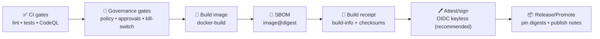

<a id="top"></a>

# 🐳 `docker-build` — Build & Publish OCI Images (Composite Action)  
**Kansas Frontier Matrix (KFM)** • `.github/actions/docker-build/README.md`

[](https://github.com/bartytime4life/Kansas-Frontier-Matrix/actions/workflows/ci.yml)
[](https://github.com/bartytime4life/Kansas-Frontier-Matrix/actions/workflows/codeql.yml)


> 🧰 Repo‑local GitHub Action to build **Docker/OCI images** for KFM (API, UI, pipelines/toolchain) in a **boring, repeatable, provenance‑friendly** way.  
> 🧭 Designed to fit KFM’s non‑negotiable order: **ETL → Catalogs (STAC/DCAT/PROV) → Graph → API → UI → Story Nodes → Focus Mode**.  
>
> KFM’s CI philosophy applies to containers too: **deterministic inputs**, **declared outputs**, **provenance emission**, and **atomic promotion** (no half‑published artifacts). ✅

---

## 🧾 Policy metadata

| Field | Value |
|---|---|
| Action folder | `📁 .github/actions/docker-build/` |
| Action file | `📄 .github/actions/docker-build/action.yml` *(expected)* |
| Docs file | `📄 .github/actions/docker-build/README.md` *(you are here)* |
| Status | ✅ Spec (implementation should match this doc) |
| Last updated | **2026-01-11** |
| KFM-MDP baseline | `v11.2.6` |
| Master Guide | `v13 (draft)` |
| Primary goals | Deterministic builds • minimal permissions • auditable outputs • promotion-ready digests |

> [!IMPORTANT]
> A “promoted” KFM image must be:
> - **Addressable** ✅ by digest (`image@sha256:…`)
> - **Traceable** ✅ via build receipt (`build-info.json`) + labels
> - **Attestable** ✅ via SBOM + provenance/signing in the release lane

---

## ⚡ Quick links

| Need | Go |
|---|---|
| 🧩 All local actions | [`../README.md`](../README.md) |
| 🤖 Workflows hub | [`../../workflows/README.md`](../../workflows/README.md) |
| 🛡️ Security policy | [`../../../SECURITY.md`](../../../SECURITY.md) *(or `../../SECURITY.md` if mirrored in `.github/`)* |
| 🧯 Kill switch guard | [`../check-kill-switch/README.md`](../check-kill-switch/README.md) |
| 🧾 Build receipt + checksums | [`../build-info/README.md`](../build-info/README.md) |
| 🧬 SBOM generator | [`../sbom/README.md`](../sbom/README.md) |
| 🖊️ Attestations/signing | [`../attest/README.md`](../attest/README.md) |
| 🧑‍⚖️ Policy gate | `📁 tools/validation/policy/` *(expected)* |

---

<details>
<summary><strong>📌 Table of contents</strong></summary>

- [🎯 What this action does](#-what-this-action-does)
- [🚫 What this action does NOT do](#-what-this-action-does-not-do)
- [🧭 KFM invariants this action supports](#-kfm-invariants-this-action-supports)
- [🔐 Permissions & threat model](#-permissions--threat-model)
- [🧩 Inputs](#-inputs)
- [📤 Outputs](#-outputs)
- [📦 Output files (KFM-friendly)](#-output-files-kfm-friendly)
- [✅ Usage patterns](#-usage-patterns)
- [🚦 Promotion-ready pipeline](#-promotion-ready-pipeline)
- [🛡️ Security hardening checklist](#-security-hardening-checklist)
- [🧯 Troubleshooting](#-troubleshooting)
- [🧪 Local debugging](#-local-debugging)
- [🧱 Implementation notes (maintainers)](#-implementation-notes-maintainers)

</details>

---

## 🎯 What this action does

This action standardizes container builds for KFM so **build behavior, metadata, tags, and outputs are consistent** across workflows.

### ✅ Capabilities (expected)
- 🐳 Build images using **BuildKit + buildx**
- 🧠 Optional multi‑arch (`linux/amd64,linux/arm64`)
- 🏷️ Deterministic tagging patterns (SHA tags; optional semver)
- 🏷️ OCI label set via `docker/metadata-action` *(source, revision, repo, etc.)*
- ♻️ Cache support (`type=gha`) to keep CI fast
- 📤 Optional push to GHCR (gated: main/tags/dispatch + protected env approvals)
- 🧾 Emits machine‑readable build outputs (digest, tags, metadata JSON)
- 🧯 Upload-friendly logs/outputs (especially on failure)

### 🧭 KFM-shaped intent
Containers are not “random build artifacts.” In KFM they are part of the **governed supply chain**:
- the **API** image defines what the UI can query (contracts + redaction rules)
- the **ETL/toolchain** image defines what transforms ran against your data (reproducibility)
- the **UI** image defines what is shown to users (and must not bypass API controls)

> [!TIP]
> Treat images as “boundary artifacts” for operational trust:
> - build them consistently  
> - publish them atomically  
> - record their digest and attach provenance/SBOM in promotion lanes

---

## 🚫 What this action does NOT do

To keep it single-purpose, `docker-build` should **not**:
- ❌ Run full CI (lint/tests/typecheck) — do that in `ci.yml`
- ❌ Validate STAC/DCAT/PROV — do that in `catalog-qa` + schema lanes
- ❌ Enforce governance/classification — do that in policy gates & approval environments
- ❌ Merge PRs or publish catalogs — promotion remains **PR-first + fail-closed**
- ❌ Generate SBOMs or sign artifacts — do that in `sbom/` + `attest/`
- ❌ Bake datasets into images — ship data via catalogs/object storage, not container layers

> [!NOTE]
> KFM’s “bring computation to the data” principle also implies:
> **don’t smuggle the data into the compute artifact** (the container). 📦🚫

---

## 🧭 KFM invariants this action supports

KFM’s system invariants apply to containers too:

1) 🚦 **Fail closed**  
If build/push fails, nothing should “half publish.” No silent continues.

2) 🔐 **Least privilege**  
Defaults to `contents: read`. Only add `packages: write` for pushes; only add `id-token: write` for keyless attest.

3) 🧾 **Declared inputs/outputs (receipt-friendly)**  
Workflows should be able to point to:
- the exact Dockerfile/context used  
- the resolved tags  
- the digest file  
- the metadata JSON  
…and then checksum those in `build-info`.

4) ♻️ **Determinism (practical)**  
- Promotion relies on **digests**, not floating tags.  
- Inputs are pinned wherever possible (base image digests, lockfiles).  
- No time-based “publish tags” (avoid `nightly-<date>` for production).

5) 🧯 **Kill-switch compatible**  
This action is designed to run **after** `check-kill-switch` in mutation lanes (push/release).

---

## 🔐 Permissions & threat model

Build/push is **supply-chain-sensitive**. Treat runners + actions as part of your trusted computing base.

### ✅ Recommended workflow permissions

**PR build-only (no push):**
```yaml
permissions:
  contents: read
```

**Push to GHCR (protected lanes only):**
```yaml
permissions:
  contents: read
  packages: write
```

**Keyless signing/attest (cosign via OIDC):**
```yaml
permissions:
  contents: read
  packages: write
  id-token: write
```

> [!CAUTION]
> Never do `push: true` on untrusted fork PRs.  
> Avoid `pull_request_target` for builds/pushes unless you *fully* isolate untrusted code and secrets.

---

## 🧩 Inputs

> Composite action inputs are strings (even for booleans). Keep them explicit and validate them.

| Input | Required | Default | Example | Notes |
|---|---:|---|---|---|
| `context` | ❌ | `.` | `.` | Docker build context |
| `dockerfile` | ❌ | `Dockerfile` | `src/server/Dockerfile` | Path relative to repo root |
| `target` | ❌ | *(none)* | `runtime` | Multi-stage target |
| `push` | ❌ | `false` | `true` | Only `true` on protected lanes |
| `registry` | ❌ | `ghcr.io` | `ghcr.io` | Registry host |
| `image` | ✅ | *(none)* | `ghcr.io/${{ github.repository }}/kfm-api` | Full image name (no tag) |
| `tags` | ❌ | *(auto)* | `sha-${{ github.sha }}` | Newline-separated tags |
| `platforms` | ❌ | `linux/amd64` | `linux/amd64,linux/arm64` | Multi-arch builds |
| `build_args` | ❌ | *(none)* | `API_BASE=/api` | Newline-separated `KEY=VALUE` |
| `labels` | ❌ | *(auto)* | `org.opencontainers.image.title=KFM API` | Extra OCI labels |
| `cache_from` | ❌ | `type=gha` | `type=gha` | Cache source |
| `cache_to` | ❌ | `type=gha,mode=max` | `type=gha,mode=max` | Cache destination |
| `provenance` | ❌ | `false` | `true` | BuildKit provenance emission *(when supported)* |
| `sbom` | ❌ | `false` | `true` | BuildKit SBOM emission *(when supported; KFM still prefers `sbom/` action for gates)* |
| `output_dir` | ❌ | `.artifacts/docker` | `.artifacts/docker` | Where to write metadata/digest/logs |
| `metadata_json_path` | ❌ | *(derived)* | `.artifacts/docker/docker-metadata.json` | Override path if needed |
| `digest_path` | ❌ | *(derived)* | `.artifacts/docker/image-digest.txt` | Override path if needed |
| `build_log_path` | ❌ | *(derived)* | `.artifacts/docker/build-log.txt` | Optional build log file |
| `idempotency_key` | ❌ | *(empty)* | `${{ github.run_id }}.${{ github.run_attempt }}` | Record-only: helps “replay produces same intent” |
| `commit_seed` | ❌ | *(empty)* | `${{ github.sha }}` | Record-only: aligns with KFM “seeded, repeatable runs” |
| `fail_on_warning` | ❌ | `true` | `true` | Treat “warning-y” states as failures *(implementation-defined)* |

> [!TIP]
> If your repo produces multiple images (API/UI/pipelines), prefer matrix builds in the workflow and call this action per image.

---

## 📤 Outputs

| Output | Description |
|---|---|
| `image` | Image name (no tag) |
| `tags` | Resolved tags (newline-separated) |
| `digest` | Image digest (manifest digest for multi-arch pushes when available) |
| `image_ref` | Fully qualified reference recommended for downstream: `image@sha256:…` |
| `metadata_json` | Path to metadata JSON file |
| `digest_file` | Path to digest file |
| `output_dir` | Resolved output directory |

> [!IMPORTANT]
> Downstream lanes (SBOM, policy gate, attest, deploy) should prefer `image_ref` (digest pinned) over tags.

---

## 📦 Output files (KFM-friendly)

This action should write predictable outputs for later gates (build-info, SBOM, attestations, deployments):

```text
.artifacts/docker/
├─ docker-metadata.json      # 🏷️ tags/labels resolved by metadata action
├─ image-digest.txt          # 🧾 sha256:<...> digest
├─ image-ref.txt             # 🔗 ghcr.io/org/repo/name@sha256:<...>
└─ build-log.txt             # 🧪 optional: build output (helpful on failures)
```

### ✅ Recommended “build-info” integration
Pair with `build-info` to emit one traceable bundle:

```text
.artifacts/
├─ docker/
│  ├─ docker-metadata.json
│  ├─ image-digest.txt
│  └─ image-ref.txt
├─ build-info/
│  ├─ build-info.json
│  └─ checksums.sha256
└─ attestations/             # produced later by sbom/attest lanes
   ├─ materials.sbom.spdx.json
   └─ provenance.dsse.json
```

---

## ✅ Usage patterns

### 1) PR lane — build only (no push) 🧪
Use this to prove Dockerfiles build cleanly for every PR (no registry writes).

```yaml
jobs:
  docker-build-pr:
    runs-on: ubuntu-latest
    permissions:
      contents: read

    steps:
      - uses: actions/checkout@v4

      - name: 🧯 Kill switch (fail closed)
        uses: ./.github/actions/check-kill-switch
        with:
          mode: fail
          scope: docker

      - name: 🐳 Build (no push)
        uses: ./.github/actions/docker-build
        with:
          image: ghcr.io/${{ github.repository }}/kfm-api
          dockerfile: src/server/Dockerfile
          push: "false"
          platforms: linux/amd64
```

---

### 2) Main lane — push to GHCR 🚀
Only on `push` to `main` (or protected dispatch). No forks.

```yaml
jobs:
  docker-build-main:
    runs-on: ubuntu-latest
    permissions:
      contents: read
      packages: write

    steps:
      - uses: actions/checkout@v4

      - name: 🧯 Kill switch
        uses: ./.github/actions/check-kill-switch
        with:
          mode: fail
          scope: docker

      - name: 🔐 Login to GHCR
        uses: docker/login-action@v3
        with:
          registry: ghcr.io
          username: ${{ github.actor }}
          password: ${{ secrets.GITHUB_TOKEN }}

      - name: 🐳 Build & push
        uses: ./.github/actions/docker-build
        with:
          image: ghcr.io/${{ github.repository }}/kfm-api
          dockerfile: src/server/Dockerfile
          push: "true"
          tags: |
            sha-${{ github.sha }}
            latest
          platforms: linux/amd64,linux/arm64
```

> [!TIP]
> Prefer `sha-<sha>` for deployments. Keep `latest` as convenience only.

---

### 3) Release lane — build → SBOM → policy gate → attest/sign 🏷️🧬🖊️
Recommended order aligns with KFM’s “validate → promote” posture.

```yaml
jobs:
  release-image:
    runs-on: ubuntu-latest
    permissions:
      contents: read
      packages: write
      id-token: write

    steps:
      - uses: actions/checkout@v4

      - name: 🧯 Kill switch
        uses: ./.github/actions/check-kill-switch
        with:
          mode: fail
          scope: docker

      - name: 🔐 Login to GHCR
        uses: docker/login-action@v3
        with:
          registry: ghcr.io
          username: ${{ github.actor }}
          password: ${{ secrets.GITHUB_TOKEN }}

      - name: 🐳 Build & push
        id: img
        uses: ./.github/actions/docker-build
        with:
          image: ghcr.io/${{ github.repository }}/kfm-api
          dockerfile: src/server/Dockerfile
          push: "true"
          tags: |
            ${{ github.ref_name }}      # e.g., v1.2.3
            sha-${{ github.sha }}
          platforms: linux/amd64,linux/arm64
          output_dir: .artifacts/docker

      - name: 🧬 SBOM (image)
        uses: ./.github/actions/sbom
        with:
          mode: image
          image_ref: ${{ steps.img.outputs.image_ref }}
          formats: spdx-json,cyclonedx-json
          output_dir: .artifacts/sbom
          attestations_dir: .artifacts/attestations

      - name: 🧾 Build info (receipt)
        uses: ./.github/actions/build-info
        with:
          out_dir: .artifacts/build-info
          artifact_globs: |
            .artifacts/docker/**
            .artifacts/sbom/**
            .artifacts/attestations/**

      - name: 🖊️ Attest/sign (recommended)
        uses: ./.github/actions/attest
        with:
          subject: ${{ steps.img.outputs.image_ref }}
          artifacts: |
            .artifacts/docker/**
            .artifacts/build-info/**
            .artifacts/attestations/**
          mode: bundle
```

---

### 4) Multi-image matrix — API + UI + pipelines 🧩
If KFM has multiple deliverables, use a matrix build:

```yaml
strategy:
  matrix:
    include:
      - name: api
        image: ghcr.io/${{ github.repository }}/kfm-api
        dockerfile: src/server/Dockerfile
      - name: web
        image: ghcr.io/${{ github.repository }}/kfm-web
        dockerfile: web/Dockerfile
      - name: etl
        image: ghcr.io/${{ github.repository }}/kfm-etl
        dockerfile: pipelines/Dockerfile

steps:
  - uses: actions/checkout@v4

  - uses: ./.github/actions/check-kill-switch
    with:
      mode: fail
      scope: docker

  - uses: docker/login-action@v3
    with:
      registry: ghcr.io
      username: ${{ github.actor }}
      password: ${{ secrets.GITHUB_TOKEN }}

  - uses: ./.github/actions/docker-build
    with:
      image: ${{ matrix.image }}
      dockerfile: ${{ matrix.dockerfile }}
      push: "true"
      tags: |
        sha-${{ github.sha }}
      platforms: linux/amd64,linux/arm64
      output_dir: .artifacts/docker/${{ matrix.name }}
```

---

## 🚦 Promotion-ready pipeline

KFM “shipping” is more than pushing an image. The recommended promotion story:



> [!IMPORTANT]
> For KFM, deployments and catalogs should reference **digests**, not floating tags:
> `ghcr.io/<org>/<repo>/<image>@sha256:<digest>`

---

## 🛡️ Security hardening checklist

Use this before enabling `push: true`:

- [ ] ✅ Build/push runs only on `push main`, tags, or `workflow_dispatch`
- [ ] ✅ Protected environments required for prod publish (`environment: prod`)
- [ ] ✅ `permissions:` are minimal (only add `packages: write` when pushing)
- [ ] ✅ Kill switch step is first in mutation jobs
- [ ] ✅ No secrets in build args (avoid embedding tokens into layers)
- [ ] ✅ Dockerfile uses:
  - multi-stage builds
  - non-root user where feasible
  - pinned base images (prefer `FROM …@sha256:<digest>` for high assurance)
  - lockfiles for language deps (pip/poetry/npm/pnpm)
- [ ] ✅ Image scanning exists in release lanes (Trivy/Grype/etc.) + stored results
- [ ] ✅ SBOM generated and stored (SPDX/CycloneDX) for releases
- [ ] ✅ Attestation/provenance exists for promoted artifacts (Sigstore/in-toto style)
- [ ] ✅ Do not ship sensitive datasets inside images (ship data separately with STAC/DCAT/PROV + policy gates)

---

## 🧯 Troubleshooting

### “denied: permission to write packages”
- Ensure workflow has:
  ```yaml
  permissions:
    packages: write
  ```
- Ensure login uses `secrets.GITHUB_TOKEN` (or a PAT with `write:packages`).

### Multi-arch builds are slow / fail
- Ensure QEMU and buildx are set up in the workflow (or inside this action if you include those steps):
  - `docker/setup-qemu-action@v3`
  - `docker/setup-buildx-action@v3`

### “no space left on device”
- Reduce build context, add `.dockerignore`, prune unnecessary layers.
- Avoid copying large `data/**` into images (ship data through catalogs/object storage instead).

### Cache isn’t helping
- Ensure `cache-from` and `cache-to` are set, and BuildKit is used.
- Keep Dockerfile layers stable (install deps before copying frequently-changed code).

### Builds differ between runs (unexpected digest changes)
Common causes:
- base image drift (unpinned tag)
- unpinned OS packages (`apt-get install` without versions)
- non-locked Python/Node deps
- timestamps embedded during build

Fix:
- pin base image digests
- use lockfiles
- record tool versions and inputs in `build-info`
- treat unexpected digest drift as a **reproducibility incident** 🚨

---

## 🧪 Local debugging

Run the same build command locally before blaming CI:

```bash
docker buildx build \
  -f src/server/Dockerfile \
  --platform linux/amd64 \
  -t kfm-api:dev \
  .
```

If CI uses multi-arch, validate `linux/amd64` first locally.

---

## 🧱 Implementation notes (maintainers)

> Guidance for whoever writes/maintains `action.yml` 🔧

### ✅ Recommended internal building blocks
Inside a composite action, call trusted actions to keep implementation small:

- `docker/setup-qemu-action@v3`
- `docker/setup-buildx-action@v3`
- `docker/metadata-action@v5`
- `docker/build-push-action@v6`

### ✅ Output discipline (KFM-friendly)
- Write digest to a file (`image-digest.txt`) **and** `GITHUB_OUTPUT`
- Write a digest-pinned `image_ref` (`image-ref.txt`) **and** output it
- Write resolved metadata JSON (`docker-metadata.json`)
- Optionally capture a build log file (on failure) for debugging
- Preserve stable paths under `output_dir` so policy gates can find them

### ✅ Pinning strategy
- PR lanes: pin third-party actions to major versions (acceptable)
- Release/publish lanes: pin third-party actions by commit SHA for higher assurance

### ✅ Don’t do these things (ever)
- ❌ Don’t echo secret env vars or tokens
- ❌ Don’t run `push: true` on `pull_request` from forks
- ❌ Don’t silently continue after build/push failures
- ❌ Don’t include raw datasets in image layers

---

<p align="right"><a href="#top">⬆️ Back to top</a></p>
