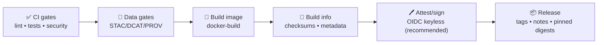

<a id="top"></a>

# 🐳 `docker-build` — Build & Publish OCI Images (Composite Action)  
**Kansas Frontier Matrix (KFM)** • `.github/actions/docker-build/README.md`

[](https://github.com/bartytime4life/Kansas-Frontier-Matrix/actions/workflows/ci.yml)
[](https://github.com/bartytime4life/Kansas-Frontier-Matrix/actions/workflows/codeql.yml)


> 🧰 Repo‑local GitHub Action to build **Docker/OCI images** for KFM (API, UI, pipelines) in a **boring, repeatable, provenance‑friendly** way.  
> 🧭 Designed to fit KFM’s non‑negotiable order: **ETL → Catalogs (STAC/DCAT/PROV) → Graph → API → UI → Story Nodes → Focus Mode**.

---

## 🧾 Policy metadata

| Field | Value |
|---|---|
| Action | `.github/actions/docker-build` |
| File | `.github/actions/docker-build/README.md` |
| Status | Spec ✅ *(implementation should match this doc)* |
| Last updated | **2026-01-09** |
| KFM-MDP baseline | v11.2.6 |
| Master Guide | v13 (draft) |
| Primary goals | Deterministic builds • minimal permissions • auditable outputs • promotion-ready |

---

## ⚡ Quick links

| Need | Go |
|---|---|
| 🧭 Repo overview | [`../../../README.md`](../../../README.md) |
| 🤖 Workflows hub | [`../../workflows/README.md`](../../workflows/README.md) |
| 🤝 Collaboration rules | [`../../README.md`](../../README.md) |
| 🛡️ Security policy | [`../../../SECURITY.md`](../../../SECURITY.md) *(or `../../SECURITY.md` if mirrored in `.github/`)* |
| 🧯 Kill switch guard | [`../check-kill-switch/README.md`](../check-kill-switch/README.md) |
| 🧾 Build traceability | [`../build-info/README.md`](../build-info/README.md) |
| 🖊️ Attestations/signing | [`../attest/README.md`](../attest/README.md) |

---

<details>
<summary><strong>📌 Table of contents</strong></summary>

- [🎯 What this action does](#-what-this-action-does)
- [🚫 What this action does NOT do](#-what-this-action-does-not-do)
- [🧭 KFM invariants this action supports](#-kfm-invariants-this-action-supports)
- [🔐 Permissions & threat model](#-permissions--threat-model)
- [🧩 Inputs](#-inputs)
- [📤 Outputs](#-outputs)
- [📦 Output files](#-output-files)
- [✅ Usage patterns](#-usage-patterns)
- [🚦 Promotion-ready pipeline](#-promotion-ready-pipeline)
- [🛡️ Security hardening checklist](#-security-hardening-checklist)
- [🧯 Troubleshooting](#-troubleshooting)
- [🧪 Local debugging](#-local-debugging)
- [🧱 Implementation notes (for maintainers)](#-implementation-notes-for-maintainers)

</details>

---

## 🎯 What this action does

This action standardizes container builds for KFM so that **build behavior, metadata, tags, and logs are consistent** across workflows.

### ✅ Capabilities (expected)
- 🐳 Build images using **BuildKit + buildx**
- 🧠 Optional multi‑arch (`linux/amd64,linux/arm64`)
- 🧷 Deterministic tagging patterns (SHA tags, optional semver tags)
- 🏷️ OCI labels via `docker/metadata-action` (repo/sha/source/revision)
- ♻️ Cache support (`type=gha`) to keep CI fast
- 📤 Optional push to GHCR (gated: main/tags/dispatch + env approvals)
- 🧾 Emits machine‑readable build outputs (digest, tags, metadata JSON)
- 📦 Uploads build logs/artifacts on failure (debuggability)

> [!IMPORTANT]
> KFM treats **integrity + provenance** as first-class. This action is designed to produce outputs you can attach to:  
> `build-info.json` ✅ • `checksums.sha256` ✅ • `SBOM` ✅ • `attestations` ✅

---

## 🚫 What this action does NOT do

To keep it “single purpose,” this action should **not**:
- ❌ Run full CI (lint/tests/typecheck) — do that in `ci.yml`
- ❌ Validate STAC/DCAT/PROV — do that in `catalog-qa` + schema lanes
- ❌ Decide governance classification — do that in policy gates / promotion logic
- ❌ Merge PRs or publish catalogs — promotion must remain **PR-first + fail-closed**
- ❌ Embed secrets into images — ever

> [!TIP]
> Think of `docker-build` as a **boring build primitive** that plugs into bigger lanes:
> - PR lane: build-only (no push)
> - Main lane: push (protected)
> - Release lane: push + sign + attest + SBOM

---

## 🧭 KFM invariants this action supports

KFM’s architecture requires guardrails that CI can enforce. This action supports them by design:

1) 🚦 **Fail closed**: if build/push fails, nothing “half publishes.”  
2) 🔐 **Least privilege**: defaults to `contents: read` and only elevates when required.  
3) 🧾 **Provenance-friendly outputs**: digest + metadata emitted so downstream can attest and record lineage.  
4) ♻️ **Determinism**: avoid time-based tags/labels for published artifacts (use SHA/semver).  
5) 🧯 **Kill-switch compatibility**: intended to run *after* `check-kill-switch`.

---

## 🔐 Permissions & threat model

CI runners are part of your supply chain. Treat build/push as security-sensitive.

### ✅ Recommended workflow permissions

**PR build-only (no push):**
```yaml
permissions:
  contents: read
```

**Push to GHCR (main/tags only):**
```yaml
permissions:
  contents: read
  packages: write
```

**Keyless signing/attest (cosign via OIDC):**
```yaml
permissions:
  contents: read
  packages: write
  id-token: write
```

**Upload SARIF (if scanning in the same lane):**
```yaml
permissions:
  contents: read
  security-events: write
```

> [!CAUTION]
> Avoid `pull_request_target` for build/push workflows unless you *fully* understand the risk.  
> Never run pushes with secrets on untrusted fork PRs.

---

## 🧩 Inputs

> Composite action inputs are strings (even for booleans). Keep them explicit.

| Input | Required | Default | Example | Notes |
|---|---:|---|---|---|
| `context` | ❌ | `.` | `.` | Docker build context |
| `dockerfile` | ❌ | `Dockerfile` | `src/server/Dockerfile` | Path relative to repo root |
| `target` | ❌ | *(none)* | `runtime` | Multi-stage target |
| `push` | ❌ | `false` | `true` | Only `true` on protected lanes |
| `registry` | ❌ | `ghcr.io` | `ghcr.io` | Registry host |
| `image` | ✅ | *(none)* | `ghcr.io/${{ github.repository }}/kfm-api` | Full image name (no tag) |
| `tags` | ❌ | *(auto)* | `sha-${{ github.sha }}` | Newline-separated tags supported |
| `platforms` | ❌ | `linux/amd64` | `linux/amd64,linux/arm64` | Multi-arch builds |
| `build_args` | ❌ | *(none)* | `API_BASE=/api` | Newline-separated `KEY=VALUE` |
| `labels` | ❌ | *(auto)* | `org.opencontainers.image.title=KFM API` | Extra OCI labels |
| `cache_from` | ❌ | `type=gha` | `type=gha` | Build cache source |
| `cache_to` | ❌ | `type=gha,mode=max` | `type=gha,mode=max` | Build cache destination |
| `provenance` | ❌ | `false` | `true` | If enabling BuildKit provenance emission |
| `sbom` | ❌ | `false` | `true` | If enabling BuildKit SBOM emission (when supported) |
| `metadata_json_path` | ❌ | `out/docker-metadata.json` | `out/docker-metadata.json` | Where to write metadata |
| `digest_path` | ❌ | `out/image-digest.txt` | `out/image-digest.txt` | Where to write digest |
| `fail_on_warning` | ❌ | `true` | `true` | If `true`, treat warnings as failures (recommended) |

> [!NOTE]
> If your repo uses multiple images (API/UI/pipelines), prefer **matrix builds** in the workflow, calling this action per image.

---

## 📤 Outputs

| Output | Description |
|---|---|
| `image` | Image name (no tag) |
| `tags` | Resolved tags (newline-separated) |
| `digest` | Pushed image digest (or local digest if build-only) |
| `metadata_json` | Path to metadata JSON file |
| `digest_file` | Path to digest file |

---

## 📦 Output files

This action should write predictable outputs for later gates (attestations, releases, deployments):

```text
out/
├─ docker-metadata.json      # tags/labels resolved by metadata action
├─ image-digest.txt          # sha256:<...> digest
└─ build-log.txt             # optional: build output (useful on failures)
```

### ✅ Recommended “build-info” integration
Pair with `build-info` to emit a single provenance-friendly bundle:

```text
out/
├─ build-info.json           # repo/sha/run/toolchain + artifact pointers
├─ checksums.sha256          # checksums for out/* and other promoted artifacts
├─ docker-metadata.json
└─ image-digest.txt
```

---

## ✅ Usage patterns

### 1) PR lane — build only (no push) 🧪
Use this to prove Dockerfiles build cleanly for every PR.

```yaml
jobs:
  docker-build-pr:
    runs-on: ubuntu-latest
    permissions:
      contents: read

    steps:
      - uses: actions/checkout@v4

      - name: 🧯 Kill switch (fail closed)
        uses: ./.github/actions/check-kill-switch

      - name: 🐳 Build (no push)
        uses: ./.github/actions/docker-build
        with:
          image: ghcr.io/${{ github.repository }}/kfm-api
          dockerfile: src/server/Dockerfile
          push: "false"
          platforms: linux/amd64
```

---

### 2) Main lane — push to GHCR 🚀
Only on `push` to `main` (or protected dispatch). No forks.

```yaml
jobs:
  docker-build-main:
    runs-on: ubuntu-latest
    permissions:
      contents: read
      packages: write

    steps:
      - uses: actions/checkout@v4

      - name: 🧯 Kill switch
        uses: ./.github/actions/check-kill-switch

      - name: 🔐 Login to GHCR
        uses: docker/login-action@v3
        with:
          registry: ghcr.io
          username: ${{ github.actor }}
          password: ${{ secrets.GITHUB_TOKEN }}

      - name: 🐳 Build & push
        uses: ./.github/actions/docker-build
        with:
          image: ghcr.io/${{ github.repository }}/kfm-api
          dockerfile: src/server/Dockerfile
          push: "true"
          tags: |
            sha-${{ github.sha }}
            latest
          platforms: linux/amd64,linux/arm64
```

> [!TIP]
> Prefer `sha-<sha>` tags for deployments. Use `latest` only for convenience.

---

### 3) Release lane — push + attest 🏷️🖊️
Recommended pattern: build → emit build-info → attest/sign.

```yaml
jobs:
  release-image:
    runs-on: ubuntu-latest
    permissions:
      contents: read
      packages: write
      id-token: write

    steps:
      - uses: actions/checkout@v4

      - name: 🧯 Kill switch
        uses: ./.github/actions/check-kill-switch

      - name: 🧾 Build info (recommended)
        uses: ./.github/actions/build-info
        with:
          out_dir: out

      - name: 🔐 Login to GHCR
        uses: docker/login-action@v3
        with:
          registry: ghcr.io
          username: ${{ github.actor }}
          password: ${{ secrets.GITHUB_TOKEN }}

      - name: 🐳 Build & push
        id: img
        uses: ./.github/actions/docker-build
        with:
          image: ghcr.io/${{ github.repository }}/kfm-api
          dockerfile: src/server/Dockerfile
          push: "true"
          tags: |
            ${{ github.ref_name }}      # e.g., v1.2.3
            sha-${{ github.sha }}
          platforms: linux/amd64,linux/arm64

      - name: 🖊️ Attest/sign (recommended)
        uses: ./.github/actions/attest
        with:
          image: ghcr.io/${{ github.repository }}/kfm-api@${{ steps.img.outputs.digest }}
          build_info: out/build-info.json
          checksums: out/checksums.sha256
```

---

### 4) Multi-image matrix — API + UI + pipelines 🧩
If KFM has multiple deliverables, use a matrix:

```yaml
strategy:
  matrix:
    include:
      - name: api
        image: ghcr.io/${{ github.repository }}/kfm-api
        dockerfile: src/server/Dockerfile
      - name: web
        image: ghcr.io/${{ github.repository }}/kfm-web
        dockerfile: web/Dockerfile

steps:
  - uses: actions/checkout@v4
  - uses: ./.github/actions/check-kill-switch
  - uses: docker/login-action@v3
    with:
      registry: ghcr.io
      username: ${{ github.actor }}
      password: ${{ secrets.GITHUB_TOKEN }}
  - uses: ./.github/actions/docker-build
    with:
      image: ${{ matrix.image }}
      dockerfile: ${{ matrix.dockerfile }}
      push: "true"
      tags: |
        sha-${{ github.sha }}
      platforms: linux/amd64,linux/arm64
```

---

## 🚦 Promotion-ready pipeline

KFM “shipping” is more than pushing an image. The promotion story is:



> [!IMPORTANT]
> For KFM, a “promoted artifact” should always be: **addressable (digest), traceable (build-info), and attestable (SBOM/provenance)**.

---

## 🛡️ Security hardening checklist

Use this before enabling `push: true`:

- [ ] ✅ Build/push runs only on `push main`, tags, or `workflow_dispatch`
- [ ] ✅ Protected environment required for prod publish (`environment: prod`)
- [ ] ✅ `permissions:` are minimal (only add `packages: write` when pushing)
- [ ] ✅ No secrets in build args (use short-lived tokens if unavoidable)
- [ ] ✅ Dockerfile uses:
  - multi-stage builds
  - non-root user where feasible
  - pinned base images (or pinned digests for high assurance)
- [ ] ✅ Scan in release lane (Trivy/Grype/etc.) and store results
- [ ] ✅ Prefer digest pinning for deployments: `image@sha256:...`
- [ ] ✅ Attest/SBOM generated for releases

---

## 🧯 Troubleshooting

### “denied: permission to write packages”
- Ensure workflow has:
  ```yaml
  permissions:
    packages: write
  ```
- Ensure login uses `secrets.GITHUB_TOKEN` (or a PAT with `write:packages`).

### Multi-arch builds are slow / fail
- Ensure QEMU and buildx are set up in the workflow (or inside this action if you include those steps):
  - `docker/setup-qemu-action@v3`
  - `docker/setup-buildx-action@v3`

### “no space left on device”
- Reduce build context, add `.dockerignore`, prune unnecessary layers.
- Avoid copying large `data/**` into images (ship data through catalogs/object storage instead).

### Cache isn’t helping
- Ensure `cache-from` and `cache-to` are set, and BuildKit is used.
- Keep Dockerfile layers stable (install deps before copying frequently-changed code).

### Builds differ between runs
- Avoid timestamps baked into files
- Pin dependencies (pip/apt/npm)
- Use lockfiles
- Consider reproducible build options where feasible

---

## 🧪 Local debugging

Run the exact build command locally before blaming CI:

```bash
# Build locally
docker buildx build \
  -f src/server/Dockerfile \
  --platform linux/amd64 \
  -t kfm-api:dev \
  .

# Inspect image
docker image inspect kfm-api:dev
```

If CI uses multi-arch, test at least `linux/amd64` locally first.

---

## 🧱 Implementation notes for maintainers

> This section is guidance for whoever writes/maintains `action.yml`.

### ✅ Recommended internal building blocks
Inside a composite action, you can call trusted actions to keep implementation small:

- `docker/setup-buildx-action@v3`
- `docker/metadata-action@v5`
- `docker/build-push-action@v6`

### ✅ Output discipline
- Write digest to a file (`out/image-digest.txt`) **and** `GITHUB_OUTPUT`
- Write resolved metadata to JSON (`out/docker-metadata.json`)
- Upload artifacts on failure (workflows should wrap with `if: always()`)

### ✅ Pinning strategy
- PR lane: pin to major versions (acceptable)
- Release/publish lanes: consider pinning third-party actions by commit SHA

### ✅ Do not do these things
- ❌ Don’t echo secret env vars
- ❌ Don’t run `push: true` on `pull_request` from forks
- ❌ Don’t silently continue after build/push failures

---

<p align="right"><a href="#top">⬆️ Back to top</a></p>

