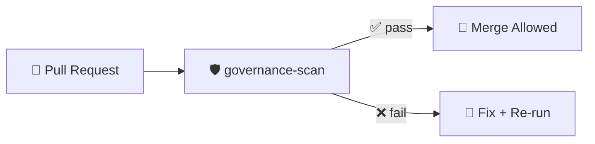

# 🛡️ Governance Scan (GitHub Action)


> [!IMPORTANT]
> **KFM is “provenance-first.”** This action exists to **block merges** when a change breaks governance rules (missing metadata, missing provenance, unsafe content, license ambiguity, classification downgrade, etc.). ✅🔒

---

## ✨ What is this?

**`governance-scan`** is a **composite GitHub Action** that runs the Kansas Frontier Matrix’s governance gates as part of CI.

It enforces the repo’s non-negotiables:

- 🧾 **Provenance-first** (no “orphan” data)
- 🧭 **Canonical pipeline order** (Raw → Processed → Catalog/Prov → DB → API → UI)
- ⚖️ **FAIR + CARE** principles (licensing + ethical/sensitivity controls)
- 🧰 **Policy-as-code** (OPA/Rego rules evaluated in CI)
- 🧨 **Fail-closed by default** (no passing build = no merge)

---

## 🗂️ Where it lives

```text
📦 repo-root/
└─ .github/
   └─ actions/
      └─ governance-scan/
         ├─ action.yml        # ✅ Source of truth for inputs/outputs
         ├─ README.md         # 👈 you are here
         └─ (scripts|policies|fixtures)/  # optional, repo-specific
```

---

## 🧠 What it checks

### ✅ 1) Policy-as-code (OPA/Rego via Conftest)
Runs repository policy rules against changed files.

Typical rule classes:
- 📦 **Data policy** (licenses, required metadata, provenance requirements)
- 🧠 **AI / Focus Mode policy** (static configs, prompt templates, guardrails)
- 🔐 **Security policy** (restricted content markers, access/sensitivity tags)
- 🧷 **Compliance policy** (privacy + sovereignty + “do not publish” constraints)

### ✅ 2) Metadata + provenance invariants (the “truth path”)
Examples of what’s enforced:

- If a file is added/updated under `data/processed/`:
  - a corresponding entry must exist under **`data/catalog/`** (STAC/DCAT)
  - a corresponding entry must exist under **`data/provenance/`** (W3C PROV)
- If a new dataset appears under `data/raw/`:
  - it must not be “activated” by downstream steps without governance signals (license, citation, sensitivity tags, owner/authority tags if needed)

### ✅ 3) Security + privacy scans
Automated scans designed to catch “oops” moments before they become permanent history:

- 🔑 **Secrets scan** (tokens, passwords, private keys, API credentials)
- 🧑‍🤝‍🧑 **PII / sensitive data scan**
- 🗺️ **Sensitive location checks** (e.g., protected archaeological coordinates, sovereignty-tagged sites)
- 🏷️ **Classification consistency** (prevents accidental “downgrades” through processing)

### ✅ 4) Governance review triggers (human-in-the-loop)
Some changes are too important for automation alone. This action can flag PRs for manual review when they introduce:

- 🧬 **Sensitive or sovereignty-bound datasets**
- 🤖 **New AI narrative behaviors** that could be perceived as factual outputs
- 🌐 **New external data sources** (license/provenance alignment review)

---

## 🚀 Quickstart (Workflow Example)

```yaml
name: 🛡️ Governance Scan

on:
  pull_request:
    paths:
      - "data/**"
      - "docs/**"
      - "policy/**"
      - ".github/actions/governance-scan/**"

jobs:
  governance:
    name: Governance Gate
    runs-on: ubuntu-latest

    permissions:
      contents: read
      pull-requests: read

    steps:
      - name: 📥 Checkout
        uses: actions/checkout@v4

      - name: 🛡️ Run governance-scan
        uses: ./.github/actions/governance-scan
        with:
          policy_dir: policy
          scan_paths: |
            data
            docs
            policy
          changed_files_only: true
          upload_artifact: true
```

> [!TIP]
> Keep the workflow `paths:` filter tight so governance runs when it matters (data/docs/policy changes), but doesn’t slow down unrelated PRs. ⚡

---

## 🔧 Inputs

> **Authoritative reference:** `action.yml` ✅  
> The table below documents the *intended* interface. If anything differs, update this README or `action.yml` to match.

| Input | Required | Default | What it does |
|------|----------|---------|--------------|
| `policy_dir` | ✅ | `policy` | Directory containing OPA/Rego rules used for evaluation |
| `scan_paths` | ✅ | `.` | Newline-delimited list of paths to scan (folders/files) |
| `changed_files_only` | ❌ | `true` (PR) | Scan only changed files (faster) vs full repo scan (stricter) |
| `fail_on_warnings` | ❌ | `true` | Treat warnings as failures (recommended for mainline repos) |
| `upload_artifact` | ❌ | `true` | Upload a report artifact for review/audit |
| `artifact_name` | ❌ | `governance-scan-report` | Artifact name used in the workflow UI |
| `report_format` | ❌ | `text` | Example: `text`, `json`, `sarif` (depends on implementation) |
| `allowlist_path` | ❌ | *(empty)* | Optional allowlist for known/approved matches (review carefully) |

---

## 📤 Outputs

| Output | What it means |
|--------|---------------|
| `violations_count` | Total governance violations detected (0 = pass) |
| `report_path` | Path to the generated report file (if produced) |

---

## 🧪 Running locally (recommended)

> [!NOTE]
> Governance should be **runnable locally** so contributors can fix issues before pushing. 🧰

Typical local flow:

```bash
# 1) Install conftest (OPA/Rego test runner)
#    https://www.conftest.dev/  (install method varies)

# 2) Run policies against your change set
conftest test data/ docs/ policy/ -p policy/
```

If this action ships a wrapper script in this folder, prefer:

```bash
./.github/actions/governance-scan/run.sh
```

*(If `run.sh` doesn’t exist, add it — local parity saves reviewer time.)*

---

## 🧯 Common failures (and how to fix)

<details>
<summary><strong>📦 “Processed data added but missing catalog/provenance”</strong></summary>

**What happened:** You added `data/processed/...` but didn’t add matching:
- `data/catalog/...` (STAC/DCAT entry)
- `data/provenance/...` (PROV lineage)

**Fix:**
1. Add the STAC/DCAT JSON (or update the existing dataset record)
2. Add a PROV record that references the raw inputs + pipeline steps
3. Re-run governance locally

</details>

<details>
<summary><strong>🔑 “Secret detected”</strong></summary>

**Fix checklist:**
- Rotate the credential immediately (assume compromised)
- Remove it from the repo (including git history if needed)
- Store secrets in GitHub Actions secrets / a vault, not in files

</details>

<details>
<summary><strong>🗺️ “Sensitive location present in public output”</strong></summary>

**Fix options (choose the correct governance-approved approach):**
- Generalize coordinates (reduce precision)
- Aggregate geometry (county-level vs site-level)
- Mark dataset as restricted with proper sovereignty/access tags
- Route through protected access controls

</details>

---

## 🧩 Extending the governance rules

### Add or update a rule
1. Add/modify a `.rego` file under `policy/`
2. Add test fixtures for the rule (recommended)
3. Ensure rules are **deterministic** and **explainable**
4. Update this README if behavior changes

### Best practices
- ✅ Prefer **small, composable rules**
- ✅ Return **actionable messages** (“what to do next”)
- ✅ Treat policy changes like code: PR + review + changelog notes

---

## 📈 Suggested CI mental model



---

## ✅ PR “Definition of Done” (fast checklist)

- [ ] 🧾 License is explicit (dataset and/or sources)
- [ ] 🧬 Provenance exists (PROV + human-readable notes if needed)
- [ ] 🗂️ Metadata exists (STAC/DCAT aligned)
- [ ] 🔐 No secrets, no accidental PII
- [ ] 🏷️ Sensitivity/classification tags are correct and consistent
- [ ] 🧪 governance-scan passes locally

---

## 🤝 Maintainer notes

> [!CAUTION]
> **Do not “paper over” governance failures.** If an allowlist/override is needed, it must be reviewed and documented (who approved it, why, and for how long). 🧾⚖️

If you add new governance triggers, consider pairing them with:
- a short contributor-facing error message
- a doc link to the correct template (metadata/prov/story templates)
- a minimal failing fixture (to prevent future regressions)

---