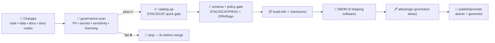

<a id="top"></a>

# 🧭✅ `governance-scan` — FAIR+CARE Guardrails (PII • Secrets • Sensitive Locations • Licensing)


> **Purpose:** catch governance violations early (PR lane) before they leak into catalogs, Story Nodes, or published artifacts.  
> KFM is a “living atlas” — **trust is the product**. This action helps keep it that way. 🧾🗺️  
>
> **Guiding principle:** *no data without provenance, no narrative without sources, and no sensitive location leaks* 🔒🧭

---

## 🧾 Action metadata

| Field | Value |
|---|---|
| Action name | `kfm/governance-scan` *(repo-local composite action)* |
| Action folder | `📁 .github/actions/governance-scan/` |
| Action file | `📄 .github/actions/governance-scan/action.yml` *(expected)* |
| Docs file | `📄 .github/actions/governance-scan/README.md` *(this file)* |
| Status | ✅ Active *(spec + operating guide — implementation should match)* |
| Last updated | **2026-01-11** |
| Default lane | 🧪 PR gate (fast) • 🚦 publish lanes run stricter rules |
| Design target | deterministic • offline-first • fail-closed for publish lanes |

> [!IMPORTANT]
> This action is intentionally **boring**:
> - no network (default) 🌐🚫
> - no secrets required 🔐🚫
> - stable output (diff-friendly) 🧾
> - **fail-closed** when configured for promotion/publish 🚦

---

## ⚡ Quick links

| Need | Go |
|---|---|
| 🧩 Actions hub | [`../README.md`](../README.md) |
| 🧪 Workflows hub | [`../../workflows/README.md`](../../workflows/README.md) |
| 🤝 `.github/` ops hub | [`../../README.md`](../../README.md) |
| 🛡️ Security policy | [`../../../SECURITY.md`](../../../SECURITY.md) *(or `../../SECURITY.md` mirror)* |
| ✅ Catalog QA gate | [`../catalog-qa/README.md`](../catalog-qa/README.md) |
| 🧯 Kill switch | [`../check-kill-switch/README.md`](../check-kill-switch/README.md) |
| 🧑‍⚖️ Policy gate (OPA/Conftest) | `📁 tools/validation/policy/` *(expected)* |
| 🧾 Build receipts | [`../build-info/README.md`](../build-info/README.md) |
| 🖊️ Attestations | [`../attest/README.md`](../attest/README.md) |

---

<details>
<summary><strong>📌 Table of contents</strong></summary>

- [🧠 Why this exists](#-why-this-exists)
- [🎯 What this action does](#-what-this-action-does)
- [🚦 Where it fits in the KFM pipeline](#-where-it-fits-in-the-kfm-pipeline)
- [🧬 KFM invariants this action protects](#-kfm-invariants-this-action-protects)
- [🗂️ Trust boundaries: public vs restricted paths](#️-trust-boundaries-public-vs-restricted-paths)
- [🔎 What it scans (modules)](#-what-it-scans-modules)
- [🧰 Rulesets](#-rulesets)
- [⚙️ Inputs](#️-inputs)
- [📤 Outputs](#-outputs)
- [📦 Output files](#-output-files)
- [🧾 Report schema (recommended)](#-report-schema-recommended)
- [✅ Usage examples](#-usage-examples)
- [🧯 Handling false positives](#-handling-false-positives)
- [🔐 Security model (forks, secrets, SSRF, leakage)](#-security-model-forks-secrets-ssrf-leakage)
- [🧪 Local developer run](#-local-developer-run)
- [🧩 Extending the scanner](#-extending-the-scanner)
- [📚 Reference library](#-reference-library)

</details>

---

## 🧠 Why this exists

KFM is not “just code.” It’s **code + data + catalogs + provenance + narratives**.

A single bad PR can:
- leak a secret into logs or docs 🔑💥
- publish PII or sensitive location precision 🧍🧭
- ship a dataset without license/attribution 🧾⚖️
- accidentally downgrade classification (“restricted” → “public”) 🧬⬇️
- turn Focus Mode into a side-channel for protected coordinates 🗺️🚫

`governance-scan` is the **fast, deterministic prevention layer** that runs *before* heavier gates (schema validation, policy pack, attestations).

---

## 🎯 What this action does

`governance-scan` runs a set of **offline checks** to prevent governance mistakes from merging:

- 🔐 **Secrets leak detection** (high-risk patterns; never prints matched strings)
- 🧍 **PII scanning** (best-effort: emails/phones/addresses-like patterns, configurable)
- 🧭 **Sensitive-location precision checks** (coords/GeoJSON/WKT in public-facing areas)
- 🧾 **License + attribution minimum bar** (STAC/DCAT + Story Nodes + governed docs)
- 🧬 **Classification propagation checks** *(optional/strict rulesets)*

It produces:
- a **machine-readable JSON report** (stable keys, stable ordering)
- a **human summary Markdown** (PR-friendly)
- optional **SARIF** (for GitHub code scanning UI)

> [!NOTE]
> This action is **not** a replacement for:
> - full STAC/DCAT/PROV schema validation
> - policy-as-code gates (OPA/Rego)
> - signing/attestations  
>
> It’s the “seatbelt” — not the whole car.

---

## 🚦 Where it fits in the KFM pipeline



> [!TIP]
> ✅ PR lane: run `governance-scan` fast + fail-closed  
> 🚦 Publish lane: run stricter ruleset + require green gates + (optionally) attest/sign

---

## 🧬 KFM invariants this action protects

These are “no shortcuts” rules the repo treats as first-class:

1) 🧾 **Provenance-first, evidence-first**  
If it can’t be attributed and traced, it doesn’t ship.

2) 🧭 **No sensitive location leaks**  
Narratives + maps must not reveal precise coordinates for protected sites or restricted layers.

3) 🧬 **Sovereignty & sensitivity propagate**  
Outputs must not be “less restricted” than inputs unless explicitly redacted/generalized.

4) 🔐 **Least privilege & fork safety**  
PR lanes must run without secrets, without write permissions, and without network dependency.

---

## 🗂️ Trust boundaries: public vs restricted paths

KFM uses **path-based expectations** to keep the scanner deterministic.

### ✅ Recommended defaults (v13-shaped)

| Category | Typical paths | Meaning |
|---|---|---|
| 🔒 Restricted / staging | `data/raw/**` • `data/work/**` | may include sensitive precision, unredacted source data |
| ✅ Publishable outputs | `data/processed/**` • `data/stac/**` • `data/catalog/dcat/**` • `data/prov/**` | must meet governance + metadata + provenance rules |
| 📚 Public docs / UI | `docs/**` • `web/**` | must not contain secrets/PII; must respect coordinate precision policy |
| 🎬 Story Nodes | `docs/reports/story_nodes/published/**` | governed narrative; strict citations + sensitivity rules |

> [!IMPORTANT]
> Story Nodes are “machine-ingestible” governed narratives. Treat them like data artifacts:
> strict front-matter, citations, and sensitivity handling.

---

## 🔎 What it scans (modules)

Think of `governance-scan` as a small set of plug-in modules. Enable/disable via `ruleset` + config.

### 1) 🔐 Secrets scan (high-risk patterns)
Flags likely credential leakage:
- tokens, bearer headers, auth strings
- private keys (`BEGIN PRIVATE KEY`)
- best-effort cloud credential patterns

✅ Design rules:
- **never** print raw matches in logs
- report: `rule_id`, `file`, `line_range`, `severity`

**Rule IDs (suggested):**
- `SECRET_PRIVATE_KEY`
- `SECRET_TOKEN_LIKE`
- `SECRET_BASIC_AUTH`
- `SECRET_CLOUD_CRED_LIKE`

---

### 2) 🧍 PII scan (best-effort)
Flags likely PII in public-facing paths:
- email addresses
- phone numbers
- addresses-like patterns *(optional; tune to avoid noise)*

✅ Design rules:
- redact matches in outputs (or store only hashed snippets)
- treat results as **signals**, not legal determinations

**Rule IDs (suggested):**
- `PII_EMAIL`
- `PII_PHONE`
- `PII_ADDRESS_LIKE`
- `PII_ID_LIKE` *(off by default; jurisdiction-specific)*

---

### 3) 🧭 Sensitive-location precision scan (KFM-specific)
Flags coordinate precision that violates policy in **public paths**:
- explicit `lat, lon` pairs in docs/story nodes
- GeoJSON `Point` features
- WKT/WKB strings embedded in public docs
- STAC Item geometries/centroids that are too precise for declared sensitivity

✅ Core idea: **Focus Mode and public narratives must not become a side-channel** for restricted coordinates.

**Rule IDs (suggested):**
- `SENSITIVE_COORDS_EXACT`
- `SENSITIVE_GEOJSON_POINT_PUBLIC`
- `SENSITIVE_WKT_PUBLIC`
- `SENSITIVE_STAC_GEOMETRY_TOO_PRECISE`

---

### 4) 🧾 License & attribution scan (FAIR)
Checks minimum metadata bar:
- STAC: `license`, `providers` present (or your profile minimum)
- DCAT: license + publisher/creator/distribution minimums *(configurable)*
- governed docs/story nodes: front-matter includes `license`, `classification`, `care_label`, etc.
- story nodes: citations exist for factual claims *(structural checks; not “truth” checks)*

✅ Goal: prevent “mystery layers” and “license unknown” promotion.

**Rule IDs (suggested):**
- `LICENSE_MISSING`
- `LICENSE_NOT_ALLOWED`
- `ATTRIBUTION_MISSING_PROVIDER`
- `DOC_FRONT_MATTER_MISSING`
- `STORY_CITATION_MISSING`

---

### 5) 🧬 Classification propagation checks (CARE)
Optional (strict/publish rulesets):
- prevent “restricted → public” downgrades without an explicit redaction note
- enforce that public artifacts contain a declared `classification` + `sensitivity`
- enforce Story Nodes with culturally sensitive references set `care_label` appropriately

**Rule IDs (suggested):**
- `CLASSIFICATION_DOWNGRADE`
- `SENSITIVITY_MISSING`
- `CARE_LABEL_MISSING`
- `REDACTION_NOTE_REQUIRED`

---

## 🧰 Rulesets

Rulesets are designed to match lanes (fast PR checks vs publish-hardening).

| Ruleset | Intended lane | Secrets | PII | Sensitive coords | License/attrib | Classification |
|---|---|---:|---:|---:|---:|---:|
| `baseline` | PR (fast) | ✅ | ✅ | ✅ | ✅ | ⚠️ warn-only |
| `strict` | nightly / deep PR | ✅ | ✅ | ✅ (stricter) | ✅ (allowlist) | ✅ |
| `publish` | promotion/publish | ✅ | ✅ | ✅ (fail-closed) | ✅ (fail-closed) | ✅ (fail-closed) |
| `agents` | executor lanes | ✅ | ✅ | ✅ | ✅ | ✅ + tighter doc/story rules |

> [!TIP]
> Start with `baseline` for PRs; use `publish` in any lane that can **promote** artifacts.

---

## ⚙️ Inputs

> GitHub Action inputs are strings. Use `"true"` / `"false"`.

| Input | Required | Default | Description |
|---|---:|---|---|
| `ruleset` | ❌ | `baseline` | `baseline` • `strict` • `publish` • `agents` |
| `paths` | ❌ | `.` | Newline-separated include paths (dirs/globs) |
| `ignore_paths` | ❌ | *(empty)* | Newline-separated excludes |
| `fail_on_warn` | ❌ | `"true"` | If `"true"`, warnings fail the action |
| `max_file_mb` | ❌ | `5` | Skip huge files to keep PR lane fast |
| `report_dir` | ❌ | `out/governance-scan` | Output folder |
| `allowlist_file` | ❌ | `.kfm/governance-scan.allowlist.txt` | Scoped allowlist for known false positives |
| `config_file` | ❌ | `.kfm/governance-scan.yml` | Optional config (thresholds, SPDX allowlist, precision rules) |
| `public_paths` | ❌ | `docs/**,web/**,data/processed/**,data/stac/**,data/catalog/dcat/**,docs/reports/story_nodes/published/**` | Areas treated as public-facing |
| `restricted_paths` | ❌ | `data/raw/**,data/work/**,docs/reports/story_nodes/draft/**` | Areas treated as restricted/staging |
| `location_precision_min` | ❌ | `county` | `exact` • `neighborhood` • `county` • `grid` • `redacted` |
| `emit_sarif` | ❌ | `"false"` | If `"true"`, write SARIF output |
| `dry_run` | ❌ | `"false"` | If `"true"`, never fails; report only |

> [!NOTE]
> `location_precision_min` is a **policy signal**. Actual enforcement can be implemented as:
> - decimal-place limits
> - geohash/H3 resolution limits
> - bbox/region-only requirements  
> …defined in `.kfm/governance-scan.yml`.

---

## 📤 Outputs

| Output | Meaning |
|---|---|
| `ok` | `"true"` if scan passed (or `dry_run=true`) |
| `error_count` | Integer-like string |
| `warning_count` | Integer-like string |
| `report_json` | Path to JSON report |
| `report_md` | Path to Markdown summary |
| `sarif_path` | Path to SARIF (if enabled) |

---

## 📦 Output files

Expected output shape:

```text
out/governance-scan/
├─ governance-scan.json        # 🧾 machine report (stable keys + ordering)
├─ governance-scan.md          # 📝 human summary (PR-friendly)
├─ governance-scan.sarif       # 🧷 optional (GitHub code scanning UI)
└─ findings/
   ├─ secrets.csv              # optional (redacted)
   ├─ pii.csv                  # optional (redacted)
   └─ sensitivity.csv          # optional
```

✅ Output design rules:
- **never** echo secrets/PII in full
- include rule IDs + file path + line/column range
- stable ordering for deterministic diffs
- write a short summary to `$GITHUB_STEP_SUMMARY` so reviewers see it instantly

---

## 🧾 Report schema (recommended)

Keep it stable once downstream gates depend on it (policy-gate dashboards love stable schemas).

```json
{
  "schema_version": 1,
  "ruleset": "baseline",
  "summary": {
    "checked_files": 124,
    "errors": 1,
    "warnings": 2
  },
  "findings": [
    {
      "rule_id": "LICENSE_MISSING",
      "severity": "error",
      "path": "data/stac/collections/example/collection.json",
      "line_start": 1,
      "line_end": 1,
      "message": "Missing required field: license",
      "public_exposure": true,
      "tags": ["STAC", "FAIR"]
    }
  ],
  "redaction": {
    "matches_redacted": true,
    "hash_algo": "sha256"
  }
}
```

> [!TIP]
> If you emit hashed snippets for debugging, hash only **small fixed windows** and avoid hashing secrets directly.

---

## ✅ Usage examples

### 1) PR gate (fast lane) 🧪

```yaml
name: Governance Scan

on:
  pull_request:
    paths:
      - "data/**"
      - "docs/**"
      - "web/**"
      - ".kfm/**"
      - ".github/actions/governance-scan/**"
      - ".github/workflows/governance-scan.yml"
  workflow_dispatch:

permissions:
  contents: read

jobs:
  governance:
    runs-on: ubuntu-latest
    timeout-minutes: 10

    steps:
      - uses: actions/checkout@v4

      - name: 🧭 Governance scan (baseline)
        uses: ./.github/actions/governance-scan
        with:
          ruleset: baseline
          paths: |
            data
            docs
            web
          fail_on_warn: "true"

      - name: 📦 Upload report
        uses: actions/upload-artifact@v4
        if: always()
        with:
          name: governance-scan-${{ github.sha }}
          path: out/governance-scan/**
```

---

### 2) Promotion lane (publish-strict) 🚦

```yaml
- name: 🧯 Kill switch
  uses: ./.github/actions/check-kill-switch
  with:
    scope: publish
    mode: fail

- name: 🧭 Governance scan (publish)
  uses: ./.github/actions/governance-scan
  with:
    ruleset: publish
    paths: |
      data/processed
      data/stac
      data/catalog/dcat
      data/prov
      docs/reports/story_nodes/published
    location_precision_min: grid
    fail_on_warn: "true"
```

---

### 3) SARIF integration (optional) 🧷

```yaml
- name: 🧭 Governance scan (SARIF)
  uses: ./.github/actions/governance-scan
  with:
    ruleset: strict
    emit_sarif: "true"

- name: Upload SARIF
  if: always()
  uses: github/codeql-action/upload-sarif@v3
  with:
    sarif_file: out/governance-scan/governance-scan.sarif
```

---

## 🧯 Handling false positives

False positives happen — but “just ignore everything” defeats the purpose.

### ✅ Allowlist strategy (recommended)

Create `.kfm/governance-scan.allowlist.txt`:

```text
# One entry per line (simple and deterministic)
# Format: <RULE_ID> <PATH_GLOB> [optional-note]
PII_EMAIL docs/archives/**  historical scans contain contact info; redacted in published summaries
SECRET_TOKEN_LIKE tools/fixtures/**  test vectors only
SENSITIVE_COORDS_EXACT docs/reports/story_nodes/draft/**  drafts may contain precision; must be redacted before publish
```

### ✅ Config strategy (recommended)

Create `.kfm/governance-scan.yml`:

```yaml
ruleset: baseline

precision:
  min_public: county
  # optional: encode your implementation semantics
  # decimal_places_max_public: 2
  # geohash_len_max_public: 5

licenses:
  spdx_allow:
    - MIT
    - CC-BY-4.0
    - CC0-1.0

pii:
  enabled: true
  email: true
  phone: true
  address_like: false

secrets:
  enabled: true
  redact_output: true

story_nodes:
  require_front_matter: true
  require_citations: true
  require_care_label: true
```

> [!IMPORTANT]
> Allowlists should be reviewed like code: scoped, justified, and never used to hide real leaks.

---

## 🔐 Security model (forks, secrets, SSRF, leakage)

### ✅ Offline-first by default
`governance-scan` should run without network access and without fetching external URLs:
- reduces SSRF risk
- keeps PR lane deterministic
- avoids external flake

### ✅ Secrets hygiene
- never print matched strings
- only report rule IDs + file/line range
- do not store raw matches in artifacts

### ✅ Fork safety
- run with `permissions: contents: read`
- do not require secrets
- do not run promotion/publish jobs on fork PRs

### ✅ Path safety
If this action expands globs, it should defensively handle:
- `..` traversal attempts
- symlink escapes
- zip bombs / huge expansions (guard with `max_file_mb` + file count budget)

---

## 🧪 Local developer run

If the underlying implementation lives in a repo tool (recommended), provide a local CLI entrypoint:

```bash
python3 tools/validation/governance_scan/run_governance_scan.py \
  --ruleset baseline \
  --paths data docs web \
  --out out/governance-scan \
  --fail-on-warn
```

> [!TIP]
> Keep local invocation aligned with CI so results match.

---

## 🧩 Extending the scanner

When you add new checks:

- ✅ keep it deterministic (stable ordering, no timestamps in outputs)
- ✅ keep PR lane fast (size limits, fixture-first design)
- ✅ emit stable rule IDs (`SENSITIVE_COORDS_EXACT`, `LICENSE_MISSING`, etc.)
- ✅ add fixtures proving the rule works
- ✅ connect to promotion rules (fail-closed in `ruleset=publish`)

**Rule naming convention (recommended):**
- `SECRET_*`
- `PII_*`
- `LICENSE_*`
- `SENSITIVE_*`
- `PROV_*`
- `CLASSIFICATION_*`
- `STORY_*`

---

## 📚 Reference library

KFM’s governance posture is influenced by:
- 🧾 provenance + auditability discipline (scientific method + V&V mindset)
- 🗺️ cartographic responsibility (“maps are not neutral”)
- 🔐 defensive security hygiene (least privilege, supply chain awareness)
- ❤️ human-centered governance (rights, narratives, sovereignty)

<details>
<summary><strong>📦 Project file influence map (what informed this action)</strong></summary>

### 🧭 Canonical KFM docs & invariants
- `docs/specs/Kansas Frontier Matrix (KFM) – Comprehensive Technical Documentation.docx`
- `docs/specs/MARKDOWN_GUIDE_v13.md(.gdoc)`
- `docs/specs/Latest Ideas.(pdf|docx)` *(agents, promotion discipline, policy pack)*

### 🧾 Policy enforcement & governance
- `docs/library/Data Spaces.pdf` *(policy enforcement + provenance-aware logging concepts)*
- `tools/validation/policy/**` *(OPA/Rego + Conftest policy pack — expected)*

### 🗺️ GIS & cartography responsibility
- `docs/library/making-maps-a-visual-guide-to-map-design-for-gis.pdf`
- `docs/library/Mobile Mapping_ Space, Cartography and the Digital - 9789048535217.pdf`

### 🔐 Security & supply chain mindset (defense only)
- `docs/library/ethical-hacking-and-countermeasures-secure-network-infrastructures.pdf`
- `docs/library/Gray Hat Python - Python Programming for Hackers and Reverse Engineers (2009).pdf`

### ❤️ Governance & accountability
- `docs/library/Introduction to Digital Humanism.pdf`
- `docs/library/Principles of Biological Autonomy - book_9780262381833.pdf`
- `docs/library/On the path to AI Law’s prophecies and the conceptual foundations of the machine learning age.pdf`

### 🧪 Reproducibility & scientific integrity
- `docs/library/Scientific Modeling and Simulation_ A Comprehensive NASA-Grade Guide.pdf`
- `docs/library/Understanding Statistics & Experimental Design.pdf`
- `docs/library/regression-analysis-with-python.pdf`
- `docs/library/think-bayes-bayesian-statistics-in-python.pdf`

</details>

---

## 📄 License

MIT (repo default), unless otherwise noted.

<p align="right"><a href="#top">⬆️ Back to top</a></p>
