<a id="top"></a>

# 🧭✅ `governance-scan` — FAIR+CARE Guardrails (PII • Secrets • Sensitive Locations • Licensing)


> **Purpose:** catch governance violations early (PR lane) before they leak into catalogs, stories, or published artifacts.  
> KFM is a “living atlas” — **trust is the product**. This action helps keep it that way. 🧾🗺️

---

## 🧾 Action metadata

| Field | Value |
|---|---|
| Action name | `kfm/governance-scan` *(repo-local composite action)* |
| Action file | `.github/actions/governance-scan/action.yml` *(expected)* |
| Docs file | `.github/actions/governance-scan/README.md` |
| Status | ✅ Active (spec + operating guide) |
| Last updated | **2026-01-09** |
| Default lane | PR (fast / required when touching `data/**`, `docs/**`, story nodes, policies) |
| Design target | deterministic • offline-first • fail-closed for publish lanes |

---

## ⚡ Quick links

| Need | Go |
|---|---|
| 🧩 Actions hub | [`../README.md`](../README.md) |
| 🧪 Workflows hub | [`../../workflows/README.md`](../../workflows/README.md) |
| 🤝 `.github/` ops | [`../../README.md`](../../README.md) |
| 🛡️ Security policy | [`../../../SECURITY.md`](../../../SECURITY.md) *(or `../../SECURITY.md` mirror)* |
| ✅ Catalog QA gate | [`../catalog-qa/README.md`](../catalog-qa/README.md) |
| 🧯 Kill switch | [`../check-kill-switch/README.md`](../check-kill-switch/README.md) |

---

<details>
<summary><strong>📌 Table of contents</strong></summary>

- [🎯 What this action does](#-what-this-action-does)
- [🚦 Where it fits in the KFM pipeline](#-where-it-fits-in-the-kfm-pipeline)
- [🧬 KFM invariants this action enforces](#-kfm-invariants-this-action-enforces)
- [🔎 What it scans (modules)](#-what-it-scans-modules)
- [⚙️ Inputs](#️-inputs)
- [📤 Outputs](#-outputs)
- [📦 Output files](#-output-files)
- [✅ Usage examples](#-usage-examples)
- [🧯 Handling false positives](#-handling-false-positives)
- [🔐 Security model (SSRF, secrets, forks)](#-security-model-ssrf-secrets-forks)
- [🧪 Local developer run](#-local-developer-run)
- [🧩 Extending the scanner](#-extending-the-scanner)
- [📚 Reference library](#-reference-library)

</details>

---

## 🎯 What this action does

`governance-scan` is a **repo-local composite action** that runs a set of fast checks to prevent governance mistakes from merging, including:

- 🔐 **Secrets & credential leakage** (belt-and-suspenders alongside GitHub secret scanning)
- 🧍 **PII detection** (emails/phones/addresses-like patterns where relevant)
- 🧭 **Sensitive-location precision** policy checks (points/coordinates in public artifacts)
- 🧾 **License / attribution** minimum bar (especially in STAC/DCAT manifests and Story Nodes)
- 🧬 **Classification propagation** hints (outputs shouldn’t be “less restricted” than inputs)

It produces a **machine-readable report** + **human summary** and is designed to be a **required PR gate** for governance-sensitive paths.

---

## 🚦 Where it fits in the KFM pipeline

KFM has a strict order. Governance scans exist to keep downstream stages safe:

```mermaid
flowchart LR
  A["🧰 ETL / Code / Docs changes"] --> B["🔎 governance-scan<br/>(PII • secrets • sensitivity • licenses)"]
  B -->|pass ✅| C["✅ catalog-qa<br/>(STAC/DCAT quick gate)"]
  C --> D["🧬 catalogs + PROV<br/>(boundary artifacts)"]
  D --> E["🕸️ graph / API / UI"]
  B -->|fail ❌| X["🧯 stop — fix before merge"]
```



> [!IMPORTANT]
> This action is not a replacement for **policy-as-code** (OPA/Rego) or for full schema validation — it’s a fast, high-leverage **prevention layer**.

---

## 🧬 KFM invariants this action enforces

These are KFM’s “no shortcuts” rules, expressed as actionable gates:

1) 🚦 **Pipeline ordering is absolute**  
No publishing or Story Node promotion without passing governance + metadata gates first.

2) 🧾 **Provenance-first and evidence-first**  
If something is going public, it must be attributable and traceable (metadata + provenance + citations).

3) 🧭 **Sovereignty & sensitivity propagate**  
If inputs are restricted or culturally sensitive, outputs must not publish exact precision (default: generalize).

4) 🔐 **Least privilege & fail-closed**  
Governance checks should not require secrets; publish lanes should fail if governance checks fail.

---

## 🔎 What it scans (modules)

Think of `governance-scan` as a small set of plug-in modules. Enable/disable them by ruleset.

### 1) 🔐 Secrets scan (fast patterns)
Looks for high-risk patterns such as:
- common token formats (API keys, bearer tokens)
- private keys (`BEGIN PRIVATE KEY`)
- cloud credentials patterns (best-effort)

✅ Goal: catch accidents *before* they hit GitHub’s own scanners or logs.

> This should be conservative and **avoid** printing matched secrets. It reports locations and rule IDs only.

### 2) 🧍 PII scan (best-effort)
Flags likely PII in documents and metadata:
- emails, phone numbers, addresses-like patterns
- identity numbers-like patterns (configurable, jurisdiction-aware if needed)

✅ Goal: prevent accidental doxxing or sensitive disclosures in public artifacts.

### 3) 🧭 Sensitive location precision scan (KFM-specific)
Flags publication of exact coordinates in places where it shouldn’t appear, including:
- Story Nodes / narrative markdown
- STAC Items/Collections properties
- CSV/GeoJSON samples that are meant to be public
- “docs” that accidentally embed lat/lon lists

Common triggers:
- explicit lat/lon pairs at point precision
- GeoJSON Points in “public” folders
- WKT/WKB strings embedded in docs

✅ Goal: enforce “location precision policy” (county/region/grid) unless explicitly allowed.

### 4) 🧾 License & attribution scan (FAIR)
Checks the minimum metadata bar:
- license present (prefer SPDX identifiers)
- attribution/provider required fields (STAC: `license`, `providers`; DCAT: `license`, `publisher`, `distribution`)
- Story Nodes: citations present for factual claims (basic structural checks)

✅ Goal: prevent “mystery layers” and “license unknown” promotion.

### 5) 🧬 Classification propagation hints (CARE)
Optionally checks for:
- sensitivity tags/labels present in manifests
- “public” outputs derived from “restricted/confidential” inputs without an explicit redaction note

✅ Goal: reduce human error. This is a **gate** only when configured; otherwise it’s a warning lane.

---

## ⚙️ Inputs

> GitHub Action inputs are strings. Use `"true"` / `"false"`.

| Input | Required | Default | Description |
|---|---:|---|---|
| `ruleset` | ❌ | `baseline` | Which module set to run: `baseline`, `strict`, `publish`, `agents` |
| `paths` | ❌ | `.` | Newline-separated include globs or directories to scan |
| `ignore_paths` | ❌ | *(empty)* | Newline-separated exclude globs |
| `fail_on_warn` | ❌ | `"true"` | If `"true"`, warnings fail the action |
| `max_file_mb` | ❌ | `5` | Skip files larger than this (avoid huge scans in PR lane) |
| `report_dir` | ❌ | `out/governance-scan` | Where reports are written |
| `allowlist_file` | ❌ | `.kfm/governance-scan.allowlist.txt` | Optional allowlist for known false positives |
| `config_file` | ❌ | `.kfm/governance-scan.yml` | Optional config (policy thresholds, precision rules, SPDX allowlist) |
| `public_paths` | ❌ | `docs/**,web/**,data/catalog/**,data/processed/**` | Areas treated as public-facing by default |
| `restricted_paths` | ❌ | `data/raw/**,data/work/**` | Areas treated as restricted/staging by default |
| `location_precision_min` | ❌ | `county` | Precision policy: `exact`, `neighborhood`, `county`, `grid`, `redacted` |
| `emit_sarif` | ❌ | `"false"` | If `"true"`, write SARIF for code scanning UI |
| `dry_run` | ❌ | `"false"` | If `"true"`, never fails; report only |

> [!TIP]
> Start with `ruleset=baseline` for PRs and use `ruleset=publish` in promotion lanes to be stricter.

---

## 📤 Outputs

| Output | Meaning |
|---|---|
| `ok` | `"true"` if scan passed (or `dry_run=true`) |
| `error_count` | Integer-like string |
| `warning_count` | Integer-like string |
| `report_json` | Path to JSON report |
| `report_md` | Path to Markdown summary |
| `sarif_path` | Path to SARIF (if enabled) |

---

## 📦 Output files

Expected output shape:

```text
out/governance-scan/
├─ governance-scan.json        # machine report
├─ governance-scan.md          # human summary (PR-friendly)
├─ governance-scan.sarif       # optional (code scanning UI)
└─ findings/
   ├─ secrets.csv              # optional (redacted)
   ├─ pii.csv                  # optional (redacted)
   └─ sensitivity.csv          # optional
```

✅ Output design rules:
- never echo secrets/PII in full
- include rule IDs + file path + line/column range
- stable ordering for deterministic diffs

---

## ✅ Usage examples

### 1) PR gate (fast lane) 🧪

```yaml
name: Governance Scan

on:
  pull_request:
    paths:
      - "data/**"
      - "docs/**"
      - "web/**"
      - ".github/actions/governance-scan/**"
      - ".github/workflows/governance-scan.yml"
  workflow_dispatch:

permissions:
  contents: read

jobs:
  governance:
    runs-on: ubuntu-latest
    timeout-minutes: 10

    steps:
      - uses: actions/checkout@v4

      - name: 🧭 Governance scan
        uses: ./.github/actions/governance-scan
        with:
          ruleset: baseline
          paths: |
            data
            docs
            web
          fail_on_warn: "true"

      - name: 📦 Upload report
        uses: actions/upload-artifact@v4
        if: always()
        with:
          name: governance-scan-${{ github.sha }}
          path: out/governance-scan/**
```

### 2) Promotion lane (publish-strict) 🚦

```yaml
- name: 🧯 Kill switch
  uses: ./.github/actions/check-kill-switch
  with:
    scope: publish
    mode: fail

- name: 🧭 Governance scan (publish)
  uses: ./.github/actions/governance-scan
  with:
    ruleset: publish
    paths: |
      data/catalog
      data/processed
      docs/reports/story_nodes
    location_precision_min: grid
    fail_on_warn: "true"
```

### 3) SARIF integration (optional) 🧷

```yaml
- name: 🧭 Governance scan (SARIF)
  uses: ./.github/actions/governance-scan
  with:
    ruleset: strict
    emit_sarif: "true"

- name: Upload SARIF
  if: always()
  uses: github/codeql-action/upload-sarif@v3
  with:
    sarif_file: out/governance-scan/governance-scan.sarif
```

---

## 🧯 Handling false positives

False positives happen — but “just ignore everything” breaks the whole point.

### ✅ Allowlist strategy (recommended)

Create `.kfm/governance-scan.allowlist.txt`:

```text
# One entry per line (simple and deterministic)
# Format: <RULE_ID> <PATH_GLOB> [optional-note]
PII_EMAIL docs/archives/**  historical scans contain contact info; redacted in published summaries
SECRET_LIKE_TOKEN tools/fixtures/**  test vectors only
SENSITIVE_COORDS docs/reports/story_nodes/draft/**  draft lane only; not published
```

### ✅ Config strategy (recommended)

Create `.kfm/governance-scan.yml`:

```yaml
ruleset: baseline
precision:
  min_public: county
licenses:
  spdx_allow:
    - MIT
    - CC-BY-4.0
    - CC0-1.0
pii:
  enabled: true
  email: true
  phone: true
secrets:
  enabled: true
  redact_output: true
```

> [!IMPORTANT]
> Allowlists should be reviewed like code: scoped, justified, and not used to hide real issues.

---

## 🔐 Security model (SSRF, secrets, forks)

### ✅ Offline-first
`governance-scan` should run **without network access** and without fetching external URLs.
- reduces SSRF risks
- keeps PR lane deterministic
- avoids “external dependency flake”

### ✅ Secrets hygiene
- never print matched strings
- only report rule IDs and file/line location
- do not write raw matches into artifacts

### ✅ Fork safety
- run with `permissions: contents: read`
- do not require secrets
- do not run promotion/publish in PR context

---

## 🧪 Local developer run

If the underlying implementation lives in a repo tool (recommended), provide a local CLI entrypoint such as:

```bash
python3 tools/validation/governance_scan/run_governance_scan.py \
  --ruleset baseline \
  --paths data docs web \
  --out out/governance-scan \
  --fail-on-warn
```

> Keep local invocation aligned with CI so results match.

---

## 🧩 Extending the scanner

When you add new checks:

- ✅ keep it deterministic (stable ordering, no timestamps in outputs)
- ✅ keep PR lane fast (size limits, fixture-first design)
- ✅ emit stable rule IDs (`SENSITIVE_COORDS`, `MISSING_LICENSE`, etc.)
- ✅ add fixtures that prove the rule works
- ✅ connect to promotion rules (fail-closed in `ruleset=publish`)

**Rule naming convention (recommended):**
- `SECRET_*`
- `PII_*`
- `LICENSE_*`
- `SENSITIVE_*`
- `PROV_*`
- `CLASSIFICATION_*`

---

## 📚 Reference library

KFM’s governance posture is influenced by:
- 🧾 provenance + auditability discipline (scientific method, V&V mindset)
- 🗺️ cartographic responsibility (“maps are not neutral”)
- 🔐 defensive security hygiene (least privilege, supply chain awareness)
- ❤️ human-centered governance (rights, narratives, sovereignty)

<details>
<summary><strong>📦 Project file influence map (what informed this action)</strong></summary>

### 🧭 Canonical KFM docs & invariants
- `docs/specs/Kansas Frontier Matrix (KFM) – Comprehensive Technical Documentation.docx`
- `docs/specs/MARKDOWN_GUIDE_v13.md(.gdoc)`
- `docs/specs/Latest Ideas.(pdf|docx)` *(agents, kill switch, promotion discipline)*

### 🗺️ GIS & cartography responsibility
- `docs/library/making-maps-a-visual-guide-to-map-design-for-gis.pdf`
- `docs/library/Mobile Mapping_ Space, Cartography and the Digital - 9789048535217.pdf`

### 🔐 Security & supply chain mindset (defense only)
- `docs/library/ethical-hacking-and-countermeasures-secure-network-infrastructures.pdf`
- `docs/library/Gray Hat Python - Python Programming for Hackers and Reverse Engineers (2009).pdf`

### ❤️ Governance & accountability
- `docs/library/Introduction to Digital Humanism.pdf`
- `docs/library/Principles of Biological Autonomy - book_9780262381833.pdf`
- `docs/library/Data Spaces.pdf`
- `docs/library/On the path to AI Law’s prophecies and the conceptual foundations of the machine learning age.pdf`

### 🧪 Reproducibility & scientific integrity
- `docs/library/Scientific Modeling and Simulation_ A Comprehensive NASA-Grade Guide.pdf`
- `docs/library/Understanding Statistics & Experimental Design.pdf`
- `docs/library/regression-analysis-with-python.pdf`
- `docs/library/think-bayes-bayesian-statistics-in-python.pdf`

</details>

---

<p align="right"><a href="#top">⬆️ Back to top</a></p>

