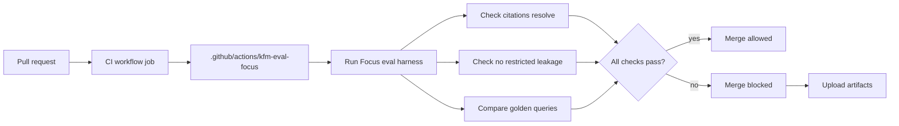

<!-- [KFM_META_BLOCK_V2]
doc_id: kfm://doc/8af22d53-2cef-4be6-b002-512901b7daac
title: kfm-eval-focus (GitHub Action)
type: standard
version: v1
status: draft
owners: TBD
created: 2026-02-28
updated: 2026-02-28
policy_label: public
related:
  - .github/actions/kfm-eval-focus/action.yml
  - tests/eval/focus_harness/
tags: [kfm, github-actions, ci, focus-mode, evaluation]
notes:
  - TODO: Update Inputs/Outputs to exactly match action.yml.
  - TODO: Confirm the local eval command + output paths in the repo.
[/KFM_META_BLOCK_V2] -->

<a id="top"></a>

# kfm-eval-focus

**Purpose:** Run the **Focus Mode evaluation harness** in CI and **fail closed** on citation, policy, or regression violations.

> Status: **draft** • Owners: **TBD** • Path: `.github/actions/kfm-eval-focus/`


<!-- TODO: replace/add real workflow badges once workflow names are known -->

**Quick links:** [Why this exists](#why-this-exists) · [What it does](#what-it-does) · [Usage](#usage) · [Inputs](#inputs) · [Outputs](#outputs) · [Artifacts](#artifacts) · [Security--governance](#security--governance) · [Directory standard](#directory-standard) · [Troubleshooting](#troubleshooting)

---

## Why this exists

Focus Mode is **not** a general chatbot. It is a governed, evidence-led workflow that must:

- retrieve **admissible evidence**
- produce an answer **with citations**
- and **verify every citation resolves** (hard gate)

If citations cannot be verified (or policy denies), Focus Mode must **abstain** or **reduce scope**.

The evaluation harness is the CI enforcement mechanism for this posture:
- run “golden queries”
- detect regressions
- block merges when the cite-or-abstain contract is violated

> WARNING  
> This is a **merge gate** for Focus Mode. Changes to this action, the harness, or the golden queries should be treated as governed changes (reviewed + reversible).

## What it does

At a high level, this composite action:

1. Sets up the repo runtime (Node/tooling as required)
2. Runs the Focus Mode evaluation harness (golden queries + safety checks)
3. Optionally uploads harness outputs as GitHub Actions artifacts
4. Fails the job if any required checks fail (**fail closed**)



## KFM citation model

In KFM, a “citation” is expected to be **resolvable evidence** (e.g., an `EvidenceRef` that resolves into an `EvidenceBundle` with metadata, artifacts, and provenance), not just a pasted URL.

This action’s job is to ensure the evaluation harness enforces that contract (e.g., “citations resolve” and “no restricted leakage”).

---

## Where this fits in the repo

This action lives under `.github/actions/` and is intended to be called from one (or more) workflows under `.github/workflows/` (for example: the main CI workflow, or a reusable lane workflow).

### Directory contents

```text
.github/actions/kfm-eval-focus/
  action.yml     # Composite action definition (inputs/outputs live here)
  README.md      # This file
```

---

## Usage

### Typical CI step

```yaml
- name: Focus Mode evaluation (merge gate)
  uses: ./.github/actions/kfm-eval-focus
  with:
    # TODO: Update keys to match action.yml
    node-version: "20"
    package-manager: "npm"
    eval-command: "npm run test:eval:focus"
    upload-artifacts: "true"
    artifact-name: "focus-eval"
```

### Run only when Focus Mode changes (recommended)

```yaml
on:
  pull_request:
    paths:
      - "src/focus/**"
      - "src/api/routes/focus.*"
      - "tests/eval/focus_harness/**"
      - ".github/actions/kfm-eval-focus/**"
```

---

## Inputs

> NOTE  
> The authoritative interface is `.github/actions/kfm-eval-focus/action.yml`.  
> Update this table to match `action.yml` whenever inputs change.

| Input | Required | Default | Description |
|------|----------|---------|-------------|
| `node-version` | no | `20` | Node.js version to use for running the harness. |
| `package-manager` | no | `npm` | One of `npm`, `pnpm`, `yarn`. |
| `workdir` | no | `.` | Repo subdirectory to run commands from. |
| `eval-command` | no | `npm run test:eval:focus` | Command that runs the Focus eval harness. |
| `upload-artifacts` | no | `true` | Upload harness outputs for review/debugging. |
| `artifact-name` | no | `focus-eval` | Name of uploaded artifact bundle. |
| `fail-on-diff` | no | `true` | Fail if golden-query outputs change unexpectedly. |

## Outputs

> TODO: Document outputs (if any) once they are declared in `action.yml`.

---

## What the harness should check

Your `tests/eval/focus_harness/` (or equivalent) should cover **at minimum**:

- **Citation resolvability:** every citation resolves via the evidence resolver for the test role.
- **No restricted leakage:** public-role answers must not contain restricted policy labels or precise sensitive locations.
- **Abstention correctness:** restricted queries must abstain with a policy-safe explanation and include an audit reference.
- **Regression control:** golden queries should be stable and should fail CI on unexpected diffs.

> TIP  
> Include at least one test that validates a “good” query (must cite, must not abstain) and one test that validates a restricted request (must abstain).

---

## Artifacts

If `upload-artifacts` is enabled, upload (at minimum):

- an eval summary (pass/fail per case)
- diffs for golden-query regressions
- logs that help explain *why* a case failed (policy-safe)
- (optional) deterministic output hashes for stable cases

---

## Security & governance

- Treat Focus Mode evaluation as a **safety gate** (fail closed).
- Avoid leaking secrets or restricted metadata in logs and artifacts.
- Prefer short retention for CI artifacts unless an incident review requires longer.

---

## Directory standard

### Acceptable inputs

This directory should contain:
- GitHub Action implementation files (`action.yml`, `README.md`)
- small helper scripts used **only** by the action (if needed), with pinned versions where practical

### Exclusions

Do **not** place here:
- dataset artifacts (use `data/` lifecycle zones)
- long-lived test fixtures that belong under `tests/`
- secrets, credentials, or environment-specific configs

---

## Troubleshooting

<details>
<summary>Common failure modes</summary>

- **“Citation failed to resolve”**  
  Usually indicates broken EvidenceRefs, missing catalog artifacts, or policy changes that deny access.  
  Fix: ensure the evidence resolver can resolve all citations for the role used by the test case.

- **“Unexpected abstention / refusal”**  
  Usually indicates missing admissible evidence for a golden query, or a retrieval-plan regression.  
  Fix: inspect the harness output and verify retrieval + bundling steps still map to EvidenceRefs.

- **“Restricted leakage detected”**  
  High severity. This indicates a policy or redaction failure.  
  Fix: treat as a security incident; verify policy pre-checks, evidence resolver obligations, and output filtering.

</details>

---

Back to top: [↑](#top)
