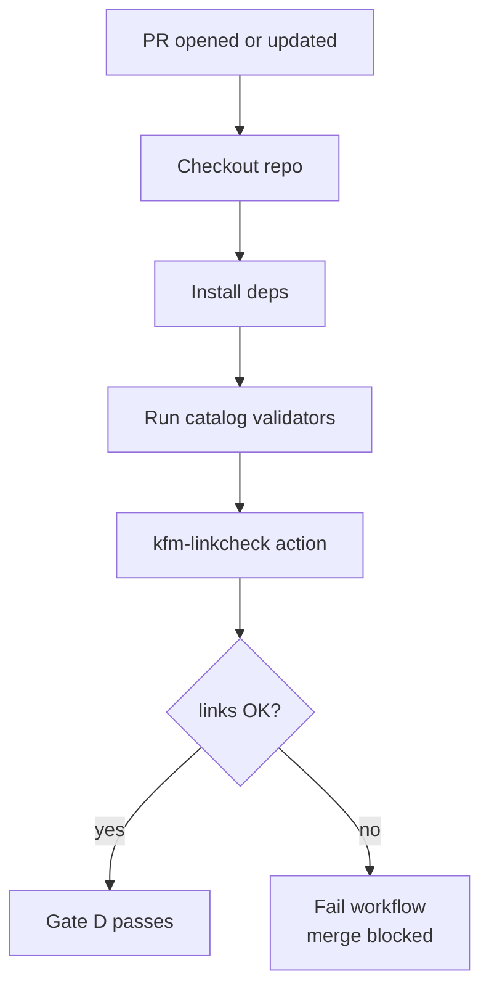

<!-- [KFM_META_BLOCK_V2]
doc_id: kfm://doc/3c0c2e1c-9ff1-4e63-a232-1a8a6d5e8c1a
title: kfm-linkcheck GitHub Action
type: standard
version: v1
status: draft
owners: KFM Maintainers
created: 2026-02-28
updated: 2026-02-28
policy_label: public
related:
  - .github/workflows/
  - tools/linkcheck/
tags: [kfm, ci, github-actions, linkcheck, promotion-gates]
notes:
  - Keep README and action.yml inputs/outputs synchronized.
[/KFM_META_BLOCK_V2] -->

# kfm-linkcheck (GitHub Action)

> Merge-blocking catalog cross-link + citation link checks for KFM (**Promotion Contract Gate D**).


---

## Quick navigation

- [Purpose](#purpose)
- [What it checks](#what-it-checks)
- [How it works](#how-it-works)
- [Usage](#usage)
- [Inputs and outputs](#inputs-and-outputs)
- [Local run](#local-run)
- [Troubleshooting](#troubleshooting)
- [Repo placement](#repo-placement)
- [Change management](#change-management)
- [Verification checklist](#verification-checklist)

---

## Purpose

KFM treats the **DCAT + STAC + PROV “triplet”** as a contract surface: catalogs must be **cross-linked** and evidence references must be **resolvable** (fail-closed).

This action runs the repository’s **catalog link checker** and fails the workflow step if:

- catalog cross-links are missing or inconsistent
- citations / EvidenceRefs are broken (unresolvable)
- required IDs are missing (preventing deterministic resolution)

This action is intended to support:

- **Promotion Contract – Gate D: Catalog triplet validation**
  - “DCAT/STAC/PROV all validate and cross-link”
  - “EvidenceRefs resolve without guessing”
  - “Validators + linkcheck; fail if broken links or missing IDs”

[Back to top](#quick-navigation)

---

## What it checks

This action is focused on **link integrity**, not schema validation (run schema validators separately).

Typical checks include:

| Check class | Why it matters | Examples of what’s “broken” |
|---|---|---|
| **Triplet cross-links** | Keeps DCAT/STAC/PROV navigable and machine-resolvable | STAC `links[]` missing the `describedby` (DCAT) or `via` (PROV) relationship |
| **EvidenceRef resolvability** | Prevents “guessing” at evidence; enables cite-or-abstain UX | `dcat://…` / `prov://…` / `doc://…` references that don’t resolve |
| **ID presence** | Deterministic identity; avoids drift and accidental collisions | Missing `dataset_version_id`, missing run/activity IDs, missing record IDs in link targets |

### Example cross-links (STAC → DCAT / PROV)

A promoted STAC Collection is expected to include links like:

- `rel: describedby` → `dcat://…`
- `rel: via` → `prov://…`

(Exact profile requirements live in the catalog schemas and KFM governance docs.)

[Back to top](#quick-navigation)

---

## How it works



Under the hood, this action should invoke the repository link-check CLI (commonly something like `node tools/linkcheck/catalog_linkcheck.js`) and surface failures as GitHub Actions annotations and a non-zero exit.

[Back to top](#quick-navigation)

---

## Usage

### Minimal (local action)

```yaml
- name: Linkcheck citations (KFM)
  uses: ./.github/actions/kfm-linkcheck
```

### Typical CI lane (recommended ordering)

Run linkcheck **after**:
1) dependency install  
2) catalog validators (DCAT/STAC/PROV)

```yaml
jobs:
  validate:
    runs-on: ubuntu-latest
    steps:
      - uses: actions/checkout@v4

      # Ensure Node + deps are available (exact setup depends on your repo)
      - uses: actions/setup-node@v4
        with:
          # TODO: pin via .nvmrc / toolchain file if present
          node-version: "20"
          cache: "npm"

      - run: npm ci

      - name: Validate catalogs
        run: |
          node tools/validators/validate_dcat.js
          node tools/validators/validate_stac.js
          node tools/validators/validate_prov.js

      - name: Linkcheck citations (KFM)
        uses: ./.github/actions/kfm-linkcheck
```

> NOTE: If this action already installs dependencies / sets up Node internally, you can simplify.  
> The authoritative interface is `action.yml`.

[Back to top](#quick-navigation)

---

## Inputs and outputs

**Source of truth:** `action.yml` in this directory.

Document the action’s interface here and keep it in sync with `action.yml`.

### Starter template (PROPOSED)

If you haven’t defined inputs yet, this table is a good starting point. Adjust to match `action.yml`:

| Input | Required | Default | Meaning |
|---|---:|---|---|
| `command` | no | `node tools/linkcheck/catalog_linkcheck.js` | CLI command to run |
| `working-directory` | no | `.` | Where to run the command |
| `fail-on-warning` | no | `true` | Treat warnings as failures |
| `report-format` | no | `github` | Output/annotation format |

| Output | Meaning |
|---|---|
| `report-path` | Path to any emitted report (if generated) |

[Back to top](#quick-navigation)

---

## Local run

If you want to reproduce CI locally, run the same command your workflow uses. A common pattern is:

```bash
npm ci
node tools/linkcheck/catalog_linkcheck.js
```

[Back to top](#quick-navigation)

---

## Troubleshooting

### “Broken link” / “missing ID” failures

1) Identify which artifact is referenced (DCAT vs STAC vs PROV vs doc).
2) Fix the producing catalog generator or the hand-authored catalog file.
3) Re-run:
   - catalog validators
   - linkcheck

### Common root causes

- STAC Collection or Item missing `describedby` / `via` links
- A `prov://` link points to a run ID that doesn’t exist in the PROV bundle
- A `dcat://` link points to a dataset version that doesn’t exist (or was renamed)
- EvidenceRef schemes changed without updating resolvers and tests

[Back to top](#quick-navigation)

---

## Repo placement

This directory is a **local GitHub Action** used by CI lanes.

```text
.github/
  actions/
    kfm-linkcheck/
      action.yml        # Action definition (authoritative contract)
      README.md         # This file
      # (optional) scripts/, dist/, etc.
```

### Acceptable inputs (what belongs here)

- `action.yml` and supporting scripts required to run linkcheck in CI
- Documentation (README) and minimal test fixtures for the action itself

### Exclusions (what must not go here)

- Large datasets or production catalog artifacts (keep those in their domain folders)
- Secrets, tokens, or credentials (use GitHub Actions secrets / OIDC)
- Long-lived build outputs that can be regenerated (prefer CI artifacts)

[Back to top](#quick-navigation)

---

## Change management

Because link checking is a **merge-blocking gate**, treat changes as governed:

- Pin tool versions where practical (Node, dependencies, schema profiles).
- Any change that relaxes checks should include:
  - rationale
  - before/after examples
  - updated tests/fixtures
  - explicit steward sign-off if it affects promotion rules

[Back to top](#quick-navigation)

---

## Verification checklist

- [ ] `action.yml` exists and defines the same inputs/outputs documented above
- [ ] Action fails the step on broken links (non-zero exit)
- [ ] Action is wired into CI lanes that enforce Promotion Contract Gate D
- [ ] Sample STAC/DCAT/PROV fixtures exist to prove both “pass” and “fail” behavior
- [ ] Output is human-actionable (points to the exact file + field to fix)

[Back to top](#quick-navigation)
