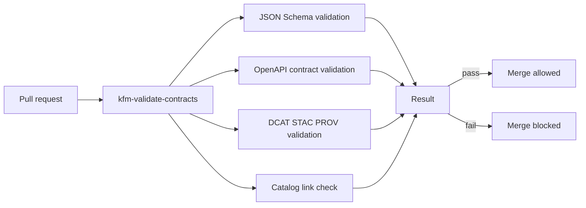

<!-- [KFM_META_BLOCK_V2]
doc_id: kfm://doc/6b2a1c7e-4a60-4f1e-8f9c-3a7d0a8b4f9d
title: kfm-validate-contracts GitHub Action
type: standard
version: v1
status: draft
owners: TBD
created: 2026-02-28
updated: 2026-02-28
policy_label: public
related:
  - .github/workflows
  - contracts
  - data/catalog
  - tools
tags: [kfm, ci, contracts, validation, governance]
notes:
  - Keep this README in sync with action.yml.
  - This action is part of the fail-closed Promotion Contract enforcement posture.
[/KFM_META_BLOCK_V2] -->

# kfm-validate-contracts
Fail-closed CI gate that validates KFM **contract surfaces** (schemas, OpenAPI, catalog triplet) so promotion and publishing can’t proceed with broken or ambiguous metadata.


---

## Navigation
- [What this action does](#what-this-action-does)
- [Why it exists in KFM](#why-it-exists-in-kfm)
- [Where it fits in the repo](#where-it-fits-in-the-repo)
- [Inputs](#inputs)
- [Outputs](#outputs)
- [Usage](#usage)
- [Directory contents](#directory-contents)
- [Troubleshooting](#troubleshooting)
- [Contributing](#contributing)

---

## What this action does
This action is intended to validate the KFM “contract-first” artifacts that other systems depend on:

- **Schema validation**
  - JSON Schemas used for dataset specs/registries and other typed artifacts.
- **OpenAPI contract validation**
  - API schema integrity checks (lint, bundle/compile, diff checks if enabled).
- **Catalog triplet validation**
  - **DCAT + STAC + PROV** validate and cross-link deterministically.
- **Catalog link checking**
  - Verifies required cross-links so EvidenceRefs resolve *without guessing*.

> [!WARNING]
> This action should **fail closed**. If any contract validation fails, the job must exit non-zero so merges/promotion can be blocked.

---

## Why it exists in KFM
KFM treats catalogs and provenance not as optional documentation, but as runtime-facing contracts. When contract artifacts drift or break, the system loses its ability to:
- enforce licensing and policy labels consistently,
- resolve evidence deterministically,
- publish trustworthy map/story/focus answers.

This action is one of the CI mechanisms that helps keep the Promotion Contract enforceable.

---

## Where it fits in the repo
**Path:** `.github/actions/kfm-validate-contracts/`

This directory contains a reusable GitHub Action (typically a **composite action**) designed to be invoked by one or more workflows under `.github/workflows/` (for example: PR checks, release gates, promotion checks).

### Acceptable inputs
This action is for validating **contracts and metadata surfaces**, such as:
- `contracts/` (OpenAPI specs, schemas, vocabularies)
- `data/catalog/` (DCAT/STAC/PROV artifacts)
- `tools/` validators and link-check helpers (if used by the action)

### Exclusions
Do **not** put the following here:
- dataset acquisition or ingestion logic (belongs in pipelines/ingest tooling)
- promotion tooling (release manifests, publishing)
- runtime services (API/UI code)
- “fix-up” logic that silently patches invalid catalogs (validation should be strict and predictable)

---

## Inputs
> [!NOTE]
> **Source of truth:** `action.yml`.  
> Keep this section synced with the actual composite action inputs.

Recommended (typical) inputs for this action:

| Input | Required | Default | Purpose |
|------|----------|---------|---------|
| `workdir` | no | `.` | Run validators from this directory |
| `scope` | no | `all` | `all` or `changed` (validate all vs. only changed files) |
| `fail_on_warnings` | no | `true` | Treat warnings as errors (recommended for governance posture) |
| `catalog_paths` | no | `data/catalog` | Root path(s) for DCAT/STAC/PROV artifacts |
| `contracts_paths` | no | `contracts` | Root path(s) for OpenAPI and JSON schemas |
| `tools_paths` | no | `tools` | Root path(s) for validators/linkcheckers |

If you don’t support these inputs in `action.yml`, remove them here.

---

## Outputs
> [!NOTE]
> **Source of truth:** `action.yml`.

Recommended outputs:

| Output | Description |
|--------|-------------|
| `validated` | `true` if all validations passed |
| `summary_path` | Optional path to a machine-readable validation summary (JSON) |

---

## Usage

### Minimal
```yaml
jobs:
  contracts:
    runs-on: ubuntu-latest
    steps:
      - uses: actions/checkout@v4

      - name: Validate KFM contracts
        uses: ./.github/actions/kfm-validate-contracts
```

### Validate changed-only
If your action supports a `scope: changed` mode:

```yaml
jobs:
  contracts:
    runs-on: ubuntu-latest
    steps:
      - uses: actions/checkout@v4
        with:
          fetch-depth: 0

      - name: Validate KFM contracts
        uses: ./.github/actions/kfm-validate-contracts
        with:
          scope: changed
```

---

## Validation flow


---

## Directory contents
> [!NOTE]
> This directory listing is a **documentation expectation**. Update it to match what actually exists.

```text
.github/actions/kfm-validate-contracts/
├─ README.md              # You are here
├─ action.yml             # Composite action definition
└─ (optional) scripts/    # Helper scripts invoked by action.yml
```

---

## Troubleshooting

### “Catalog link check failed”
Common causes:
- STAC collection or item missing a required link to DCAT or PROV
- PROV bundle missing required activity/entity/agent linkage
- EvidenceRef targets can’t be resolved without guessing

Fix:
- add explicit cross-links (do not rely on implied conventions)
- re-run locally using the same validator commands as the action

### “OpenAPI contract validation failed”
Common causes:
- OpenAPI YAML not bundling/compiling
- breaking changes detected (if diff mode enabled)

Fix:
- validate the OpenAPI file(s) locally
- update DTO/schema changes and regenerate any derived artifacts

---

## Contributing
When adding or modifying contract surfaces:
1. Update the relevant schema/OpenAPI/catalog artifact(s).
2. Add or update fixtures/examples (valid + invalid where useful).
3. Ensure this action runs in PR CI and fails for invalid artifacts.
4. Keep this README and `action.yml` in sync.

---

<p align="right"><a href="#kfm-validate-contracts">Back to top</a></p>
