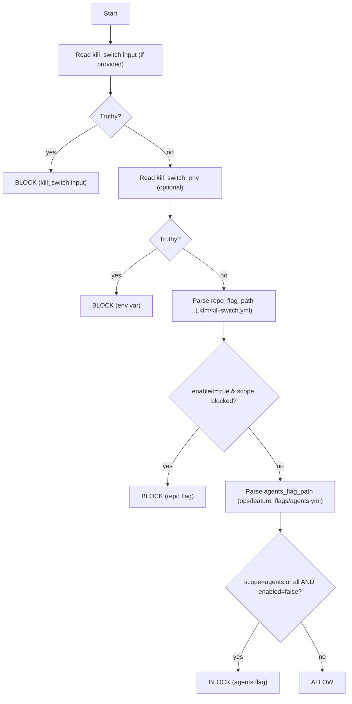

<a id="top"></a>

# 🧯 `kill-switch` — Fail‑Closed Circuit Breaker for KFM CI/CD + Agents


> **What this is:** a repo‑local composite action that checks KFM kill‑switch signals (repo/env + feature‑flag files) and **halts dangerous lanes** (publish, deploy, docker push, agents) *before* they run.  
> **Why:** KFM is provenance‑first and governance‑first — **trust > speed**. When something is wrong (incidents, misclassification, broken catalogs, suspected compromise), you need a **single stop button** that’s boring, fast, and auditable. 🧾🔐

---

## 🧾 Action metadata

| Field | Value |
|---|---|
| Path | `.github/actions/kill-switch/README.md` |
| Action folder | `.github/actions/kill-switch/` |
| Action file | `.github/actions/kill-switch/action.yml` *(expected)* |
| Action ID (suggested) | `kfm/kill-switch` |
| Type | Composite Action |
| Default posture | **Fail‑closed** (stop lanes on signal) |
| Last updated | **2026-01-11** |
| Baseline | KFM‑MDP **v11.2.6** • Master Guide **v13 (draft)** |

> [!NOTE]
> If your repo currently uses `check-kill-switch/`, treat this action as the **canonical** circuit breaker.
> You can keep `check-kill-switch` as a thin compatibility wrapper that forwards to `kill-switch` (recommended) 🔁✅

---

## ⚡ Quick links

| Need | Go |
|---|---|
| 🧪 Workflows (CI/CD patterns) | [`../../workflows/README.md`](../../workflows/README.md) |
| 🧩 Actions hub | [`../README.md`](../README.md) |
| 🛡️ Security policy | [`../../../SECURITY.md`](../../../SECURITY.md) *(or `../../SECURITY.md` if mirrored)* |
| 🧭 Governance scan (PR gate) | [`../governance-scan/README.md`](../governance-scan/README.md) *(if present)* |
| ✅ Catalog QA (STAC/DCAT fast gate) | [`../catalog-qa/README.md`](../catalog-qa/README.md) *(if present)* |
| 📦 Build receipts | [`../build-info/README.md`](../build-info/README.md) |
| 🐳 Build/push images | [`../docker-build/README.md`](../docker-build/README.md) |
| 🧬 SBOM | [`../sbom/README.md`](../sbom/README.md) |
| 🖊️ Attestations | [`../attest/README.md`](../attest/README.md) |

---

<details>
<summary><strong>📌 Table of contents</strong></summary>

- [🧠 What problem this solves](#-what-problem-this-solves)
- [🧭 What this action protects](#-what-this-action-protects)
- [🧯 Signals this action checks](#-signals-this-action-checks)
- [⚖️ Precedence rules](#️-precedence-rules)
- [🎛️ Scopes](#️-scopes)
- [🔌 Inputs](#-inputs)
- [📤 Outputs](#-outputs)
- [🚀 Usage patterns](#-usage-patterns)
- [🗂️ Kill‑switch file formats](#️-kill-switch-file-formats)
- [🧠 Decision flow](#-decision-flow)
- [🔐 Security & governance notes](#-security--governance-notes)
- [🧯 Incident playbook](#-incident-playbook)
- [🧰 Troubleshooting](#-troubleshooting)

</details>

---

## 🧠 What problem this solves

KFM workflows cover **code + data + catalogs + provenance + artifacts + (optionally) agents**.

When *any* of the following is true:

- 🔥 a publish lane is producing broken STAC/DCAT/PROV “boundary artifacts”
- 🔐 secrets / credentials are suspected exposed
- 🗺️ sensitive locations risk being published at too‑fine precision
- 📦 artifact integrity checks are failing or supply chain is in doubt
- 🤖 an agent lane must stop immediately (Watcher–Planner–Executor safety)

…you need an immediate **pipeline breaker** that:
- runs fast (milliseconds)
- uses least privilege (read‑only)
- is auditable (prints *why* it stopped, without leaking secrets)
- is easy to wire into **every workflow** (PR lanes, nightly, release, deploy)

This action is that breaker. 🧯

---

## 🧭 What this action protects

Kill switch is for **mutation risk** — anything that can write, publish, or irreversibly change the system.

✅ Typical “must‑guard” jobs:
- 📦 publish catalogs (STAC/DCAT/PROV promotion)
- 🐳 push container images to GHCR
- 🌐 deploy Pages / environments
- 🖊️ attach attestations / signatures
- 🤖 run Planner/Executor jobs that can open PRs or write artifacts

✅ Typical “safe to keep running” jobs (when you want a calm pause):
- 🧪 unit tests / lint / typecheck
- 🔎 governance-scan / catalog-qa (read-only gates)
- 🧾 build-info generation (read-only + hashing)

> [!IMPORTANT]
> Kill switch is an **emergency brake**, not a policy engine.  
> For complex allow/deny logic, use policy-as-code gates (OPA/Conftest) — and keep this action simple. 🧑‍⚖️✅

---

## 🧯 Signals this action checks

This action supports **layered switch sources** so you can stop the system even if one channel is unavailable.

### 1) 🔐 Repo / Environment kill switch (fastest, recommended)
A repo variable/secret or workflow `env:` value like:

- `KFM_KILL_SWITCH=true` *(or `1`, `yes`, `on`)*

Used to **pause dangerous lanes immediately** without code changes. 🚨

### 2) 🧾 Auditable repo kill switch file (reviewable toggles)
A version-controlled file you protect via CODEOWNERS, e.g.:

- `.kfm/kill-switch.yml`

Used for:
- planned maintenance windows 🛠️
- visible stop state in Git history 🧾
- scope-specific stops (publish on, tests off) 🎛️

### 3) 🤖 Agent runtime flag (W·P·E safety)
A repo file (governed, reviewable):

- `ops/feature_flags/agents.yml`

Used to stop agent actions (Planner/Executor) quickly and traceably.

> [!TIP]
> **Precedence rule of thumb:** if *any* source says “STOP”, we stop.  
> The action reports the highest‑priority source that triggered the block.

---

## ⚖️ Precedence rules

When multiple signals exist, resolve them deterministically:

1) **Explicit input value** (`kill_switch`)  
2) **Repo/env var** (`kill_switch_env`, default: `KFM_KILL_SWITCH`)  
3) **Repo kill-switch file** (`.kfm/kill-switch.yml`)  
4) **Agents flag file** (`ops/feature_flags/agents.yml`) *(agents scope only; or `scope=all`)*

This precedence ensures:
- 🚨 emergency response can override everything immediately
- 🧾 reviewed toggles remain canonical for normal ops
- 🤖 agent safety remains enforceable by a simple, auditable flag file

---

## 🎛️ Scopes

Scopes let you stop risky lanes without freezing everything.

Recommended scope values:

| Scope | Stops | Typical workflows |
|---|---|---|
| `all` | everything mutation‑capable | emergency response |
| `publish` | catalogs/data promotion, releases | `release.yml`, `publish-catalogs.yml` |
| `deploy` | pages/env deploys | `pages.yml`, `deploy.yml` |
| `docker` | image push/sign | `docker.yml`, `release.yml` |
| `agents` | Planner/Executor lanes | `agents.yml`, `executor.yml` |
| `pr_checks` | optional: stop PR checks (rare) | only during CI incidents |

> [!CAUTION]
> Don’t over-scope. The safest default is:  
> **stop publish/deploy/docker/agents**, keep PR checks running. ✅🧪

---

## 🔌 Inputs

> Composite actions receive inputs as strings. Treat booleans as `"true"` / `"false"`.

| Input | Required | Default | Meaning |
|---|---:|---|---|
| `mode` | ❌ | `fail` | `fail` → exit 1 when blocked. `output-only` → never fails, only sets outputs. |
| `scope` | ❌ | `all` | What this check is guarding: `all`, `publish`, `deploy`, `docker`, `agents`, `pr_checks`. |
| `kill_switch` | ❌ | *(empty)* | Explicit kill-switch value (recommended). Pass `${{ vars.KFM_KILL_SWITCH }}` or `${{ secrets.KFM_KILL_SWITCH }}`. |
| `kill_switch_env` | ❌ | `KFM_KILL_SWITCH` | Env var name to read if `kill_switch` isn’t provided. |
| `repo_flag_path` | ❌ | `.kfm/kill-switch.yml` | Auditable repo kill switch file (optional but recommended). |
| `agents_flag_path` | ❌ | `ops/feature_flags/agents.yml` | Agent subsystem flag file. |
| `require_files` | ❌ | `false` | If `true`, missing flag files are treated as an error (strict publish lanes). |
| `truthy` | ❌ | `true,1,yes,on` | Comma-separated values considered “ON” (case-insensitive). |
| `report_path` | ❌ | `out/kill-switch/report.json` | Where to write a small JSON decision report. |
| `print_summary` | ❌ | `true` | If `true`, write a safe summary into `$GITHUB_STEP_SUMMARY`. |

---

## 📤 Outputs

| Output | Meaning |
|---|---|
| `allowed` | `"true"` if the job should proceed |
| `blocked` | `"true"` if kill switch is engaged for the scope |
| `scope` | resolved scope value |
| `source` | which control triggered the block (`kill_switch`, `env`, `repo_flag_path`, `agents_flag_path`) |
| `reason` | human-readable reason (best effort; may be blank) |
| `report_path` | path to JSON report file |

✅ Recommended JSON report shape (tiny + boring):

```json
{
  "allowed": true,
  "blocked": false,
  "scope": "publish",
  "source": "repo_flag_path",
  "reason": "maintenance window",
  "evaluated": {
    "kill_switch": "unset",
    "kill_switch_env": "unset",
    "repo_flag_path": ".kfm/kill-switch.yml",
    "agents_flag_path": "ops/feature_flags/agents.yml"
  }
}
```

---

## 🚀 Usage patterns

### Pattern A — Guardrails job (recommended for multi‑job workflows) 🧱

This prevents expensive jobs from even starting.

```yaml
name: Publish Catalogs

on:
  workflow_dispatch:
  push:
    branches: [main]

permissions:
  contents: read

jobs:
  guardrails:
    runs-on: ubuntu-latest
    outputs:
      allowed: ${{ steps.ks.outputs.allowed }}
      reason:  ${{ steps.ks.outputs.reason }}
    steps:
      - uses: actions/checkout@v4
      - id: ks
        name: 🧯 Kill switch
        uses: ./.github/actions/kill-switch
        with:
          scope: publish
          mode: output-only
          kill_switch: ${{ vars.KFM_KILL_SWITCH }}

  publish:
    needs: guardrails
    if: needs.guardrails.outputs.allowed == 'true'
    runs-on: ubuntu-latest
    permissions:
      contents: read
      id-token: write
    steps:
      - uses: actions/checkout@v4
      - name: 🚀 Promote catalogs
        run: echo "publish steps…"
```

✅ Why this works:
- guardrails are tiny + deterministic
- downstream jobs are hard‑stopped when the switch is ON
- you can still keep CI calm (green-but-paused) when desired 🧘‍♂️✅

---

### Pattern B — Single job early‑exit (simple workflows)

```yaml
jobs:
  build:
    runs-on: ubuntu-latest
    permissions:
      contents: read

    steps:
      - uses: actions/checkout@v4

      - id: ks
        uses: ./.github/actions/kill-switch
        with:
          scope: all
          mode: output-only
          kill_switch: ${{ vars.KFM_KILL_SWITCH }}

      - name: 🧪 Run tests
        if: steps.ks.outputs.allowed == 'true'
        run: pytest -q
```

---

### Pattern C — Agent workflows (W·P·E safety) 🤖🧯

Agents should hard-stop when disabled.

```yaml
jobs:
  executor:
    runs-on: ubuntu-latest
    permissions:
      contents: read

    steps:
      - uses: actions/checkout@v4

      - name: 🧯 Kill switch (agents)
        uses: ./.github/actions/kill-switch
        with:
          scope: agents
          mode: fail
          kill_switch: ${{ vars.KFM_KILL_SWITCH }}

      - name: 🤖 Execute plan (opens PR, never merges)
        run: echo "executor logic…"
```

> [!CAUTION]
> Don’t run mutation-capable agent jobs on untrusted fork PRs.  
> Keep them on `push main`, tags, or `workflow_dispatch` with protected environments.

---

## 🗂️ Kill‑switch file formats

> Keep YAML **flat and boring** for deterministic parsing (no anchors, no multi-docs).

### A) 🤖 `ops/feature_flags/agents.yml` (agent enable/disable)

```yaml
# ops/feature_flags/agents.yml
enabled: false
reason: "maintenance window — pause W·P·E automation"
expires_utc: "2026-01-12T00:00:00Z"
ticket: "INC-2026-01-11-001"
```

Interpretation:
- `enabled: false` ⇒ **agents are OFF** (Planner/Executor stop)
- `enabled: true`  ⇒ agents may run (still gated by governance + PR rules)

✅ Recommended protection:
- CODEOWNERS for `ops/feature_flags/**`
- required reviews for changes

---

### B) 🧾 `.kfm/kill-switch.yml` (audited stop button)

```yaml
# .kfm/kill-switch.yml
version: 1
enabled: true

# scopes are "block = true"
scopes:
  publish: true
  deploy: true
  docker: true
  agents: true
  pr_checks: false

reason: "incident response: catalog integrity investigation"
set_by: "@kfm/ops"
set_at_utc: "2026-01-11T05:12:00Z"
expires_utc: "2026-01-12T05:12:00Z"
ticket: "INC-2026-01-11-001"
```

Interpretation:
- `enabled: false` ⇒ file is ignored (no blocking from this source)
- `enabled: true` + `scopes.<scope>: true` ⇒ **block that scope**
- `scope=all` ⇒ block if *any* scoped block is true (or treat as “block everything” — implementation choice, but document it)

> [!TIP]
> Use `.kfm/kill-switch.yml` when you want a **reviewed**, **auditable** pause state that’s visible in repo history. 🧾

---

## 🧠 Decision flow



---

## 🔐 Security & governance notes

### ✅ Least privilege by default
This action should run with:

```yaml
permissions:
  contents: read
```

No secrets required unless you choose to pass `kill_switch` explicitly.

### ✅ Do not print secrets
- Never echo the `kill_switch` raw value.
- Only report: **blocked/allowed**, **source**, **scope**, **reason**.

### ✅ Trust boundaries
- PRs are untrusted. A contributor can modify `.kfm/kill-switch.yml` *in the PR* to make the PR run “look allowed.”  
  That’s fine for PR validation jobs — but **publish/deploy** should not run in PR context anyway.
- Protected lanes should be guarded by:
  - branch protection
  - protected GitHub Environments (approvals)
  - no secrets for fork PRs
  - attestation/signing in release lanes

> [!IMPORTANT]
> Kill switch is a **circuit breaker**, not the only lock. 🔐

---

## 🧯 Incident playbook

### 🚨 Immediate containment (minutes)
1) Turn on the fastest switch:
   - set `KFM_KILL_SWITCH=true` in GitHub **Environment** vars/secrets (preferred) or repo vars
2) Re-run the affected workflow(s) (optional) to confirm the guard trips.
3) Start private incident tracking (avoid pasting secrets/sensitive info in public issues).

### 🧾 Stabilize + document (hours)
4) If you need an auditable stop state:
   - set `.kfm/kill-switch.yml` with reason + expiry + ticket
5) Confirm CODEOWNERS protection for:
   - `ops/feature_flags/**`
   - `.kfm/**`
6) Run governance-scan + catalog-qa on a fixed snapshot.

### ✅ Recovery (after fix)
7) Turn switch OFF (unset env var + set `.kfm/kill-switch.yml.enabled=false` or remove scoped blocks)
8) Require a “return to green” checklist:
   - catalogs valid ✅
   - provenance present ✅
   - classification propagation validated ✅
   - secrets rotated (if applicable) ✅
   - release artifacts re-attested (if applicable) ✅

---

## 🧰 Troubleshooting

### “It says the kill switch is ON, but I didn’t set it”
- Check workflow `env:` blocks for `KFM_KILL_SWITCH`.
- Check GitHub **Environment** vars/secrets (they can shadow repo settings).
- Check `.kfm/kill-switch.yml` and `ops/feature_flags/agents.yml`.

### “It’s not stopping my workflow”
- Ensure your workflow actually calls this action (**guardrails job recommended**).
- Ensure downstream jobs have `if:` gates wired to the outputs (when using `mode=output-only`).
- Confirm you didn’t set `mode: output-only` and then forget the `if:` gate.

### “I want publish halted but PR checks to keep running”
- Use `scope: publish` in publish workflows.
- Keep PR workflows using `scope: pr_checks` (or `scope: all` but configure `.kfm/kill-switch.yml.scopes.pr_checks=false`).

---

<p align="right"><a href="#top">⬆️ Back to top</a></p>
