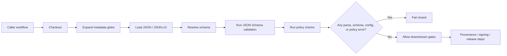

<!-- [KFM_META_BLOCK_V2]
doc_id: kfm://doc/NEEDS-VERIFICATION
title: Metadata Validate v2
type: standard
version: v1
status: draft
owners: TODO: owner not verified
created: NEEDS-VERIFICATION
updated: 2026-05-05
policy_label: NEEDS-VERIFICATION
related: [
  ../README.md,
  ../../README.md,
  ../../workflows/README.md,
  ../../../schemas/README.md,
  ../../../policy/README.md,
  ../../../tests/README.md
]
tags: [kfm, github-actions, metadata, validation, schema, policy, stac, dcat, prov]
notes: [
  This README documents the intended metadata-validation v2 gate without claiming branch-local action.yml, workflow callers, schema paths, policy paths, or required-check status are verified.
  The action should remain a thin workflow step wrapper. Semantic contract meaning belongs in contracts/, machine-checkable shape belongs in schemas/, policy meaning belongs in policy/, and regression proof belongs in tests/ or fixtures/.
]
[/KFM_META_BLOCK_V2] -->

<a id="top"></a>

# Metadata Validate v2

Composite GitHub Action documentation for fail-closed, schema-first metadata admission before KFM provenance, release, or publication stages continue.


> [!NOTE]
> **Status:** `draft`  
> **Owners:** `TODO: owner not verified`  
> **Authority:** `PROPOSED / NEEDS VERIFICATION`  
> **Repo fit:** `.github/actions/metadata-validate-v2/`  
> **Review burden:** workflow maintainers, schema maintainers, policy maintainers, and release-gate reviewers should recheck this README against the mounted `action.yml` and caller workflows before merge.

**Quick jumps:** [Scope](#scope) · [Repo fit](#repo-fit) · [Accepted inputs](#accepted-inputs) · [Exclusions](#exclusions) · [Directory tree](#directory-tree) · [Operating model](#operating-model) · [Usage](#usage) · [Behavior matrix](#behavior-matrix) · [Validation](#validation) · [Definition of done](#definition-of-done) · [Rollback](#rollback) · [FAQ](#faq) · [Appendix](#appendix)

> [!IMPORTANT]
> This action is a **metadata admission gate**, not a publication authority. It may validate metadata objects and stop unsafe workflow progress. It must not define canonical schema meaning, policy law, source authority, release state, or evidence truth by itself.

---

## Scope

`.github/actions/metadata-validate-v2/` is the expected home for a repo-local composite action that validates KFM metadata objects before downstream provenance, signing, release assembly, catalog closure, or publication steps run.

Use this action to:

- validate STAC, DCAT, PROV, and KFM metadata JSON against repo-owned schemas;
- run policy checks after structural validation;
- fail closed when metadata is malformed, unsupported, missing a schema, or policy-denied;
- centralize repeated metadata gate steps so workflow YAML stays thin and reviewable;
- provide reviewer-readable failure output for CI.

This action should remain small. Larger validation helpers, policy bundles, fixtures, schemas, and release decisions belong in their owning responsibility roots.

[Back to top](#top)

---

## Repo fit

| Direction | Surface | Relationship | Status |
| --- | --- | --- | --- |
| Parent lane | [`../README.md`](../README.md) | `.github/actions/` step-wrapper boundary | `NEEDS VERIFICATION` |
| GitHub control plane | [`../../README.md`](../../README.md) | `.github/` review, automation, and platform-governance context | `NEEDS VERIFICATION` |
| Workflow callers | [`../../workflows/README.md`](../../workflows/README.md) | workflow orchestration should call this action instead of embedding large validation scripts | `NEEDS VERIFICATION` |
| Schema authority | [`../../../schemas/README.md`](../../../schemas/README.md) | machine-checkable JSON Schema definitions consumed by this action | `NEEDS VERIFICATION` |
| Policy authority | [`../../../policy/README.md`](../../../policy/README.md) | Rego or equivalent policy rules consumed by this action | `NEEDS VERIFICATION` |
| Verification evidence | [`../../../tests/README.md`](../../../tests/README.md) | executable tests, fixtures, and regression proof for action behavior | `NEEDS VERIFICATION` |

### Ownership boundary

This action may wrap validation commands. It must not become the only place where validation meaning exists.

| Meaning | Owning root |
| --- | --- |
| semantic object meaning | `contracts/` |
| machine-checkable shape | `schemas/` |
| allow / deny / restrict / abstain logic | `policy/` |
| fixtures and regression proof | `tests/` and `fixtures/` |
| workflow sequencing | `.github/workflows/` |
| step-level reuse | `.github/actions/metadata-validate-v2/` |

[Back to top](#top)

---

## Accepted inputs

The mounted `action.yml` is the source of truth for exact input names and defaults. Until it is rechecked, treat this table as the expected interface.

| Input | Expected meaning | Required? | Status |
| --- | --- | --- | --- |
| `paths` | comma-separated glob list of metadata files to validate | expected required | `NEEDS VERIFICATION` |
| `schema_dir` | directory containing JSON Schemas used by the validator | expected required | `NEEDS VERIFICATION` |
| `policy_dir` | policy bundle directory, if v2 exposes it as an input rather than using a repo default | optional / possible | `PROPOSED` |
| `allow_empty` | whether no matched files should pass; default should fail closed unless caller explicitly opts out | optional / possible | `PROPOSED` |
| `summary` | whether to write a compact CI step summary | optional / possible | `PROPOSED` |

Accepted target files should be metadata objects that are already within the repository’s governed review path, such as:

- STAC Items, Collections, or Catalogs;
- DCAT dataset or distribution records;
- PROV JSON / JSON-LD;
- KFM catalog, receipt, proof, release, layer, or manifest metadata explicitly routed into this gate.

[Back to top](#top)

---

## Exclusions

Do **not** place these responsibilities in this action:

| Excluded responsibility | Correct home or handling |
| --- | --- |
| raw source fetching or ETL | `connectors/`, `pipelines/`, `tools/`, or `scripts/` depending on repo convention |
| schema authorship | `schemas/` plus semantic links to `contracts/` |
| policy authorship | `policy/` |
| provenance generation | a separate provenance guard or release/proof lane |
| SBOM generation, signing, or attestation upload | dedicated attestation or release tooling |
| release or publish orchestration | `.github/workflows/`, `release/`, and governed promotion tooling |
| secrets or long-lived credentials | GitHub environments or external secret management |
| public UI or runtime interpretation | `apps/`, `packages/`, `ui/`, or `web/` as governed by repo convention |

[Back to top](#top)

---

## Directory tree

### Minimum expected shape

```text
.github/actions/metadata-validate-v2/
├── README.md
└── action.yml        # NEEDS VERIFICATION in the mounted branch
```

### Mature target shape

```text
.github/actions/metadata-validate-v2/
├── README.md
├── action.yml
├── migration.md      # only if v2 intentionally supersedes metadata-validate/
└── tests/
    └── fixtures/     # optional action-local smoke fixtures; shared fixtures still belong in tests/ or fixtures/
```

> [!NOTE]
> Keep local fixtures tiny if they exist. Contract-grade and policy-grade fixtures should remain in shared verification roots so they are reusable outside GitHub Actions.

[Back to top](#top)

---

## Operating model



The gate should run before provenance, signing, catalog assembly, release, or publish steps. Broken metadata should fail early, while the workflow still has enough context to report file-scoped errors.

[Back to top](#top)

---

## Usage

### Minimal caller shape

```yaml
# NEEDS VERIFICATION: compare this example against the mounted action.yml before use.
- name: Metadata validation gate
  uses: ./.github/actions/metadata-validate-v2
  with:
    paths: "data/**/*.json,data/**/*.geojson,release/**/*.json"
    schema_dir: "schemas/metadata"
```

### Typical workflow position

```yaml
jobs:
  metadata-gates:
    runs-on: ubuntu-latest
    steps:
      - uses: actions/checkout@v4

      - name: Metadata validation
        uses: ./.github/actions/metadata-validate-v2
        with:
          paths: ${{ inputs.metadata_globs }}
          schema_dir: ${{ inputs.schema_dir }}

      # Later gates should only run if metadata validation passes.
      - name: Provenance guard
        if: ${{ success() }}
        run: echo "Call provenance gate here"

      - name: Release dry run
        if: ${{ success() }}
        run: echo "Call release dry run here"
```

### Operating rule

Run this action early and fail closed.

If a metadata file cannot be parsed, matched to a schema, validated, or policy-evaluated, later proof, signing, release, or publication steps should not run.

[Back to top](#top)

---

## Behavior matrix

| Outcome | Meaning | Expected workflow result | Reviewer action |
| --- | --- | --- | --- |
| `PASS` | targeted files passed schema and policy checks | downstream gates may continue | confirm summary and caller scope |
| `FAIL_SCHEMA` | JSON parse, missing schema, bad type, required field, or enum failure | stop | fix metadata or schema reference |
| `FAIL_POLICY` | policy bundle denied or warned in a fail-closed mode | stop | fix metadata, source rights, policy label, provenance, or release posture |
| `ERROR_CONFIG` | missing input, bad path, unavailable tool, or action misconfiguration | stop | fix caller or action setup |
| `NO_MATCH` | globs matched no files | stop by default unless explicitly allowed | confirm caller intent |
| `NEEDS_VERIFICATION` | README examples, callers, or defaults do not match mounted `action.yml` | do not treat README as interface-complete | inspect `action.yml` and caller workflows |

[Back to top](#top)

---

## Validation

Use inspection-first commands before changing this action.

```bash
# Confirm target files and local action contract.
find .github/actions/metadata-validate-v2 -maxdepth 3 -type f | sort
sed -n '1,260p' .github/actions/metadata-validate-v2/action.yml 2>/dev/null || true
sed -n '1,260p' .github/actions/metadata-validate-v2/README.md 2>/dev/null || true

# Confirm parent action and workflow boundaries.
sed -n '1,260p' .github/actions/README.md 2>/dev/null || true
sed -n '1,260p' .github/workflows/README.md 2>/dev/null || true
grep -R "uses: ./.github/actions/metadata-validate-v2" -n .github/workflows 2>/dev/null || true

# Confirm related schema and policy homes.
find schemas policy tests fixtures -maxdepth 4 -type f 2>/dev/null | sort | sed -n '1,260p'

# Confirm no placeholder action metadata remains.
find .github/actions/metadata-validate-v2 -name action.yml -size 0 -print
grep -R "Placeholder file to keep this directory in version control." .github/actions/metadata-validate-v2 -n 2>/dev/null || true
```

Suggested implementation tests, once the action exists:

```bash
# Use repo-native test commands if available.
python -m pytest tests -q
```

[Back to top](#top)

---

## Definition of done

- [ ] `action.yml` exists and is non-empty.
- [ ] `README.md` matches the real `action.yml` inputs, defaults, and commands.
- [ ] at least one caller workflow is verified or the README clearly states that no caller is mounted yet.
- [ ] schema directory path is confirmed.
- [ ] policy directory path is confirmed or the action explicitly documents why policy is out of scope.
- [ ] empty-glob behavior is explicit and fail-closed by default.
- [ ] failure output is file-scoped enough for reviewers.
- [ ] no secrets, tokens, unpublished evidence, or internal review data are printed in logs.
- [ ] tests or fixtures cover pass, schema failure, policy failure, no-match, and bad-config paths.
- [ ] any relationship to older `metadata-validate/` or `kfm__metadata__validate` naming is documented rather than silently erased.
- [ ] caller workflows do not treat this action as a publish or release authority.

[Back to top](#top)

---

## Rollback

README-only rollback is straightforward:

```bash
git checkout -- .github/actions/metadata-validate-v2/README.md
```

If a workflow begins calling this action and the gate is wrong, roll back by disabling the caller first, then repairing the action:

```bash
# Example inspection-only sequence before any rollback PR.
grep -R "metadata-validate-v2" -n .github/workflows .github/actions 2>/dev/null || true
```

A safe rollback PR should include:

1. reverted caller workflow step or pinned prior action path;
2. preserved failure logs or check-run summary;
3. issue or correction note explaining why the gate was withdrawn;
4. follow-up task to repair schemas, policy, or action configuration.

[Back to top](#top)

---

## FAQ

### Why is this separate from provenance or signing actions?

Metadata validity is a distinct admission gate. KFM keeps structural validation, policy validation, provenance linkage, signing, release, and publication separate so each failure mode remains inspectable.

### Why not validate with JSON Schema only?

A file can be structurally valid and still be unfit for release. Policy checks are needed for rights, sensitivity, provenance, release posture, and other admissibility conditions.

### Does this action validate only STAC?

No. The intended metadata set includes STAC, DCAT, PROV, and KFM metadata routed through this gate. Exact v2 coverage must be verified against `action.yml`, schemas, and callers.

### Can this action publish artifacts?

No. It may allow later gates to continue after validation passes, but publication must remain a governed state transition with review, proof, release, correction, and rollback controls.

### What if `metadata-validate-v2` diverges from older action-family material?

Update this README to match the mounted implementation and keep the lineage note explicit. Do not silently rename interfaces, inputs, or responsibilities.

[Back to top](#top)

---

## Appendix

<details>
<summary>Lineage note for action-family naming</summary>

Earlier KFM action-family material used the name `kfm__metadata__validate` and described two core inputs:

- `paths`
- `schema_dir`

It also described JSON Schema validation followed by Conftest / OPA policy checks. This README uses the repo path `metadata-validate-v2/` supplied by the target file and treats the bridge between those names as `NEEDS VERIFICATION` until the mounted branch confirms the exact implementation.

</details>

<details>
<summary>Illustrative validator core</summary>

```python
# Illustrative only. Verify against mounted v2 implementation before use.
from jsonschema import Draft202012Validator
import json
import os

schema_path = os.path.join(schema_dir, f"{data.get('type', 'dataset')}.schema.json")

with open(schema_path, encoding="utf-8") as schema_file:
    schema = json.load(schema_file)

validator = Draft202012Validator(schema)
errors = sorted(validator.iter_errors(data), key=lambda error: list(error.path))

if errors:
    for error in errors:
        print(f"{path}: {error.message}")
    raise SystemExit(1)
```

</details>

<details>
<summary>Known unknowns before merge</summary>

- real `action.yml` contents;
- exact owner or CODEOWNERS coverage for this action directory;
- exact schema directory;
- exact policy directory;
- current workflow callers;
- whether `metadata-validate-v2` supersedes or coexists with `metadata-validate`;
- required-check names and branch-protection behavior;
- whether v2 adds inputs beyond `paths` and `schema_dir`;
- whether action-local tests or shared tests are the repo convention.

</details>

[Back to top](#top)
