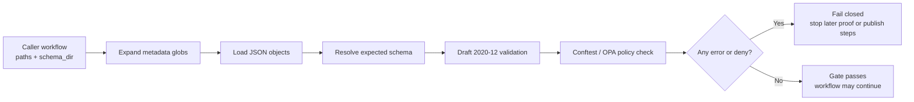

<!-- [KFM_META_BLOCK_V2]
doc_id: kfm://doc/NEEDS-VERIFICATION
title: Metadata Validate v2
type: standard
version: v1
status: draft
owners: NEEDS VERIFICATION
created: YYYY-MM-DD
updated: YYYY-MM-DD
policy_label: NEEDS VERIFICATION
related: [../../README.md, ../../workflows/README.md]
tags: [kfm, github-actions, metadata, validation, stac, dcat, prov]
notes: [Current-session workspace inspection was PDF-only; exact action.yml, owners, callers, and schema or policy paths for metadata-validate-v2 need mounted-repo verification., This README preserves the directly surfaced action-family lineage to kfm__metadata__validate instead of smoothing that naming bridge away.]
[/KFM_META_BLOCK_V2] -->

# Metadata Validate v2

Composite GitHub Action for fail-closed, schema-first validation of KFM metadata before later provenance, signing, or publish stages continue.

> [!NOTE]
> **Status:** experimental  
> **Owners:** NEEDS VERIFICATION  
>      
> **Quick jumps:** [Scope](#scope) · [Repo fit](#repo-fit) · [Accepted inputs](#accepted-inputs) · [Exclusions](#exclusions) · [Directory tree](#directory-tree) · [Quickstart](#quickstart) · [Usage](#usage) · [Diagram](#diagram) · [Behavior matrix](#behavior-matrix) · [Task list](#task-list--definition-of-done) · [FAQ](#faq)  
> **Repo fit:** `.github/actions/metadata-validate-v2/` → upstream: [`../../README.md`](../../README.md), [`../../workflows/README.md`](../../workflows/README.md) · downstream: caller workflows, schema bundles, and policy gates that depend on fail-closed metadata admission (**exact caller paths NEEDS VERIFICATION**)

> [!IMPORTANT]
> This directory should function as a **metadata admission gate**, not as a catch-all build or publish action. In KFM terms, it exists to stop malformed or policy-unsafe STAC / DCAT / PROV objects before they are allowed to participate in catalog closure, release assembly, or outward publication.

> [!WARNING]
> The current session did **not** surface the mounted contents of `.github/actions/metadata-validate-v2/action.yml`. The strongest directly surfaced action-family material names the gate `kfm__metadata__validate`; this README keeps that lineage visible and marks the exact `metadata-validate-v2` bridge as **NEEDS VERIFICATION**.

## Scope

This directory is the likely home of the v2 composite action that validates metadata objects against JSON Schema and policy rules in one fail-closed step.

Use this action for:

- structural validation of STAC / DCAT / PROV JSON against repo-owned schemas
- policy validation of the same files through Conftest / OPA
- CI-ready failure reporting that stops later proof, release, or publish stages from continuing on broken metadata
- reusable workflow composition where metadata admission needs to be centralized instead of copied into multiple workflows

This action is **not** the place for raw-source ingestion, provenance generation, SBOM signing, release publishing, or runtime interpretation.

## Repo fit

| Path | Role | Relationship |
| --- | --- | --- |
| [`../../README.md`](../../README.md) | `.github` subtree hub | upstream doc surface for repo automation and policy-facing GitHub assets |
| [`../../workflows/README.md`](../../workflows/README.md) | workflow lane hub | adjacent caller and operator context |
| `.github/actions/metadata-validate-v2/` | this directory | composite metadata-validation gate |
| `schemas/metadata/` or equivalent | schema source | **NEEDS VERIFICATION** for mounted repo path |
| `policy/rego/` or equivalent | policy source | **NEEDS VERIFICATION** for mounted repo path |
| caller workflows under `../../workflows/` | downstream users of this action | **NEEDS VERIFICATION** for exact filenames and required-check names |

## Accepted inputs

This directory should accept only the materials needed to explain and operate the metadata gate.

| Input surface | What belongs here | Posture |
| --- | --- | --- |
| Caller-provided metadata globs | STAC Items, Collections, Catalogs, DCAT objects, PROV JSON / JSON-LD, and other metadata objects explicitly routed into this gate | **CONFIRMED** for the surfaced action family |
| Schema directory | JSON Schemas used to validate the incoming metadata set | **CONFIRMED** for the surfaced action family |
| Policy bundle | Rego rules evaluated by Conftest after schema validation | **CONFIRMED** for the surfaced action family; exact path **NEEDS VERIFICATION** |
| Usage examples | Minimal workflow calls that show how a caller invokes the action | **PROPOSED** until mounted callers are rechecked |
| Gate notes | File-scoped failure behavior, schema dispatch notes, and reviewer guidance | **PROPOSED** but repo-appropriate |

## Exclusions

Do **not** place the following here:

- raw source fetch logic, ETL connectors, or dataset-specific transformations
- provenance fetch or orphan-output guards that belong in a separate provenance gate
- SBOM generation, Cosign signing, or attestation upload logic
- release or publish orchestration
- UI/runtime behavior notes that belong in app or surface docs
- schema authoring for STAC / DCAT / PROV themselves; this action consumes contracts, it does not own their canonical definitions
- unsupported claims that the mounted `v2` interface, callers, or defaults were directly reverified in this session

## Directory tree

Current minimal directory expectation supported by the target path and normal composite-action shape:

```text
.github/actions/metadata-validate-v2/
├── README.md
└── action.yml                  # composite entrypoint; mounted contents NEEDS VERIFICATION
```

> [!TIP]
> Keep this directory small. The action should remain a reusable gate with a clear contract, not a hidden mini-framework for every validation concern in the repo.

## Quickstart

### Minimal caller shape

```yaml
# Illustrative caller shape — NEEDS VERIFICATION against mounted action.yml
- name: Metadata gate
  uses: ./.github/actions/metadata-validate-v2
  with:
    paths: "data/**/*.json,data/**/*.geojson,contracts/**/*.json"
    schema_dir: "schemas/metadata"
```

### Typical workflow position

```yaml
# Illustrative sequencing — metadata first, later proof/publish steps second
jobs:
  gates:
    runs-on: ubuntu-latest
    steps:
      - uses: actions/checkout@v4

      - name: Metadata validation
        uses: ./.github/actions/metadata-validate-v2
        with:
          paths: ${{ inputs.metadata_globs }}
          schema_dir: ${{ inputs.schema_dir }}

      # provenance / signing / publish gates follow later
```

### Operating rule

Run this gate **early**. Broken metadata should fail before any later stage spends time generating proof packs, signing artifacts, or attempting publication.

## Usage

### What the surfaced action family does

The strongest directly surfaced action-family material shows a small, readable contract:

1. expand caller-provided metadata globs
2. load JSON objects
3. resolve an expected schema
4. run Draft 2020-12 validation
5. run Conftest / OPA policy checks
6. fail closed on any structural or policy-breaking error

That is the right mental model for `metadata-validate-v2` unless the mounted repo proves a different implementation.

### Action contract snapshot

| Surface | What the surfaced action family establishes | Posture |
| --- | --- | --- |
| `paths` | comma-separated globs of metadata files to validate | **CONFIRMED** for the surfaced action family |
| `schema_dir` | directory containing JSON Schemas used by the validator | **CONFIRMED** for the surfaced action family |
| Schema dispatch | selects a schema from the object’s `type` field using a `<type>.schema.json` pattern | **CONFIRMED** for the surfaced action family; exact v2 rule **NEEDS VERIFICATION** |
| Policy pass | runs Conftest against the same target set after schema validation | **CONFIRMED** for the surfaced action family |
| Policy location | surfaced example points Conftest at `policy/rego` | **INFERRED** for the current repo until mounted recheck |
| Exit behavior | aggregated schema errors or policy denials fail the step | **INFERRED** from the surfaced implementation shape |

### Validation responsibilities

| Layer | What it should catch | Why it matters |
| --- | --- | --- |
| Structural | invalid JSON, missing required fields, bad types, unsupported enum values, schema drift | prevents broken metadata from entering later lanes |
| Profile | STAC / DCAT / PROV object-shape mistakes and contract mismatches | protects outward catalog meaning and closure |
| Policy | rights, sensitivity, provenance, or publication obligations expressible in Rego | keeps the gate fail-closed instead of “best effort” |
| Workflow | non-zero exit with file-scoped error output | makes failures reviewable instead of mysterious |

### Standards anchors this gate likely cares about

| Profile | Why it belongs here |
| --- | --- |
| JSON Schema Draft 2020-12 | machine-validatable contract files, fixtures, and schema-level admission gates |
| STAC 1.1.x line | spatiotemporal asset metadata and outward asset closure |
| DCAT 3 | outward dataset and distribution metadata |
| PROV-O | lineage vocabulary and provenance-linked metadata expectations |

> [!NOTE]
> Exact repo profile pins, extension lists, and schema filenames still need mounted-repo verification before this README should be treated as interface-complete.

## Diagram



## Behavior matrix

| Outcome | Meaning | Typical next move |
| --- | --- | --- |
| **Pass** | schema and policy checks succeeded for the targeted file set | continue to provenance, signing, or publish stages |
| **Fail** | JSON parse, schema, missing-schema, or policy errors were detected | fix metadata or policy issue before retry |
| **NEEDS VERIFICATION** | the README, examples, or callers no longer match mounted implementation | reverify `action.yml` and caller workflows before merge |

## Task list / definition of done

- [ ] mounted `action.yml` is rechecked and this README matches its real inputs, defaults, and helper commands
- [ ] at least one caller workflow example is upgraded from illustrative to repo-verified
- [ ] schema-dispatch behavior is explicit
- [ ] policy bundle path is confirmed
- [ ] empty-glob / no-match behavior is documented
- [ ] file-scoped failure output is shown or linked
- [ ] README cross-links to real schema and policy locations
- [ ] any sibling provenance or signing actions referenced here are verified against the mounted tree
- [ ] meta-block placeholders are resolved or intentionally retained with review notes

## FAQ

### Why is this separate from provenance or publish actions?

Because metadata validity is its own gate. KFM keeps structural admission, policy admission, provenance linkage, and artifact signing distinct enough that each failure mode stays visible and fail-closed.

### Why not use only `jsonschema`?

Because KFM doctrine separates structural validity from policy validity. A file can match schema and still be unfit for outward use if policy obligations fail.

### Does this action validate only STAC?

No. The strongest surfaced action-family material explicitly describes STAC / DCAT / PROV as the target metadata set. Exact v2 coverage still needs mounted-repo verification.

### What if `metadata-validate-v2` diverges from the older `kfm__metadata__validate` material?

Update this README to match the mounted implementation, but keep the lineage note explicit rather than silently erasing the naming or interface shift.

## Appendix

<details>
<summary><strong>Source-grounded lineage note</strong></summary>

The strongest directly surfaced action-family draft uses the name `kfm__metadata__validate` and shows:

- `paths` and `schema_dir` inputs
- Draft 2020-12 JSON Schema validation via Python
- Conftest / OPA policy checks after schema validation

This README treats `metadata-validate-v2/` as the current repo-facing directory name supplied by the task, while keeping the older surfaced action-family name visible until the mounted repo confirms the bridge.

</details>

<details>
<summary><strong>Illustrative validator core from the surfaced action family</strong></summary>

```python
# illustrative, source-grounded shape — NEEDS VERIFICATION against mounted v2
schema_path = os.path.join(schema_dir, f"{data.get('type', 'dataset')}.schema.json")
validator = Draft202012Validator(schema)
errors = sorted(validator.iter_errors(data), key=lambda e: e.path)
```

That dispatch rule is useful because it keeps the gate generic across multiple metadata families without forcing one monolithic schema.

</details>

<details>
<summary><strong>Known unknowns before merge</strong></summary>

- real `action.yml` inventory and helper scripts
- owners and review lane for this directory
- exact schema directory path
- exact Rego policy path
- caller workflows and required-check names
- whether v2 adds inputs beyond `paths` and `schema_dir`

</details>

[Back to top](#metadata-validate-v2)
