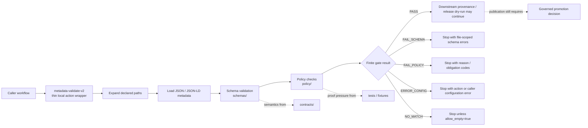

<!-- [KFM_META_BLOCK_V2]
doc_id: kfm://doc/NEEDS-VERIFICATION
title: Metadata Validate v2
type: standard
version: v1
status: draft
owners: TODO: owner not verified
created: NEEDS-VERIFICATION
updated: 2026-05-06
policy_label: NEEDS-VERIFICATION
related: [
  ../README.md,
  ../metadata-validate/README.md,
  ../../README.md,
  ../../workflows/README.md,
  ../../../README.md,
  ../../../contracts/README.md,
  ../../../schemas/README.md,
  ../../../policy/README.md,
  ../../../tests/README.md,
  ../../../scripts/README.md
]
tags: [kfm, github-actions, metadata, validation, schema, policy, ci, governance]
notes: [
  Current main evidence confirms this README exists; action.yml for this path was not found through GitHub connector during this revision.
  CODEOWNERS and PULL_REQUEST_TEMPLATE were fetched but contain no reviewer or PR checklist content, so owner and review routing remain NEEDS VERIFICATION.
  This README documents a target contract and graduation path for a future or branch-local local action; it must not be treated as proof of a runnable composite action until action.yml and caller workflows are verified.
]
[/KFM_META_BLOCK_V2] -->

<a id="top"></a>

# Metadata Validate v2

Target contract and readiness guide for a repo-local metadata validation gate that should fail closed before provenance, release, or publication work continues.

<div align="left">


</div>

> [!NOTE]
> **Status:** `experimental` README / runnable action `NEEDS VERIFICATION`  
> **Owners:** `TODO: owner not verified`  
> **Path:** `.github/actions/metadata-validate-v2/README.md`  
> **Current evidence snapshot:** README present on `main`; directory-local `action.yml` not found on inspected `main`; workflow callers not found in inspected workflow YAML.  
> **Quick jumps:** [Scope](#scope) · [Repo fit](#repo-fit) · [Accepted inputs](#accepted-inputs) · [Exclusions](#exclusions) · [Current evidence snapshot](#current-evidence-snapshot) · [Directory tree](#directory-tree) · [Operating model](#operating-model) · [Usage](#usage) · [Validation](#validation) · [Behavior matrix](#behavior-matrix) · [Definition of done](#definition-of-done) · [Rollback](#rollback) · [FAQ](#faq) · [Appendix](#appendix)

> [!IMPORTANT]
> `metadata-validate-v2` is a **metadata admission gate**, not a publication authority. It may wrap schema and policy checks after implementation. It must not define canonical contract meaning, machine schema authority, policy law, source authority, release state, evidence truth, or public publication by itself.

---

## Scope

`.github/actions/metadata-validate-v2/` is reserved for a repo-local GitHub Action wrapper that validates structured metadata before downstream provenance, signing, release assembly, catalog closure, or publication-related workflows continue.

The intended role is narrow:

- expand and inspect declared metadata file inputs;
- validate metadata objects against repo-owned schemas;
- run policy checks after structural validation when policy is in scope;
- fail closed on malformed files, missing schemas, unsupported inputs, policy denial, or bad configuration;
- produce reviewer-readable output that helps maintainers fix the affected file rather than searching CI logs blindly.

This action should stay small. Reusable validation logic, schema bodies, policy bundles, fixtures, proof objects, and release decisions belong in their own responsibility roots.

[Back to top](#top)

---

## Repo fit

| Direction | Surface | Relationship | Status |
| --- | --- | --- | --- |
| This README | `.github/actions/metadata-validate-v2/README.md` | directory-local contract and readiness guide | `CONFIRMED` present on inspected `main` |
| Action metadata | `action.yml` | required before this directory can be treated as a runnable local action | `CONFIRMED not found on inspected main` / branch-local possibility `UNKNOWN` |
| Parent action lane | [`../README.md`](../README.md) | `.github/actions/` owns thin step-wrapper boundaries | `CONFIRMED` present |
| Earlier sibling | [`../metadata-validate/README.md`](../metadata-validate/README.md) | existing token-oriented metadata action documentation; v2 relationship needs explicit migration rule | `CONFIRMED` README present / runnable action metadata `NEEDS VERIFICATION` |
| GitHub gatehouse | [`../../README.md`](../../README.md) | `.github/` owns repo-wide CI, PR, and automation routing | `CONFIRMED` README present |
| Workflow callers | [`../../workflows/README.md`](../../workflows/README.md) | workflows may call this action after `action.yml` exists | `CONFIRMED` workflow docs present / caller use not found in inspected YAML |
| Project root | [`../../../README.md`](../../../README.md) | KFM identity, trust law, and lifecycle posture | `CONFIRMED` present |
| Contract meaning | [`../../../contracts/README.md`](../../../contracts/README.md) | human-readable object semantics and compatibility expectations | `CONFIRMED` present |
| Machine shape | [`../../../schemas/README.md`](../../../schemas/README.md) | JSON Schema and machine-contract scaffolds consumed by validators | `CONFIRMED` present / schema-home law still `NEEDS VERIFICATION` |
| Policy authority | [`../../../policy/README.md`](../../../policy/README.md) | allow, deny, restrict, abstain, rights, sensitivity, release, and correction decisions | `CONFIRMED` present |
| Verification proof | [`../../../tests/README.md`](../../../tests/README.md) | deterministic fixtures, negative paths, validator tests, and release/runtime drills | `CONFIRMED` present |
| Entrypoint helpers | [`../../../scripts/README.md`](../../../scripts/README.md) | thin repo-local operator commands; not authority surfaces | `CONFIRMED` present |

### Directory Rules basis

`.github/actions/` belongs under `.github/` because local actions are GitHub-native CI step wrappers. They may orchestrate a narrow validation step, but they do not own KFM truth. Contract meaning belongs in `contracts/`, machine shape belongs in `schemas/`, admissibility belongs in `policy/`, and proof belongs in `tests/` / `fixtures/`.

[Back to top](#top)

---

## Accepted inputs

The exact input names and defaults are **NEEDS VERIFICATION** until a directory-local `action.yml` exists and is reviewed. The table below is the proposed v2 contract to verify or adjust when `action.yml` is added.

| Input | Expected meaning | Required? | Default posture | Status |
| --- | --- | ---: | --- | --- |
| `paths` | newline- or comma-delimited file list / glob list for metadata files | yes | fail if empty unless explicitly allowed | `PROPOSED` |
| `schema_dir` | repo-relative directory containing JSON Schemas or schema index | yes | no implicit external schemas | `PROPOSED` |
| `policy_dir` | repo-relative policy bundle directory, if policy checks are in v2 scope | conditional | omit only when README states policy is out of scope | `PROPOSED` |
| `mode` | validation profile such as `schema-only`, `schema-policy`, or `report-only` | no | `schema-policy` for release-significant callers | `PROPOSED` |
| `allow_empty` | whether no matched files can pass | no | `false` | `PROPOSED` |
| `report_json` | optional output path for a machine-readable validation report | no | no report unless set | `PROPOSED` |
| `summary` | whether to write a GitHub step summary | no | `true` | `PROPOSED` |

Accepted target files should be small, structured, repo-visible metadata objects already moving through governed review, such as:

- STAC Catalog, Collection, Item, or related geospatial metadata;
- DCAT dataset or distribution records;
- PROV JSON / JSON-LD provenance records;
- KFM source, evidence, catalog, layer, release, receipt, proof, or manifest metadata explicitly routed into this gate;
- tiny public-safe fixture metadata used to prove positive and negative behavior.

[Back to top](#top)

---

## Exclusions

Do **not** move these responsibilities into this action.

| Excluded responsibility | Correct home or handling | Why |
| --- | --- | --- |
| schema authorship or schema registry decisions | `schemas/` plus relevant ADRs and contract links | the action consumes schema authority; it does not create it |
| contract meaning | `contracts/` | semantics must stay reviewable outside workflow glue |
| policy authorship or policy reason-code law | `policy/` | the action may call policy, not define it |
| validator implementation large enough to share | `tools/`, `packages/`, or `scripts/` depending on repo convention | local actions should stay thin |
| raw source fetching, scraping, ETL, or source activation | `connectors/`, `pipelines/`, `tools/`, source registries, and policy review | source intake is not metadata validation |
| provenance generation, SBOM generation, signing, or attestation upload | dedicated provenance, attest, SBOM, release, or proof lanes | keep proof duties separable |
| release approval or publication | `release/`, governed workflows, review records, release manifests, correction paths, rollback cards | publication is a governed state transition |
| secrets, tokens, private keys, or trust roots | GitHub environments, OIDC, or approved secret management | local action directories must not store secrets |
| public runtime or UI behavior | governed API, app, package, or UI lanes | action output is CI evidence, not public truth |
| RAW, WORK, QUARANTINE, unpublished candidates, direct model output | lifecycle stores and governed APIs only | public and CI summaries must not leak restricted material |

[Back to top](#top)

---

## Current evidence snapshot

| Claim | Label | Evidence-aware reading |
| --- | ---: | --- |
| `.github/actions/metadata-validate-v2/README.md` exists on inspected `main`. | `CONFIRMED` | This document can be revised in place. |
| `.github/actions/metadata-validate-v2/action.yml` was not found through the GitHub connector on inspected `main`. | `CONFIRMED for inspected main` | Treat the directory as README-only until branch-local evidence proves otherwise. |
| `.github/actions/README.md` exists and frames local actions as thin wrappers. | `CONFIRMED` | This README should align to that parent lane. |
| `.github/CODEOWNERS` was fetched but contains no owner routing content. | `CONFIRMED` | Owner remains `TODO` / `NEEDS VERIFICATION`. |
| `.github/PULL_REQUEST_TEMPLATE.md` was fetched but contains no checklist content. | `CONFIRMED` | Review checklist behavior must not be claimed from the template. |
| Workflow files observed on `main` are `baseline.yml`, `promote-and-reconcile.yml`, and `synthetic-release-dry-run.yml`. | `CONFIRMED` | Workflow directory is active, but platform required-check status remains unknown. |
| Inspected workflow YAML did not show `uses: ./.github/actions/metadata-validate-v2`. | `CONFIRMED for inspected files` | Caller use remains `UNKNOWN` across other branches, private settings, or future work. |
| Branch protections, required checks, artifact retention, environment approvals, and platform settings were not inspected. | `UNKNOWN` | Do not claim merge-blocking enforcement. |

> [!WARNING]
> README presence is not runnable action evidence. A local GitHub Action needs a non-empty `action.yml` or `action.yaml`, verified callers or explicit no-caller status, and tests or fixtures that prove fail-closed behavior.

[Back to top](#top)

---

## Directory tree

### Current inspected `main` shape

```text
.github/actions/metadata-validate-v2/
└── README.md
```

`action.yml` was not found on inspected `main`.

### Graduation target

```text
.github/actions/metadata-validate-v2/
├── README.md
├── action.yml
├── migration.md              # required if v2 coexists with or supersedes metadata-validate/
└── tests/
    └── fixtures/
        ├── pass/
        ├── fail-schema/
        ├── fail-policy/
        ├── bad-config/
        └── no-match/
```

### Reading rule

Use the current tree for current branch claims. Use the graduation tree as a target checklist, not as proof of implementation.

[Back to top](#top)

---

## Operating model



The gate should run before proof, signing, release assembly, or publication-related steps. It may allow later gates to continue after validation passes. It does not approve release.

[Back to top](#top)

---

## Usage

> [!CAUTION]
> The examples below are **PROPOSED** until `action.yml` exists and matches them. Do not copy them into required workflows without verifying the mounted action contract.

### Minimal proposed caller

```yaml
- name: Metadata validation v2
  uses: ./.github/actions/metadata-validate-v2
  with:
    paths: |
      data/catalog/**/*.json
      release/**/*.json
    schema_dir: schemas/contracts/v1
```

### Schema + policy proposed caller

```yaml
- name: Metadata validation v2
  uses: ./.github/actions/metadata-validate-v2
  with:
    paths: |
      data/catalog/**/*.json
      data/proofs/**/*.json
      release/**/*.json
    schema_dir: schemas/contracts/v1
    policy_dir: policy
    mode: schema-policy
    allow_empty: "false"
    report_json: .tmp/metadata-validate-v2/report.json
    summary: "true"
```

### Workflow placement

```yaml
jobs:
  metadata-gates:
    runs-on: ubuntu-latest
    permissions:
      contents: read

    steps:
      - name: Check out repository
        uses: actions/checkout@v4
        with:
          persist-credentials: false

      - name: Validate metadata before release dry-run
        uses: ./.github/actions/metadata-validate-v2
        with:
          paths: ${{ inputs.metadata_paths }}
          schema_dir: schemas/contracts/v1
          policy_dir: policy
          mode: schema-policy

      - name: Release dry-run
        if: ${{ success() }}
        run: bash scripts/check_synthetic_release_local.sh
```

[Back to top](#top)

---

## Validation

Run these inspection-first commands from the repository root before changing this directory.

```bash
# Confirm checkout and branch state.
git status --short
git branch --show-current || true
git rev-parse --show-toplevel || true

# Inspect this local action namespace.
find .github/actions/metadata-validate-v2 -maxdepth 3 -type f | sort
sed -n '1,260p' .github/actions/metadata-validate-v2/README.md 2>/dev/null || true
sed -n '1,260p' .github/actions/metadata-validate-v2/action.yml 2>/dev/null || true

# Make missing or empty action metadata explicit.
if [ ! -s .github/actions/metadata-validate-v2/action.yml ]; then
  echo "NEEDS_VERIFICATION: .github/actions/metadata-validate-v2/action.yml missing or empty"
fi

# Check parent action and workflow boundaries.
sed -n '1,260p' .github/actions/README.md 2>/dev/null || true
sed -n '1,260p' .github/workflows/README.md 2>/dev/null || true
grep -R "uses: ./.github/actions/metadata-validate-v2" -n .github/workflows .github/actions 2>/dev/null || true

# Check ownership and PR intake signals.
sed -n '1,220p' .github/CODEOWNERS 2>/dev/null || true
sed -n '1,220p' .github/PULL_REQUEST_TEMPLATE.md 2>/dev/null || true

# Inspect downstream authority surfaces.
find contracts schemas policy tests fixtures scripts -maxdepth 4 -type f 2>/dev/null | sort | sed -n '1,260p'
```

Suggested tests once `action.yml` exists:

```bash
# Use repo-native test commands after verifying the runner.
python -m unittest discover -s tests
bash scripts/validate_all.sh
```

Do not report action success, test success, or workflow enforcement unless those commands actually ran on the active checkout.

[Back to top](#top)

---

## Behavior matrix

| Result | Meaning | Expected workflow behavior | Reviewer action |
| --- | --- | --- | --- |
| `PASS` | matched files passed configured schema and policy checks | downstream gates may continue | confirm scope, report, and caller inputs |
| `FAIL_SCHEMA` | JSON parse, missing schema, required field, type, enum, or schema-resolution failure | stop | fix metadata, schema mapping, or schema path |
| `FAIL_POLICY` | policy denied the candidate or required obligations were not met | stop | fix rights, sensitivity, provenance, release posture, or policy fixture |
| `ERROR_CONFIG` | missing input, unavailable tool, bad mode, bad path, or action misconfiguration | stop | fix action metadata or caller workflow |
| `NO_MATCH` | declared paths matched no files | stop by default | confirm whether caller should pass `allow_empty` |
| `NEEDS_VERIFICATION` | README, examples, or assumptions are ahead of implementation evidence | do not treat as implemented | inspect `action.yml`, workflows, and test coverage |

[Back to top](#top)

---

## Definition of done

A `metadata-validate-v2` directory is ready to graduate from README-only namespace to runnable local action when:

- [ ] `action.yml` exists and is non-empty.
- [ ] `action.yml` inputs and outputs match this README.
- [ ] the action has one narrow responsibility.
- [ ] schema validation behavior is explicit.
- [ ] policy behavior is explicit, or policy is explicitly out of scope.
- [ ] empty-match behavior is explicit and fail-closed by default.
- [ ] pass, schema-failure, policy-failure, bad-config, and no-match cases have tiny fixtures or tests.
- [ ] the action does not store secrets, tokens, private keys, source credentials, or trust roots.
- [ ] the action does not publish, promote, sign, attest, or approve release by itself.
- [ ] failure output is file-scoped and reviewer-readable.
- [ ] caller workflows, if any, are verified and documented.
- [ ] branch protection / required-check status is either verified or explicitly left `UNKNOWN`.
- [ ] the relationship with `../metadata-validate/` is explained in `migration.md` or this README.
- [ ] related docs are updated when behavior changes materially.

[Back to top](#top)

---

## Rollback

README-only rollback:

```bash
git checkout -- .github/actions/metadata-validate-v2/README.md
```

If a future workflow calls this action and the gate is wrong, disable or revert the caller first, then repair the action:

```bash
# Find callers before rollback.
grep -R "metadata-validate-v2" -n .github/workflows .github/actions 2>/dev/null || true

# Revert the workflow or action change by commit when appropriate.
git revert <commit-sha>
```

A release-significant rollback should preserve audit evidence:

1. keep failed workflow logs and uploaded reports;
2. record whether a release candidate, receipt, proof, or dry-run was affected;
3. update a correction note or rollback card if public or semi-public release posture changed;
4. re-run the verified local validation commands.

[Back to top](#top)

---

## FAQ

### Is `metadata-validate-v2` currently runnable?

`NEEDS VERIFICATION`. The README exists on inspected `main`, but `action.yml` was not found for this directory during this revision.

### Why keep this README if `action.yml` is missing?

Because the namespace and target responsibility are already documented. Keeping the README honest lets maintainers graduate the action deliberately instead of allowing a placeholder directory to imply implementation.

### How is v2 different from `metadata-validate/`?

`metadata-validate/` is documented as a narrow Markdown metadata-token check. `metadata-validate-v2` should not claim that role unless maintainers intentionally reuse it. The likely v2 role is broader structured metadata admission: schema validation first, then policy checks when in scope. That split remains `PROPOSED` until implemented.

### Can this action publish artifacts?

No. It can stop unsafe progress or allow downstream gates to continue. Publication remains a governed state transition with evidence closure, policy posture, review state, release state, correction path, and rollback target.

### Can this action validate policy without JSON Schema?

It should not, for release-significant metadata. Policy should consume structured inputs whose shape has already been validated or intentionally tested as invalid. A structurally valid file may still be policy-denied.

[Back to top](#top)

---

## Appendix

<details>
<summary><strong>Illustrative action.yml skeleton</strong></summary>

This skeleton is not implementation evidence. Verify tool installation, input names, and repo-native validators before use.

```yaml
name: metadata-validate-v2
description: Validate governed KFM metadata files against schemas and optional policy gates.

inputs:
  paths:
    description: Newline- or comma-delimited metadata files or globs to validate.
    required: true
  schema_dir:
    description: Repo-relative schema directory or schema index.
    required: true
  policy_dir:
    description: Optional repo-relative policy directory.
    required: false
    default: ""
  mode:
    description: Validation mode: schema-only, schema-policy, or report-only.
    required: false
    default: schema-policy
  allow_empty:
    description: Whether no matched files may pass.
    required: false
    default: "false"
  report_json:
    description: Optional JSON report output path.
    required: false
    default: ""
  summary:
    description: Whether to write a GitHub step summary.
    required: false
    default: "true"

runs:
  using: composite
  steps:
    - name: Validate metadata
      shell: bash
      run: |
        set -euo pipefail
        echo "NEEDS_VERIFICATION: wire to repo-native validator implementation."
        test -n "${{ inputs.paths }}"
        test -d "${{ inputs.schema_dir }}"
```

</details>

<details>
<summary><strong>Known unknowns before merge</strong></summary>

- stable `doc_id`
- verified owner
- created date
- policy label
- branch-local existence of `action.yml`
- exact v2 inputs, outputs, and defaults
- whether `metadata-validate-v2` supersedes or coexists with `metadata-validate`
- current workflow callers
- branch protections and required-check status
- action-local fixture convention versus shared `tests/` / `fixtures/` convention
- policy runner and schema validator implementation
- artifact retention and CI report expectations

</details>

[Back to top](#top)
