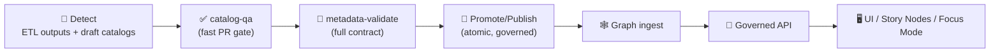

<a id="top"></a>

# 🧾✅ `metadata-validate` — Full STAC/DCAT/PROV Contract Validation (KFM)

[](#what-this-action-does)


> **Purpose:** validate KFM’s **metadata boundary artifacts**—**STAC**, **DCAT**, and **PROV**—so nothing with broken schema, missing governance fields, or unsafe links gets promoted downstream. 🧾🔍  
> **KFM order (non‑negotiable):** **ETL → Catalogs (STAC/DCAT/PROV) → Graph → API → UI → Story Nodes → Focus Mode** 🧭  
> **Mental model:** `catalog-qa` is the *fast PR filter* ✅, `metadata-validate` is the *full contract enforcement* 🧾🔒, and **promotion happens only after the “Validate” gauntlet passes** (Detect → Validate → Promote). 🚦

---

## 🧾 Action metadata

| Field | Value |
|---|---|
| Action name | `kfm/metadata-validate` *(repo-local composite action)* |
| Location | `.github/actions/metadata-validate/` |
| Action file | `.github/actions/metadata-validate/action.yml` *(expected)* |
| Docs file | `.github/actions/metadata-validate/README.md` |
| Status | ✅ Active (spec + operating guide) |
| Last updated | **2026-01-11** |
| KFM baseline | **KFM‑MDP v11.2.6** |
| Master Guide | **v13 (draft)** — see `docs/specs/MARKDOWN_GUIDE_v13.md.gdoc` |
| Default lane | Nightly / Promotion (recommended), PR (optional, paths-filtered) |
| Governed artifacts (canonical) | `data/stac/collections/**` • `data/stac/items/**` • `data/catalog/dcat/**` • `data/prov/**` |
| Governed artifacts (legacy tolerated) | `data/provenance/**` *(if older pipelines still emit here)* |

> [!IMPORTANT]
> KFM treats catalogs + provenance as **contract/boundary artifacts**: downstream stages should consume **only** what passes validation.  
> If this action fails in a publish/promotion lane, promotion must stop. 🧯

---

## ⚡ Quick links

| Need | Go |
|---|---|
| 🧩 Actions hub | [`../README.md`](../README.md) |
| 🧪 Workflows hub | [`../../workflows/README.md`](../../workflows/README.md) |
| ✅ Quick gate (PR) | [`../catalog-qa/README.md`](../catalog-qa/README.md) |
| 🧭 Governance scan | [`../governance-scan/README.md`](../governance-scan/README.md) *(if present)* |
| 🧯 Kill switch | [`../kill-switch/README.md`](../kill-switch/README.md) |
| 📦 Build receipt | [`../build-info/README.md`](../build-info/README.md) |
| 🖊️ Attest/sign | [`../attest/README.md`](../attest/README.md) |
| 🧠 Master Guide v13 (draft) | [`../../../docs/specs/MARKDOWN_GUIDE_v13.md.gdoc`](../../../docs/specs/MARKDOWN_GUIDE_v13.md.gdoc) |
| 🧾 KFM technical spec | [`../../../docs/specs/Kansas Frontier Matrix (KFM) – Comprehensive Technical Documentation.docx`](../../../docs/specs/Kansas%20Frontier%20Matrix%20(KFM)%20%E2%80%93%20Comprehensive%20Technical%20Documentation.docx) |

---

<details>
<summary><strong>📌 Table of contents</strong></summary>

- [🎯 What this action does](#what-this-action-does)
- [🧭 Why metadata validation is “security” in KFM](#why-metadata-validation-is-security-in-kfm)
- [🧱 Where it fits in the pipeline](#where-it-fits-in-the-pipeline)
- [🔎 What gets validated](#what-gets-validated)
- [⚙️ Inputs](#inputs)
- [📤 Outputs](#outputs)
- [📦 Output files](#output-files)
- [✅ Usage patterns](#usage-patterns)
- [🧪 Local developer run](#local-developer-run)
- [🔐 Safety notes (links, SSRF, forks)](#safety-notes-links-ssrf-forks)
- [🧯 Troubleshooting](#troubleshooting)
- [🧩 Extending the validator (KFM profiles)](#extending-the-validator-kfm-profiles)
- [📚 Reference library (project files)](#reference-library-project-files)

</details>

---

<a id="what-this-action-does"></a>

## 🎯 What this action does

`metadata-validate` runs a **full contract check** across KFM metadata + provenance so only valid, governed artifacts move forward.

### ✅ Core outcomes
- 🗂️ **STAC** (Collections + Items): schema + required governance fields + link/asset integrity
- 🗃️ **DCAT** (Dataset views): license/publisher/distributions sanity + references align with STAC
- 🧬 **PROV** (lineage bundles): required nodes + edges + consistent linkage to outputs/IDs
- 🔁 **Cross-link consistency:** STAC ↔ DCAT ↔ PROV align, and artifacts point to real outputs
- 📦 **Evidence outputs:** JSON + Markdown reports (and optional SARIF) for PRs, audits, and promotion lanes

### 🧠 Where this sits in “Detect → Validate → Promote”
KFM’s promotion flow expects a **validation gauntlet** before anything becomes “promoted.”  
This action is one of the **lane validators** in that gauntlet (alongside policy gates, link checks, and governance scans). 🚦

---

<a id="why-metadata-validation-is-security-in-kfm"></a>

## 🧭 Why metadata validation is “security” in KFM

In KFM, metadata isn’t paperwork—it’s the **trust boundary**:

- 🗂️ STAC/DCAT are how consumers discover and fetch assets (bad links = bad downstream behavior)
- 🧾 PROV is how we prove what happened (auditability + reproducibility)
- 🔗 `href`s are a supply‑chain surface (poisoned catalogs can induce unsafe fetches)
- 🧭 Governance fields prevent “mystery layers,” license drift, and sensitive-location mistakes

That’s why this action is designed to be:
- ✅ **Fail‑closed** for promotion lanes
- ✅ **Deterministic**
- ✅ **Offline‑first** (network checks are optional + allowlisted)
- ✅ **Safe to run on PRs** (no secrets required)

---

<a id="where-it-fits-in-the-pipeline"></a>

## 🧱 Where it fits in the pipeline



**Rule of the road:** downstream stages should consume only artifacts that passed validation. ✅

---

<a id="what-gets-validated"></a>

## 🔎 What gets validated

> KFM convention reminder: “Catalogs” refers collectively to **STAC + DCAT + PROV** as boundary artifacts.

### 1) 🗂️ STAC (Collections + Items)
**Contract checks (recommended):**
- ✅ JSON schema correctness (STAC core)
- ✅ required governance fields: `license`, `providers`, `stac_extensions` (presence and policy)
- ✅ required identity fields: `id`, `type`, `stac_version`, `links`
- ✅ assets are well-formed (`assets.*.href`, media types, roles when relevant)
- ✅ geospatial sanity: `bbox` ranges, geometry validity (when present)
- ✅ temporal sanity: `datetime` OR (`start_datetime` + `end_datetime`)
- ✅ internal linking: parent/child + self/root link expectations

### 2) 🗃️ DCAT (Dataset / Distribution rollups)
**Contract checks (recommended):**
- ✅ DCAT shape validity (JSON(-LD) profile you adopt)
- ✅ stable dataset identifiers
- ✅ governance minimum bar: license + publisher/contact expectations (promotion mode)
- ✅ distributions include access URLs and/or download URLs
- ✅ optional consistency checks vs STAC (coverage, identifiers, versions)

### 3) 🧬 PROV (W3C PROV JSON-LD)
**Contract checks (recommended):**
- ✅ required nodes exist: `entity`, `activity`, `agent`
- ✅ lineage edges exist and make sense: `used`, `wasGeneratedBy`, `wasAssociatedWith`, `wasDerivedFrom`
- ✅ run metadata includes parameters + seeds (when applicable) + tool versions (when emitted)
- ✅ output entities align with STAC/DCAT references (IDs and/or artifact paths)

### 4) 🔁 Cross‑layer linkage checks (KFM-shaped)
High‑value “boundary artifact” enforcement:
- ✅ Every **promoted** dataset has:
  - at least one STAC Collection (and Items when publishable),
  - a DCAT dataset/distributions entry,
  - a PROV bundle that explains inputs → process → outputs.
- ✅ STAC assets point to real published outputs (typically `data/processed/**` or published object storage)
- ✅ DCAT distributions point to stable STAC endpoints and/or stable downloads
- ✅ PROV output entities reference the same artifacts STAC/DCAT reference

### 5) 🧭 Kansas policy checks (optional, profile-driven)
If a dataset declares Kansas scope (or is tagged as Kansas):
- ✅ bbox plausibility checks (lon/lat ordering mistakes)
- ✅ optional “county tag if applicable” rule (KFM profile)
- ✅ optional “sensitivity classification required” rule (KFM profile)

> [!TIP]
> Keep PR lane fast: validate changed catalogs + provenance only.  
> Run “whole universe validation” nightly or in promotion lanes. 🌙🚀

---

<a id="inputs"></a>

## ⚙️ Inputs

> Composite action inputs are strings. Use `"true"` / `"false"`.

| Input | Required | Default | Description |
|---|---:|---|---|
| `mode` | ❌ | `pr` | `pr` / `nightly` / `promotion` (controls strictness + coverage) |
| `root` | ❌ | `data/` | Scan root |
| `stac_glob` | ❌ | `stac/collections/**/*.json`<br/>`stac/items/**/*.json` | STAC files to validate *(newline-separated supported)* |
| `dcat_glob` | ❌ | `catalog/dcat/**/*.json*` | DCAT files to validate *(JSON or JSON-LD)* |
| `prov_glob` | ❌ | `prov/**/*.json*`<br/>`provenance/**/*.json*` | PROV files to validate *(supports legacy directory)* |
| `profile` | ❌ | `kfm-v1` | KFM profile name for extra rules (license/sensitivity/naming/county tags) |
| `fail_on_warn` | ❌ | `"true"` | Warnings fail the action (recommended for promotion) |
| `check_links` | ❌ | `"true"` | Validate link **shape** always; network checks only when allowlisted |
| `allowed_domains` | ❌ | *(empty)* | Domain allowlist for network link checks (promotion lane only) |
| `check_assets_exist` | ❌ | `"true"` | Ensure referenced **local** assets exist (when paths are local) |
| `check_checksums` | ❌ | `"false"` | Validate checksums if your catalogs publish them |
| `report_dir` | ❌ | `out/metadata-validate` | Where reports are written |
| `emit_sarif` | ❌ | `"false"` | Emit SARIF output for code scanning UI |
| `max_files` | ❌ | `2000` | Prevent runaway scans |

> [!IMPORTANT]
> If you enable network link checks, **always** set `allowed_domains` (fail‑closed).  
> Default posture should be **offline‑first**.

---

<a id="outputs"></a>

## 📤 Outputs

| Output | Meaning |
|---|---|
| `ok` | `"true"` if validation passed |
| `error_count` | Integer-like string |
| `warning_count` | Integer-like string |
| `report_json` | Path to JSON report |
| `report_md` | Path to Markdown summary |
| `sarif_path` | Path to SARIF (if enabled) |

---

<a id="output-files"></a>

## 📦 Output files

Expected output shape (stable + PR-friendly):

```text
out/metadata-validate/
├─ metadata-validate.json         # ✅ machine report (stable ordering)
├─ metadata-validate.md           # 🧾 human summary (PR-friendly)
├─ metadata-validate.sarif        # 🧷 optional
└─ findings/
   ├─ stac-errors.csv
   ├─ dcat-errors.csv
   └─ prov-errors.csv
```

Design rules:
- ✅ stable ordering (diffable)
- ✅ stable rule IDs (`STAC_SCHEMA_FAIL`, `PROV_MISSING_AGENT`, etc.)
- ✅ **no secrets** / no raw tokens / no huge blobs

---

<a id="usage-patterns"></a>

## ✅ Usage patterns

### 1) PR lane (paths-filtered) 🧪
Run only when metadata changes (keeps PR CI fast):

```yaml
name: Metadata Validate

on:
  pull_request:
    paths:
      - "data/stac/**"
      - "data/catalog/dcat/**"
      - "data/prov/**"
      - "data/provenance/**"
      - "schemas/**"
      - "tools/validation/**"
      - ".github/actions/metadata-validate/**"
      - ".github/workflows/metadata-validate.yml"
  workflow_dispatch:

permissions:
  contents: read

jobs:
  validate:
    runs-on: ubuntu-latest
    timeout-minutes: 12

    steps:
      - uses: actions/checkout@v4

      - name: 🧾 Metadata validate (PR)
        uses: ./.github/actions/metadata-validate
        with:
          mode: pr
          root: data
          fail_on_warn: "true"
          emit_sarif: "false"

      - name: 📦 Upload report
        uses: actions/upload-artifact@v4
        if: always()
        with:
          name: metadata-validate-${{ github.sha }}
          path: out/metadata-validate/**
```

### 2) Nightly lane (wider coverage) 🌙
Run deep validation on schedule:

```yaml
on:
  schedule:
    - cron: "0 4 * * *"   # daily @ 04:00 UTC
  workflow_dispatch:
```

Use:
- `mode: nightly`
- broader globs
- optional additional checks (checksums, stricter profiles)

### 3) Promotion lane (fail‑closed + allowlisted domains) 🚀🧯
Use in publish workflows:

```yaml
steps:
  - uses: actions/checkout@v4

  - name: 🧯 Kill switch
    uses: ./.github/actions/kill-switch
    with:
      scope: publish
      behavior: fail

  - name: 🧭 Governance scan (recommended)
    uses: ./.github/actions/governance-scan
    with:
      ruleset: publish
      fail_on_warn: "true"

  - name: 🧾 Metadata validate (promotion)
    uses: ./.github/actions/metadata-validate
    with:
      mode: promotion
      fail_on_warn: "true"
      check_links: "true"
      allowed_domains: |
        github.com
        raw.githubusercontent.com
        kansas.gov
```

> [!TIP]
> If you can’t allowlist domains safely, disable network checks and validate local-only references (preferred). ✅

---

<a id="local-developer-run"></a>

## 🧪 Local developer run

If this action wraps a repo tool (recommended), standardize a CLI so dev results match CI:

```bash
python3 tools/validation/metadata_validate/run_metadata_validate.py \
  --mode pr \
  --root data \
  --stac-glob "stac/collections/**/*.json" \
  --stac-glob "stac/items/**/*.json" \
  --dcat-glob "catalog/dcat/**/*.json*" \
  --prov-glob "prov/**/*.json*" \
  --prov-glob "provenance/**/*.json*" \
  --fail-on-warn \
  --out out/metadata-validate
```

✅ Local expectations:
- same rule IDs as CI
- same report shapes
- deterministic output order

---

<a id="safety-notes-links-ssrf-forks"></a>

## 🔐 Safety notes (links, SSRF, forks)

If you enable any “link checking” that makes network calls:

✅ Required safeguards:
- allowlist domains (`allowed_domains`)
- deny private ranges / loopback / link-local
- cap redirects + re-check destination
- strict timeouts (avoid hanging CI)
- never attach auth headers to external URLs
- avoid fetching large assets (prefer HEAD, range GET, or metadata-only)

Fork PR posture:
- run offline-only checks (no secrets, no publish)

---

<a id="troubleshooting"></a>

## 🧯 Troubleshooting

### Common failures (and fixes)

| Rule ID | What it usually means | Fix |
|---|---|---|
| `STAC_SCHEMA_FAIL` | STAC JSON doesn’t match schema | regenerate with tool; fix required fields |
| `STAC_MISSING_LICENSE` | `license` missing/empty | add license (prefer SPDX) |
| `STAC_EMPTY_PROVIDERS` | missing provider attribution | add provider objects |
| `STAC_BAD_LINK` | malformed or unsafe link | fix href; remove broken link; allowlist domain |
| `DCAT_BAD_DISTRIBUTION` | missing/invalid distribution | add access URL/download URL |
| `PROV_MISSING_ACTIVITY` | PROV run lacks activity | emit activity node; link used/generated entities |
| `PROV_ORPHAN_OUTPUT` | PROV references output not in STAC/DCAT | align IDs and paths; update catalogs |

### Debug workflow
1) read `out/metadata-validate/metadata-validate.md` first  
2) check the JSON report for rule IDs + file paths  
3) run locally with the same flags as CI  
4) fix metadata generators (don’t hand-edit complex STAC unless needed)

---

<a id="extending-the-validator-kfm-profiles"></a>

## 🧩 Extending the validator (KFM profiles)

KFM treats “vanilla STAC/DCAT/PROV” as baseline. **Profiles** encode KFM’s extra expectations.

### ✅ Profile docs (recommended locations)
```text
docs/standards/
├─ KFM_STAC_PROFILE.md
├─ KFM_DCAT_PROFILE.md
└─ KFM_PROV_PROFILE.md           # optional, but recommended
```

### 🧬 What KFM profiles commonly enforce
Examples (project-shaped):
- stable ID format (`kfm.ks.<domain>.<layer>.<time>.<version>`)
- required `license` + attribution/provider
- required **sensitivity classification** for public artifacts
- “Kansas county tag” when applicable
- PROV required for promoted datasets
- allowlist STAC extensions for production catalogs

> [!TIP]
> Keep “profile rules” versioned: `kfm-v1`, `kfm-v2`, etc.  
> Promotion lanes should pin a profile version (no surprise policy drift). 🔒

---

<a id="reference-library-project-files"></a>

## 📚 Reference library (project files)

KFM’s metadata discipline sits at the intersection of:
- 🧾 reproducible science (V&V mindset, experiment logging)
- 🗺️ geospatial practice (CRS/bbox correctness, cartographic accountability)
- 🔐 secure supply chains (trusted provenance + predictable automation)
- ❤️ governance (FAIR+CARE, sensitive locations, respectful narratives)

<details>
<summary><strong>🧠 Recommended reading pack (in-repo)</strong></summary>

### 🧭 Canonical KFM direction
- `docs/specs/MARKDOWN_GUIDE_v13.md.gdoc`
- `docs/specs/Kansas Frontier Matrix (KFM) – Comprehensive Technical Documentation.docx`
- `docs/specs/Scientific Method _ Research _ Master Coder Protocol Documentation.pdf`
- `docs/notes/Latest Ideas.*`

### 🗺️ GIS & spatial integrity
- `docs/library/python-geospatial-analysis-cookbook.pdf`
- `docs/library/PostgreSQL Notes for Professionals - PostgreSQLNotesForProfessionals.pdf`
- `docs/library/making-maps-a-visual-guide-to-map-design-for-gis.pdf`

### 🧪 Modeling & reproducibility
- `docs/library/Scientific Modeling and Simulation_ A Comprehensive NASA-Grade Guide.pdf`
- `docs/library/Understanding Statistics & Experimental Design.pdf`
- `docs/library/think-bayes-bayesian-statistics-in-python.pdf`

### 🔐 Security & governance mindset (defense)
- `SECURITY.md`
- `docs/library/Data Spaces.pdf`
- `docs/library/Introduction to Digital Humanism.pdf`

</details>

---

<p align="right"><a href="#top">⬆️ Back to top</a></p>
