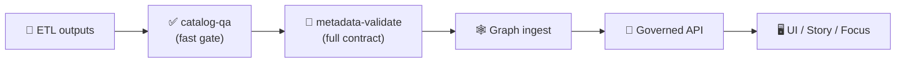

<a id="top"></a>

# 🧾✅ `metadata-validate` — Full STAC/DCAT/PROV Validation (KFM)

[](#-what-this-action-does)


> **Purpose:** validate KFM’s **metadata boundary artifacts**—**STAC**, **DCAT**, and **PROV**—so nothing with broken schema, missing governance fields, or unsafe links gets promoted downstream.  
> **Position in KFM:** **ETL → Metadata (STAC/DCAT/PROV) → Graph → API → UI → Story Nodes → Focus Mode** 🧭  
> **Mental model:** `catalog-qa` is the *fast PR filter* ✅, `metadata-validate` is the *full contract enforcement* 🧾🔍.

---

## 🧾 Action metadata

| Field | Value |
|---|---|
| Action name | `kfm/metadata-validate` *(repo-local composite action)* |
| Location | `.github/actions/metadata-validate/` |
| Docs file | `.github/actions/metadata-validate/README.md` |
| Status | ✅ Active (spec + operating guide) |
| Last updated | **2026-01-10** |
| Default lane | Nightly / Promotion (recommended), PR (optional) |
| Governed artifacts | `data/catalog/stac/**` • `data/catalog/dcat/**` • `data/prov/**` *(or your canonical equivalents)* |

---

## ⚡ Quick links

| Need | Go |
|---|---|
| 🧩 Actions hub | [`../README.md`](../README.md) |
| 🧪 Workflows hub | [`../../workflows/README.md`](../../workflows/README.md) |
| ✅ Quick STAC/DCAT gate | [`../catalog-qa/README.md`](../catalog-qa/README.md) |
| 🧭 Governance scan | [`../governance-scan/README.md`](../governance-scan/README.md) *(if present)* |
| 🧯 Kill switch | [`../kill-switch/README.md`](../kill-switch/README.md) |
| 🧾 Build traceability | [`../build-info/README.md`](../build-info/README.md) |
| 🛡️ Security policy | [`../../../SECURITY.md`](../../../SECURITY.md) |

---

<details>
<summary><strong>📌 Table of contents</strong></summary>

- [🎯 What this action does](#-what-this-action-does)
- [🧭 Why metadata validation is “security” in KFM](#-why-metadata-validation-is-security-in-kfm)
- [🧱 Where it fits in the pipeline](#-where-it-fits-in-the-pipeline)
- [🔎 What gets validated](#-what-gets-validated)
- [⚙️ Inputs](#️-inputs)
- [📤 Outputs](#-outputs)
- [📦 Output files](#-output-files)
- [✅ Usage patterns](#-usage-patterns)
- [🧪 Local developer run](#-local-developer-run)
- [🔐 Safety notes (links, SSRF, forks)](#-safety-notes-links-ssrf-forks)
- [🧯 Troubleshooting](#-troubleshooting)
- [🧩 Extending the validator (KFM profiles)](#-extending-the-validator-kfm-profiles)
- [📚 Reference library (project files)](#-reference-library-project-files)

</details>

---

## 🎯 What this action does

`metadata-validate` runs a **full “contract check”** across KFM metadata and provenance:

### ✅ Core goals
- 🧾 **Schema correctness** (STAC, DCAT, PROV)
- 🔗 **Reference integrity** (IDs, links, asset hrefs, internal cross-links)
- 🧭 **Geo sanity** (bbox/CRS/proj fields, optional Kansas bounds sanity)
- 📜 **Governance completeness** (license, providers/publisher, citations hooks, classification tags)
- 🧬 **Lineage integrity** (PROV references exist, inputs/outputs linked, parameters recorded)

### 🧠 How it differs from `catalog-qa`
- `catalog-qa` ✅: “fast and brutal” (missing license/providers/extensions + link spot-check)
- `metadata-validate` 🧾: “full spec + profile enforcement” (schema + cross-linking + deeper geo checks)

> [!IMPORTANT]
> This action is designed to be **deterministic** and **fail‑closed** in publish lanes.  
> If validation fails, promotion must stop—no partial metadata, no half-catalogs. 🧯

---

## 🧭 Why metadata validation is “security” in KFM

In KFM, metadata isn’t paperwork—it’s the **trust boundary**:

- 🗂️ STAC/DCAT are how consumers discover and fetch assets  
- 🧾 PROV is how we prove what happened (auditability + reproducibility)  
- 🔗 Links and hrefs are a supply‑chain surface (poisoned catalogs can induce unsafe fetches)  
- 🧭 Governance fields prevent “mystery layers,” licensing drift, and sensitive-location leaks  

So this action is treated like a **security control** (not just a lint).

---

## 🧱 Where it fits in the pipeline



Recommended lane placement:
- 🧪 PR lane: optional (or run on `data/catalog/**` only)
- 🌙 Nightly: recommended (bigger coverage)
- 🚀 Promotion lane: required (fail‑closed)

---

## 🔎 What gets validated

### 1) 🗂️ STAC (Catalog / Collection / Item)
Recommended checks:
- ✅ JSON schema validity (STAC core)
- ✅ required fields: `id`, `type`, `stac_version`, `links`, `license`, `providers`
- ✅ `stac_extensions` present (and optionally allowlist Stable-only for production)
- ✅ asset references are well-formed (`assets.*.href`, media type)
- ✅ temporal coverage (`datetime` or `start_datetime`+`end_datetime`)
- ✅ geospatial: `bbox`, `geometry` validity, optional `proj:*` fields
- ✅ internal linking: parent/child relationships, self/root links

### 2) 🗃️ DCAT (Dataset / Distribution rollups)
Recommended checks:
- ✅ DCAT shape validity (JSON-LD or JSON profile you adopt)
- ✅ dataset identifiers stable
- ✅ license/publisher/contact fields exist (at minimum for promoted datasets)
- ✅ distributions reference STAC endpoints and/or download URLs
- ✅ temporal/spatial coverage present and consistent with STAC (when both exist)

### 3) 🧬 PROV (W3C PROV JSON-LD)
Recommended checks:
- ✅ required nodes exist (`entity`, `activity`, `agent`)
- ✅ edges make sense (`used`, `wasGeneratedBy`, `wasAssociatedWith`, `wasDerivedFrom`)
- ✅ run metadata includes: tool versions, parameters, seeds (when applicable)
- ✅ output entities reference STAC IDs or artifact paths consistently

### 4) 🔁 Cross-link checks (KFM shaped)
Optional, high-value:
- STAC Item ID appears in DCAT distributions (or a stable mapping)
- PROV output entity points to the same asset referenced by STAC `assets.*.href`
- licenses are consistent across STAC/DCAT and do not regress (“unknown” in promotion lane fails unless explicitly approved)

### 5) 🧭 Kansas sanity (optional)
If a dataset declares Kansas scope:
- bbox sanity check vs reference bounds  
  `[-102.05, 36.99, -94.59, 40.00]`
- coordinate range sanity (lon/lat order mistakes)

> [!TIP]
> Keep PR checks small. Run “whole universe validation” at night or in promotion. 🌙🚀

---

## ⚙️ Inputs

> Composite action inputs are strings. Use `"true"` / `"false"`.

| Input | Required | Default | Description |
|---|---:|---|---|
| `mode` | ❌ | `pr` | `pr` / `nightly` / `promotion` (controls strictness + coverage) |
| `root` | ❌ | `data/` | Scan root |
| `stac_glob` | ❌ | `catalog/stac/**/*.json` | STAC files to validate |
| `dcat_glob` | ❌ | `catalog/dcat/**/*.json` | DCAT files to validate |
| `prov_glob` | ❌ | `prov/**/*.json*` | PROV files to validate |
| `profile` | ❌ | `kfm-v1` | Profile name for additional rules |
| `fail_on_warn` | ❌ | `"true"` | Warnings fail the action (recommended for promotion) |
| `check_links` | ❌ | `"true"` | Validate link shape; optional network HEAD/GET (see safety notes) |
| `check_assets_exist` | ❌ | `"true"` | Ensure referenced local assets exist (when paths are local) |
| `check_checksums` | ❌ | `"false"` | Validate asset checksums if you publish them |
| `check_kansas_bounds` | ❌ | `"true"` | Kansas bbox sanity checks where applicable |
| `allowed_domains` | ❌ | *(empty)* | Allowlist for network link checks (promotion lane) |
| `report_dir` | ❌ | `out/metadata-validate` | Where reports are written |
| `emit_sarif` | ❌ | `"false"` | Emit SARIF output for code scanning UI |
| `max_files` | ❌ | `2000` | Prevent runaway scans |

> [!IMPORTANT]
> If you enable network link checks, use `allowed_domains` (fail‑closed).  
> Default posture should be **offline-first**.

---

## 📤 Outputs

| Output | Meaning |
|---|---|
| `ok` | `"true"` if validation passed |
| `error_count` | Integer-like string |
| `warning_count` | Integer-like string |
| `report_json` | Path to JSON report |
| `report_md` | Path to Markdown summary |
| `sarif_path` | Path to SARIF (if enabled) |

---

## 📦 Output files

Expected output shape (stable + PR-friendly):

```text
out/metadata-validate/
├─ metadata-validate.json         # ✅ machine report
├─ metadata-validate.md           # 🧾 human summary
├─ metadata-validate.sarif        # 🧷 optional
└─ findings/
   ├─ stac-errors.csv
   ├─ dcat-errors.csv
   └─ prov-errors.csv
```

Report design rules:
- stable ordering (diffable)
- rule IDs are consistent (`STAC_SCHEMA_FAIL`, `PROV_MISSING_AGENT`, etc.)
- no secrets, no raw tokens, no huge blobs

---

## ✅ Usage patterns

### 1) PR lane (paths-filtered) 🧪
Run only when metadata changes (keeps PR CI fast):

```yaml
name: Metadata Validate

on:
  pull_request:
    paths:
      - "data/catalog/**"
      - "data/prov/**"
      - "schemas/**"
      - "tools/validation/**"
      - ".github/actions/metadata-validate/**"
      - ".github/workflows/metadata-validate.yml"
  workflow_dispatch:

permissions:
  contents: read

jobs:
  validate:
    runs-on: ubuntu-latest
    timeout-minutes: 12

    steps:
      - uses: actions/checkout@v4

      - name: 🧾 Metadata validate (PR)
        uses: ./.github/actions/metadata-validate
        with:
          mode: pr
          root: data
          fail_on_warn: "true"
          emit_sarif: "false"

      - name: 📦 Upload report
        uses: actions/upload-artifact@v4
        if: always()
        with:
          name: metadata-validate-${{ github.sha }}
          path: out/metadata-validate/**
```

### 2) Nightly lane (wider coverage) 🌙
Run deep validation on schedule:

```yaml
on:
  schedule:
    - cron: "0 4 * * *"   # daily @ 04:00 UTC
  workflow_dispatch:
```

Use:
- `mode: nightly`
- broader globs
- optional additional checks (checksums, more schemas)

### 3) Promotion lane (fail-closed + allowlisted domains) 🚀🧯
Use in publish workflows:

```yaml
steps:
  - uses: actions/checkout@v4

  - name: 🧯 Kill switch
    uses: ./.github/actions/kill-switch
    with:
      scope: publish
      behavior: fail

  - name: 🧾 Metadata validate (promotion)
    uses: ./.github/actions/metadata-validate
    with:
      mode: promotion
      fail_on_warn: "true"
      check_links: "true"
      allowed_domains: |
        github.com
        raw.githubusercontent.com
        kansas.gov
        kshs.org
```

> If you can’t allowlist domains safely, disable network checks and validate local-only references (preferred). ✅

---

## 🧪 Local developer run

If this action wraps a repo tool (recommended), standardize a CLI:

```bash
python3 tools/validation/metadata_validate/run_metadata_validate.py \
  --mode pr \
  --root data \
  --stac-glob "catalog/stac/**/*.json" \
  --dcat-glob "catalog/dcat/**/*.json" \
  --prov-glob "prov/**/*.json*" \
  --fail-on-warn \
  --out out/metadata-validate
```

Local expectations:
- same rule IDs as CI
- same report shapes
- deterministic output order

---

## 🔐 Safety notes (links, SSRF, forks)

If you enable any “link checking” that makes network calls:

✅ Required safeguards:
- allowlist domains (`allowed_domains`)
- deny private ranges / loopback / link-local
- cap redirects + re-check destination
- strict timeouts (avoid hanging CI)
- never attach auth headers to external URLs
- avoid fetching large assets (prefer HEAD, range GET, or metadata-only)

Fork PR posture:
- run offline-only checks (no secrets, no publish)

---

## 🧯 Troubleshooting

### Common failures (and fixes)

| Rule ID | What it usually means | Fix |
|---|---|---|
| `STAC_SCHEMA_FAIL` | STAC JSON doesn’t match schema | regenerate with tool; fix required fields |
| `STAC_MISSING_LICENSE` | `license` missing/empty | add license (prefer SPDX) |
| `STAC_EMPTY_PROVIDERS` | missing provider attribution | add provider objects |
| `STAC_BAD_LINK` | malformed or unsafe link | fix href; remove broken link; allowlist domain |
| `DCAT_BAD_DISTRIBUTION` | missing/invalid distribution | add access URL/download URL |
| `PROV_MISSING_ACTIVITY` | PROV run lacks activity | emit activity node; link used/generated entities |
| `PROV_ORPHAN_OUTPUT` | PROV references output not in STAC/DCAT | align IDs and paths; update catalogs |

### Debug workflow
1) read `out/metadata-validate/metadata-validate.md` first  
2) check the JSON report for rule IDs + file paths  
3) run locally with the same flags as CI  
4) fix metadata generators (don’t hand-edit complex STAC unless needed)

---

## 🧩 Extending the validator (KFM profiles)

KFM should treat “vanilla STAC/DCAT/PROV” as a baseline. Profiles encode KFM’s extra expectations.

Suggested layout:

```text
schemas/
├─ kfm/
│  ├─ stac-profile.schema.json
│  ├─ dcat-profile.schema.json
│  └─ prov-profile.schema.json
tools/validation/metadata_validate/
└─ run_metadata_validate.py
```

Profile examples (KFM-ish):
- stable ID format (`kfm.ks.<domain>.<layer>.<time>.<version>`)
- required `license` + `providers`
- required `sensitivity` tag for public artifacts (public/internal/restricted)
- required provenance presence for promoted datasets
- allowlist STAC extensions for production catalogs

> Keep “profile rules” versioned: `kfm-v1`, `kfm-v2`, etc. 🧬

---

## 📚 Reference library (project files)

KFM’s metadata discipline sits at the intersection of:
- 🧾 reproducible science (V&V, UQ, experiment logging)
- 🗺️ geospatial practice (CRS/bbox correctness, cartographic accountability)
- 🔐 secure supply chains (trusted provenance + predictable automation)
- ❤️ governance (FAIR+CARE, sensitive locations, respectful narratives)

<details>
<summary><strong>🧠 Recommended reading pack (project files)</strong></summary>

### 🧭 Canonical KFM direction
- `docs/specs/Kansas Frontier Matrix (KFM) – Comprehensive Technical Documentation.docx`
- `docs/specs/MARKDOWN_GUIDE_v13.md(.gdoc)`
- `docs/specs/Scientific Method _ Research _ Master Coder Protocol Documentation.pdf`
- `docs/specs/Latest Ideas.pdf`

### 🗺️ GIS & spatial integrity
- `docs/library/python-geospatial-analysis-cookbook.pdf`
- `docs/library/PostgreSQL Notes for Professionals - PostgreSQLNotesForProfessionals.pdf`
- `docs/library/making-maps-a-visual-guide-to-map-design-for-gis.pdf`

### 🛰️ Remote sensing (metadata discipline at scale)
- `docs/library/Cloud-Based Remote Sensing with Google Earth Engine-Fundamentals and Applications.pdf`

### 🧪 Modeling & reproducibility
- `docs/library/Scientific Modeling and Simulation_ A Comprehensive NASA-Grade Guide.pdf`
- `docs/library/Understanding Statistics & Experimental Design.pdf`
- `docs/library/think-bayes-bayesian-statistics-in-python.pdf`

### 🔐 Security & governance mindset (defense)
- `SECURITY.md`
- `docs/library/Data Spaces.pdf`
- `docs/library/Introduction to Digital Humanism.pdf`

</details>

---

<p align="right"><a href="#top">⬆️ Back to top</a></p>

