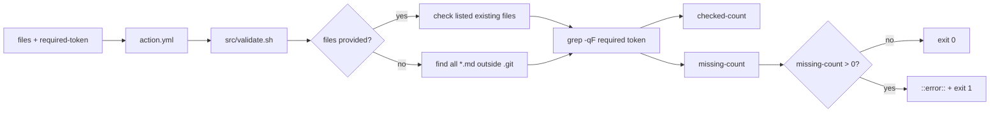

<!-- [KFM_META_BLOCK_V2]
doc_id: kfm://doc/TODO
title: Metadata Validate Action
type: standard
version: v1
status: draft
owners: TODO: owner not verified
created: TODO: YYYY-MM-DD
updated: TODO: YYYY-MM-DD
policy_label: TODO: public
related: [.github/actions/README.md, .github/workflows/README.md, scripts/validate_all.sh, tools/validate_docs_truth_labels.py]
tags: [kfm, github-actions, metadata, validation]
notes: [README expanded from action.yml and src/validate.sh; unresolved metadata placeholders require maintainer review]
[/KFM_META_BLOCK_V2] -->

# Metadata Validate Action

Composite GitHub Action for checking that Markdown files carry the required KFM metadata token.

> [!NOTE]
> **Status:** `draft`  
> **Owners:** `TODO: owner not verified`  
> **Authority:** `CONFIRMED` for the local action contract; `NEEDS VERIFICATION` for current workflow callers and merge-gate enforcement  
> **Repo fit:** `.github/actions/metadata-validate/README.md`  
> **Review burden:** workflow, documentation, and governance maintainers should review changes because this action can block documentation updates and can create false confidence if treated as full metadata validation.


**Quick jumps:** [Scope](#scope) · [Repo fit](#repo-fit) · [Inputs](#inputs) · [Outputs](#outputs) · [Behavior contract](#behavior-contract) · [Usage](#usage) · [Validation](#validation) · [Exclusions](#exclusions) · [Review checklist](#review-checklist) · [Open verification](#open-verification) · [Rollback](#rollback)

---

## Scope

`metadata-validate` is a narrow CI step wrapper. It checks whether selected Markdown files contain a required literal token, defaulting to `[KFM_META_BLOCK_V2]`.

It is useful as an early guard for KFM documentation hygiene. It is not a substitute for schema validation, policy review, link checking, truth-label review, publication review, or EvidenceBundle closure.

### Current verified snapshot

| Surface | Verified behavior | Notes |
| --- | --- | --- |
| `action.yml` | Defines a composite action with `files` and `required-token` inputs. | The default required token is `[KFM_META_BLOCK_V2]`. |
| `src/validate.sh` | Checks files with `grep -qF` and fails when one or more checked files lack the required token. | Missing explicitly listed files are warned and skipped, not counted as failures. |
| `README.md` | This file documents the action’s repo fit, safe usage, boundaries, and verification burden. | This README should itself include the token so the default check can validate it. |

> [!IMPORTANT]
> Passing this action means only that the required token is present. It does **not** prove that the metadata block is complete, truthful, well-formed, current, owner-approved, policy-reviewed, or release-ready.

[Back to top](#metadata-validate-action)

---

## Repo fit

| Relationship | Path | Why it matters |
| --- | --- | --- |
| This action | `./` | Local composite action surface for Markdown metadata-token checks. |
| Action metadata | [`./action.yml`](./action.yml) | Declares inputs, outputs, and the composite step that invokes the validator script. |
| Validator script | [`./src/validate.sh`](./src/validate.sh) | Implements the token scan and fail-closed missing-token result. |
| Parent action lane | [`../README.md`](../README.md) | Should explain local action boundaries and keep reusable action wrappers discoverable. |
| Workflow lane | [`../../workflows/README.md`](../../workflows/README.md) | Workflows may call this action, but workflow orchestration and permissions belong there. |
| GitHub gatehouse | [`../../README.md`](../../README.md) | `.github/` is the repository-side control-plane surface for review and automation. |
| Root posture | [`../../../README.md`](../../../README.md) | Defines KFM as evidence-first, map-first, time-aware, governed, auditable, and reversible. |
| Documentation truth-label validation | [`../../../tools/validate_docs_truth_labels.py`](../../../tools/validate_docs_truth_labels.py) | A neighboring validation layer; this action does not replace truth-label checks. |
| Directory-rule validation | [`../../../tools/check_directory_rules.py`](../../../tools/check_directory_rules.py) | Path and root-boundary checks belong in repo-wide tools, not this token gate. |
| Repo-wide validation script | [`../../../scripts/validate_all.sh`](../../../scripts/validate_all.sh) | Broader validation orchestration can run this action’s checks indirectly or beside it. |
| Schema-home ADR | [`../../../docs/adr/ADR-0001-schema-home.md`](../../../docs/adr/ADR-0001-schema-home.md) | Schema authority decisions remain outside this action. |
| Contract / schema / policy / test surfaces | [`../../../contracts/README.md`](../../../contracts/README.md), [`../../../schemas/README.md`](../../../schemas/README.md), [`../../../policy/README.md`](../../../policy/README.md), [`../../../tests/README.md`](../../../tests/README.md) | This action reports on documentation tokens; it does not own semantic meaning, machine shape, policy decisions, or proof burden. |

### Placement decision

`.github/actions/metadata-validate/` is a valid control-plane/action location because `.github/` is a repo-wide automation and review surface. The action must stay a thin wrapper around reviewable logic and must not become a hidden schema, policy, source, proof, release, or publication authority.

[Back to top](#metadata-validate-action)

---

## Inputs

| Input | Required | Default | Meaning |
| --- | ---: | --- | --- |
| `files` | No | `""` | Newline-delimited list of Markdown files to check. If empty, the script scans all `*.md` files under the repository except `.git/`. |
| `required-token` | No | `[KFM_META_BLOCK_V2]` | Literal token that must appear in each checked Markdown file. |

### Input rules

1. Prefer explicit file lists when validating changed files in a pull request.
2. Prefer whole-repo scans when validating release candidates or documentation migrations.
3. Keep `required-token` stable unless a reviewed KFM metadata-block migration is underway.
4. Do not pass raw logs, directories, globs, or generated text as if they were resolved Markdown file paths unless the caller expands them first.
5. Treat skipped missing file paths as `NEEDS VERIFICATION`; the script warns and continues.

[Back to top](#metadata-validate-action)

---

## Outputs

| Output | Meaning |
| --- | --- |
| `checked-count` | Number of existing Markdown files checked. |
| `missing-count` | Number of checked Markdown files missing the required token. |

A successful run exits with status `0`. A run with one or more checked files missing the token emits a GitHub Actions error and exits non-zero.

[Back to top](#metadata-validate-action)

---

## Behavior contract

| Condition | Result | Trust interpretation |
| --- | --- | --- |
| `files` is empty | Find all `*.md` files outside `.git/` and check them. | Broad hygiene check; may be slower on large trees. |
| `files` contains newline-delimited paths | Check only existing listed files. | Good for pull-request changed-file gates. |
| A listed file is missing | Emit a warning and skip it. | Not strict enough for required changed-file existence by itself. |
| A checked file contains `required-token` | Count it as checked and passing. | Token presence only; metadata quality remains unproven. |
| A checked file lacks `required-token` | Increment missing count and fail the action. | Fail-closed for missing metadata token. |
| `GITHUB_OUTPUT` is unset during local script execution | Local run may fail because the script writes outputs there. | Use a temporary `GITHUB_OUTPUT` for local tests. |

> [!CAUTION]
> The action should not be described as “metadata validation” without the word “token” nearby. It validates token presence, not full metadata truth.

[Back to top](#metadata-validate-action)

---

## Usage

### Whole-repo Markdown token scan

```yaml
- name: Validate KFM metadata tokens
  uses: ./.github/actions/metadata-validate
```

### Changed-file or targeted scan

```yaml
- name: Validate KFM metadata tokens for selected files
  uses: ./.github/actions/metadata-validate
  with:
    files: |
      README.md
      docs/README.md
      .github/actions/metadata-validate/README.md
    required-token: "[KFM_META_BLOCK_V2]"
```

### Read outputs in a later step

```yaml
- name: Validate KFM metadata tokens
  id: metadata
  uses: ./.github/actions/metadata-validate

- name: Report metadata token counts
  shell: bash
  run: |
    echo "checked=${{ steps.metadata.outputs.checked-count }}"
    echo "missing=${{ steps.metadata.outputs.missing-count }}"
```

[Back to top](#metadata-validate-action)

---

## Local validation

Run from the repository root.

```bash
# Inspect this action lane.
find .github/actions/metadata-validate -maxdepth 3 -type f | sort
sed -n '1,220p' .github/actions/metadata-validate/action.yml
sed -n '1,220p' .github/actions/metadata-validate/src/validate.sh
sed -n '1,260p' .github/actions/metadata-validate/README.md

# Check this README with a local GITHUB_OUTPUT target.
GITHUB_OUTPUT="$(mktemp)" \
  bash .github/actions/metadata-validate/src/validate.sh \
  ".github/actions/metadata-validate/README.md" \
  "[KFM_META_BLOCK_V2]"

# Confirm the script can be executed the same way action.yml invokes it.
git ls-files -s .github/actions/metadata-validate/src/validate.sh
```

### Repo-wide companion checks

```bash
# Adjacent validation and governance checks.
python tools/validate_docs_truth_labels.py
python tools/check_directory_rules.py
python tools/check_no_public_internal_paths.py
bash scripts/validate_all.sh
```

Use repo-native workflows or `scripts/validate_all.sh` for broader proof. This action is only one documentation-token gate.

[Back to top](#metadata-validate-action)

---

## Diagram


```mermaid
flowchart LR
  Inputs["files + required-token"] --> Action["action.yml"]
  Action --> Script["src/validate.sh"]
  Script --> Selection{"files provided?"}
  Selection -- "yes" --> Listed["check listed existing files"]
  Selection -- "no" --> Find["find all *.md outside .git"]
  Listed --> Grep["grep -qF required token"]
  Find --> Grep
  Grep --> Pass["checked-count"]
  Grep --> Missing["missing-count"]
  Missing --> Error{"missing-count > 0?"}
  Error -- "no" --> OK["exit 0"]
  Error -- "yes" --> Fail["::error:: + exit 1"]
```

This flow is intentionally small. The action checks for a literal token and returns counts; higher-order KFM validation remains in tools, tests, policy, contracts, schemas, and review workflows.

[Back to top](#metadata-validate-action)

---

## Exclusions

| Does not belong here | Better home | Why |
| --- | --- | --- |
| Full metadata-block schema validation | `schemas/contracts/v1/` plus `tests/contracts/` and relevant validators | This action checks a literal token only. |
| Semantic contract meaning | `contracts/` | Contract docs define object meaning and invariants. |
| Policy allow/deny logic | `policy/` | Policy owns decisions, reasons, obligations, and fail-closed behavior. |
| Source rights and activation checks | `data/registry/`, `control_plane/`, and source validators | Source authority is not a Markdown token issue. |
| Publication, promotion, rollback, or correction decisions | `release/`, `data/proofs/`, `data/receipts/`, and promotion validators | Publication is a governed state transition, not a Markdown token pass. |
| Workflow permissions and orchestration | `.github/workflows/` | Workflow security and sequencing should stay visible at the workflow boundary. |
| Large reusable validators | `tools/validators/` or `packages/` | Composite actions should remain thin and reviewable. |
| Documentation style, link, or accessibility checks | `tools/` and `tests/` | Those checks are adjacent, not this action’s core contract. |

[Back to top](#metadata-validate-action)

---

## Review checklist

Before changing this action or README, verify:

- [ ] `action.yml` input names still match this README.
- [ ] `src/validate.sh` behavior still matches the behavior table.
- [ ] The default required token is still `[KFM_META_BLOCK_V2]`.
- [ ] This README still includes `[KFM_META_BLOCK_V2]`.
- [ ] Relative links resolve from `.github/actions/metadata-validate/`.
- [ ] Changes do not imply full metadata validation when only token presence is checked.
- [ ] Any new workflow caller is documented in `.github/workflows/README.md` or the relevant workflow file.
- [ ] Missing-file behavior is still acceptable for the intended caller.
- [ ] Local execution guidance still accounts for `GITHUB_OUTPUT`.
- [ ] Broader validation remains in `tools/`, `tests/`, `schemas/`, `contracts/`, and `policy/`.

### Definition of done

A change is ready when a reviewer can answer three questions without reading the script first:

1. What files are checked?
2. What exact token is required?
3. What does a pass **not** prove?

[Back to top](#metadata-validate-action)

---

## Open verification

| Item | Status | Why it matters |
| --- | --- | --- |
| Dedicated owner for this action lane | `TODO` | Repository ownership does not prove review ownership for this path. |
| Current workflow caller inventory | `NEEDS VERIFICATION` | This README does not claim that a checked workflow currently invokes this action. |
| Executable bit on `src/validate.sh` | `NEEDS VERIFICATION` | `action.yml` invokes the script by path, so executable mode matters unless callers use `bash`. |
| Missing-file policy | `NEEDS VERIFICATION` | Skipping missing listed files may be too permissive for strict changed-file gates. |
| Full metadata-block validation | `PROPOSED` | Token presence is useful but insufficient for complete metadata governance. |
| Badge status | `NEEDS VERIFICATION` | Badges are documentation hints, not CI proof. |

[Back to top](#metadata-validate-action)

---

## Rollback

To roll back a README-only documentation update, revert the README change and re-run the local validation commands above.

To roll back behavior changes, revert `action.yml` and `src/validate.sh` together. Then run a positive case and a negative case:

```bash
# Positive case: this README should contain the token.
GITHUB_OUTPUT="$(mktemp)" \
  bash .github/actions/metadata-validate/src/validate.sh \
  ".github/actions/metadata-validate/README.md" \
  "[KFM_META_BLOCK_V2]"

# Negative case: a temp file without the token should fail.
tmpfile="$(mktemp --suffix=.md)"
printf '# Missing metadata token\n' > "$tmpfile"
GITHUB_OUTPUT="$(mktemp)" \
  bash .github/actions/metadata-validate/src/validate.sh \
  "$tmpfile" \
  "[KFM_META_BLOCK_V2]"
```

The negative case is expected to exit non-zero. Do not use it in a chained shell command without isolating the expected failure.

[Back to top](#metadata-validate-action)

---

<details>
<summary>Appendix: minimal metadata block reminder</summary>

This action checks for token presence, not block correctness. Still, docs that require KFM metadata should use the reviewed block format expected by the repository’s documentation rules.

```markdown
<!-- [KFM_META_BLOCK_V2]
doc_id: kfm://doc/TODO
title: Example
type: standard
version: v1
status: draft
owners: TODO: owner not verified
created: TODO: YYYY-MM-DD
updated: TODO: YYYY-MM-DD
policy_label: TODO: public
related: []
tags: [kfm]
notes: [TODO: unverified metadata requires maintainer review]
[/KFM_META_BLOCK_V2] -->
```

Do not fill owner, dates, policy labels, or related records unless they have been verified.

</details>
