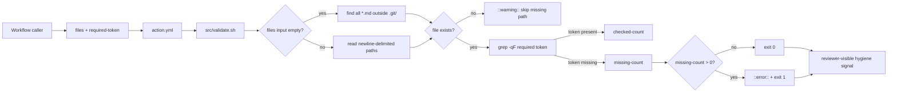

<!-- [KFM_META_BLOCK_V2]
doc_id: kfm://doc/TODO
title: Metadata Validate Action
type: standard
version: v1
status: draft
owners: TODO: owner not verified
created: TODO: YYYY-MM-DD
updated: 2026-05-06
policy_label: TODO: public
related: [
  ../README.md,
  ../metadata-validate-v2/README.md,
  ../../README.md,
  ../../workflows/README.md,
  ../../../README.md,
  ../../../scripts/validate_all.sh,
  ../../../tools/validate_docs_truth_labels.py,
  ../../../tools/check_directory_rules.py,
  ../../../tools/check_schema_home.py,
  ../../../tools/check_no_public_internal_paths.py,
  ../../../contracts/README.md,
  ../../../schemas/README.md,
  ../../../policy/README.md,
  ../../../tests/README.md,
  ../../../fixtures/README.md
]
tags: [kfm, github-actions, metadata, validation, markdown, ci, trust-spine]
notes: [
  "This action validates literal metadata-token presence only; it does not validate full metadata-block shape, truth, ownership, policy, or release readiness.",
  "owners, created date, policy label, executable-bit status, workflow caller inventory, required-check status, and branch/ruleset enforcement remain NEEDS VERIFICATION.",
  "Revision preserves the action as a thin .github/actions wrapper and keeps contract, schema, policy, test, proof, and release authority in their owning roots."
]
[/KFM_META_BLOCK_V2] -->

<a id="top"></a>

# Metadata Validate Action

Composite GitHub Action for checking that Markdown files contain a required KFM metadata token.

> [!NOTE]
> **Status:** `active` action surface / `draft` README  
> **Owners:** `TODO: owner not verified`  
> **Repo fit:** `.github/actions/metadata-validate/README.md`  
> **Authority:** `CONFIRMED` for the documented token-check contract; `NEEDS VERIFICATION` for workflow callers, executable mode, and merge-gate enforcement  
> **Review burden:** workflow, documentation, schema, policy, and release reviewers should keep this action narrow: it can block missing-token docs, but it must not become a hidden metadata, policy, proof, or publication authority.


**Quick jumps:** [Scope](#scope) · [Repo fit](#repo-fit) · [Inputs](#inputs) · [Outputs](#outputs) · [Exclusions](#exclusions) · [Directory tree](#directory-tree) · [Behavior contract](#behavior-contract) · [Usage](#usage) · [Local validation](#local-validation) · [Diagram](#diagram) · [Review gates](#review-gates) · [Rollback](#rollback) · [FAQ](#faq) · [Appendix](#appendix)

---

## Scope

`metadata-validate` is a small repo-local GitHub Action that checks Markdown files for a literal required token.

By default, the token is:

```text
[KFM_META_BLOCK_V2]
```

Use this action as an early documentation-hygiene guard. It helps KFM keep README-like and standard Markdown documents visible to the metadata discipline, especially where CI needs a fast fail-closed signal.

> [!IMPORTANT]
> Passing this action proves **token presence only**. It does not prove that a metadata block is complete, truthful, well-formed, current, owner-approved, policy-reviewed, schema-valid, release-ready, or publication-safe.

### What this action is responsible for

| Responsibility | Status | Boundary |
| --- | --- | --- |
| Scan selected Markdown files | `CONFIRMED` | Uses caller-supplied file list or whole-repo Markdown discovery. |
| Require a literal token | `CONFIRMED` | Defaults to `[KFM_META_BLOCK_V2]`, overridable by input. |
| Count checked files | `CONFIRMED` | Emits `checked-count` through action outputs. |
| Count missing-token files | `CONFIRMED` | Emits `missing-count` and fails when non-zero. |
| Warn on missing listed paths | `CONFIRMED` | Skips missing paths rather than treating them as missing-token failures. |
| Validate full metadata fields | `EXCLUDED` | Belongs in schemas, validators, tests, and review. |
| Decide publication readiness | `EXCLUDED` | Belongs in governed release, proof, policy, review, correction, and rollback lanes. |

[Back to top](#top)

---

## Repo fit

| Direction | Surface | Relationship |
| --- | --- | --- |
| This README | `./README.md` | Action-specific contract, usage, review, and rollback guide. |
| Action metadata | [`./action.yml`](./action.yml) | Declares the composite action interface and output mapping. |
| Validator script | [`./src/validate.sh`](./src/validate.sh) | Implements literal-token scanning and fail-closed missing-token behavior. |
| Parent action lane | [`../README.md`](../README.md) | Explains `.github/actions/` as thin repo-local step wrappers. |
| Versioned sibling | [`../metadata-validate-v2/README.md`](../metadata-validate-v2/README.md) | Documents the broader proposed schema/policy metadata gate; keep this v1 token gate distinct. |
| GitHub gatehouse | [`../../README.md`](../../README.md) | Places actions under repo-wide GitHub governance. |
| Workflow orchestration | [`../../workflows/README.md`](../../workflows/README.md) | Workflow callers belong here; this action is only a reusable step. |
| Root posture | [`../../../README.md`](../../../README.md) | Defines KFM as governed, evidence-first, map-first, time-aware, auditable, and reversible. |
| Documentation truth labels | [`../../../tools/validate_docs_truth_labels.py`](../../../tools/validate_docs_truth_labels.py) | Adjacent validation layer; this action does not replace truth-label checks. |
| Directory-rule checks | [`../../../tools/check_directory_rules.py`](../../../tools/check_directory_rules.py) | Path/root-boundary validation belongs in repo-wide tools. |
| Schema-home checks | [`../../../tools/check_schema_home.py`](../../../tools/check_schema_home.py) | Schema authority checks are outside this action. |
| Public/internal path checks | [`../../../tools/check_no_public_internal_paths.py`](../../../tools/check_no_public_internal_paths.py) | Public-surface trust checks are broader than token presence. |
| Aggregate validation | [`../../../scripts/validate_all.sh`](../../../scripts/validate_all.sh) | Broader CI validation entrypoint that may run beside or above this action. |
| Semantic meaning | [`../../../contracts/README.md`](../../../contracts/README.md) | Contracts explain object meaning. |
| Machine shape | [`../../../schemas/README.md`](../../../schemas/README.md) | Schemas validate structured fields. |
| Policy decisions | [`../../../policy/README.md`](../../../policy/README.md) | Policy owns allow, deny, restrict, abstain, rights, and sensitivity logic. |
| Regression proof | [`../../../tests/README.md`](../../../tests/README.md), [`../../../fixtures/README.md`](../../../fixtures/README.md) | Tests and fixtures prove behavior across positive and negative paths. |

### Placement decision

`.github/actions/metadata-validate/` is the right responsibility root for this file because it is GitHub Actions step-wrapper glue. It must stay thin and reviewable.

It must not become a competing home for:

- metadata schema authority;
- policy law;
- semantic contract meaning;
- source descriptors;
- release manifests;
- proof packs;
- receipts;
- published data;
- domain-lane documentation.

[Back to top](#top)

---

## Inputs

| Input | Required | Default | Meaning |
| --- | ---: | --- | --- |
| `files` | No | `""` | Newline-delimited list of Markdown file paths to check. When empty, the script scans all `*.md` files under the repository except `.git/`. |
| `required-token` | No | `[KFM_META_BLOCK_V2]` | Literal token that must appear in each checked Markdown file. |

### Input rules

1. Prefer explicit file lists for pull-request changed-file checks.
2. Prefer whole-repo scans for release candidates, documentation migrations, or periodic hygiene checks.
3. Keep `required-token` stable unless a reviewed metadata-block migration is underway.
4. Treat workflow-provided paths as untrusted until the script has verified that each listed path exists and is a file.
5. Treat skipped missing paths as `NEEDS VERIFICATION`; this action warns and skips them.

[Back to top](#top)

---

## Outputs

| Output | Script key | Meaning |
| --- | --- | --- |
| `checked-count` | `checked_count` | Number of existing Markdown files checked. |
| `missing-count` | `missing_count` | Number of checked Markdown files missing the required token. |

A successful run exits with status `0`.

A run with one or more checked files missing the required token emits a GitHub Actions error and exits non-zero.

[Back to top](#top)

---

## Exclusions

| Does not belong in this action | Better home | Why |
| --- | --- | --- |
| Full metadata-block schema validation | `schemas/`, `tools/validators/`, `tests/`, `fixtures/` | This action checks literal token presence only. |
| Metadata field truth review | `docs/`, `control_plane/`, review records, CODEOWNERS-backed review | Ownership, dates, policy labels, and related links need human/governance review. |
| Semantic object definitions | `contracts/` | Contracts define meaning and invariants. |
| Policy allow/deny logic | `policy/` | Policy owns admissibility, rights, sensitivity, and release posture. |
| Source rights or source activation checks | `data/registry/`, `control_plane/`, source validators | Source authority is not a Markdown-token issue. |
| Release, promotion, rollback, or correction decisions | `release/`, `data/proofs/`, `data/receipts/`, promotion validators | Publication is a governed state transition, not a token pass. |
| Workflow permissions and job orchestration | `.github/workflows/` | Workflows decide when and how this action runs. |
| Large reusable validators | `tools/validators/`, `tools/`, `packages/` | Composite actions should remain thin wrappers. |
| Documentation style, link, and accessibility checks | `tools/`, `tests/` | Those checks are adjacent, not this action’s core contract. |

[Back to top](#top)

---

## Directory tree

### Current expected action shape

```text
.github/actions/metadata-validate/
├── README.md
├── action.yml
└── src/
    └── validate.sh
```

| Path | Role | Status |
| --- | --- | --- |
| `README.md` | Action documentation and review boundary | `draft` |
| `action.yml` | Composite action interface | `CONFIRMED` by repo evidence; re-check before merge |
| `src/validate.sh` | Bash token-check implementation | `CONFIRMED` by repo evidence; executable bit `NEEDS VERIFICATION` |

### Neighboring action-family context

```text
.github/actions/
├── README.md
├── metadata-validate/
├── metadata-validate-v2/
├── opa-gate/
├── provenance-guard/
├── sbom-produce-and-sign/
└── src/
```

This action is the narrow token gate. `metadata-validate-v2/` is the place to document or implement a deeper schema/policy gate if maintainers choose to keep both versions.

[Back to top](#top)

---

## Behavior contract

| Condition | Result | Trust interpretation |
| --- | --- | --- |
| `files` is empty | Find all `*.md` files outside `.git/` and check them. | Broad hygiene check. |
| `files` contains newline-delimited paths | Check only existing listed files. | Good for pull-request changed-file checks. |
| A listed path is empty text | Ignore it. | Supports clean multiline inputs. |
| A listed file does not exist | Emit `::warning::` and skip it. | Missing-file strictness must be handled elsewhere if needed. |
| A checked file contains `required-token` | Count as checked and passing. | Token presence only. |
| A checked file lacks `required-token` | Increment missing count. | Missing metadata-token gate failure. |
| One or more checked files lack the token | Emit `::error::` and exit `1`. | Fail-closed for missing metadata token. |
| `GITHUB_OUTPUT` is unset | Script cannot write outputs reliably. | Local runs should set `GITHUB_OUTPUT="$(mktemp)"`. |

> [!CAUTION]
> Do not describe this action as “full metadata validation” without qualification. The precise phrase is **metadata-token validation**.

[Back to top](#top)

---

## Usage

### Whole-repo Markdown token scan

```yaml
- name: Validate KFM metadata tokens
  uses: ./.github/actions/metadata-validate
```

### Targeted Markdown token scan

```yaml
- name: Validate selected KFM metadata tokens
  uses: ./.github/actions/metadata-validate
  with:
    files: |
      README.md
      docs/README.md
      .github/actions/metadata-validate/README.md
    required-token: "[KFM_META_BLOCK_V2]"
```

### Read action outputs

```yaml
- name: Validate KFM metadata tokens
  id: metadata
  uses: ./.github/actions/metadata-validate

- name: Report metadata token counts
  shell: bash
  run: |
    set -euo pipefail
    echo "checked=${{ steps.metadata.outputs.checked-count }}"
    echo "missing=${{ steps.metadata.outputs.missing-count }}"
```

### Changed-file caller sketch

```yaml
- name: Collect changed Markdown files
  id: changed-md
  shell: bash
  run: |
    set -euo pipefail
    git fetch origin "${{ github.base_ref }}" --depth=1
    git diff --name-only "origin/${{ github.base_ref }}"...HEAD \
      | grep -E '\.md$' \
      | tee changed-md.txt || true

    {
      echo "files<<EOF"
      cat changed-md.txt
      echo "EOF"
    } >> "$GITHUB_OUTPUT"

- name: Validate metadata tokens on changed Markdown
  uses: ./.github/actions/metadata-validate
  with:
    files: ${{ steps.changed-md.outputs.files }}
```

> [!NOTE]
> The changed-file sketch is illustrative. Reuse only after verifying the workflow trigger, checkout depth, fork behavior, and baseline ref logic for the target workflow.

[Back to top](#top)

---

## Local validation

Run from the repository root.

```bash
# Inspect this action lane.
find .github/actions/metadata-validate -maxdepth 3 -type f | sort
sed -n '1,220p' .github/actions/metadata-validate/action.yml
sed -n '1,220p' .github/actions/metadata-validate/src/validate.sh
sed -n '1,260p' .github/actions/metadata-validate/README.md

# Check this README with a local GITHUB_OUTPUT target.
GITHUB_OUTPUT="$(mktemp)" \
  bash .github/actions/metadata-validate/src/validate.sh \
  ".github/actions/metadata-validate/README.md" \
  "[KFM_META_BLOCK_V2]"

# Confirm executable mode when action.yml invokes the script by path.
git ls-files -s .github/actions/metadata-validate/src/validate.sh
```

### Positive and negative smoke checks

```bash
# Positive case.
positive_file="$(mktemp --suffix=.md)"
cat > "$positive_file" <<'MD'
<!-- [KFM_META_BLOCK_V2]
doc_id: kfm://doc/TODO
title: Positive
type: standard
version: v1
status: draft
owners: TODO
created: TODO
updated: TODO
policy_label: TODO
related: []
tags: [kfm]
notes: [test fixture]
[/KFM_META_BLOCK_V2] -->

# Positive
MD

GITHUB_OUTPUT="$(mktemp)" \
  bash .github/actions/metadata-validate/src/validate.sh \
  "$positive_file" \
  "[KFM_META_BLOCK_V2]"

# Negative case. This is expected to exit non-zero.
negative_file="$(mktemp --suffix=.md)"
printf '# Missing metadata token\n' > "$negative_file"

set +e
GITHUB_OUTPUT="$(mktemp)" \
  bash .github/actions/metadata-validate/src/validate.sh \
  "$negative_file" \
  "[KFM_META_BLOCK_V2]"
status="$?"
set -e

test "$status" -ne 0
```

### Companion repo-wide checks

```bash
python tools/validate_docs_truth_labels.py
python tools/check_directory_rules.py
python tools/check_schema_home.py
python tools/check_no_public_internal_paths.py
bash scripts/validate_all.sh
```

Use repo-native workflows or `scripts/validate_all.sh` for broader proof. This action is only one documentation-token gate.

[Back to top](#top)

---

## Diagram


```mermaid
flowchart LR
  Caller[Workflow caller] --> Inputs["files + required-token"]
  Inputs --> Action[action.yml]
  Action --> Script[src/validate.sh]

  Script --> Select{files input empty?}
  Select -- yes --> WholeRepo["find all *.md outside .git/"]
  Select -- no --> Listed["read newline-delimited paths"]

  WholeRepo --> Existing{file exists?}
  Listed --> Existing

  Existing -- no --> Warn["::warning:: skip missing path"]
  Existing -- yes --> Grep["grep -qF required token"]

  Grep -- token present --> CountPass["checked-count"]
  Grep -- token missing --> CountMissing["missing-count"]

  CountMissing --> Fail{missing-count > 0?}
  Fail -- no --> OK["exit 0"]
  Fail -- yes --> Error["::error:: + exit 1"]

  OK --> Review["reviewer-visible hygiene signal"]
  Error --> Review
```

This action intentionally stops at a small boundary: token present or token missing. Higher-order KFM validation remains in `tools/`, `tests/`, `schemas/`, `contracts/`, `policy/`, `release/`, and review workflows.

[Back to top](#top)

---

## Review gates

Before changing this action or README, verify:

- [ ] `action.yml` input names still match this README.
- [ ] `action.yml` output names still map to script output keys.
- [ ] `src/validate.sh` behavior still matches the behavior table.
- [ ] The default token is still `[KFM_META_BLOCK_V2]`, or the metadata migration is documented and reviewed.
- [ ] This README still contains `[KFM_META_BLOCK_V2]`.
- [ ] Relative links resolve from `.github/actions/metadata-validate/`.
- [ ] Changes do not imply full metadata validation when only token presence is checked.
- [ ] Workflow callers, if any, are documented in `.github/workflows/README.md` or the relevant workflow file.
- [ ] Missing-file behavior is still acceptable for the intended caller.
- [ ] Local execution guidance still accounts for `GITHUB_OUTPUT`.
- [ ] Broader validation remains in `tools/`, `tests/`, `schemas/`, `contracts/`, and `policy/`.
- [ ] Any relationship to `metadata-validate-v2/` is explained instead of silently overlapping responsibilities.

### Definition of done

A change is ready when a reviewer can answer these questions without reading the script first:

1. What files are checked?
2. What exact token is required?
3. What outputs are emitted?
4. What happens when a file is missing?
5. What does a pass **not** prove?

[Back to top](#top)

---

## Rollback

README-only rollback is straightforward:

```bash
git checkout -- .github/actions/metadata-validate/README.md
```

Behavior rollback should revert `action.yml` and `src/validate.sh` together, then run positive and negative smoke checks.

```bash
# Inspect likely callers before reverting behavior.
grep -R "metadata-validate" -n .github/workflows .github/actions scripts tools 2>/dev/null || true
```

| Change type | Safe rollback |
| --- | --- |
| README-only clarification | Revert this README and re-run token validation. |
| Script behavior change | Revert `src/validate.sh`, confirm output keys, run smoke checks. |
| Action interface change | Revert `action.yml` and any caller workflows together. |
| Workflow caller change | Revert caller workflow first if CI is blocking incorrectly. |
| Token migration | Restore old token requirement or keep both gates temporarily with a migration note. |

Do not delete workflow logs, receipts, proof packs, release manifests, or correction records merely because an action changed. Those artifacts may be audit evidence.

[Back to top](#top)

---

## Open verification

| Item | Status | Why it matters |
| --- | --- | --- |
| Dedicated owner for this action lane | `TODO` | Repository ownership is not the same as path review ownership. |
| `created` date | `TODO` | Needs git history or document registry evidence. |
| `policy_label` | `TODO` | Needs governance review. |
| Current workflow caller inventory | `NEEDS VERIFICATION` | No README should claim merge-blocking behavior without workflow and platform evidence. |
| Executable bit on `src/validate.sh` | `NEEDS VERIFICATION` | `action.yml` invokes the script by path, so mode matters unless the caller uses `bash`. |
| Missing-file policy | `NEEDS VERIFICATION` | Skipping missing listed files may be too permissive for strict changed-file gates. |
| Full metadata-block validation | `PROPOSED` | Token presence is useful but insufficient for complete metadata governance. |
| Required-check / branch-protection status | `NEEDS VERIFICATION` | Platform settings are not proven by repository files. |
| Badge truth | `NEEDS VERIFICATION` | Badges are documentation hints, not CI proof. |
| v1/v2 coexistence plan | `NEEDS VERIFICATION` | `metadata-validate` and `metadata-validate-v2` should not drift into overlapping authority. |

[Back to top](#top)

---

## FAQ

### Does this validate KFM metadata?

Only at the token-presence level. It checks whether the required literal token appears in Markdown files.

### Why not validate the full metadata block here?

Because KFM separates responsibilities. Token scanning can live in a thin composite action. Full field shape belongs in machine schemas and validators; semantic truth belongs in contracts and review; admissibility belongs in policy; release readiness belongs in promotion and release gates.

### Should this action run on every Markdown file?

Whole-repo scans are useful for periodic hygiene and release candidates. Pull-request workflows may prefer changed-file scans to reduce noise.

### What happens if a listed file no longer exists?

The script warns and skips it. A caller that requires strict changed-file existence should add that check before invoking this action.

### Is this action a publication gate?

No. It can block missing metadata tokens, but publication remains a governed state transition with evidence closure, policy review, release manifest, correction path, and rollback target.

### How does this differ from `metadata-validate-v2`?

`metadata-validate` is the narrow token gate. `metadata-validate-v2` is the expected home for a broader schema/policy metadata gate if the repo keeps both action versions.

[Back to top](#top)

---

## Appendix

<details>
<summary><strong>Minimal metadata block reminder</strong></summary>

This action checks for token presence, not block correctness. Standard docs that require KFM metadata should use the reviewed block format expected by project documentation rules.

```markdown
<!-- [KFM_META_BLOCK_V2]
doc_id: kfm://doc/TODO
title: Example
type: standard
version: v1
status: draft
owners: TODO: owner not verified
created: TODO: YYYY-MM-DD
updated: TODO: YYYY-MM-DD
policy_label: TODO: public
related: []
tags: [kfm]
notes: [TODO: unverified metadata requires maintainer review]
[/KFM_META_BLOCK_V2] -->
```

Do not fill owners, dates, policy labels, identifiers, or related records unless they have been verified.

</details>

<details>
<summary><strong>Why token presence still matters</strong></summary>

Token presence is not enough, but it is still useful because it makes missing-document metadata visible early. It is a low-cost gate that helps reviewers find docs that skipped the KFM metadata discipline entirely.

Use it as the first rung, not the whole ladder.

```text
token present
  -> metadata block parse
  -> field shape validation
  -> truth-label review
  -> link and path validation
  -> source / policy / rights checks where relevant
  -> release and correction checks where publication is affected
```

</details>

<details>
<summary><strong>Known anti-patterns</strong></summary>

Reject these patterns during review:

- calling this “full metadata validation”;
- treating a passing token scan as release approval;
- adding policy decisions inside `validate.sh`;
- adding schema definitions inside `.github/actions/metadata-validate/`;
- printing secrets or restricted data in workflow logs;
- silently changing the default token without migration notes;
- letting v1 and v2 metadata gates diverge without a caller inventory;
- using successful CI as proof that owners, dates, policy labels, or evidence links are true.

</details>

[Back to top](#top)
