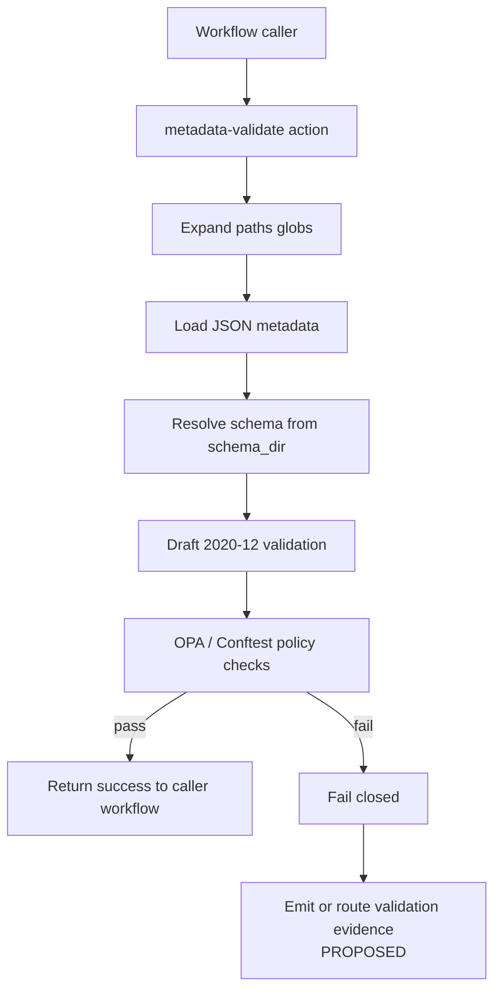

<!-- [KFM_META_BLOCK_V2]
doc_id: kfm://doc/NEEDS-VERIFICATION
title: Metadata Validate Action
type: standard
version: v1
status: draft
owners: NEEDS VERIFICATION
created: YYYY-MM-DD
updated: YYYY-MM-DD
policy_label: NEEDS VERIFICATION
related: [NEEDS-VERIFICATION: mounted sibling action.yml, NEEDS-VERIFICATION: downstream workflow callers, NEEDS-VERIFICATION: mounted schema directory, NEEDS-VERIFICATION: mounted policy bundle path]
tags: [kfm, github-actions, metadata-validate]
notes: [Current session exposed PDFs and attached text only; exact repo inventory, owners, dates, action path/name, and workflow callers require direct repository verification.]
[/KFM_META_BLOCK_V2] -->

# Metadata Validate Action

Composite metadata gate for schema-first, policy-aware validation of STAC/DCAT/PROV-style JSON before promotion or wider workflow use.

> [!NOTE]
> **Status:** experimental  
> **Owners:** NEEDS VERIFICATION  
>      
> **Quick jumps:** [Scope](#scope) · [Repo fit](#repo-fit) · [Accepted inputs](#accepted-inputs) · [Exclusions](#exclusions) · [Current verified snapshot](#current-verified-snapshot) · [Quickstart](#quickstart) · [Usage](#usage) · [Diagram](#diagram) · [Task list](#task-list--definition-of-done) · [FAQ](#faq)  
> **Repo fit:** `.github/actions/metadata-validate/` → upstream: **NEEDS VERIFICATION** · downstream: workflow callers in `.github/workflows/` that run metadata and policy gates (**NEEDS VERIFICATION**)

> [!IMPORTANT]
> This README documents a **metadata-validation lane**, not a release lane, not a provenance generator, and not a publication workflow by itself. Its job is to help a maintainer understand how metadata should be checked before later gates proceed.

> [!WARNING]
> Current-session workspace evidence did **not** include a mounted repository tree, live `.github/actions/` inventory, workflow YAML files, schemas, or tests. Treat implementation-shaped details below as **PROPOSED** or **NEEDS VERIFICATION** unless direct repo inspection confirms them.

## Scope

This directory should hold the README and composite action surface for validating metadata objects against repo-local schema and policy rules before those objects move deeper into KFM promotion or release flows.

In KFM terms, this action belongs close to the **contract-and-proof** layer: it helps stop malformed metadata from quietly entering later catalog, policy, review, and release stages.

## Repo fit

| Path / surface | Role | Verification state |
| --- | --- | --- |
| `.github/actions/metadata-validate/README.md` | this file | **CONFIRMED** target path from the current task |
| `.github/actions/metadata-validate/action.yml` | local composite action entrypoint | **NEEDS VERIFICATION** |
| `.github/workflows/` callers | downstream workflow consumers | **NEEDS VERIFICATION** |
| `schemas/metadata/` | likely schema source for JSON validation | **PROPOSED** from attached action sketch |
| `policy/rego/` | likely policy bundle path for Conftest / OPA checks | **PROPOSED** from attached action sketch |

### Why this lane exists

KFM doctrine treats outward metadata closure and proof objects as first-class, not decorative sidecars. A metadata-validation action therefore protects more than formatting: it helps preserve truth-path discipline, fail-closed behavior, and the boundary between candidate metadata and outwardly admissible metadata.

## Accepted inputs

Place or pass the following here when they are part of a metadata-validation run:

- JSON metadata files reached through repo-local glob patterns
- STAC-, DCAT-, or PROV-oriented JSON objects that need schema and policy checks
- a schema directory containing the validator targets for those objects
- repo-local policy bundles used to express deny-by-default or warning rules
- workflow invocations whose purpose is validation rather than publication

## Exclusions

This directory should **not** become the owner of:

- provenance generation or receipt publication by itself
- SBOM creation or signing
- artifact upload, patch, or release publication
- runtime evidence resolution or UI trust-surface rendering
- binary artifact validation
- broad repository policy doctrine that belongs in higher-level governance docs

## Status vocabulary used in this README

| Label | Meaning here |
| --- | --- |
| **CONFIRMED** | Directly supported by the attached project corpus or by the current task itself |
| **INFERRED** | Structural completion that fits KFM doctrine but was not directly surfaced as mounted implementation |
| **PROPOSED** | Recommended or sketched action behavior from attached working notes |
| **UNKNOWN** | Not verified strongly enough in the current session |
| **NEEDS VERIFICATION** | Review flag for repo inventory, ownership, callers, dates, or exact implementation details |

## Current verified snapshot

| Item | Verified state | Notes |
| --- | --- | --- |
| Requested target file | **CONFIRMED** | This README is for `.github/actions/metadata-validate/README.md` |
| Conceptually matching composite action | **CONFIRMED** in attached working notes | The attached notes describe a metadata-validation action for STAC/DCAT/PROV metadata |
| Exact mounted local action name/path | **UNKNOWN** | Attached notes use a prefixed variant name; the mounted repo was not inspected |
| Mounted workflow callers | **UNKNOWN** | No workflow YAML inventory was directly surfaced |
| Mounted schema directory and policy bundle path | **UNKNOWN** | Only proposal-level examples were surfaced |
| Repo owners, dates, and adjacent action inventory | **UNKNOWN** | Keep placeholders until repository verification happens |

That means this README should prioritize **purpose, routing, guardrails, and verification needs** over claims about mature implementation.

## Directory tree

Illustrative local shape only — verify against the mounted repo before commit:

```text
.github/
└── actions/
    └── metadata-validate/
        ├── README.md
        └── action.yml   # NEEDS VERIFICATION
```

## Quickstart

Illustrative usage only — verify the mounted local action name/path before copying this into CI.

```yaml
# Example caller
# NEEDS VERIFICATION:
# - exact local action reference
# - actual schema directory path
# - mounted policy bundle path

jobs:
  metadata_gate:
    runs-on: ubuntu-latest
    steps:
      - uses: actions/checkout@v4

      - name: Validate metadata
        uses: ./.github/actions/metadata-validate
        with:
          paths: "data/catalog/**/*.json,data/stac/**/*.json,data/prov/**/*.json"
          schema_dir: "schemas/metadata"
```

If the mounted repo uses a prefixed action name such as `kfm__metadata__validate`, update this README and the example together rather than silently drifting.

## Usage

### Likely action contract

The attached action sketch strongly suggests a small composite contract like the following, but the mounted repo must verify it before this README is treated as implementation-accurate.

| Input / behavior | Status | Intended job |
| --- | --- | --- |
| `paths` | **PROPOSED** | Comma-separated glob list of JSON metadata files to validate |
| `schema_dir` | **PROPOSED** | Directory containing JSON Schema files |
| Draft 2020-12 schema validation | **PROPOSED** | Validate each matched JSON file against a selected schema |
| OPA / Conftest policy pass | **PROPOSED** | Run policy checks after schema validation |
| Fail-closed result | **INFERRED** | Stop later workflow stages on validation failure |

### Likely validation model

1. Expand the glob list supplied in `paths`.
2. Load each matching JSON document.
3. Resolve a schema from `schema_dir`.
4. Run JSON Schema validation.
5. Run policy checks over the same candidate files.
6. Return a pass/fail outcome to the caller workflow.

### Review point that should block blind approval

The attached working-note sketch appears to resolve schemas from a document field shaped like:

```python
data.get("type", "dataset")
```

That is a useful **starter idea**, but it should remain **NEEDS VERIFICATION** before anyone claims this action is ready for broad STAC/DCAT/PROV coverage. For example, STAC Items often carry `type: "Feature"`, which may not line up cleanly with a local schema naming convention unless the mounted repo already includes an explicit mapping layer.

> [!TIP]
> Treat schema resolution rules as part of the action contract, not as an implementation detail to guess around later. If the mounted repo uses an explicit schema map, document it here.

## Standards posture

The attached KFM doctrine treats these standards as important boundary facts for metadata and proof-object work:

| Standard / profile family | Why it matters here |
| --- | --- |
| JSON Schema Draft 2020-12 | Machine-validatable contract files, valid/invalid fixtures, and contract-profile language |
| STAC | Spatiotemporal asset description and discovery vocabulary |
| DCAT 3 | Outward dataset and distribution catalog metadata |
| PROV-O | Lineage vocabulary for activities, entities, and agents |

This action should therefore be documented as a **metadata gate**, not as a generic JSON linter.

## KFM contract alignment

| KFM object family | Why this action matters |
| --- | --- |
| `SourceDescriptor` | Helps keep source-facing metadata honest once schemas exist |
| `ValidationReport` | Natural proof object for pass, fail, or quarantine outcomes |
| `CatalogClosure` | Protects outward STAC/DCAT/PROV closure from malformed inputs |
| `DecisionEnvelope` | Likely downstream machine-readable carrier for policy outcomes |
| `ReleaseManifest / ReleaseProofPack` | Later release objects are safer when metadata is validated earlier |

## Diagram


```mermaid
flowchart TD
    A[Workflow caller] --> B[metadata-validate action]
    B --> C[Expand paths globs]
    C --> D[Load JSON metadata]
    D --> E[Resolve schema from schema_dir]
    E --> F[Draft 2020-12 validation]
    F --> G[OPA / Conftest policy checks]
    G -- pass --> H[Return success to caller workflow]
    G -- fail --> I[Fail closed]
    I --> J[Emit or route validation evidence<br/>PROPOSED]
```

## Compact reference table

| Concern | What this README should say now | What must wait for repo verification |
| --- | --- | --- |
| Purpose | Metadata validation before later gates | Exact mounted workflow inventory |
| Inputs | Likely `paths` and `schema_dir` | Real input list from `action.yml` |
| Schema behavior | Draft 2020-12 validator is a strong proposal | Actual schema mapping logic |
| Policy behavior | Conftest / OPA is a strong proposal | Real policy path, flags, and fixtures |
| Adjacent actions | Metadata validation is separate from provenance/SBOM lanes | Exact sibling action names and paths |
| Maturity | Experimental / draft is safe | “Active” or “stable” claims need direct proof |

## Task list / definition of done

- [ ] Mounted `action.yml` is directly inspected and matches this README
- [ ] Exact local action reference is confirmed (`metadata-validate` vs prefixed variant)
- [ ] Real input names, defaults, and required fields are copied from the mounted action file
- [ ] Schema naming and selection rules are verified against actual STAC/DCAT/PROV fixtures
- [ ] Mounted schema directory is linked here with grounded relative links
- [ ] Mounted policy bundle path and flags are linked here with grounded relative links
- [ ] At least one real caller workflow is linked from this README
- [ ] Owners, dates, and policy label placeholders are resolved
- [ ] Any machine-readable outputs produced by the action are documented explicitly
- [ ] This README is updated if the action grows beyond validation into broader gate orchestration

## FAQ

### Why is the exact action reference still marked **NEEDS VERIFICATION**?

Because the current task names the directory as `.github/actions/metadata-validate/`, while the attached working-note sketch describes a conceptually matching action under a prefixed name. This README should not pretend that naming drift is already resolved.

### Does this action replace provenance or SBOM lanes?

No. The attached action sketch sits beside provenance and SBOM-oriented actions in a broader gate family. This README should keep metadata validation scoped to metadata validation.

### Why is schema selection called out as a review hotspot?

Because schema lookup is where many “looks fine in prose” workflows fail in practice. If STAC/DCAT/PROV documents do not map cleanly to local schema filenames, the action can become brittle while still sounding polished.

### Should this action publish, patch, or promote anything?

Not by default. Its safest documented role is to validate candidate metadata and fail closed before later gates decide what may proceed.

## Appendix

<details>
<summary><strong>Illustrative behavior sketch from the attached working-note corpus</strong></summary>

The attached working notes suggest a composite action with two main stages:

1. JSON Schema validation over matched metadata files.
2. Conftest / OPA policy checks over those same candidate paths.

Illustrative pseudocode shape:

```python
for file in glob(paths):
    data = load_json(file)
    schema_name = f"{data.get('type', 'dataset')}.schema.json"
    schema = load_json(f"{schema_dir}/{schema_name}")
    Draft202012Validator(schema).validate(data)

conftest.test(paths, policy="policy/rego")
```

Treat that sketch as **PROPOSED** until the mounted repo confirms:

- the exact action name
- the exact input list
- the actual schema naming convention
- the real policy path and flags
- whether the action emits any machine-readable validation artifact
</details>

[Back to top](#metadata-validate-action)
