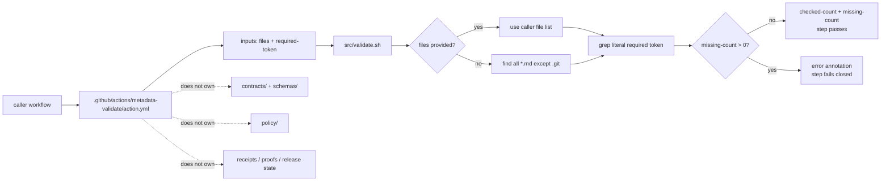

<!-- [KFM_META_BLOCK_V2]
doc_id: kfm://doc/NEEDS_VERIFICATION__github_actions_metadata_validate_readme
title: metadata-validate
type: standard
version: v1
status: draft
owners: @bartytime4life
created: NEEDS_VERIFICATION__YYYY-MM-DD
updated: 2026-04-27
policy_label: public
related: [../README.md, ./action.yml, ./src/validate.sh, ../metadata-validate-v2/README.md, ../../workflows/README.md, ../../CODEOWNERS, ../../PULL_REQUEST_TEMPLATE.md, ../../../contracts/README.md, ../../../schemas/README.md, ../../../policy/README.md, ../../../tests/README.md, ../../../tools/docs/README.md, ../../../tools/validators/README.md, ../../../scripts/README.md]
tags: [kfm, github-actions, metadata, markdown, validation, meta-block]
notes: [Replaces a thin action-local README with a reviewable contract for the current token-presence composite action. doc_id and created date need registry or git-history verification. This action validates literal token presence only; semantic KFM_META_BLOCK_V2 parsing and schema/policy validation remain separate responsibilities.]
[/KFM_META_BLOCK_V2] -->

<a id="top"></a>

# `metadata-validate`

Composite GitHub Action for requiring a KFM metadata token in targeted Markdown files before downstream governance checks continue.


> [!IMPORTANT]
> **Status:** `experimental`  
> **Owners:** `@bartytime4life`  
> **Path:** `.github/actions/metadata-validate/README.md`  
> **Action contract:** `files` + `required-token` in [`action.yml`](./action.yml)  
> **Helper:** [`src/validate.sh`](./src/validate.sh)  
> **Quick jumps:** [Scope](#scope) · [Repo fit](#repo-fit) · [Accepted inputs](#accepted-inputs) · [Exclusions](#exclusions) · [Directory tree](#directory-tree) · [Quickstart](#quickstart) · [Usage](#usage) · [Diagram](#diagram) · [Operating tables](#operating-tables) · [Task list](#task-list--definition-of-done) · [FAQ](#faq) · [Appendix](#appendix)

> [!NOTE]
> This is the **v1 token-presence gate**. It answers: “Does each targeted Markdown file contain the required metadata token?”  
> It does **not** prove that the metadata block is structurally complete, semantically correct, policy-safe, or release-ready.

---

## Scope

`metadata-validate` is a small repo-local action for the earliest Markdown metadata admission check.

It is useful when a workflow needs a simple fail-closed guard before later documentation, schema, policy, provenance, or release steps run.

### What it checks

| Check | Current behavior | Truth label |
|---|---|---:|
| Target file set | Uses the caller-provided newline-delimited `files` list; if omitted, scans all `*.md` files under the current working directory except `.git/` | **CONFIRMED** |
| Token | Requires a literal `required-token` string in every counted Markdown file | **CONFIRMED** |
| Default token | `[KFM_META_BLOCK_V2]` | **CONFIRMED** |
| Missing file paths | Warns and skips missing paths | **CONFIRMED** |
| Counts | Emits `checked-count` and `missing-count` | **CONFIRMED** |
| Missing token | Emits an error and exits non-zero | **CONFIRMED** |

### What it does not check

This action does **not** currently verify:

- exact HTML comment wrapper placement
- required KFM Meta Block V2 keys
- valid YAML-like field formatting
- `doc_id` registry allocation
- owner legitimacy beyond visible repo ownership docs
- policy label correctness
- relative-link validity
- one-H1 README rules
- README impact-block completeness
- schema validity
- OPA / Conftest policy decisions
- publication, proof-pack, or release readiness

Use this action as an early **presence gate**, not as the full documentation governance validator.

<p align="right"><a href="#top">Back to top ⤴</a></p>

---

## Repo fit

| Direction | Surface | Relationship |
|---|---|---|
| Parent action boundary | [`../README.md`](../README.md) | Defines `.github/actions/` as the step-level reuse seam for thin, reviewable local actions |
| This action metadata | [`./action.yml`](./action.yml) | Machine-readable composite-action contract |
| This action helper | [`./src/validate.sh`](./src/validate.sh) | Token-presence implementation |
| Sibling v2 lane | [`../metadata-validate-v2/README.md`](../metadata-validate-v2/README.md) | Richer schema/policy gate candidate; do not silently merge its responsibilities into v1 |
| Workflow callers | [`../../workflows/README.md`](../../workflows/README.md) | Caller workflows should own job orchestration, permissions, artifact upload, and required-check posture |
| Ownership | [`../../CODEOWNERS`](../../CODEOWNERS) | Routes `.github/actions/` review through current broad ownership |
| PR intake | [`../../PULL_REQUEST_TEMPLATE.md`](../../PULL_REQUEST_TEMPLATE.md) | Keeps action changes tied to evidence, validation, rollback, and review burden |
| Contract meaning | [`../../../contracts/README.md`](../../../contracts/README.md) | Human-readable contract doctrine stays outside action glue |
| Machine schemas | [`../../../schemas/README.md`](../../../schemas/README.md) | Schema law and schema maturity stay outside action glue |
| Policy authority | [`../../../policy/README.md`](../../../policy/README.md) | Policy semantics and allow/deny obligations belong in policy surfaces |
| Verification | [`../../../tests/README.md`](../../../tests/README.md) | Tests and fixtures should prove behavior beyond README claims |
| Documentation tooling | [`../../../tools/docs/README.md`](../../../tools/docs/README.md) | Richer doc-structure and meta-block checks should live in durable tooling when they outgrow this wrapper |
| Durable validators | [`../../../tools/validators/README.md`](../../../tools/validators/README.md) | Full validation logic should graduate here when it becomes more than a thin token gate |

### Boundary rule

A repo-local action may **wrap** canonical KFM checks. It must not become the canonical home of metadata meaning, policy semantics, contract truth, proof state, or publication authority.

<p align="right"><a href="#top">Back to top ⤴</a></p>

---

## Accepted inputs

### Action runtime inputs

| Input | Required | Default | Description |
|---|---:|---|---|
| `files` | no | `""` | Newline-delimited list of files to validate. When empty, the helper scans all Markdown files under the current working directory, excluding `.git/`. |
| `required-token` | no | `[KFM_META_BLOCK_V2]` | Literal token that must appear in each counted file. |

### Action-local files

| File type | What belongs here | Typical shape |
|---|---|---|
| Action metadata | Composite-action contract | [`action.yml`](./action.yml) |
| Action helper | Minimal implementation for this action only | [`src/validate.sh`](./src/validate.sh) |
| Action README | Inputs, outputs, behavior, examples, and boundaries | [`README.md`](./README.md) |
| Smoke fixtures | Tiny positive/negative Markdown examples, once added | `tests/fixtures/*.md` |
| Migration notes | Temporary notes only if this action changes contract or is replaced by v2 | `migration.md` |

> [!TIP]
> Prefer an explicit `files` list in PR workflows. The default all-Markdown scan is useful for broad audits, but it can surprise maintainers if generated, archived, third-party, or intentionally metadata-free Markdown exists in the checkout.

<p align="right"><a href="#top">Back to top ⤴</a></p>

---

## Exclusions

| Do not put here | Better home | Why |
|---|---|---|
| KFM Meta Block V2 semantic rules | [`../../../tools/docs/README.md`](../../../tools/docs/README.md), [`../../../docs/standards/README.md`](../../../docs/standards/README.md) | Semantic documentation rules need durable tooling and reviewable standards |
| JSON Schema definitions | [`../../../schemas/README.md`](../../../schemas/README.md) | Machine shape authority should not hide inside an action folder |
| Human-readable contract doctrine | [`../../../contracts/README.md`](../../../contracts/README.md) | Contract meaning should stay reviewable outside CI glue |
| Policy bundles or Rego logic | [`../../../policy/README.md`](../../../policy/README.md) | Policy meaning must remain explicit and independently testable |
| Multi-job orchestration | [`../../workflows/README.md`](../../workflows/README.md) | Jobs, permissions, artifacts, and promotion choreography belong to workflows |
| Mature validation tools | [`../../../tools/validators/README.md`](../../../tools/validators/README.md), [`../../../scripts/README.md`](../../../scripts/README.md) | Reusable validators deserve normal tooling lifecycle and tests |
| Receipts, proofs, signatures, release evidence | `../../../data/receipts/`, `../../../data/proofs/`, or release surfaces | Action logs are not durable release evidence |
| Secrets or tokens | GitHub secrets, environments, or external secret management | Action folders must never become credential stores |
| Direct publish shortcuts | Governed workflow and promotion surfaces | KFM promotion is a governed state transition, not an action convenience |

<p align="right"><a href="#top">Back to top ⤴</a></p>

---

## Directory tree

### Current source-check snapshot

```text
.github/actions/metadata-validate/
├── README.md
├── action.yml
└── src/
    └── validate.sh
```

### Target shape once tests are added

```text
.github/actions/metadata-validate/
├── README.md
├── action.yml
├── src/
│   └── validate.sh
└── tests/
    └── fixtures/
        ├── valid-meta-token.md
        └── missing-meta-token.md
```

> [!NOTE]
> The current action is intentionally small. Add fixtures and tests before expanding behavior beyond token presence.

<p align="right"><a href="#top">Back to top ⤴</a></p>

---

## Quickstart

Run commands from the repository root.

### 1) Inspect the action contract

```bash
sed -n '1,200p' .github/actions/metadata-validate/action.yml
sed -n '1,240p' .github/actions/metadata-validate/src/validate.sh
```

### 2) Confirm the helper can run locally

`validate.sh` writes to `$GITHUB_OUTPUT`, so define a temporary output file for local checks.

```bash
tmp_output="$(mktemp)"

GITHUB_OUTPUT="$tmp_output" \
  .github/actions/metadata-validate/src/validate.sh \
  ".github/actions/metadata-validate/README.md" \
  "[KFM_META_BLOCK_V2]"

cat "$tmp_output"
rm -f "$tmp_output"
```

### 3) Check a focused file list

```bash
files="$(
  printf '%s\n' \
    ".github/actions/metadata-validate/README.md" \
    ".github/actions/README.md" \
    "schemas/contracts/v1/README.md"
)"

tmp_output="$(mktemp)"

GITHUB_OUTPUT="$tmp_output" \
  .github/actions/metadata-validate/src/validate.sh \
  "$files" \
  "[KFM_META_BLOCK_V2]"

cat "$tmp_output"
rm -f "$tmp_output"
```

### 4) Verify the executable bit before relying on the composite action

```bash
test -x .github/actions/metadata-validate/src/validate.sh \
  || echo "NEEDS VERIFICATION: set executable bit or invoke through bash explicitly."
```

<p align="right"><a href="#top">Back to top ⤴</a></p>

---

## Usage

### Minimal workflow call

```yaml
- name: Validate KFM metadata token
  uses: ./.github/actions/metadata-validate
  with:
    required-token: "[KFM_META_BLOCK_V2]"
```

When `files` is omitted, the action scans all `*.md` files under the workflow working directory except `.git/`.

### Preferred PR-focused call

```yaml
- name: Validate KFM metadata token in changed Markdown
  uses: ./.github/actions/metadata-validate
  with:
    files: |
      README.md
      .github/actions/metadata-validate/README.md
      schemas/contracts/v1/README.md
    required-token: "[KFM_META_BLOCK_V2]"
```

### Reading the outputs

| Output | Meaning |
|---|---|
| `checked-count` | Number of existing files counted by the helper |
| `missing-count` | Number of counted files that did not contain the required token |

Example follow-up step:

```yaml
- name: Show metadata-token counts
  shell: bash
  run: |
    echo "checked=${{ steps.metadata_validate.outputs.checked-count }}"
    echo "missing=${{ steps.metadata_validate.outputs.missing-count }}"
```

> [!WARNING]
> A passing result means the token was present. It does not mean the document has a valid `doc_id`, complete required keys, valid links, correct ownership, or safe publication posture.

<p align="right"><a href="#top">Back to top ⤴</a></p>

---

## Diagram


```mermaid
flowchart LR
    WF["caller workflow"] --> ACT[".github/actions/metadata-validate/action.yml"]
    ACT --> IN["inputs: files + required-token"]
    IN --> SH["src/validate.sh"]
    SH --> SCAN{"files provided?"}
    SCAN -- yes --> LIST["use caller file list"]
    SCAN -- no --> FIND["find all *.md except .git"]
    LIST --> TOK["grep literal required token"]
    FIND --> TOK
    TOK --> PASS{"missing-count > 0?"}
    PASS -- no --> OUT["checked-count + missing-count\nstep passes"]
    PASS -- yes --> FAIL["error annotation\nstep fails closed"]

    ACT -. does not own .-> CONTRACTS["contracts/ + schemas/"]
    ACT -. does not own .-> POLICY["policy/"]
    ACT -. does not own .-> PROOF["receipts / proofs / release state"]
```

<p align="right"><a href="#top">Back to top ⤴</a></p>

---

## Operating tables

### Behavior matrix

| Scenario | Result | Reviewer reading |
|---|---|---|
| Target file contains `[KFM_META_BLOCK_V2]` | Counted as checked and passing | Presence only; deeper structure still needs other checks |
| Target file lacks the required token | Counted as missing; action exits non-zero | Fix the file or intentionally exclude it from the caller list |
| `files` input is empty | Scans all Markdown files under current working directory, excluding `.git/` | Useful for broad audits; risky if repo contains intentionally metadata-free Markdown |
| `files` includes a missing path | Emits a warning and skips that path | Caller should decide whether missing paths should be a hard failure in a separate step |
| `required-token` is changed | Requires the caller-provided literal token | Useful for migration checks; do not confuse custom tokens with KFM Meta Block V2 |

### Truth labels used here

| Label | Meaning in this README |
|---|---|
| **CONFIRMED** | Directly supported by the current action files, current repo-facing docs, or direct source inspection |
| **INFERRED** | Conservative interpretation from current action shape and KFM doctrine |
| **PROPOSED** | Recommended hardening, fixture, workflow, or documentation improvement not yet proven as implemented |
| **UNKNOWN** | Not established from current source check or repository/platform evidence |
| **NEEDS VERIFICATION** | Must be checked in the mounted branch, git history, workflow callers, tests, or GitHub platform settings before merge or rollout |

### v1 versus v2

| Surface | Working role | Keep separate until |
|---|---|---|
| `metadata-validate/` | Simple literal-token gate for Markdown metadata presence | It is intentionally replaced or narrowed by a documented migration |
| `metadata-validate-v2/` | Candidate richer schema/policy metadata gate | Its `action.yml`, callers, defaults, tests, and policy/schema paths are verified |
| `tools/docs/` | Durable documentation structure and meta-block tooling | The helper is stable enough to be wrapped by this or another local action |
| `tools/validators/` | Rich contract, schema, policy, and promotion validators | The logic is too mature or important to hide inside action-local shell |

<p align="right"><a href="#top">Back to top ⤴</a></p>

---

## Task list / definition of done

A stronger `metadata-validate` action is done when:

- [ ] `README.md` matches the real `action.yml` inputs, outputs, and defaults
- [ ] `src/validate.sh` has at least one positive-path and one negative-path fixture
- [ ] local smoke tests run without relying on undocumented environment state
- [ ] one checked-in workflow caller is documented, or the absence of callers is explicitly retained
- [ ] empty `files` behavior is reviewed for generated, archived, third-party, and intentionally metadata-free Markdown
- [ ] missing-file behavior is either accepted or wrapped by a hard-fail caller step
- [ ] the relationship to `metadata-validate-v2/` is documented before both are used in workflows
- [ ] deeper KFM Meta Block V2 structural checks are either added to durable tooling or explicitly left out of this action
- [ ] any new behavior updates [`../README.md`](../README.md), caller workflow docs, and relevant test docs
- [ ] rollback is simple: remove or disable the caller step without deleting canonical contract, schema, policy, receipt, or proof state

<p align="right"><a href="#top">Back to top ⤴</a></p>

---

## FAQ

### Why is this action so narrow?

Because a literal-token gate is easy to review, easy to fail closed, and hard to confuse with canonical metadata law. KFM’s richer documentation governance belongs in standards, durable tools, validators, tests, and workflow gates.

### Does this prove a valid KFM Meta Block V2?

No. It only proves that the required token appears in the file.

### Should workflows omit `files`?

Only for broad audits. For pull-request checks, prefer a focused changed-file list so generated or intentionally metadata-free Markdown does not cause noisy failures.

### Should missing file paths fail the action?

The current helper warns and skips missing files. If a caller needs missing paths to fail, add a separate caller-side precheck or update the helper with tests and a documented contract change.

### Can this action publish, sign, attest, or approve releases?

No. It may block a workflow early. It must not publish, self-approve, store secrets, or act as a release authority.

<p align="right"><a href="#top">Back to top ⤴</a></p>

---

## Appendix

<details>
<summary>Reviewer checklist</summary>

- Does the README describe only the actual v1 token-presence behavior?
- Do the examples use `files` and `required-token` exactly as `action.yml` declares them?
- Is any claim about workflow callers backed by checked-in workflow evidence?
- Is any stronger metadata validation routed to `tools/docs/`, `tools/validators/`, or `metadata-validate-v2/` instead of silently added here?
- Are canonical contracts, schemas, policy, receipts, proofs, and release state kept outside this action folder?
- Can the action be disabled or rolled back without deleting governed evidence or changing publication truth?
- Are missing-file and all-Markdown scan behaviors acceptable for the caller workflow?

</details>

<details>
<summary>Minimal fixture idea</summary>

```text
.github/actions/metadata-validate/tests/fixtures/
├── valid-meta-token.md
└── missing-meta-token.md
```

```markdown
<!-- [KFM_META_BLOCK_V2]
doc_id: kfm://doc/fixture
title: Fixture
type: standard
version: v1
status: draft
owners: @bartytime4life
created: 2026-04-27
updated: 2026-04-27
policy_label: public
related: []
tags: [kfm, fixture]
notes: [Fixture only.]
[/KFM_META_BLOCK_V2] -->

# Fixture
```

```markdown
# Missing token fixture

This file intentionally omits the metadata token for negative-path testing.
```

</details>

<p align="right"><a href="#top">Back to top ⤴</a></p>
