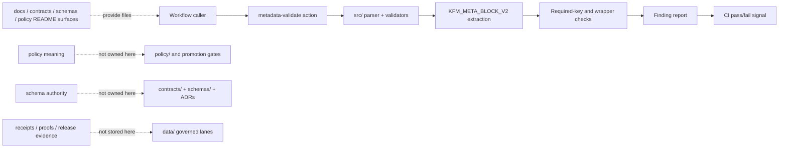

<!-- [KFM_META_BLOCK_V2]
doc_id: kfm://doc/NEEDS-VERIFICATION
title: metadata-validate/src
type: standard
version: v1
status: draft
owners: @bartytime4life
created: NEEDS-VERIFICATION
updated: NEEDS-VERIFICATION
policy_label: public
related: [
  ../README.md,
  ../action.yml,
  ../../README.md,
  ../../../README.md,
  ../../../workflows/README.md,
  ../../../CODEOWNERS,
  ../../../PULL_REQUEST_TEMPLATE.md,
  ../../../../README.md,
  ../../../../docs/README.md,
  ../../../../docs/standards/KFM_MARKDOWN_WORK_PROTOCOL.md,
  ../../../../tools/docs/README.md,
  ../../../../contracts/README.md,
  ../../../../schemas/README.md,
  ../../../../policy/README.md,
  ../../../../tests/README.md
]
tags: [kfm, github-actions, metadata, validation, documentation, ci]
notes: [
  "Target file requested by user: .github/actions/metadata-validate/src/README.md.",
  "Parent .github/actions evidence shows metadata-validate as a placeholder-heavy repo-local action seam; this src child should be verified in the active checkout before claims are upgraded.",
  "This README treats metadata validation as structural and review-supporting, not as policy, schema, release, or semantic truth authority.",
  "doc_id, created date, updated date, parent action.yml presence, implementation language, and workflow callers remain NEEDS VERIFICATION."
]
[/KFM_META_BLOCK_V2] -->

<a id="top"></a>

# `metadata-validate/src`

Source boundary for the repo-local **metadata validation action** that checks KFM documentation metadata structure without becoming metadata truth authority.

<div align="left">


</div>

> [!IMPORTANT]
> **Status:** experimental  
> **Owners:** `@bartytime4life`  
> **Path:** `.github/actions/metadata-validate/src/README.md`  
> **Repo fit:** source-code child of [`../README.md`](../README.md), inside the repo-local action surface documented by [`../../README.md`](../../README.md), downstream of [`.github`](../../../README.md), and adjacent to workflow orchestration in [`../../../workflows/README.md`](../../../workflows/README.md).  
> **Quick jumps:** [Scope](#scope) · [Repo fit](#repo-fit) · [Accepted inputs](#accepted-inputs) · [Exclusions](#exclusions) · [Directory tree](#directory-tree) · [Quickstart](#quickstart) · [Usage](#usage) · [Diagram](#diagram) · [Reference tables](#reference-tables) · [Task list](#task-list--definition-of-done) · [FAQ](#faq) · [Appendix](#appendix)

> [!NOTE]
> This source directory should validate **metadata structure and reporting shape**. It should not decide whether a document’s owner, date, policy label, evidence claim, release posture, or governance meaning is true.

---

## Scope

`metadata-validate/src/` is the action-local implementation seam for KFM metadata checks.

Its first responsibility is narrow:

1. discover the files handed to the parent action,
2. extract KFM documentation metadata blocks,
3. validate required block shape and required keys,
4. emit reviewable findings,
5. return a clear pass/fail result to the caller.

This lane supports documentation hygiene. It does **not** promote documents, settle canon, validate policy meaning, or certify evidence.

[Back to top](#top)

---

## Repo fit

| Surface | Relationship | Status |
|---|---|---|
| [`../README.md`](../README.md) | Parent action contract and human-facing usage surface | **NEEDS VERIFICATION** for current body |
| `../action.yml` | Expected GitHub Action metadata entrypoint | **NEEDS VERIFICATION** |
| [`../../README.md`](../../README.md) | Parent `.github/actions/` directory contract | **CONFIRMED by retrieved project docs; verify in active checkout** |
| [`../../../workflows/README.md`](../../../workflows/README.md) | Workflow orchestration and caller context | **NEEDS VERIFICATION** |
| [`../../../../tools/docs/README.md`](../../../../tools/docs/README.md) | Broader documentation tooling lane | **RELATED** |
| [`../../../../docs/standards/KFM_MARKDOWN_WORK_PROTOCOL.md`](../../../../docs/standards/KFM_MARKDOWN_WORK_PROTOCOL.md) | Normative Markdown authoring protocol, if present | **NEEDS VERIFICATION** |
| [`../../../../contracts/README.md`](../../../../contracts/README.md) and [`../../../../schemas/README.md`](../../../../schemas/README.md) | Contract/schema authority surfaces this action may reference but must not replace | **BOUNDARY** |
| [`../../../../policy/README.md`](../../../../policy/README.md) | Policy-as-code and policy meaning authority | **BOUNDARY** |
| [`../../../../tests/README.md`](../../../../tests/README.md) | Test and fixture ownership surface | **RELATED** |

### Boundary rule

Repo-local action source can package reusable workflow step logic. Canonical policy, schema, release, evidence, and review authority must remain in their owning lanes.

[Back to top](#top)

---

## Accepted inputs

Material belongs in this directory when it is action-local source code for metadata validation.

| Input | Belongs here? | Notes |
|---|---:|---|
| Parser for `KFM_META_BLOCK_V2` blocks | Yes | Structural parser only; no semantic authority claims. |
| Required-key validator | Yes | Should check presence and basic shape of `doc_id`, `title`, `type`, `version`, `status`, `owners`, `created`, `updated`, `policy_label`, `related`, `tags`, and `notes`. |
| Finding/report formatter | Yes | Should emit consistent review-facing output for CI. |
| Small action-local helpers | Yes | Keep narrow, deterministic, and testable. |
| Fixtures colocated only for action-local smoke behavior | Conditional | Prefer test fixtures under `tests/` unless the parent action convention requires action-local fixtures. |
| Documentation explaining source boundaries | Yes | This README is the directory contract. |

[Back to top](#top)

---

## Exclusions

| Do not put here | Why | Better home |
|---|---|---|
| Canonical metadata doctrine | Keeps source code from becoming policy prose | `docs/standards/`, `docs/doctrine/`, or repo-native equivalent |
| Schema authority decisions | Avoids silently settling `contracts/` vs `schemas/` ambiguity | `contracts/README.md`, `schemas/README.md`, ADRs |
| Policy meaning or release rules | Metadata validation is not promotion authority | `policy/`, `tools/validators/`, promotion gate docs |
| Workflow orchestration | This directory is a source seam, not a caller lane | `.github/workflows/` |
| Durable receipts, proofs, or release evidence | Action output is not sovereign evidence storage | `data/receipts/`, `data/proofs/`, `data/published/`, or governed release lanes |
| Secrets, tokens, or long-lived credentials | Source directories must not become secret stores | GitHub environments or external secret management |
| Broad docs tooling not specific to this action | Prevents duplicate tooling authority | `tools/docs/` |
| Semantic truth certification | Owners, dates, labels, and claims require governance evidence | Review process, source ledger, CODEOWNERS, ADRs |

[Back to top](#top)

---

## Directory tree

### Active checkout snapshot

```text
.github/actions/metadata-validate/src/
└── README.md
```

**NEEDS VERIFICATION:** The active checkout should be inspected before adding stronger claims about source filenames, runtime language, tests, or parent `action.yml`.

### Proposed implementation shape

```text
.github/actions/metadata-validate/
├── action.yml
├── README.md
├── src/
│   ├── README.md
│   ├── index.*                  # parent action entrypoint; extension depends on repo convention
│   ├── meta_block.*             # parser / extractor
│   ├── validate_required_keys.* # structural checks
│   └── report.*                 # findings and summary output
└── tests/
    └── fixtures/                # only if action-local tests are the established convention
```

> [!TIP]
> Keep this action small. If validation grows into broader documentation linting, graduate shared logic to `tools/docs/` and leave this action as a thin wrapper.

[Back to top](#top)

---

## Quickstart

### 1. Inspect before claiming implementation depth

```bash
# From repo root
find .github/actions/metadata-validate -maxdepth 3 -type f | sort

# Confirm action metadata exists and is non-empty
test -s .github/actions/metadata-validate/action.yml && \
  sed -n '1,220p' .github/actions/metadata-validate/action.yml

# Check for callers
grep -R "uses: ./.github/actions/metadata-validate" -n .github/workflows 2>/dev/null || true
```

### 2. Check this README’s own metadata block

```bash
# Structural smoke check; replace with repo-native docs checker when available.
python tools/docs/check_doc_structure.py \
  .github/actions/metadata-validate/src/README.md \
  --root . \
  --output doc-structure-report.json
```

### 3. Run action-local tests only after verifying their path

```bash
# Example only; keep as NEEDS VERIFICATION until tests are present.
pytest -q tests/github_actions/metadata_validate 2>/dev/null || \
pytest -q .github/actions/metadata-validate/tests 2>/dev/null || true
```

[Back to top](#top)

---

## Usage

This directory is normally not called directly. Workflows should call the parent action.

```yaml
# Illustrative caller shape — verify parent action.yml before use.
- name: Validate KFM metadata blocks
  uses: ./.github/actions/metadata-validate
  with:
    paths: |
      README.md
      docs/**/*.md
      contracts/**/*.md
      schemas/**/*.md
      policy/**/*.md
      .github/**/*.md
```

The action source should produce reviewable findings, not hidden side effects.

```json
{
  "ok": false,
  "tool": "metadata-validate",
  "findings": [
    {
      "file": "docs/example.md",
      "code": "metadata.required_key_missing",
      "severity": "error",
      "message": "KFM_META_BLOCK_V2 is missing required key: policy_label"
    }
  ]
}
```

**PROPOSED output rule:** prefer deterministic JSON output plus a concise GitHub Step Summary when called from workflow YAML.

[Back to top](#top)

---

## Diagram



[Back to top](#top)

---

## Reference tables

### Validation responsibility matrix

| Check | Default treatment | Truth label |
|---|---|---|
| Metadata block wrapper exists | Blocking for standard docs | **PROPOSED** |
| Required keys exist | Blocking for governed README/standard docs | **PROPOSED** |
| Exactly one H1 | Blocking if parent docs standard says so | **PROPOSED** |
| Quick jumps present for README-like docs | Blocking or warning depending on rollout | **PROPOSED** |
| Relative links resolve | Prefer blocking for changed files | **PROPOSED** |
| Placeholder leakage | Warning by default; blocking for published docs | **PROPOSED** |
| Owner value is correct | Do not decide here | **OUT OF SCOPE** |
| Policy label is appropriate | Do not decide here | **OUT OF SCOPE** |
| Evidence claim is supported | Do not decide here | **OUT OF SCOPE** |
| Release/promote decision | Never decide here | **OUT OF SCOPE** |

### Required metadata keys

| Key | Structural expectation | Semantic owner |
|---|---|---|
| `doc_id` | Present; reviewable placeholder allowed when unassigned | Documentation registry / canon process |
| `title` | Present and aligned with visible document role | Document author / reviewer |
| `type` | Present; usually `standard` for standard docs | Documentation standards |
| `version` | Present | Documentation standards |
| `status` | Present | Documentation standards / reviewers |
| `owners` | Present | CODEOWNERS / governance records |
| `created` | Present; placeholder allowed if not verified | Git history / governance records |
| `updated` | Present; placeholder allowed if not verified | Git history / governance records |
| `policy_label` | Present | Policy/governance lane |
| `related` | Present list-like value | Maintainer / reviewer |
| `tags` | Present list-like value | Maintainer / reviewer |
| `notes` | Present list-like value | Maintainer / reviewer |

### Implementation posture

| Claim | Current README stance |
|---|---|
| Parent action exists | **NEEDS VERIFICATION in active checkout** |
| `src/` implementation exists beyond this README | **UNKNOWN** |
| Runtime language | **UNKNOWN** |
| Workflow callers | **UNKNOWN** |
| Merge-blocking status | **UNKNOWN** |
| Structural metadata validation role | **PROPOSED** |
| Semantic truth certification role | **EXCLUDED** |

[Back to top](#top)

---

## Task list / definition of done

### This README is done enough when

- [ ] The active checkout confirms whether `../action.yml` exists and is non-empty.
- [ ] Parent action README links to this source README.
- [ ] Source filenames listed in the directory tree match actual files.
- [ ] Runtime language and package/test commands are confirmed.
- [ ] Workflow callers are inventoried or explicitly marked absent.
- [ ] The action emits deterministic findings.
- [ ] The action distinguishes structural metadata failures from semantic governance review.
- [ ] Tests cover valid, missing-block, missing-key, malformed-block, and placeholder cases.
- [ ] The action does not store secrets, receipts, proofs, or release artifacts.
- [ ] Parent workflows keep permissions least-privilege and read-only unless a separate action truly needs write access.

### Graduation gates for the action source

- [ ] **Gate 1 — Inventory:** action source, parent action metadata, and callers are confirmed.
- [ ] **Gate 2 — Contract:** input and output fields are documented in parent action README.
- [ ] **Gate 3 — Tests:** valid and invalid fixtures exercise every finding code.
- [ ] **Gate 4 — CI:** workflow caller runs the action against a bounded target set.
- [ ] **Gate 5 — Review:** failures are readable by maintainers without inspecting source code.
- [ ] **Gate 6 — Boundary:** no policy/schema/release authority is hidden inside action source.

[Back to top](#top)

---

## FAQ

### Does this action decide whether metadata values are true?

No. It should decide whether metadata is present, shaped correctly, and reviewable. Truth of owners, dates, status, policy label, related links, and claims requires governance evidence.

### Should this source directory own the `KFM_META_BLOCK_V2` standard?

No. It may implement checks for the standard. The standard itself belongs in documentation standards or another repo-approved authority surface.

### Can the action fail CI?

Yes, if the calling workflow configures it as blocking. Even then, the failure should be for structural violations, not semantic disputes.

### Can this action validate JSON schemas?

Only if the parent action explicitly scopes that behavior. General schema validation belongs in schema/contract validators, not hidden in metadata action source.

### What is the easiest way for this directory to go wrong?

It goes wrong when a small action wrapper becomes the only place where metadata policy, schema authority, or publication rules are defined.

### Why keep placeholders visible?

Because KFM prefers honest reviewable gaps over polished overclaims. A placeholder is acceptable when it names the exact evidence still needed.

[Back to top](#top)

---

## Appendix

<details>
<summary><strong>Appendix A — Safe finding-code starter set</strong></summary>

| Code | Meaning |
|---|---|
| `metadata.block_missing` | No `KFM_META_BLOCK_V2` wrapper found. |
| `metadata.block_duplicate` | More than one top-level metadata block found. |
| `metadata.block_malformed` | Wrapper found but cannot be parsed consistently. |
| `metadata.required_key_missing` | Required key absent. |
| `metadata.placeholder_present` | Placeholder present where caller treats placeholders as warnings or errors. |
| `metadata.related_link_unresolved` | Related path is link-like but cannot be resolved. |
| `metadata.title_h1_mismatch` | Optional check: block title and visible title drift. |

</details>

<details>
<summary><strong>Appendix B — Local inspection checklist</strong></summary>

```bash
# Confirm this README path
test -f .github/actions/metadata-validate/src/README.md

# Confirm parent surfaces
for f in \
  .github/actions/metadata-validate/README.md \
  .github/actions/metadata-validate/action.yml \
  .github/actions/README.md \
  .github/workflows/README.md \
  .github/CODEOWNERS
do
  test -f "$f" && echo "FOUND $f" || echo "MISSING $f"
done

# Confirm action callers
grep -R "metadata-validate" -n .github/workflows .github/actions 2>/dev/null || true
```

</details>

<details>
<summary><strong>Appendix C — Review note for maintainers</strong></summary>

Before upgrading any **UNKNOWN** or **NEEDS VERIFICATION** statement in this README, collect at least one of:

- active checkout file presence,
- parent `action.yml` content,
- workflow caller evidence,
- test fixture evidence,
- CI run output,
- CODEOWNERS or governance record,
- documentation standard that defines the metadata contract.

Do not upgrade a claim because the intended architecture is plausible.

</details>
