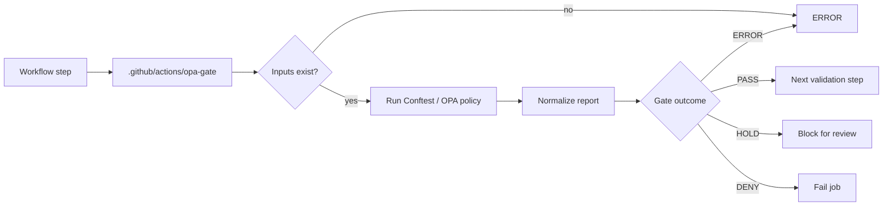

<!-- [KFM_META_BLOCK_V2]
doc_id: kfm://doc/TODO
title: KFM OPA Gate Action
type: standard
version: v1
status: draft
owners: TODO: owner not verified
created: TODO: YYYY-MM-DD
updated: TODO: YYYY-MM-DD
policy_label: TODO: public|restricted|...
related: [TODO: .github/workflows/, policy/, tools/validators/]
tags: [kfm, github-actions, opa, conftest, policy-gate]
notes: [Target path and implementation are PROPOSED until verified in a mounted KFM repository.]
[/KFM_META_BLOCK_V2] -->

# KFM OPA Gate Action

Reusable local GitHub Action for fail-closed OPA/Conftest policy checks over KFM trust-bearing inputs.

> [!NOTE]
> **Status:** `draft`  
> **Owners:** `TODO: owner not verified`  
> **Authority:** `PROPOSED`  
> **Repo fit:** `.github/actions/opa-gate/README.md`  
> **Review burden:** CI/platform maintainers review action behavior; policy stewards review gate semantics; affected domain stewards review domain-specific policies.


## Quick links

- [Purpose](#purpose)
- [Repo fit](#repo-fit)
- [What this action gates](#what-this-action-gates)
- [Accepted inputs](#accepted-inputs)
- [Produced outputs](#produced-outputs)
- [Gate outcomes](#gate-outcomes)
- [Usage](#usage)
- [Policy expectations](#policy-expectations)
- [Security posture](#security-posture)
- [Exclusions](#exclusions)
- [Definition of done](#definition-of-done)
- [Validation](#validation)
- [Rollback](#rollback)
- [Open verification](#open-verification)

## Purpose

`opa-gate` is the local action wrapper for KFM policy-as-code checks. It should evaluate structured KFM inputs against Rego policy packs and return a finite, auditable gate result.

Use this action when a workflow needs to ask:

> “Does this proposed manifest, receipt, source descriptor, release candidate, runtime envelope, or generated artifact pass the repo’s declared policy gates?”

This action is a **gate helper**, not a publication authority.

## Repo fit

| Item | Decision |
| --- | --- |
| Target path | `.github/actions/opa-gate/README.md` |
| Owning root | `.github/` |
| Target type | README-like document for a local GitHub Action |
| Path status | `PROPOSED` until a mounted repo proves the action directory exists |
| Upstream callers | `.github/workflows/*.yml`, reusable workflows, release dry-runs, validation jobs |
| Upstream policy homes | `policy/`, or another repo-approved policy home |
| Upstream target homes | `schemas/`, `contracts/`, `data/registry/`, `release/`, `runtime/`, generated candidate artifacts |
| Downstream outputs | Workflow result, job summary, optional machine-readable gate report |
| Not downstream of | Public UI, direct model runtime, RAW/WORK/QUARANTINE data, unpublished source material |

Directory basis: `.github/` is a repo-wide CI and orchestration root. This path does not create a domain root, schema home, source registry, release home, or proof home.

## What this action gates

Typical targets include structured files such as:

| Target family | Example target | Gate reason |
| --- | --- | --- |
| Source admission | `data/registry/sources/<domain>/*.yaml` | Source role, rights, sensitivity, and update cadence must be explicit. |
| Release candidate | `release/candidates/<domain>/*.json` | Promotion must have policy, evidence, review, rollback, and manifest support. |
| Runtime envelope | `runtime/**/runtime_response_envelope*.json` | Public responses must use finite outcomes and cite support when claims depend on evidence. |
| Evidence bundle | `data/catalog/**/evidence_bundle*.json` | Evidence references must resolve before public claims are allowed. |
| Layer manifest | `data/published/layers/**/*.json` | Public map layers must be released, source-linked, sensitivity-checked, and rollback-capable. |
| CI receipt | `data/receipts/**/*.json` | Receipts must not silently become proof or publication authority. |

> [!IMPORTANT]
> A passing policy gate does not publish anything. Promotion remains a governed state transition with validation, policy, review, release manifest, correction path, and rollback target.

## Accepted inputs

The `action.yml` file should keep these names synchronized with this README.

| Input | Required | Default | Purpose |
| --- | --- | --- | --- |
| `target` | yes | none | File or directory to evaluate. |
| `policy` | yes | `policy` | Rego policy directory. |
| `namespace` | no | `main` | Conftest namespace to evaluate. |
| `all-namespaces` | no | `false` | Evaluate all namespaces when repo policy requires it. |
| `data` | no | none | Additional data path for policy evaluation, such as a source-authority register. |
| `output` | no | `json` | Conftest output format requested by the workflow. |
| `report-path` | no | `${{ runner.temp }}/opa-gate-result.json` | Machine-readable report path. |
| `working-directory` | no | `.` | Directory where the gate should run. |
| `conftest-version` | no | `TODO: pin version in action.yml` | Conftest version to install or verify. |

Input rules:

- `target` and `policy` must exist before evaluation.
- The action must not fetch live source data.
- The action must not require secrets for normal policy evaluation.
- The action must fail closed when input, policy, tool installation, or report generation is missing.
- The workflow, not this README, decides whether reports are uploaded as CI artifacts or copied into a governed receipt lane.

## Produced outputs

| Output | Values | Purpose |
| --- | --- | --- |
| `gate-outcome` | `PASS`, `HOLD`, `DENY`, `ERROR` | Finite result for workflow branching and summaries. |
| `report-path` | path | Location of the machine-readable gate report. |
| `failure-count` | integer | Count of deny/violation failures detected. |
| `warning-count` | integer | Count of warnings detected. |
| `exception-count` | integer | Count of tool or policy exceptions detected. |
| `summary` | string | Short human-readable result for job summaries. |

## Gate outcomes

| Outcome | Meaning | Workflow behavior |
| --- | --- | --- |
| `PASS` | Policy evaluation completed and no blocking rule fired. | Continue to the next validation step. |
| `HOLD` | Policy evaluation found review-required conditions. | Block automation unless a later reviewed workflow explicitly resolves the hold. |
| `DENY` | Policy evaluation found one or more blocking violations. | Fail the job. |
| `ERROR` | The gate could not evaluate reliably. Examples: missing target, missing policy, tool failure, malformed report. | Fail the job. |

`HOLD`, `DENY`, and `ERROR` are non-publication outcomes. None should advance a candidate to release.

## Usage

### Trusted internal workflow example

Use this pattern only where the workflow is not executing untrusted pull-request code with elevated permissions.

```yaml
name: KFM OPA Gate

on:
  pull_request:
    branches: [main]
  workflow_dispatch: {}

permissions:
  contents: read

jobs:
  opa-gate:
    runs-on: ubuntu-latest

    steps:
      - name: Checkout repository
        uses: actions/checkout@v4
        with:
          persist-credentials: false

      - name: Run KFM OPA gate
        uses: ./.github/actions/opa-gate
        with:
          target: release/candidates/example/release_manifest.json
          policy: policy
          namespace: data.kfm.release
          output: json
          report-path: ${{ runner.temp }}/opa-gate-result.json
```

### Local check example

```bash
conftest test release/candidates/example/release_manifest.json \
  --policy policy \
  --namespace data.kfm.release \
  --output json
```

### Policy unit-test example

```bash
conftest verify --policy policy
```

## Policy expectations

Policy packs should be readable, testable, and KFM-specific.

A policy should prefer structured reason codes over vague messages:

```rego
package data.kfm.release

violation contains {
  "code": "KFM_RELEASE_MISSING_ROLLBACK",
  "message": "Release candidate must include a rollback target.",
  "severity": "deny",
  "surface": "release",
} if {
  not input.rollback_target
}
```

Policy packs should check for KFM trust obligations such as:

- required source descriptors
- evidence closure
- source-role validity
- sensitivity and public-safety state
- release manifest completeness
- correction and rollback targets
- finite response outcomes
- absence of RAW/WORK/QUARANTINE public exposure
- absence of direct model-runtime publication
- stable hashes or version identifiers when required

## Security posture

> [!IMPORTANT]
> Do not run untrusted pull-request code in a privileged workflow just to evaluate policy. Treat PR content, generated manifests, and workflow-provided strings as untrusted input until the gate and review process says otherwise.

The action should follow these defaults:

| Control | Required posture |
| --- | --- |
| Token permissions | Start with `contents: read`; add permissions only when the calling workflow proves a need. |
| Secrets | Do not require secrets for normal policy checks. |
| Network | Do not require network access for policy evaluation after dependencies are installed. |
| PR context | Prefer unprivileged `pull_request` checks for untrusted PRs. |
| Privileged triggers | Avoid `pull_request_target` for untrusted code. If a privileged trigger is unavoidable, do not checkout or execute untrusted code. |
| Third-party actions | Pin third-party actions or setup steps according to repo security policy. |
| Reports | Do not put secrets, tokens, raw source content, precise sensitive locations, or living-person/DNA details into gate reports. |
| Failure mode | Missing tool, missing target, missing policy, malformed policy, or malformed report is `ERROR`, not `PASS`. |

## Exclusions

This action does **not**:

- publish artifacts
- sign artifacts
- upload to Rekor or any external transparency log
- decide source rights by itself
- perform steward review
- create release manifests
- create rollback cards
- validate JSON Schema unless the workflow explicitly calls a schema validator
- replace domain validators under `tools/validators/`
- read from `data/raw/`, `data/work/`, or `data/quarantine/` for public outputs
- expose direct model runtime outputs
- make EvidenceBundle content authoritative without separate evidence resolution

Excluded work belongs in the appropriate responsibility root:

| Excluded work | Preferred home |
| --- | --- |
| Human policy rationale | `docs/` or `policy/README.md` |
| Executable policies | `policy/` |
| Machine schemas | `schemas/` |
| Semantic contracts | `contracts/` |
| Domain validators | `tools/validators/` |
| Fixtures | `fixtures/` |
| Release manifests | `release/` |
| Operational receipts | `data/receipts/` |
| Proof packs | `data/proofs/` |

## Operational flow



## Definition of done

This README is ready to mark `active` only when the repository verifies all of the following:

- [ ] `.github/actions/opa-gate/action.yml` or `action.yaml` exists.
- [ ] `action.yml` input and output names match this README.
- [ ] The action pins or verifies its Conftest/OPA tool version.
- [ ] At least one PASS fixture and one DENY fixture exist.
- [ ] At least one ERROR path is tested, such as missing `target`.
- [ ] Policy unit tests are present for the default policy namespace.
- [ ] A workflow calls the local action without broad token permissions.
- [ ] Gate reports avoid secrets and sensitive raw content.
- [ ] `HOLD`, if implemented, blocks automation by default.
- [ ] Rollback is documented for disabling the action or reverting workflow callers.
- [ ] Owners are verified.

## Validation

Run only commands supported by the mounted repository.

Suggested checks after implementation:

```bash
git diff --check
find .github/actions/opa-gate -maxdepth 3 -type f | sort
sed -n '1,260p' .github/actions/opa-gate/README.md
sed -n '1,240p' .github/actions/opa-gate/action.yml
conftest verify --policy policy
conftest test <target> --policy policy --namespace <namespace> --output json
```

If the repository has a native CI wrapper, prefer that wrapper.

## Rollback

To disable this action safely:

1. Remove or disable workflow steps that call `./.github/actions/opa-gate`.
2. Re-run CI to confirm no required workflow still references the action.
3. Revert `.github/actions/opa-gate/` only after callers are removed or migrated.
4. Preserve any prior gate reports, release decisions, receipts, and review records according to the repo’s retention policy.

Do not delete policy history, release history, proof packs, or rollback cards to “clean up” a failed gate.

## Open verification

| Item | Status | Required check |
| --- | --- | --- |
| Owner | `UNKNOWN` | Confirm CI/platform owner and policy steward owner. |
| `action.yml` existence | `UNKNOWN` | Inspect mounted repo. |
| Default policy path | `NEEDS VERIFICATION` | Confirm whether `policy/` is canonical for executable policy. |
| Conftest/OPA version | `NEEDS VERIFICATION` | Pin in action metadata or dependency setup. |
| Gate report schema | `PROPOSED` | Confirm or create machine schema for gate reports. |
| HOLD semantics | `PROPOSED` | Decide whether review-required policy results use `HOLD` or `DENY` with obligations. |
| Workflow trigger model | `NEEDS VERIFICATION` | Confirm trusted vs untrusted PR posture before enabling privileged triggers. |
| Receipt storage | `NEEDS VERIFICATION` | Decide whether CI gate reports are ephemeral artifacts, `data/receipts/` entries, or both. |
