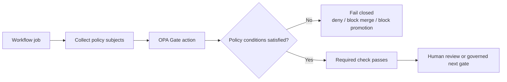

<!-- [KFM_META_BLOCK_V2]
doc_id: kfm://doc/TODO-UUID-NEEDS-VERIFICATION
title: OPA Gate Action
type: standard
version: v1
status: draft
owners: TODO-NEEDS-VERIFICATION
created: TODO-NEEDS-VERIFICATION
updated: TODO-NEEDS-VERIFICATION
policy_label: TODO-NEEDS-VERIFICATION
related: [.github/actions/opa-gate/, ../../workflows/]
tags: [kfm, ci, policy, opa, conftest]
notes: [Exact action contract, owners, dates, and workflow links need direct repo verification.]
[/KFM_META_BLOCK_V2] -->

# OPA Gate Action

Fail-closed policy evaluation for governed review and promotion lanes in Kansas Frontier Matrix.

> **Status:** draft · exact mounted action contract **NEEDS VERIFICATION**  
> **Owners:** TODO / NEEDS VERIFICATION  
>      
> **Quick jumps:** [Scope](#scope) · [Repo fit](#repo-fit) · [Inputs](#inputs) · [Quickstart](#quickstart) · [Usage](#usage) · [Diagram](#diagram) · [Task list](#task-list) · [FAQ](#faq)

> [!WARNING]
> The current session did **not** surface the mounted `action.yml`, helper scripts, tests, or calling workflows for this directory. This README is therefore grounded in KFM doctrine and the target path name, while exact inputs, outputs, and local file inventory are marked **NEEDS VERIFICATION**.

## Scope

This directory is intended to hold the GitHub Action that turns KFM’s policy posture into a merge-blocking CI gate.

In KFM doctrine, policy is not decorative. Promotion is a governed state transition supported by typed artifacts, proofs, and negative-path behavior rather than an informal copy, toggle, or best-effort pass. An OPA gate in this directory should therefore serve one narrow job:

- evaluate machine-readable policy subjects,
- fail closed when required evidence or policy conditions are missing,
- return a reviewable result to the calling workflow,
- stop short of signing, publishing, merging, or silently “fixing” anything.

### Status legend used in this README

| Label | Meaning here |
|---|---|
| **CONFIRMED** | Grounded in attached KFM doctrine and source corpus. |
| **INFERRED** | Strongly implied by KFM doctrine and the target directory role, but not directly verified in mounted repo files. |
| **PROPOSED** | Recommended repo shape or action behavior that fits KFM doctrine but is not yet verified in implementation. |
| **NEEDS VERIFICATION** | Exact file, input, output, or wiring not surfaced in the current session. |

## Repo fit

**Path:** `.github/actions/opa-gate/README.md`

**Likely upstream callers:** [`../../workflows/`](../../workflows/) — **NEEDS VERIFICATION**

**Likely downstream consequences:** review gating, promotion eligibility, receipt/proof checks, and policy-visible failure reporting — exact paths **NEEDS VERIFICATION**

### Why this directory matters in KFM

KFM doctrine repeatedly emphasizes:

- typed contract families instead of free-form gating,
- visible reason/obligation outcomes instead of silent denials,
- policy-bearing review and promotion,
- evidence-linked negative outcomes as first-class behavior.

That makes an `opa-gate` directory a natural home for a reusable CI control point that can be called from multiple workflows without duplicating policy runner logic.

## Inputs

### Accepted inputs

The gate should accept machine-readable policy subjects that are already part of KFM’s trust path or proof surface.

| Input family | What belongs here | Status |
|---|---|---|
| Policy subject files | JSON/YAML manifests, receipts, catalog records, or envelope-like artifacts submitted for policy evaluation | **CONFIRMED** doctrinally, exact filenames **NEEDS VERIFICATION** |
| Policy bundle root | Rego policies, data bundles, or equivalent policy assets | **INFERRED** |
| Execution options | Runner-specific arguments such as namespace, format, strictness, or rego version | **INFERRED** |
| Context metadata | PR/run metadata needed to report a reviewable pass/fail outcome | **INFERRED** |

### Illustrative subject set

The exact mounted set is **NEEDS VERIFICATION**, but KFM doctrine makes these especially relevant candidates:

- `run_manifest.json`
- `run_receipt.json`
- `prov.json`
- `release_manifest.json`
- `catalog_closure.json`
- `evidence_bundle.json`
- `runtime_response_envelope.json`

> [!NOTE]
> The filenames above are **illustrative KFM-aligned examples**, not claims that those exact files already exist in this repository.

## Exclusions

This directory should **not** become a catch-all for unrelated governance work.

| Excluded concern | Where it should live instead |
|---|---|
| Artifact signing / attestation creation | Signing or provenance lanes, not the policy gate itself |
| Schema authoring | Contract and schema directories |
| Human approval records | Review / stewardship lanes and proof objects |
| Runtime public-policy enforcement | Governed API / runtime policy surfaces |
| Data repair or mutation | Ingest, transform, or correction workflows |
| Auto-merge / auto-publish behavior | Promotion lanes after all required gates and review steps |

## Directory tree

The mounted directory contents were **not** surfaced in the current session. This is the smallest reviewable placeholder tree for a README-like directory doc.

```text
.github/actions/opa-gate/
├── README.md
├── action.yml                    # NEEDS VERIFICATION
├── <wrapper script(s)>           # NEEDS VERIFICATION
├── <example inputs or fixtures>  # NEEDS VERIFICATION
└── <tests or smoke checks>       # NEEDS VERIFICATION
```

## Quickstart

### GitHub Actions usage

The exact input contract is **NEEDS VERIFICATION**. The example below is illustrative and should be reconciled against the mounted `action.yml`.

```yaml
# Illustrative example — update to match the mounted action contract.
- name: Policy gate
  uses: ./.github/actions/opa-gate
  with:
    policy-root: policy/
    subject-files: |
      mcp/run_receipts/run_manifest.json
      data/catalog/stac/collection.json
      data/catalog/prov/prov.json
```

### Local equivalent

If this action wraps Conftest or a similar OPA runner, the local troubleshooting path will likely resemble:

```bash
# Illustrative local equivalent — exact command shape NEEDS VERIFICATION
conftest test mcp/run_receipts/run_manifest.json -p policy/
```

### Exit behavior

A useful contract for this action is simple:

- `0` → policy gate passed
- non-zero → policy gate denied or execution failed
- annotations / log summary → **NEEDS VERIFICATION**
- uploaded evidence or receipt links → **NEEDS VERIFICATION**

## Usage

### What the gate should enforce

In KFM, a pass should mean more than “the YAML parsed.” The gate should be capable of blocking work when core trust conditions fail.

| Concern | Expected gate behavior | Evidence posture |
|---|---|---|
| Missing required proof artifacts | Deny | **CONFIRMED** doctrinal need |
| Missing or invalid rights / sensitivity posture | Deny | **CONFIRMED** doctrinal need |
| Missing or inconsistent catalog / provenance closure | Deny | **CONFIRMED** doctrinal need |
| Missing review-bearing reason / obligation outputs where policy requires them | Deny | **INFERRED** |
| Unsurfaced negative-path behavior | Deny or mark incomplete | **CONFIRMED** as a trust requirement |
| Unverified branch from illustrative examples | Do not claim supported | **CONFIRMED** session boundary |

### What “good” looks like

A strong `opa-gate` action in KFM will usually be:

- reusable across PR and promotion workflows,
- explicit about what policy bundle it executed,
- deterministic in its pass/fail outcome,
- able to emit reviewable deny reasons,
- narrow in scope, so it cannot quietly become a second orchestrator.

### What it should not silently do

- mutate artifacts,
- sign manifests,
- create releases,
- merge PRs,
- replace human review,
- hide denial causes behind generic CI failure text.

## Diagram



## Tables

### KFM object families most relevant to this action

| Object family | Why the gate cares |
|---|---|
| `DecisionEnvelope` | Machine-readable policy result and obligation surface |
| `ReleaseManifest` / `ReleaseProofPack` | Promotion readiness and public-safe proof |
| `EvidenceBundle` | Runtime and trust-surface evidence resolution |
| `RuntimeResponseEnvelope` | Negative-path and citation-aware runtime proof |
| `CatalogClosure` | STAC / DCAT / PROV linkage and identifier consistency |
| `ValidationReport` | Schema / semantic validation and quarantine-aware outcomes |

### Boundary profile

| Boundary question | Expected answer |
|---|---|
| Is this a public route? | No. This is a CI / review control surface. |
| Can it become a second truth surface? | It should not. It evaluates policy; it does not replace canonical evidence or review artifacts. |
| Can it approve hidden exceptions? | It should not. KFM review/policy actions must stay visible and auditable. |
| Can it be used outside PR flows? | Likely yes for reusable workflow calls, but exact wiring is **NEEDS VERIFICATION**. |

## Task list

Before calling this README complete against the mounted repository, verify the following:

- [ ] `action.yml` or `action.yaml` is surfaced and this README matches its real input/output contract.
- [ ] The actual policy runner is documented (`opa`, `conftest`, or equivalent).
- [ ] One pass example and one deny example exist and are runnable.
- [ ] The action’s fail-closed exit behavior is tested.
- [ ] Calling workflow(s) and required status-check names are documented.
- [ ] Any kill-switch, strict mode, or version-pinning behavior is documented if implemented.
- [ ] The action does not overstep into signing, publishing, or merge control beyond its stated gate role.
- [ ] Example paths in this README are reconciled to real repository paths.
- [ ] Owners, status, and metadata block values are updated from placeholders.
- [ ] Long-term maintenance note is added if policy bundle versioning is explicit.

### Definition of done

This README is ready to be treated as fully repo-native when:

1. the mounted action manifest is verified,
2. the examples are updated from illustrative to real,
3. at least one workflow caller is linked directly,
4. test or smoke evidence exists for both pass and deny paths,
5. placeholders in the meta block and impact block are retired.

## FAQ

### Is this the only place policy should run in KFM?

No. This action is a CI/review gate. KFM doctrine also expects policy-bearing behavior at review, promotion, runtime, and correction surfaces.

### Does a passing OPA gate mean the artifact is publishable?

Not by itself. KFM doctrine treats promotion as a governed state change supported by typed artifacts, review where required, and proof-bearing outcomes.

### Should this action sign or attest artifacts?

That would be a different concern. This action may verify policy prerequisites around signed receipts or provenance artifacts, but signing itself belongs elsewhere unless the mounted implementation proves otherwise.

### Does this README prove the action already exists and is wired correctly?

No. It documents the directory’s governed role and a reviewable placeholder structure. The exact mounted implementation remains **NEEDS VERIFICATION**.

### Why are there so many “NEEDS VERIFICATION” markers?

Because the current session did not expose the mounted repo tree for this directory. KFM documentation should prefer visible uncertainty over persuasive overclaiming.

## Appendix

<details>
<summary><strong>Illustrative policy subjects and outcomes</strong></summary>

These examples are **illustrative**, not confirmed repository state.

```yaml
subject families:
  - run manifests
  - receipt or proof artifacts
  - STAC / DCAT / PROV closure documents
  - runtime envelope fixtures
  - reason / obligation registries

deny examples:
  - missing required receipt
  - missing rights posture
  - schema/semantic validation failure
  - provenance closure inconsistency
  - unresolved exact-location sensitivity
```

</details>

<details>
<summary><strong>Review checklist for reconciling this README with mounted repo evidence</strong></summary>

- Confirm actual action filename and branding.
- Replace illustrative examples with exact `uses:` and `with:` blocks.
- Link real workflows that call the action.
- Add real local test commands if they exist.
- Add real policy path(s) if they are mounted.
- Replace placeholder owners and metadata fields.
- Decide whether this directory README is the right long-term home for action-level examples or whether examples belong beside tests.

</details>

[Back to top](#opa-gate-action)
