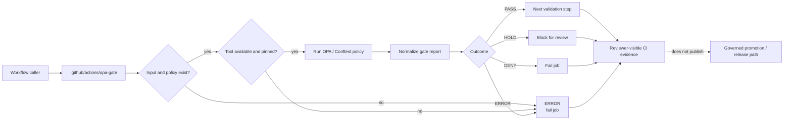

<!-- [KFM_META_BLOCK_V2]
doc_id: kfm://doc/TODO-NEEDS-VERIFICATION
title: KFM OPA Gate Action
type: standard
version: v1
status: draft
owners: NEEDS_VERIFICATION
created: TODO-NEEDS-VERIFICATION
updated: 2026-05-06
policy_label: public
related: [../README.md, ../../README.md, ../../workflows/README.md, ../../../README.md, ../../../policy/README.md, ../../../policies/README.md, ../../../tools/validators/promotion_gate/README.md, TODO: action.yml-or-action.yaml]
tags: [kfm, github-actions, opa, conftest, policy-gate, fail-closed]
notes: [README path confirmed through GitHub connector; action.yml/action.yaml not found in connector check and must be reverified in the active checkout; owners and platform enforcement remain NEEDS VERIFICATION.]
[/KFM_META_BLOCK_V2] -->

<a id="top"></a>

# KFM OPA Gate Action

Repo-local policy-gate README for evaluating KFM trust-bearing inputs with OPA/Conftest-style fail-closed checks.

> [!NOTE]
> **Status:** `experimental` action contract / `draft` README  
> **Owners:** `NEEDS_VERIFICATION`  
> **Repo fit:** `.github/actions/opa-gate/README.md` under the `.github/` gatehouse root  
> **Implementation posture:** README path `CONFIRMED`; action metadata `NEEDS VERIFICATION` because `action.yml` / `action.yaml` was not confirmed in the connector check  
> **Review burden:** CI/platform maintainers, policy stewards, release reviewers, and affected domain stewards should verify action metadata, workflow callers, policy home, fixtures, outcomes, and report handling before enabling this gate as merge-blocking.


**Quick jumps:** [Scope](#scope) · [Repo fit](#repo-fit) · [Current implementation snapshot](#current-implementation-snapshot) · [Accepted inputs](#accepted-inputs) · [Exclusions](#exclusions) · [Proposed action interface](#proposed-action-interface) · [Outcomes](#outcomes) · [Operational flow](#operational-flow) · [Usage](#usage) · [Policy expectations](#policy-expectations) · [Security](#security-and-permissions) · [Gate report](#gate-report-contract) · [Definition of done](#definition-of-done) · [Validation](#validation) · [Rollback](#rollback) · [Open verification](#open-verification)

---

## Scope

`opa-gate` is the repo-local GitHub Action boundary for policy-as-code checks over structured KFM inputs.

It should answer one narrow question:

> Does this target object, manifest, receipt, candidate, response envelope, source descriptor, or released-layer descriptor satisfy the declared KFM policy bundle for the declared gate?

This action is a **gate wrapper**, not policy law.

| Boundary | Rule |
| --- | --- |
| Policy meaning | Owned by `policy/`; `policies/` is compatibility-only unless a later ADR says otherwise. |
| Machine shape | Owned by `schemas/` and schema validators. |
| Object semantics | Owned by `contracts/`. |
| Promotion validation | Owned by validator lanes such as `tools/validators/promotion_gate/`. |
| Workflow orchestration | Owned by `.github/workflows/`. |
| Publication | Owned by governed release/promotion state, not by this action. |

> [!IMPORTANT]
> A passing OPA gate does **not** publish anything. Publication remains a governed state transition with evidence closure, policy posture, review state, release manifest, correction path, and rollback target.

[Back to top](#top)

---

## Repo fit

| Field | Value |
| --- | --- |
| Path | `.github/actions/opa-gate/README.md` |
| Owning root | `.github/` |
| Root responsibility | Repo-wide GitHub automation and review gatehouse |
| Document role | README-like contract for a local action wrapper |
| Current path status | `CONFIRMED` README path through GitHub connector |
| Action metadata status | `NEEDS VERIFICATION`; create or confirm `action.yml` / `action.yaml` before callers rely on it |
| Canonical policy home | `policy/` |
| Compatibility policy root | `policies/` compatibility/transitional only |
| Upstream callers | `.github/workflows/*.yml`, after caller inventory and permission review |
| Upstream decision roots | `policy/`, `contracts/`, `schemas/`, `tools/validators/`, `fixtures/`, `tests/` |
| Downstream evidence | GitHub job summary, gate report JSON, optional CI artifact, optional governed receipt after repo policy says so |
| Not downstream of | Public UI, direct model runtime, RAW/WORK/QUARANTINE data, unpublished candidates, or source-system side effects |

### Upstream / downstream links

| Relation | Relative path | Use |
| --- | --- | --- |
| Parent action lane | [`../README.md`](../README.md) | Local actions are thin wrappers, not hidden authority. |
| GitHub gatehouse | [`../../README.md`](../../README.md) | `.github/` governance, workflows, ownership, templates, and security routing. |
| Workflow lane | [`../../workflows/README.md`](../../workflows/README.md) | Workflow orchestration and caller inventory. |
| Root project posture | [`../../../README.md`](../../../README.md) | KFM trust law, lifecycle, public-client boundary, and object families. |
| Policy root | [`../../../policy/README.md`](../../../policy/README.md) | Canonical policy semantics and finite outcomes. |
| Compatibility root | [`../../../policies/README.md`](../../../policies/README.md) | Compatibility-only plural policy path. |
| Promotion validator | [`../../../tools/validators/promotion_gate/README.md`](../../../tools/validators/promotion_gate/README.md) | Release-facing promotion validation model and fail-closed decision contract. |

> [!NOTE]
> Directory Rules basis: `.github/` is a repo-wide governance and automation root. `opa-gate/` does not create a domain root, schema home, policy home, release home, proof home, source registry, or publication lane.

[Back to top](#top)

---

## Current implementation snapshot

Recheck this table in the active checkout before merging changes.

| Item | Current review status | Consequence |
| --- | --- | --- |
| `.github/actions/opa-gate/README.md` | `CONFIRMED` via GitHub connector | This file is being revised in place. |
| `.github/actions/opa-gate/action.yml` | `NOT FOUND` in connector check | Action implementation is not confirmed. |
| `.github/actions/opa-gate/action.yaml` | `NOT FOUND` in connector check | Action implementation is not confirmed. |
| Checked workflow callers | `NEEDS VERIFICATION` | The inspected workflow files did not confirm a caller; search active checkout before enabling. |
| `.github/CODEOWNERS` | `CONFIRMED` present but empty in connector check | Owner routing remains `NEEDS VERIFICATION`. |
| `.github/PULL_REQUEST_TEMPLATE.md` | `CONFIRMED` present but empty in connector check | Review prompts remain `NEEDS VERIFICATION`. |
| Policy home | `CONFIRMED` ADR decision: `policy/` canonical | Use `policy/`; do not grow `policies/` as a parallel authority. |
| OPA/Conftest tooling | `UNKNOWN` in active runner | Pin or verify before action metadata claims enforcement. |
| Branch protection / required checks | `UNKNOWN` | Do not claim merge-blocking behavior from README text. |

[Back to top](#top)

---

## Accepted inputs

This README covers two related input surfaces: action wrapper inputs and policy target inputs.

### Action wrapper inputs

These are **PROPOSED** until action metadata exists and is synchronized with this README.

| Input | Required | Default | Purpose |
| --- | --- | --- | --- |
| `target` | yes | none | File or directory to evaluate. |
| `policy` | yes | `policy` | Canonical policy directory or policy bundle path. |
| `namespace` | no | `main` | Conftest namespace to evaluate. |
| `all-namespaces` | no | `false` | Evaluate all namespaces where repo policy requires it. |
| `data` | no | none | Additional policy data path, such as a source-authority register. |
| `output` | no | `json` | Conftest/OPA output format requested by the caller. |
| `report-path` | no | `${{ runner.temp }}/opa-gate-result.json` | Machine-readable report destination. |
| `working-directory` | no | `.` | Directory where the gate runs. |
| `conftest-version` | no | `NEEDS_VERIFICATION` | Conftest version to install, pin, or verify. |
| `opa-version` | no | `NEEDS_VERIFICATION` | OPA version to install, pin, or verify when OPA is used directly. |

### Policy target inputs

| Target family | Examples | Why it belongs at this gate |
| --- | --- | --- |
| Source admission | `data/registry/sources/<domain>/*.yaml` | Source role, rights, sensitivity, cadence, and caveats must be explicit. |
| Release candidate | `release/candidates/<domain>/*.json` | Publication readiness must include policy, review, rollback, and manifest support. |
| Runtime response | `runtime/**/runtime_response_envelope*.json` | Public responses must use finite outcomes and citation/evidence support. |
| Evidence bundle | `data/catalog/**/evidence_bundle*.json` | Evidence references must resolve before public claims are allowed. |
| Layer manifest | `data/published/layers/**/*.json` | Public map layers must be released, source-linked, sensitivity-checked, and rollback-capable. |
| Receipt or proof reference | `data/receipts/**/*.json`, `data/proofs/**/*.json` | Receipts and proofs must remain distinct and policy-visible. |
| Correction or rollback object | `release/**/rollback*.json`, `**/correction_notice*.json` | Withdrawal, supersession, and rollback must remain auditable. |

### Input rules

- `target` and `policy` must exist before evaluation.
- The action must not fetch live source data during normal policy evaluation.
- The action must not require secrets for normal policy checks.
- Missing input, missing policy, missing tool, malformed policy, malformed report, or unsupported output is `ERROR`, not `PASS`.
- Workflow callers decide whether reports remain ephemeral CI artifacts or become governed receipts.

[Back to top](#top)

---

## Exclusions

| This action does **not** own | Correct home | Why |
| --- | --- | --- |
| Policy law | `policy/` | Policy remains the decision authority. |
| Compatibility policy content | `policies/` only as documented compatibility | Do not split canonical policy authority. |
| Contract meaning | `contracts/` | Semantic meaning belongs outside action glue. |
| Machine schemas | `schemas/` | Shape validation belongs outside action glue. |
| Full validators | `tools/validators/` | Reusable validation logic should be reviewable outside `.github/actions/`. |
| Workflow orchestration | `.github/workflows/` | Workflows call actions; actions do not own workflow strategy. |
| Source connectors | `connectors/` | Live source access needs rights, source role, cadence, and review handling. |
| Lifecycle data | `data/` | CI actions are not data stores. |
| Release manifests | `release/` | Release state is a governed publication surface. |
| Receipts and proofs | `data/receipts/`, `data/proofs/` | Emitted audit artifacts are not action definitions. |
| Signing / attestation implementation | `tools/attest/` and release tooling | OPA gate may consume attestation status; it should not own signing. |
| Secrets, keys, tokens | GitHub environments, OIDC, or approved secret manager | Never commit credentials into action directories. |
| Public model output | governed runtime/API lanes | AI is interpretive and evidence-subordinate. |
| Publication side effects | governed promotion/release workflows | A gate result is not publication approval. |

[Back to top](#top)

---

## Proposed action interface

Create this only after maintainers confirm the intended local-action implementation.

```yaml
name: kfm-opa-gate
description: Run a fail-closed KFM policy gate over a supplied target.

inputs:
  target:
    description: File or directory to evaluate.
    required: true
  policy:
    description: Canonical policy directory or policy bundle path.
    required: true
    default: policy
  namespace:
    description: Policy namespace to evaluate.
    required: false
    default: main
  all-namespaces:
    description: Evaluate all namespaces instead of one namespace.
    required: false
    default: "false"
  data:
    description: Optional policy data path.
    required: false
  output:
    description: Output format for the policy tool.
    required: false
    default: json
  report-path:
    description: Path to write a normalized KFM gate report.
    required: false
    default: ${{ runner.temp }}/opa-gate-result.json
  working-directory:
    description: Directory where evaluation should run.
    required: false
    default: .
  conftest-version:
    description: Conftest version to install or verify.
    required: false
    default: NEEDS_VERIFICATION
  opa-version:
    description: OPA version to install or verify when used directly.
    required: false
    default: NEEDS_VERIFICATION

outputs:
  gate-outcome:
    description: PASS, HOLD, DENY, or ERROR.
  report-path:
    description: Path to the normalized gate report.
  failure-count:
    description: Count of blocking violations.
  warning-count:
    description: Count of non-blocking warnings.
  exception-count:
    description: Count of tool, parse, or report exceptions.
  summary:
    description: Short reviewer-facing result.

runs:
  using: composite
  steps:
    - name: Evaluate KFM policy
      shell: bash
      run: |
        set -euo pipefail
        echo "Implementation NEEDS VERIFICATION."
        exit 1
```

> [!WARNING]
> The YAML above is an interface sketch. Do not commit it as a working action without installing or verifying the policy tool, writing the report normalizer, adding fixtures, and testing negative paths.

[Back to top](#top)

---

## Outcomes

OPA/Conftest output can be tool-specific. The action should normalize it into KFM gate outcomes.

| Outcome | Meaning | Workflow behavior |
| --- | --- | --- |
| `PASS` | Evaluation completed and no blocking rule fired. | Continue to the next validation step. |
| `HOLD` | Evaluation found review-required or obligation-bearing conditions. | Block automation unless a later reviewed workflow resolves the hold. |
| `DENY` | Evaluation found one or more blocking policy violations. | Fail the job. |
| `ERROR` | The gate could not evaluate reliably. | Fail the job and preserve diagnostics. |

`HOLD`, `DENY`, and `ERROR` are non-publication outcomes. None should advance a candidate to release.

### Outcome mapping

| Raw condition | Normalized outcome |
| --- | --- |
| Tool exit code `0` and no blocking violations | `PASS` |
| Review-required rule present and no hard denial | `HOLD` |
| Deny / violation / blocking failure present | `DENY` |
| Missing target, missing policy, missing tool, parse failure, malformed output, or report write failure | `ERROR` |

[Back to top](#top)

---

## Operational flow



[Back to top](#top)

---

## Usage

### Trusted internal workflow example

Use this only where the workflow is not executing untrusted pull-request code with elevated permissions.

```yaml
name: kfm-opa-gate-example

on:
  pull_request:
    branches: [main]
  workflow_dispatch: {}

permissions:
  contents: read

jobs:
  opa-gate:
    runs-on: ubuntu-latest
    timeout-minutes: 20

    steps:
      - name: Check out repository
        uses: actions/checkout@v4
        with:
          persist-credentials: false

      - name: Run KFM OPA gate
        uses: ./.github/actions/opa-gate
        with:
          target: release/candidates/example/release_manifest.json
          policy: policy
          namespace: data.kfm.release
          output: json
          report-path: ${{ runner.temp }}/opa-gate-result.json
```

### Local check example

Run only after `conftest` is installed and the policy path is confirmed.

```bash
conftest test release/candidates/example/release_manifest.json \
  --policy policy \
  --namespace data.kfm.release \
  --output json
```

### Policy unit-test example

Run only after policy tests are present.

```bash
conftest verify --policy policy
```

### Report sanity check example

```bash
python -m json.tool "${RUNNER_TEMP:-/tmp}/opa-gate-result.json"
```

[Back to top](#top)

---

## Policy expectations

Policy packs should be readable, testable, KFM-specific, and reason-code driven.

Illustrative Rego pattern:

```rego
package data.kfm.release

violation contains {
  "code": "KFM_RELEASE_MISSING_ROLLBACK",
  "message": "Release candidate must include a rollback target.",
  "severity": "deny",
  "surface": "release"
} if {
  not input.rollback_target
}
```

Policy checks should cover KFM trust obligations such as:

- source descriptors and source-role validity
- rights, terms, sensitivity, and public-safety posture
- evidence closure and `EvidenceRef -> EvidenceBundle` resolution
- release manifest completeness
- correction and rollback targets
- finite runtime response outcomes
- absence of RAW/WORK/QUARANTINE public exposure
- absence of direct model-runtime publication
- stable hashes or version identifiers where required
- reviewer obligations and separation of duties where maturity requires it

> [!NOTE]
> Policy packs may emit detailed tool-native results. The action should normalize those results into stable KFM outcomes and report fields that workflows and reviewers can understand.

[Back to top](#top)

---

## Security and permissions

> [!IMPORTANT]
> Do not run untrusted pull-request code in a privileged workflow just to evaluate policy. Treat PR content, generated manifests, and workflow-provided strings as untrusted input until validation and review say otherwise.

| Control | Required posture |
| --- | --- |
| Token permissions | Start with `contents: read`; add write scopes only after a documented need. |
| Secrets | Do not require secrets for normal policy checks. |
| Network | Do not require network access for evaluation after dependencies are installed. |
| PR context | Prefer unprivileged `pull_request` checks for untrusted PRs. |
| Privileged triggers | Avoid `pull_request_target` for untrusted code. If unavoidable, do not checkout or execute untrusted code. |
| Third-party actions | Pin and review according to repo security policy. |
| Tool versions | Pin or verify OPA/Conftest versions before claiming enforcement maturity. |
| Reports | Do not include secrets, tokens, raw source content, precise sensitive locations, living-person data, DNA/genomic details, or restricted steward records. |
| Failure mode | Missing or malformed inputs are `ERROR`, not `PASS`. |

[Back to top](#top)

---

## Gate report contract

The normalized report is **PROPOSED** until a schema and implementation exist.

```json
{
  "kind": "KfmOpaGateReport",
  "version": "v1",
  "gate_outcome": "DENY",
  "target": "release/candidates/example/release_manifest.json",
  "policy": "policy",
  "namespace": "data.kfm.release",
  "failure_count": 1,
  "warning_count": 0,
  "exception_count": 0,
  "reason_codes": [
    "KFM_RELEASE_MISSING_ROLLBACK"
  ],
  "obligations": [
    "add_rollback_target"
  ],
  "tool": {
    "name": "conftest",
    "version": "NEEDS_VERIFICATION"
  },
  "audit": {
    "workflow": "NEEDS_VERIFICATION",
    "run_id": "NEEDS_VERIFICATION",
    "sha": "NEEDS_VERIFICATION"
  }
}
```

### Report rules

- `gate_outcome` must be one of `PASS`, `HOLD`, `DENY`, or `ERROR`.
- Negative outcomes should include reason codes.
- Review-required outcomes should include obligations.
- Tool exceptions should be counted separately from policy violations.
- Reports are not proof packs unless a separate release/proof policy classifies and stores them that way.
- Reports must be public-safe when uploaded as GitHub Actions artifacts.

[Back to top](#top)

---

## Directory tree

### Current observed target directory

```text
.github/actions/opa-gate/
└── README.md
```

### Minimum implementation tree

```text
.github/actions/opa-gate/
├── README.md
├── action.yml
└── scripts/
    └── normalize_report.py
```

### Preferred fixture and test placement

```text
tests/
└── github-actions/
    └── opa-gate/
        ├── valid/
        ├── deny/
        ├── hold/
        └── error/
```

> [!TIP]
> Keep action-local code tiny. If report normalization or gate behavior grows beyond a small wrapper, move reusable logic to `tools/`, `scripts/`, or `packages/`, then call it from the local action.

[Back to top](#top)

---

## Definition of done

This README can move from `experimental` toward `active` only when the repository verifies these items.

- [ ] `action.yml` or `action.yaml` exists in `.github/actions/opa-gate/`.
- [ ] Action input and output names match this README.
- [ ] OPA/Conftest installation or verification is explicit and version-bounded.
- [ ] At least one `PASS` fixture exists.
- [ ] At least one `DENY` fixture exists.
- [ ] At least one `ERROR` path is tested, such as missing `target` or missing `policy`.
- [ ] `HOLD`, if implemented, blocks automation by default.
- [ ] Gate report JSON has a schema or validator.
- [ ] Reports avoid secrets and restricted content.
- [ ] A workflow caller is confirmed and uses least-privilege permissions.
- [ ] CODEOWNERS or equivalent owner routing is populated.
- [ ] Policy-home authority remains `policy/`; `policies/` stays compatibility-only.
- [ ] Rollback is documented for disabling callers or reverting the action.
- [ ] Documentation links are updated in `.github/actions/README.md` and `.github/workflows/README.md` when caller behavior changes.

[Back to top](#top)

---

## Validation

Run from the repository root in the active checkout.

```bash
git status --short
git branch --show-current || true
git rev-parse --show-toplevel || true

find .github/actions/opa-gate -maxdepth 3 -type f | sort

sed -n '1,260p' .github/actions/opa-gate/README.md
sed -n '1,260p' .github/actions/opa-gate/action.yml 2>/dev/null || true
sed -n '1,260p' .github/actions/opa-gate/action.yaml 2>/dev/null || true

grep -R "uses: ./.github/actions/opa-gate" -n .github/workflows 2>/dev/null || true

command -v conftest >/dev/null && conftest --version || echo "Conftest not available"
command -v opa >/dev/null && opa version || echo "OPA not available"
```

When policy tooling and fixtures exist:

```bash
conftest verify --policy policy

conftest test <target> \
  --policy policy \
  --namespace <namespace> \
  --output json
```

When repo-native validation wrappers exist, prefer those wrappers and report actual command results in the PR.

[Back to top](#top)

---

## Rollback

To disable this action safely:

1. Remove or disable workflow steps that call `./.github/actions/opa-gate`.
2. Re-run CI to confirm no required workflow still references the action.
3. Revert `.github/actions/opa-gate/` only after callers are removed or migrated.
4. Preserve prior gate reports, release decisions, receipts, proofs, review records, correction notices, and rollback cards according to repo policy.
5. Record platform-side changes that Git cannot capture, such as required-check removal or environment-rule changes.

Do not delete policy history, release history, proof packs, or rollback cards to “clean up” a failed gate.

[Back to top](#top)

---

## Open verification

| Item | Status | Required check |
| --- | --- | --- |
| Action owner | `NEEDS_VERIFICATION` | Populate CODEOWNERS or owner register. |
| `action.yml` / `action.yaml` | `NEEDS_VERIFICATION` | Create or confirm action metadata. |
| Workflow caller inventory | `NEEDS_VERIFICATION` | Search active checkout and platform settings. |
| Default policy path | `CONFIRMED` by ADR as `policy/`; implementation still `NEEDS_VERIFICATION` | Confirm policy bundle inventory and runner behavior. |
| Conftest/OPA version | `NEEDS_VERIFICATION` | Pin or verify in workflow/action setup. |
| Gate report schema | `PROPOSED` | Create schema or validator for `KfmOpaGateReport`. |
| `HOLD` semantics | `PROPOSED` | Decide whether review-required results are `HOLD` or `DENY` with obligations. |
| CODEOWNERS coverage | `NEEDS_VERIFICATION` | Current connector check found an empty file. |
| PR template evidence prompts | `NEEDS_VERIFICATION` | Current connector check found an empty file. |
| Branch protection / required checks | `UNKNOWN` | Inspect GitHub platform settings. |
| Receipt storage | `NEEDS_VERIFICATION` | Decide whether reports remain CI artifacts, become `data/receipts/`, or both. |
| Sensitive-report redaction | `NEEDS_VERIFICATION` | Add report sanitizer tests before uploading artifacts broadly. |

[Back to top](#top)

---

<details>
<summary><strong>Maintainer notes</strong></summary>

### Status labels used here

| Label | Meaning |
| --- | --- |
| `CONFIRMED` | Verified from current repository file evidence, connector output, command output, or governing KFM doctrine. |
| `PROPOSED` | Recommended design or interface not proven as implemented. |
| `UNKNOWN` | Not verified strongly enough to claim. |
| `NEEDS VERIFICATION` | Checkable before merge or rollout. |
| `DENY` / `ERROR` / `HOLD` | Gate outcomes, not rhetorical labels. |

### Anti-patterns to reject

- Hiding policy decisions inside composite-action shell glue.
- Treating successful CI as publication approval.
- Allowing missing policy files to pass.
- Giving OPA gate workflows broad write permissions by default.
- Running untrusted PR code under privileged triggers.
- Uploading reports that include restricted geometry, secrets, living-person data, or raw source payloads.
- Creating a second canonical policy root under `policies/`.
- Treating model output, map tiles, summaries, receipts, or graph edges as sovereign truth.

</details>

[Back to top](#top)
