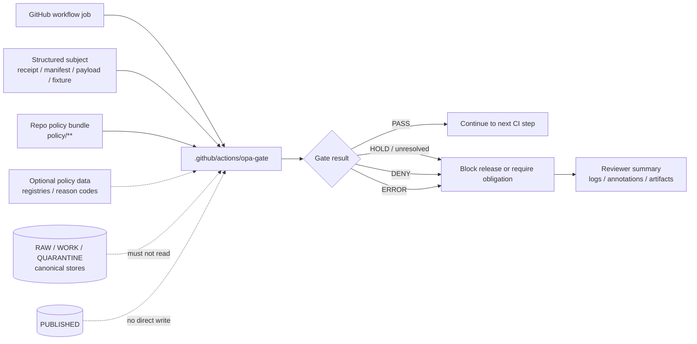

<!-- [KFM_META_BLOCK_V2]
doc_id: kfm://doc/NEEDS-VERIFICATION
title: .github/actions/opa-gate/
type: standard
version: v1
status: draft
owners: @bartytime4life
created: NEEDS-VERIFICATION
updated: 2026-04-27
policy_label: NEEDS-VERIFICATION
related: [../README.md, ../../workflows/README.md, ../../watchers/README.md, ../../CODEOWNERS, ../../PULL_REQUEST_TEMPLATE.md, ../../SECURITY.md, ../../../README.md, ../../../policy/README.md, ../../../contracts/README.md, ../../../schemas/README.md, ../../../tests/README.md, ../../../tools/validators/README.md, ../../../tools/ci/README.md]
tags: [kfm, github-actions, opa, conftest, policy-gate, ci, governance]
notes: [doc_id, created date, policy label, action.yml status, workflow callers, branch protection, and exact OPA or Conftest versions remain NEEDS VERIFICATION in a mounted checkout; owner is inherited from source-corpus CODEOWNERS coverage and should be rechecked before merge; this README documents a thin repo-local action seam, not policy authority itself.]
[/KFM_META_BLOCK_V2] -->

<a id="top"></a>

# `.github/actions/opa-gate/`

Thin repo-local action wrapper for running KFM policy-as-code gates against reviewable subjects without turning workflow glue into policy authority.

<div align="left">


</div>

> [!IMPORTANT]
> **Status:** `experimental`  
> **Owners:** `@bartytime4life` *(source-corpus baseline; recheck against mounted `CODEOWNERS` before merge)*  
> **Path:** `.github/actions/opa-gate/README.md`  
> **Role:** thin CI step wrapper around OPA / Conftest policy evaluation  
> **Truth posture:** source corpus confirms the `opa-gate/` lane name and placeholder intent; this session did **not** verify `action.yml`, workflow callers, branch protections, or runtime behavior in a mounted repository.  
> **Quick jumps:** [Scope](#scope) · [Repo fit](#repo-fit) · [Inputs](#inputs) · [Exclusions](#exclusions) · [Directory tree](#directory-tree) · [Quickstart](#quickstart) · [Usage](#usage) · [Diagram](#diagram) · [Gate matrix](#gate-matrix) · [Task list](#task-list--definition-of-done) · [FAQ](#faq) · [Appendix](#appendix)

---

## Scope

`opa-gate/` is the repo-local action seam for repeated policy checks that need a named, reviewable contract inside GitHub Actions.

It should evaluate structured inputs against repo policy bundles, return a fail-closed result, and expose enough summary detail for reviewers to understand why a workflow continued or stopped.

### Working interpretation

| Label | Meaning in this README |
|---|---|
| **CONFIRMED** | Supported by attached KFM doctrine or source-corpus documentation. |
| **INFERRED** | Strongly implied by KFM repo structure or adjacent docs, but not directly verified here. |
| **PROPOSED** | Recommended action contract or implementation detail pending mounted-repo verification. |
| **UNKNOWN** | Not verified in this session. |
| **NEEDS VERIFICATION** | Must be checked before merge, rollout, or branch-protection reliance. |

### This action may own

- calling a repo-approved policy evaluator such as Conftest or OPA;
- requiring explicit subject and policy paths;
- returning pass/fail status to the calling workflow;
- writing a compact CI summary;
- preserving policy failures as reviewable logs or artifacts;
- failing closed when required inputs, policies, or evaluator binaries are missing.

### This action must not own

- the meaning of policy rules;
- canonical schema or contract authority;
- promotion, publication, rollback, or correction authority;
- long-lived secrets;
- direct source harvesting;
- direct access to RAW, WORK, QUARANTINE, canonical, steward-only, or model-runtime stores;
- any claim that an artifact is public-safe unless the governed promotion path says so.

[Back to top](#top)

---

## Repo fit

`opa-gate/` sits inside the `.github` gatehouse as a thin reusable step. It is downstream of policy doctrine and upstream of workflow decisions.

| Direction | Surface | Fit |
|---|---|---|
| Parent action index | [`../README.md`](../README.md) | Defines repo-local action boundaries and neighboring action lanes. |
| Workflow callers | [`../../workflows/README.md`](../../workflows/README.md) | Workflows orchestrate jobs and choose when this gate runs. |
| GitHub governance | [`../../CODEOWNERS`](../../CODEOWNERS), [`../../PULL_REQUEST_TEMPLATE.md`](../../PULL_REQUEST_TEMPLATE.md), [`../../SECURITY.md`](../../SECURITY.md) | Ownership, review expectations, and security posture must be verified before branch-protection reliance. |
| Root posture | [`../../../README.md`](../../../README.md) | KFM remains governed, evidence-first, map-first, time-aware, and policy-conscious. |
| Policy authority | [`../../../policy/README.md`](../../../policy/README.md) | Policy owns allow, deny, reason, obligation, and no-silent-publish behavior. |
| Contract meaning | [`../../../contracts/README.md`](../../../contracts/README.md) | Human-readable contract semantics belong here, not inside action glue. |
| Machine schemas | [`../../../schemas/README.md`](../../../schemas/README.md) | Machine-file validation belongs to schema/contract tooling before or beside policy evaluation. |
| Test burden | [`../../../tests/README.md`](../../../tests/README.md) | Negative-path and valid/invalid fixtures should stay visible in shared tests. |
| Durable validators | [`../../../tools/validators/README.md`](../../../tools/validators/README.md) | Rich validation logic belongs in tested tools; this action wraps calls, not whole validators. |
| CI rendering | [`../../../tools/ci/README.md`](../../../tools/ci/README.md) | Reviewer summaries may be rendered by tooling outside the action. |
| Adjacent actions | [`../metadata-validate/README.md`](../metadata-validate/README.md), [`../provenance-guard/README.md`](../provenance-guard/README.md), [`../sbom-produce-and-sign/README.md`](../sbom-produce-and-sign/README.md) | Keep metadata, provenance, and SBOM/signing responsibilities separate. |

[Back to top](#top)

---

## Inputs

Accepted inputs are structured subjects that can be evaluated without executing untrusted project code.

### Accepted subjects

| Subject family | Examples | Gate purpose |
|---|---|---|
| Receipts | `RunReceipt`, `TransformReceipt`, `PolicyDecision` candidate | Check completeness, required fields, reason codes, and lifecycle posture. |
| Release candidates | release manifest, promotion payload, rollback card | Block publication when ownership, evidence, catalog closure, signatures, or diff posture is unresolved. |
| Catalog closure records | STAC/DCAT/PROV matrix, catalog linkage report | Enforce cross-catalog identity and digest consistency. |
| Evidence records | EvidenceBundle summary, EvidenceRef closure report | Block missing or unresolved evidence. |
| Source descriptors | source role, rights, cadence, sensitivity, steward metadata | Deny unknown source roles, unresolved rights, stale source posture, or unsafe release class. |
| UI/runtime trust payloads | Evidence Drawer payload, Focus response envelope, layer manifest | Enforce finite outcomes, evidence links, policy state, and no raw public path. |
| Policy test fixtures | valid/invalid examples under `policy/**` or `tests/**` | Prove rules fail closed before they gate real changes. |

### Target action inputs

These names are **PROPOSED** until `./action.yml` is inspected.

| Input | Required | Expected value | Notes |
|---|---:|---|---|
| `subject` | yes | file or directory path | The structured object to evaluate. |
| `policy-path` | yes | policy bundle directory | Keep explicit; avoid hidden global defaults. |
| `data-path` | no | supplemental policy data path | Use only when the repo policy bundle requires side data. |
| `output-format` | no | `table`, `json`, or `tap` | Match the repo-pinned evaluator. |
| `summary` | no | `true` or `false` | Write compact status to `$GITHUB_STEP_SUMMARY` when supported. |

> [!NOTE]
> Missing subject, missing policy path, missing evaluator binary, empty policy bundle, or unreadable input should stop the job. In KFM terms, “not evaluated” is not a pass.

[Back to top](#top)

---

## Exclusions

| Do not put here | Why | Better home |
|---|---|---|
| Policy doctrine or rule meaning | The action is a wrapper, not decision sovereignty. | [`../../../policy/README.md`](../../../policy/README.md), `policy/**` |
| JSON Schema validation as the primary job | Metadata and shape checks should stay separately testable. | [`../metadata-validate/README.md`](../metadata-validate/README.md), [`../../../schemas/README.md`](../../../schemas/README.md) |
| Evidence or proof archive storage | Actions may link or summarize proof, not become the proof store. | `data/proofs/`, `data/receipts/`, release/proof lanes |
| Attestation verification | Keep provenance verification distinct from policy evaluation. | [`../provenance-guard/README.md`](../provenance-guard/README.md), `tools/attest/` |
| SBOM generation or signing | Signing may support policy but is not the same action. | [`../sbom-produce-and-sign/README.md`](../sbom-produce-and-sign/README.md) |
| Whole workflow orchestration | Multi-job sequencing belongs to workflows or reusable workflows. | [`../../workflows/README.md`](../../workflows/README.md) |
| Live source connector logic | Policy gates should evaluate declared artifacts, not fetch new facts. | `tools/`, `pipelines/`, domain runbooks |
| Direct publication shortcuts | Promotion is a governed state transition, not a local action side effect. | release workflows, promotion validators, review surfaces |
| Long-lived credentials | Local actions must not become secret stores. | GitHub environments, OIDC, external secret management |

[Back to top](#top)

---

## Directory tree

### Current evidence snapshot

The source corpus describes this lane as placeholder-heavy and needing verification in a real checkout.

```text
.github/actions/opa-gate/
└── README.md                 # source-corpus placeholder lane; replace with this README after review
```

### Graduated target shape

```text
.github/actions/opa-gate/
├── README.md                 # this file
├── action.yml                # PROPOSED composite action contract
├── src/                      # optional tiny helpers only
└── tests/
    └── fixtures/
        ├── allow/            # minimal pass examples
        ├── deny/             # expected policy denials
        ├── hold/             # unresolved/obligation examples, if supported
        └── error/            # malformed or missing-input examples
```

> [!TIP]
> Keep action-local fixtures tiny. Durable policy tests should live under `policy/**` and shared `tests/**` so policy behavior remains visible outside GitHub Actions.

[Back to top](#top)

---

## Quickstart

### 1. Inspect the mounted checkout

```bash
# Confirm the action directory and current files.
find .github/actions/opa-gate -maxdepth 3 -type f | sort

# Confirm whether the action is already implemented.
test -s .github/actions/opa-gate/action.yml && sed -n '1,200p' .github/actions/opa-gate/action.yml

# Look for workflow callers.
grep -R "uses: ./.github/actions/opa-gate" -n .github/workflows 2>/dev/null || true

# Check policy and ownership context.
sed -n '1,120p' .github/CODEOWNERS 2>/dev/null || true
find policy -maxdepth 3 -type f | sort | head -80
```

### 2. Verify the policy evaluator

```bash
# The caller or setup step should make the evaluator available before this action runs.
command -v conftest
conftest --version

# Optional direct OPA check if the repo uses raw OPA in addition to Conftest.
command -v opa || true
opa version 2>/dev/null || true
```

### 3. Run a local gate before wiring workflows

```bash
# Replace these paths with repo fixtures that actually exist.
conftest test tests/fixtures/policy/allow/release_manifest.json --policy policy
conftest test tests/fixtures/policy/deny/missing_evidence.json --policy policy
```

### 4. Call the action from a workflow

```yaml
name: policy-gate-smoke

on:
  pull_request:
    paths:
      - "policy/**"
      - "data/receipts/**"
      - "data/proofs/**"
      - "schemas/**"
      - ".github/actions/opa-gate/**"

jobs:
  opa_gate:
    runs-on: ubuntu-latest
    permissions:
      contents: read

    steps:
      - uses: actions/checkout@v4
        with:
          persist-credentials: false

      - name: Verify Conftest is available
        run: command -v conftest

      - name: Run KFM OPA gate
        uses: ./.github/actions/opa-gate
        with:
          subject: tests/fixtures/policy/allow/release_manifest.json
          policy-path: policy
```

[Back to top](#top)

---

## Usage

Use `opa-gate/` when a workflow needs the same policy step more than once, or when reviewers need a stable action contract instead of hand-written shell embedded in many workflows.

### Recommended action contract

The minimal target is intentionally boring.

```yaml
# .github/actions/opa-gate/action.yml
name: opa-gate
description: Run a repo-local OPA / Conftest policy gate against a supplied subject and policy path.

inputs:
  subject:
    description: File or directory to evaluate.
    required: true
  policy-path:
    description: Repo policy path to use.
    required: true

runs:
  using: composite
  steps:
    - name: Evaluate policy
      shell: bash
      run: |
        set -euo pipefail
        test -n "${{ inputs.subject }}"
        test -n "${{ inputs.policy-path }}"
        conftest test "${{ inputs.subject }}" --policy "${{ inputs.policy-path }}"
```

> [!IMPORTANT]
> This starter shape is **PROPOSED**. Preserve any stronger existing `action.yml` contract if a mounted checkout proves one already exists.

### Caller responsibilities

A calling workflow should:

1. check out the repository with least necessary permissions;
2. install or verify the pinned policy evaluator;
3. pass explicit subject and policy paths;
4. upload or render policy output when a reviewer needs it;
5. block merge, promotion, or release on non-zero exit;
6. avoid `pull_request_target` write-permission patterns unless the workflow is designed to parse only trusted base policy and inert PR data.

### Policy pack expectations

A KFM policy pack should be:

- deny-by-default;
- fixture-tested with at least one pass and one deny case;
- explicit about reason codes and obligations;
- version-aware when Rego syntax changes;
- scoped to one gate family where possible;
- readable enough that a reviewer can connect denial reasons to KFM doctrine.

[Back to top](#top)

---

## Diagram



The action is a control-plane wrapper. It observes structured evidence and policy results; it does not become evidence, policy, or publication authority.

[Back to top](#top)

---

## Gate matrix

| Gate concern | Typical policy question | Expected result |
|---|---|---|
| Ownership | Does the candidate name a steward or accountable owner? | `DENY` or `HOLD` when missing. |
| Schema posture | Was shape validation completed before policy evaluation? | `DENY` when required validation evidence is absent. |
| Evidence completeness | Do EvidenceRefs resolve to EvidenceBundles? | `DENY` for missing evidence; `HOLD` if fixable and policy allows. |
| Rights and sensitivity | Are rights, sovereignty, cultural sensitivity, exact location, private land, or source terms unresolved? | Fail closed. |
| Catalog closure | Do manifest, STAC/DCAT/PROV, and proof digests align? | `DENY` on mismatch. |
| Signature posture | Was verification actually performed when claimed? | Never trust `signatures_verified: true` without verification evidence. |
| Diff posture | Is the change clean, scoped, and reviewable? | `DENY` or `HOLD` on unreviewed material drift. |
| Public path safety | Could the gate expose raw, unpublished, exact-sensitive, or steward-only content? | `DENY`. |
| Runtime/AI boundary | Does a policy subject imply direct model or raw-store access? | `DENY`. |

### Surface grammar

| Surface | Recommended finite outcomes | Meaning |
|---|---|---|
| CI gate / review check | `PASS`, `HOLD`, `DENY`, `ERROR` | What the checker decided. |
| Runtime / public answer | `ANSWER`, `ABSTAIN`, `DENY`, `ERROR` | What the user receives. |
| Release receipt | `PROMOTED`, `BLOCKED`, `REVERTED`, `WITHDRAWN` | What happened to the candidate. |

> [!NOTE]
> Conftest itself commonly reports pass/fail. KFM workflows may translate policy output into richer gate vocabulary only when that translation is explicit, tested, and reviewable.

[Back to top](#top)

---

## Task list / definition of done

Use this checklist before treating `opa-gate/` as more than a placeholder.

- [ ] `README.md` has the KFM Meta Block V2 and README-like impact block.
- [ ] `action.yml` exists, is non-empty, and matches this README or this README is updated.
- [ ] Caller workflow verifies or installs the pinned policy evaluator.
- [ ] The action fails closed on missing `subject`, missing `policy-path`, empty policy bundle, or evaluator failure.
- [ ] At least one `allow` fixture and one `deny` fixture are present and documented.
- [ ] Policy tests cover missing evidence, unresolved rights, stale source, invalid source role, and sensitive public geometry where relevant.
- [ ] Workflow permissions are least-privilege; `contents: read` is enough for normal gate runs.
- [ ] The action does not read RAW, WORK, QUARANTINE, canonical, steward-only, or model-runtime stores directly.
- [ ] Any reviewer summary links to the evaluated subject and policy bundle.
- [ ] Parent [`../README.md`](../README.md) links to this file.
- [ ] Workflow docs explain which jobs call this action.
- [ ] OPA / Conftest version posture is recorded or intentionally delegated to a setup action.
- [ ] Branch protection or required-check claims are verified before being documented as active.

[Back to top](#top)

---

## FAQ

### Does a passing `opa-gate` run publish anything?

No. `PASS` means the policy check did not block the current subject. Publication still requires the governed release path, review state, catalog/proof closure, and rollback/correction support.

### Can this action evaluate many files?

Yes, if the pinned evaluator and policy bundle support that pattern. Keep large scans bounded and prefer shared validator tools when the logic becomes complex.

### Should this install Conftest?

Usually no. Prefer a separate setup step or setup action so the version pin is visible and reusable. This action should primarily evaluate, not manage the full toolchain.

### Can this action call raw `opa eval` instead of Conftest?

Possibly. Document the selected evaluator in `action.yml`, add fixtures, and keep the policy output shape stable. Do not mix evaluator modes silently.

### Where should policy fixtures live?

Prefer shared `policy/**` or `tests/**` fixtures. Action-local fixtures are acceptable only for tiny smoke tests proving the wrapper contract.

### What is the safest first implementation?

A minimal composite action with explicit `subject` and `policy-path`, one workflow smoke caller, one pass fixture, one deny fixture, and a documented fail-closed behavior.

[Back to top](#top)

---

## Appendix

<details>
<summary>Illustrative Rego gate shape (<strong>PROPOSED</strong>)</summary>

This example uses modern Rego-style syntax. Adapt it if the repo pins a different OPA / Conftest syntax mode.

```rego
package kfm.opa_gate

default allow := false

deny contains msg if {
  not input.spec_hash
  msg := "missing spec_hash"
}

deny contains msg if {
  input.public_release == true
  input.rights.status == "unresolved"
  msg := "public release requires resolved rights"
}

deny contains msg if {
  input.public_release == true
  input.sensitivity.precision_class == "exact_sensitive"
  msg := "public release cannot expose exact sensitive geometry"
}

allow if {
  count(deny) == 0
}
```

</details>

<details>
<summary>Illustrative CI summary shape (<strong>PROPOSED</strong>)</summary>

```text
## OPA Gate

Subject: data/receipts/example.run_receipt.json
Policy: policy/
Result: DENY

Blocking reasons:
- missing EvidenceBundle for claim.001
- public release requires resolved rights

Reviewer next step:
- Open EvidenceBundle fixture or update source descriptor rights posture.
```

</details>

<details>
<summary>Review notes for future maintainers</summary>

- Keep this action thin enough that reviewers can understand it quickly.
- Move durable logic into `tools/validators/` or `policy/` when shell grows beyond wrapper behavior.
- Treat missing evidence as a system signal, not a nuisance.
- Keep policy decisions auditable without dumping sensitive details into public logs.
- Re-run mounted-repo verification before upgrading truth labels in this README.

</details>

[Back to top](#top)
