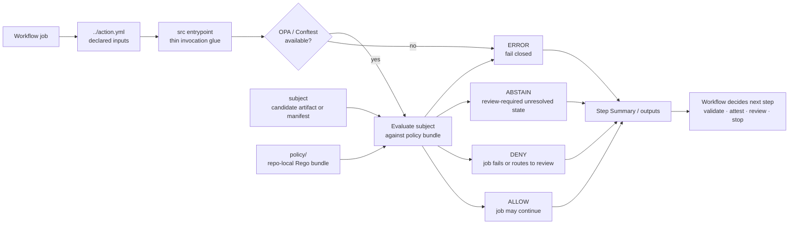

<!-- [KFM_META_BLOCK_V2]
doc_id: kfm://doc/<pending-uuid>
title: .github/actions/opa-gate/src/
type: standard
version: v1
status: draft
owners: @bartytime4life
created: <NEEDS VERIFICATION>
updated: 2026-04-27
policy_label: public
related: [../README.md, ../action.yml, ../../README.md, ../../../workflows/README.md, ../../../CODEOWNERS, ../../../../policy/, ../../../../contracts/, ../../../../schemas/contracts/v1/, ../../../../tests/contracts/, ../../../../tools/validators/promotion_gate/, ../../../../tools/attest/]
tags: [kfm, github-actions, opa, conftest, policy-gate, ci, governance]
notes: [doc_id placeholder pending registry allocation, created date needs git-history verification, target src file presence needs mounted-repo verification, this README scopes src to action-local invocation glue only]
[/KFM_META_BLOCK_V2] -->

<a id="top"></a>

# `.github/actions/opa-gate/src/`

Action-local implementation guidance for the KFM OPA gate; this folder may invoke policy, but it must not own policy meaning.


| Field | Value |
|---|---|
| Status | `experimental` |
| Owners | `@bartytime4life` |
| Path | `.github/actions/opa-gate/src/README.md` |
| Parent action | [`../README.md`](../README.md) and `../action.yml` |
| Upstream control plane | [`../../README.md`](../../README.md), [`../../../workflows/README.md`](../../../workflows/README.md) |
| Policy authority | [`../../../../policy/`](../../../../policy/) |
| Contract/schema authority | [`../../../../contracts/`](../../../../contracts/), [`../../../../schemas/contracts/v1/`](../../../../schemas/contracts/v1/) |
| Verification neighbors | [`../../../../tests/contracts/`](../../../../tests/contracts/), [`../../../../tools/validators/promotion_gate/`](../../../../tools/validators/promotion_gate/), [`../../../../tools/attest/`](../../../../tools/attest/) |
| Truth posture | **CONFIRMED** parent action name appears in corpus-visible repo docs · **PROPOSED** `src/` implementation shape · **UNKNOWN** mounted-repo implementation, actual entrypoint filename, tool provisioning, workflow callers, and required-check wiring |
| Quick jumps | [Scope](#scope) · [Repo fit](#repo-fit) · [Accepted inputs](#accepted-inputs) · [Exclusions](#exclusions) · [Directory tree](#directory-tree) · [Quickstart](#quickstart) · [Implementation rules](#implementation-rules) · [Diagram](#diagram) · [Definition of done](#definition-of-done) · [FAQ](#faq) · [Appendix](#appendix) |

> [!IMPORTANT]
> `src/` is a **thin action-local glue layer**. Rego rules, policy decisions, schema definitions, proof objects, promotion authority, and publication state must remain outside this folder.

> [!WARNING]
> Missing policy input, missing subject input, missing evaluator binary, malformed policy output, or unresolved gate state must fail closed. A polished summary is useful; a silent pass is not.

---

## Scope

`.github/actions/opa-gate/src/` belongs to the local `opa-gate` action only.

Use it for the smallest amount of source needed to:

- read inputs declared by `../action.yml`
- invoke a repo-local OPA or Conftest policy bundle
- normalize evaluator exit behavior into KFM-readable gate status
- write a GitHub Step Summary or action output when the parent action explicitly exposes one
- preserve enough diagnostic context for review without leaking secrets or restricted source detail

This folder should stay boring, inspectable, and easy to replace.

<p align="right"><a href="#top">Back to top ⤴</a></p>

---

## Repo fit

`src/` sits below the action interface and above the repo’s policy authority.

| Direction | Surface | Role |
|---|---|---|
| Parent | [`../README.md`](../README.md) | Human-facing contract for the `opa-gate` action |
| Interface | `../action.yml` | Declares inputs, outputs, runtime, and invocation step |
| Local glue | `./` | Runs the action-local entrypoint and normalizes results |
| Policy authority | [`../../../../policy/`](../../../../policy/) | Owns Rego rules, policy bundles, reasons, obligations, and allow/deny logic |
| Contracts and schemas | [`../../../../contracts/`](../../../../contracts/), [`../../../../schemas/contracts/v1/`](../../../../schemas/contracts/v1/) | Own trust-object meaning and machine-readable object shapes |
| Workflow orchestration | [`../../../workflows/`](../../../workflows/) | Owns job sequencing, permissions, setup, and promotion choreography |
| Durable validators | [`../../../../tools/validators/`](../../../../tools/validators/) | Own reusable validators that outgrow action-local glue |
| Contract-facing tests | [`../../../../tests/contracts/`](../../../../tests/contracts/) | Own valid/invalid fixtures and negative-path proof burden |

### Working interpretation

The action may answer: **“Did this subject pass this policy bundle under the declared evaluator?”**

The action must not answer by itself: **“Is this artifact published, authoritative, policy-safe forever, or released to the public?”**

That higher decision belongs to promotion, release, proof, review, and rollback surfaces.

<p align="right"><a href="#top">Back to top ⤴</a></p>

---

## Accepted inputs

Accepted contents for this directory:

- action-local entrypoint source such as a small shell, Node, Python, or repo-native script
- result-normalization helpers used only by `opa-gate`
- Step Summary formatting helpers used only by `opa-gate`
- tiny input guards that check whether required `action.yml` inputs are present
- README-local notes that explain action glue behavior and failure semantics

Accepted runtime inputs, when declared by `../action.yml`, may include:

| Input | Meaning | Required posture |
|---|---|---|
| `subject` | File or directory evaluated by policy | Must exist before evaluation |
| `policy-path` | Repo-local policy bundle path | Must exist and be explicit |
| `data-path` | Optional policy data bundle | Must be declared if used |
| `output-format` | Optional evaluator output format | Must not hide denies |
| `summary` | Optional Step Summary behavior | Must not replace machine status |

> [!NOTE]
> Input names above are a **PROPOSED starter vocabulary**. Do not treat them as current implementation until `../action.yml` is inspected in the mounted repo.

<p align="right"><a href="#top">Back to top ⤴</a></p>

---

## Exclusions

Do not place these in `src/`.

| Excluded material | Why it does not belong here | Put it here instead |
|---|---|---|
| Rego policy bodies | Policy meaning must be reviewable outside action glue | [`../../../../policy/`](../../../../policy/) |
| Policy fixtures | Gate proof needs stable valid/invalid examples | [`../../../../tests/contracts/`](../../../../tests/contracts/) or policy-local tests |
| Schema definitions | Schema truth must not hide inside CI wrappers | [`../../../../schemas/contracts/v1/`](../../../../schemas/contracts/v1/) and [`../../../../contracts/`](../../../../contracts/) |
| PromotionDecision or ReleaseManifest authority | Promotion is a governed state transition, not a script side effect | promotion/release contracts and workflow-controlled release lanes |
| Durable validator logic | Reusable validators deserve independent tests and docs | [`../../../../tools/validators/`](../../../../tools/validators/) |
| SBOM/signature implementation | Signing is adjacent but not the policy gate’s source concern | [`../../../../tools/attest/`](../../../../tools/attest/) or sibling action lanes |
| Secrets, long-lived credentials, tokens | This folder must never become a secret store | GitHub environments or external secret management |
| Canonical evidence archives | Action code may emit links or summaries, not become evidence truth | governed evidence, receipt, proof, catalog, and release locations |
| Whole workflow choreography | Sequencing belongs at job/workflow level | [`../../../workflows/`](../../../workflows/) |

<p align="right"><a href="#top">Back to top ⤴</a></p>

---

## Directory tree

### Current target path

```text
.github/actions/opa-gate/src/
└── README.md
```

### PROPOSED implementation shape

```text
.github/actions/opa-gate/
├── action.yml                  # action interface; source must not silently add inputs
├── README.md                   # parent action contract
├── src/
│   ├── README.md               # this file
│   ├── <entrypoint>            # e.g. run.sh, index.mjs, or main.py after repo convention check
│   ├── <result-normalizer>     # optional; only if needed for KFM-readable output
│   └── <summary-writer>        # optional; Step Summary formatting only
└── tests/
    └── fixtures/               # optional action-local smoke fixtures; contract fixtures live elsewhere
```

> [!TIP]
> If the entrypoint grows enough to need its own package, fixtures, dependency lock, or reusable public API, move it out of this action folder and into a repo tool with tests.

<p align="right"><a href="#top">Back to top ⤴</a></p>

---

## Quickstart

### 1. Inspect the action boundary

Run from the repository root after the real checkout is mounted.

```bash
find .github/actions/opa-gate -maxdepth 3 -type f | sort
test -f .github/actions/opa-gate/action.yml
test -f .github/actions/opa-gate/README.md
test -f .github/actions/opa-gate/src/README.md
```

### 2. Confirm policy is not hidden in action glue

```bash
find .github/actions/opa-gate/src -maxdepth 2 -type f | sort

# Policy rules should be outside the action-local source folder.
find policy -maxdepth 4 -type f \( -name '*.rego' -o -name '*.json' -o -name '*.yaml' -o -name '*.yml' \) | sort
```

### 3. Confirm evaluator availability

Tool installation belongs in workflow setup, the runner image, or an explicitly documented setup step.

```bash
command -v conftest || command -v opa
```

### 4. Run a narrow policy smoke test once fixtures exist

```bash
# Example only. Replace with the repo-ratified subject and policy paths.
conftest test <subject> --policy <policy-path>
```

> [!IMPORTANT]
> A missing evaluator is an `ERROR` and should fail the job. It is not a reason to skip policy evaluation.

<p align="right"><a href="#top">Back to top ⤴</a></p>

---

## Implementation rules

### 1. Keep `action.yml` authoritative for the action interface

`src/` may consume inputs. It must not invent hidden inputs.

When the source needs a new input or output:

1. update `../action.yml`
2. update `../README.md`
3. update this README if source behavior changes
4. add or update fixtures and negative-path checks

### 2. Normalize outcomes without weakening them

| Evaluator condition | KFM-readable result | Job behavior |
|---|---:|---|
| Policy allows subject | `ALLOW` | pass |
| Policy denies subject | `DENY` | fail unless parent workflow is explicitly review-only |
| Policy emits unresolved or abstain-like state | `ABSTAIN` | fail unless parent workflow explicitly routes to review |
| Missing subject | `ERROR` | fail |
| Missing policy bundle | `ERROR` | fail |
| Missing evaluator binary | `ERROR` | fail |
| Malformed evaluator output | `ERROR` | fail |

### 3. Keep summaries useful but non-authoritative

A Step Summary may show:

- subject path
- policy path
- evaluator name and version, when available
- result category
- reason codes or obligation codes, when policy emits them
- fixture or report path
- next review action

A Step Summary must not:

- claim publication
- redact evidence by omission while passing the gate
- leak restricted source content
- replace the machine-readable gate result
- conceal deny/error output behind friendly prose

### 4. Treat destructive or publishing behavior as out of scope

This source folder should not publish artifacts, mutate release state, write canonical evidence, sign bundles, or move data into public locations. It may only evaluate and report.

<p align="right"><a href="#top">Back to top ⤴</a></p>

---

## Diagram



<p align="right"><a href="#top">Back to top ⤴</a></p>

---

## Definition of done

The `src/` folder is ready to graduate from placeholder to active action source when all of the following are true:

- [ ] `../action.yml` declares every input and output consumed by source code.
- [ ] Missing `subject` fails closed.
- [ ] Missing `policy-path` fails closed.
- [ ] Missing OPA or Conftest binary fails closed.
- [ ] A deny result is distinguishable from a runtime error.
- [ ] The source emits a concise review summary without leaking restricted content.
- [ ] Policy rules are stored outside `src/`.
- [ ] Contract/schema fixtures are stored outside `src/` unless explicitly action-local.
- [ ] The parent action README links this source README.
- [ ] At least one pass fixture and one deny/error fixture are exercised in CI or a documented local validation path.
- [ ] Tool versions and Rego syntax expectations are documented or pinned by the workflow/setup layer.
- [ ] Rollback is simple: remove or bypass this local action without deleting policy, contracts, schemas, receipts, or proof objects.

<p align="right"><a href="#top">Back to top ⤴</a></p>

---

## FAQ

### Why does this action source not own Rego policy?

Because KFM policy must be enforceable and reviewable as backend law, not buried inside a workflow helper. `src/` invokes policy; it does not define policy authority.

### Can this folder contain a larger validator?

Only temporarily. If the validator becomes reusable, domain-aware, or fixture-heavy, move it to `tools/validators/` and call it from the action.

### Should this action publish artifacts after policy passes?

No. Publication belongs to promotion and release choreography. A policy pass may allow the next workflow step to continue, but it is not publication by itself.

### Should `src/` use OPA directly or Conftest?

Either may be valid after repo verification. Prefer the toolchain already used or pinned by the repository. When both are possible, keep the action interface stable and document evaluator behavior.

### What happens if policy cannot decide?

Treat unresolved policy state as review-required and fail closed unless the workflow is explicitly a non-publishing advisory check.

<p align="right"><a href="#top">Back to top ⤴</a></p>

---

## Appendix

<details>
<summary>Evidence posture used by this README</summary>

| Label | Meaning here |
|---|---|
| **CONFIRMED** | Supported by corpus-visible repo documentation or current prompt doctrine |
| **INFERRED** | Strongly implied by KFM structure, but not verified as implemented in this target path |
| **PROPOSED** | Recommended implementation shape for this README or source folder |
| **UNKNOWN** | Not verifiable without a mounted repo, actual `action.yml`, workflows, tests, and runner setup |
| **NEEDS VERIFICATION** | Must be checked before merge or rollout |

</details>

<details>
<summary>Action-local source review checklist</summary>

Before approving changes under `src/`, reviewers should ask:

1. Does the change alter the gate interface?
2. If yes, did `../action.yml` and `../README.md` change too?
3. Does the change introduce policy meaning that belongs in `policy/`?
4. Does the change introduce schema meaning that belongs in `schemas/` or `contracts/`?
5. Does every missing-input path fail closed?
6. Is deny output preserved clearly enough for review?
7. Are secrets, tokens, restricted evidence, and exact sensitive locations protected?
8. Can the action be rolled back without losing policy or proof state?

</details>

<details>
<summary>Minimal evaluator contract</summary>

The action-local source should preserve this evaluator contract even if the underlying implementation changes:

| Contract point | Requirement |
|---|---|
| Deterministic subject | The evaluated file or directory is explicit |
| Deterministic policy bundle | The policy path is explicit |
| Fail-closed default | No policy evaluation means no pass |
| Reviewable output | Deny/error messages are available to reviewers |
| No hidden publish | The gate cannot publish by itself |
| No authority collapse | Policy, schema, proof, receipt, and release meanings stay outside `src/` |

</details>

<p align="right"><a href="#top">Back to top ⤴</a></p>
