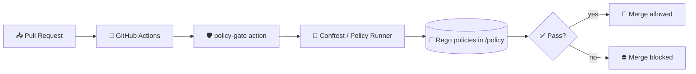

# 🛡️ Policy Gate (CI) — Governance as Code for KFM


> [!IMPORTANT]
> This action is a **guardrail**, not a suggestion. If policy fails, the workflow fails. ✅🧱

---

## ✨ What is this?

`policy-gate` is a **local GitHub Composite Action** that enforces **repository governance rules** during CI for the Kansas Frontier Matrix (KFM).  
It’s the “✅ allowed / ⛔ denied” checkpoint that keeps the repo **provenance-first**, **license-safe**, **metadata-complete**, and **policy-compliant**.

📍 **Action path:** `.github/actions/policy-gate`  
📍 **Policies live in:** `policy/` (OPA/Rego “policy as code”)  

---

## 🧠 Why do we need it?

KFM is designed around a “truth path”:

✅ **Raw → Processed → Catalog/Metadata → Provenance → DB → API → UI**

The Policy Gate ensures contributions don’t accidentally break that contract.  
It prevents merges that would create **uncited data**, **unlicensed content**, **missing provenance**, or **unsafe AI artifacts**.

---

## 🗂️ Expected folder layout

```text
📦 .github/
└── actions/
    └── policy-gate/
        ├── action.yml         # ✅ Composite action definition (authoritative inputs)
        ├── README.md          # 👈 you are here
        └── scripts/           # (optional) helper scripts used by the action
```

---

## ✅ What the gate checks (high level)

Your repository policies can evolve, but the gate typically enforces things like:

### 🧾 Data & licensing
- ✅ Datasets include a **license** + **citation metadata**
- ✅ Restricted or sensitive data is **not exposed in open paths**
- ✅ File formats meet “interoperable / reusable” expectations (where applicable)

### 🧬 Provenance & traceability
- ✅ New/updated processed artifacts have a **matching provenance log**
- ✅ Canonical pipeline order isn’t bypassed (no “UI-only” data drops)

### 🤖 AI governance (if applicable in this repo)
- ✅ AI prompts/templates/content follow **policy rules**
- ✅ Disallowed content patterns are blocked
- ✅ Required citation fields exist when rules demand them

### 🔐 Repo hygiene & security
- ✅ “No secrets in repo” guardrails (if your policy bundle includes this)
- ✅ Enforces repository “zones” (where certain types of files are allowed)

> [!NOTE]
> The **source of truth** is always the Rego policies in `policy/`.  
> The README describes intent + usage; the policies define reality.

---

## ⚙️ How it works (conceptually)



---

## 🚀 Usage

### ✅ Minimal example (whole-repo scan)

```yaml
name: policy-gate

on:
  pull_request:
  push:
    branches: [main]

jobs:
  policy:
    runs-on: ubuntu-latest
    steps:
      - name: Checkout 🧾
        uses: actions/checkout@v4

      - name: Policy Gate 🛡️
        uses: ./.github/actions/policy-gate
        with:
          policy_dir: policy
          targets: .
```

---

### 🎯 Faster PR example (only check changed files)

This pattern reduces runtime on big repos:

```yaml
jobs:
  policy:
    runs-on: ubuntu-latest
    steps:
      - uses: actions/checkout@v4

      - name: Get changed files 📌
        id: changes
        uses: tj-actions/changed-files@v45

      - name: Policy Gate 🛡️ (changed-only)
        uses: ./.github/actions/policy-gate
        with:
          policy_dir: policy
          targets: ${{ steps.changes.outputs.all_changed_files }}
```

> [!TIP]
> If your action expects a newline-delimited list, use:
> `targets: |` and pass `${{ steps.changes.outputs.all_changed_files }}` on its own line.

---

## 🧩 Inputs

> [!IMPORTANT]
> **`action.yml` is authoritative.** This table documents the *intended* interface.
> If this README and `action.yml` disagree, trust `action.yml`.

| Input | Required | Default | What it does |
|------|----------|---------|--------------|
| `policy_dir` | ✅ | `policy` | Path to the policy bundle (Rego files, optional data files) |
| `targets` | ✅ | `.` | Files/dirs to evaluate (entire repo or a changed-files list) |
| `fail_on_warn` | ❌ | `true` | Treat policy warnings as failures (fail-closed posture) |
| `namespace` | ❌ | *(empty)* | Optional policy namespace selection (if your rules are namespaced) |
| `report_format` | ❌ | `stdout` | Optional: `stdout`, `json`, etc. (if the action supports reporting) |
| `report_path` | ❌ | *(empty)* | Optional path to write a machine-readable report for artifacts |

---

## 🧪 Run locally (recommended before pushing) 💻✅

If CI blocks your PR, the fastest fix is running the same checks locally.

### 1) Install the runner (Conftest is commonly used)
- macOS (Homebrew): `brew install conftest`
- Linux: download from upstream releases, or use your package manager

### 2) Run policies on the whole repo
```bash
conftest test . -p policy
```

### 3) Run policies on a subfolder or single file
```bash
conftest test data/ -p policy
conftest test data/processed/my_dataset.geojson -p policy
```

> [!TIP]
> If you’re iterating on a rule, use `--trace` (if enabled in your workflow) to understand why it fired.

---

## 🧯 Common failures & quick fixes

### ❌ “Dataset missing license / citation”
✅ Add or update required metadata fields in the dataset’s catalog/metadata file.

### ❌ “Processed artifact has no provenance”
✅ Add a matching provenance log (often in something like `data/provenance/`), referencing:
- inputs (raw source)
- process (pipeline/script)
- outputs (processed file)
- timestamps + responsible agent (human and/or pipeline)

### ❌ “File committed to forbidden zone”
✅ Move the file to the correct location (raw vs processed vs docs vs policy), or update the pipeline output target.

### ❌ “Restricted content in open path”
✅ Move to protected location, redact, aggregate, or mark access restrictions in metadata (depending on governance rules).

---

## 🧱 Adding / updating policies (maintainers)

### 🧾 Add a new rule
1. Create or update a `.rego` file in `policy/`
2. Add fixtures/examples (recommended)
3. Verify locally:
   ```bash
   conftest test . -p policy
   ```

### ✅ Make failures human-friendly
Policies should emit actionable messages:
- “what failed”
- “where it failed”
- “how to fix it”

---

## 🔐 Security posture

- **Fail closed by default**: policy uncertainty should block merges, not allow them.
- Policies must be **reviewed like code** (PR + review).
- If an exception is needed, prefer:
  - a scoped policy allowance with justification, or
  - a documented “waiver” mechanism (if implemented), rather than disabling checks.

---

## 🔗 Related docs

- 📁 `policy/` — Policy bundle (Rego rules)
- 📁 `data/catalog/` — Dataset metadata (if present in this repo)
- 📁 `data/provenance/` — Provenance logs (if present in this repo)
- 📁 `.github/workflows/` — Workflows that call this action

---

## 🧭 Philosophy (tl;dr)

**If it can’t be traced, it doesn’t ship.** 🧬  
**If it’s missing metadata, it’s not usable.** 🧾  
**If it’s sensitive, it’s governed.** 🔐  
**If policy fails, the merge fails.** 🛡️
