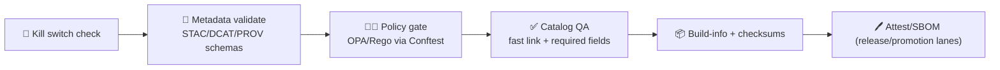

<a id="top"></a>

# 🧑‍⚖️ `.github/actions/policy-gate/` — Policy-as-Code Gate (OPA/Rego via Conftest)


> KFM’s “policy gate” is the **semantic/governance** layer of CI: it evaluates repo content against **OPA/Rego policies** (via **Conftest**) and **blocks merges/promotions** when KFM invariants are violated.
>
> 🧭 **KFM order is absolute:** **ETL → Metadata (STAC/DCAT/PROV) → Graph → API → UI → Story Nodes → Focus Mode**  
> This action helps keep that order enforceable and boring. ✅

---

## 🧾 Action metadata

| Field | Value |
|---|---|
| Action name | `kfm/policy-gate` |
| Action type | Composite Action |
| Action file | `.github/actions/policy-gate/action.yml` |
| Documentation | `.github/actions/policy-gate/README.md` |
| Status | Active ✅ |
| Last updated | **2026-01-10** |
| Default engine | **Conftest** (OPA under the hood) |
| Default posture | **Fail-closed** (deny blocks) |
| Primary purpose | Governance + safety + “promotion discipline” gates |

---

## ⚡ Quick links

| Need | Go |
|---|---|
| 🧪 Workflows overview | `/.github/workflows/README.md` |
| 🗂️ Metadata schema validation | `/.github/actions/metadata-validate/README.md` |
| ✅ Fast STAC/DCAT QA | `/.github/actions/catalog-qa/README.md` |
| 🧯 Kill switch checks | `/.github/actions/check-kill-switch/README.md` + `/.github/actions/kill-switch/README.md` |
| 🧭 Collaboration hub | `/.github/README.md` |
| 🛡️ Security policy | `/SECURITY.md` *(or `/.github/SECURITY.md` if mirrored)* |
| 📦 Attestations | `/.github/actions/attest/README.md` |
| 🧾 Build traceability | `/.github/actions/build-info/README.md` |

---

<details>
<summary><strong>📌 Table of contents</strong></summary>

- [What this action does](#-what-this-action-does)
- [Where it fits in KFM CI](#-where-it-fits-in-kfm-ci)
- [Inputs](#-inputs)
- [Outputs](#-outputs)
- [Usage in workflows](#-usage-in-workflows)
- [Recommended policy pack layout](#-recommended-policy-pack-layout)
- [Writing policies that don’t rot](#-writing-policies-that-dont-rot)
- [Common policy domains for KFM](#-common-policy-domains-for-kfm)
- [Local debugging](#-local-debugging)
- [Troubleshooting](#-troubleshooting)
- [Security notes](#-security-notes)
- [Reference library](#-reference-library)
- [Back to top](#-back-to-top)

</details>

---

## ✅ What this action does

This action:

- 🧑‍⚖️ Runs **OPA/Rego** policy checks (via **Conftest**) against one or more targets (files/dirs).
- 🚫 Fails the job when **deny** rules trigger (fail-closed).
- ⚠️ Optionally fails on **warn** rules (recommended for promotion lanes).
- 🧾 Produces **machine-readable** + **human-readable** reports to upload as workflow artifacts.
- 🧪 Optionally runs `conftest verify` to validate the policy pack’s own tests.

### Why KFM needs this (beyond “schema validation”)
Schema validation ensures JSON/YAML is shaped correctly.

Policy gates enforce **meaning**:
- licensing rules (SPDX allowlists)
- link safety / SSRF defenses for catalogs
- classification propagation (public outputs cannot be less restricted than inputs)
- cross-layer consistency (STAC/DCAT/PROV alignment)
- “promotion discipline” (stage → validate → publish)

---

## 🧭 Where it fits in KFM CI

Policy Gate is typically **after** schema validation and **before** publish/promotion.



> [!IMPORTANT]
> The **same policies** should be used in PR checks and in promotion.  
> PR lane can be “fast + targeted”; promotion lane should be “strict + complete”.

---

## 🧾 Inputs

> All inputs are strings (GitHub Actions limitation). Use `"true"` / `"false"` for booleans.

| Input | Required | Default | Meaning |
|---|---:|---|---|
| `policy_dir` | ❌ | `tools/validation/policy` | Directory containing the policy pack (`rego/**`, tests, bundles) |
| `targets` | ❌ | `.` | Space/newline-separated list of files/dirs to evaluate |
| `conftest_version` | ❌ | `0.56.0` | Conftest release version to install (pin for determinism) |
| `fail_on_warn` | ❌ | `"true"` | If `"true"`, warnings are treated as failures |
| `run_verify` | ❌ | `"true"` | If `"true"`, run `conftest verify` on the policy pack tests |
| `output_format` | ❌ | `json` | Conftest output format (`json`, `table`, etc.) |
| `report_dir` | ❌ | `artifacts/policy-gate` | Where to write reports |
| `namespace` | ❌ | *(empty)* | Optional: restrict evaluation to a namespace/bundle (if used) |
| `extra_args` | ❌ | *(empty)* | Extra args passed to `conftest test` |

> [!TIP]
> Keep **policy packs deterministic**: pin tool versions and avoid rules that depend on current time, network availability, or the runner’s environment.

---

## 📦 Outputs

| Output | Description |
|---|---|
| `report_json` | Path to the machine-readable report (`.json`) |
| `report_md` | Path to a human summary (`.md`) |
| `conftest_version` | The Conftest version used |

> Reports are meant to be uploaded via `actions/upload-artifact@v4` by the calling workflow.

---

## 🧪 Usage in workflows

### 1) Minimal PR lane example (safe on forks)

```yaml
jobs:
  policy_gate:
    runs-on: ubuntu-latest
    permissions:
      contents: read

    steps:
      - uses: actions/checkout@v4

      - name: Policy Gate (OPA/Rego)
        uses: ./.github/actions/policy-gate
        with:
          policy_dir: tools/validation/policy
          targets: |
            data/
            docs/
          fail_on_warn: "true"

      - name: Upload policy reports
        uses: actions/upload-artifact@v4
        if: always()
        with:
          name: policy-gate-${{ github.sha }}
          path: artifacts/policy-gate/**
```

### 2) Data-only trigger (recommended)

```yaml
on:
  pull_request:
    paths:
      - "data/**"
      - "tools/validation/policy/**"
      - ".github/actions/policy-gate/**"
```

### 3) Promotion lane (strict + complete, environment-gated)

```yaml
jobs:
  promote:
    runs-on: ubuntu-latest
    environment: prod
    permissions:
      contents: read

    steps:
      - uses: actions/checkout@v4

      - name: Policy gate (full repo)
        uses: ./.github/actions/policy-gate
        with:
          policy_dir: tools/validation/policy
          targets: .
          fail_on_warn: "true"
          run_verify: "true"

      # next steps: publish catalogs, attach SBOM, attest, etc.
```

### 4) Advanced: “bundle” style (policy pack decides what to run)
If your policy pack includes bundle selectors (e.g., `all_ci`, `promotion`, `domain_*`), you can use `namespace` to target a specific bundle package if your implementation supports it.

```yaml
- name: Policy gate (promotion bundle)
  uses: ./.github/actions/policy-gate
  with:
    policy_dir: tools/validation/policy
    targets: .
    namespace: bundles
    extra_args: "--all-namespaces"
```

> [!NOTE]
> Bundle selection is optional. The simplest approach is: **write good `deny[]` rules**, run them everywhere.

---

## 🧱 Recommended policy pack layout

Your action runs policies. The policies live elsewhere. This is the recommended “KFM-friendly” shape:

```text
📁 tools/
└─ ✅📁 validation/
   └─ 🧑‍⚖️📁 policy/
      ├─ 📄 README.md
      ├─ 🧠📁 rego/
      │  ├─ 🧰📁 common/
      │  │  ├─ 🧩 helpers.rego
      │  │  ├─ 🧾 license_allowlist.rego
      │  │  └─ 🔗 url_allowlist.rego
      │  ├─ 🗂️📁 catalogs/
      │  │  ├─ 🛰️ stac_required.rego
      │  │  ├─ 🗃️ dcat_required.rego
      │  │  ├─ 🧬 prov_required.rego
      │  │  └─ 🛡️ link_safety.rego
      │  ├─ 🧭📁 governance/
      │  │  ├─ 🧬 classification_propagation.rego
      │  │  ├─ 🗺️ sensitive_locations.rego
      │  │  └─ 🏷️ attribution.rego
      │  ├─ 🔐📁 supply_chain/
      │  │  ├─ 🧷 workflows_least_privilege.rego
      │  │  └─ 📌 actions_pinning.rego
      │  └─ 📦 bundles.rego
      └─ 🧪📁 tests/
         ├─ 🧪 *_test.rego
         └─ 🧫📁 samples/
            ├─ ✅📁 good/
            └─ ❌📁 bad/
```

### “What’s enforced” (typical starter set)
Most KFM policy packs start by enforcing:

- ✅ STAC/DCAT/PROV required fields (license/providers/links/provenance presence)
- ✅ License allowlist (SPDX)
- ✅ Link safety for catalogs (e.g., block `localhost`, `169.254.169.254`, `file://`, etc.)
- ✅ Classification propagation rules (outputs cannot be less restricted than inputs)
- ✅ Governance flags for sensitive locations (precision rules)

> [!TIP]
> Keep deny messages **short and actionable**. Prefix messages by domain:
> - `STAC:` …
> - `DCAT:` …
> - `PROV:` …
> - `GOV:` …
> - `SC:` (supply chain) …

---

## 🧠 Writing policies that don’t rot

### ✅ Make policies deterministic
Avoid rules that depend on:
- current wall-clock time
- random seeds
- network access (unless you intentionally provide allowlists + caching)

### ✅ Prefer “fail-closed” for promotion lanes
- PR lane can warn on some items (depending on maturity)
- Promotion lane should be strict (deny anything not explicitly permitted)

### ✅ Treat metadata as security-critical
For KFM, “it’s just metadata” is a trap:
- catalogs can trigger unsafe fetches
- missing license/provider fields can poison downstream trust
- missing provenance breaks incident response and reproducibility

---

## 🧩 Common policy domains for KFM

Use Policy Gate to enforce the “meaning layer” of the repo:

### 🗂️ Catalog governance (STAC/DCAT)
- license required
- providers required
- valid `links[]` and safe schemes/domains
- extensions stability rules (warn/pilot vs stable)
- dataset identifiers and versioning patterns

### 🧾 Provenance (PROV)
- PROV files exist for promoted artifacts
- PROV activity includes inputs, outputs, agents, and configurations
- run IDs and dataset IDs are consistent with catalogs

### 🔒 Classification & sovereignty
- classification tags required for certain domains
- **propagation**: outputs inherit sensitivity from inputs unless explicitly redacted/approved
- location precision rules for sensitive areas (county/grid/H3-based publication strategies)

### 🔐 CI/CD supply chain
- least-privilege workflow permissions
- forbid `pull_request_target` unless explicitly justified
- action pinning rules (major version ok; SHA pinning preferred in hardened lanes)
- avoid `curl | bash` patterns

### 🎬 Story Nodes & narrative artifacts (optional)
- require evidence links for factual claims
- enforce fact vs interpretation sections
- block high-precision sensitive locations in public stories

---

## 🧰 Local debugging

### Install Conftest (example)
```bash
# macOS (Homebrew)
brew install conftest

# Linux (manual): see Conftest releases for your platform
```

### Run the policy pack locally
```bash
# Run policy tests (unit-style)
conftest verify -p tools/validation/policy

# Run policies against targets
conftest test -p tools/validation/policy data/ docs/ --output table

# JSON output (machine-readable)
conftest test -p tools/validation/policy data/ --output json > /tmp/policy-report.json
```

> [!TIP]
> Always reproduce locally first. If local passes but CI fails, compare:
> - Conftest version
> - policy pack path
> - which targets were evaluated
> - line endings / JSON formatting

---

## 🧯 Troubleshooting

### “No policies found”
- confirm `policy_dir` points at the directory containing `rego/` (or `.rego` files)
- ensure your workflow checked out the repo
- ensure the action actually installs Conftest

### “Policies ran but didn’t evaluate my files”
- check `targets` (paths are relative to repo root)
- verify your workflow trigger includes the relevant paths
- consider running against `.` if you’re unsure

### “Too noisy”
- consolidate “fast-fail” checks into **Catalog QA** and keep policy gate focused on governance rules
- add bundle selection once policies scale

---

## 🔐 Security notes

- ✅ This action should run with `permissions: contents: read` in PR lanes.
- ✅ It should not require secrets (safe for fork PRs).
- 🚫 Do not pass secrets via action outputs.
- 🚫 Do not download arbitrary policy packs from the internet at runtime.

> [!IMPORTANT]
> CI runners are part of your security boundary. Treat policy-gate changes like production changes.

---

## 📚 Reference library

These project docs influence policy domains (governance, provenance, reproducibility, safety):

- `docs/specs/MARKDOWN_GUIDE_v13.md(.gdoc)` — pipeline invariants, provenance-first, validation gates  
- `docs/specs/Kansas Frontier Matrix (KFM) – Comprehensive Technical Documentation.docx` — architecture and governed pipeline  
- `docs/library/Data Spaces.pdf` — access control + policy enforcement concepts  
- `docs/library/Introduction to Digital Humanism.pdf` — human-centered governance constraints  
- `docs/library/Cloud-Based Remote Sensing with Google Earth Engine-Fundamentals and Applications.pdf` — remote sensing pipeline realities (data QA needs)

---

## ⬆️ Back to top

<p align="right"><a href="#top">⬆️ Back to top</a></p>

