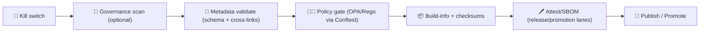

<a id="top"></a>

# 🧑‍⚖️✅ `.github/actions/policy-gate/` — Policy‑as‑Code Gate (OPA/Rego via Conftest)


> KFM’s “policy gate” is the **semantic + governance** layer of CI/CD: it evaluates repo artifacts against a **Policy Pack** written in **OPA/Rego** and executed via **Conftest**, and it **blocks merges/promotions** when KFM invariants are violated. :contentReference[oaicite:0]{index=0}
>
> 🧭 **KFM order is absolute:** **ETL → Metadata (STAC/DCAT/PROV) → Graph → API → UI → Story Nodes → Focus Mode**  
> This action helps keep that order enforceable and boring. ✅

---

## 🧾 Action metadata

| Field | Value |
|---|---|
| Action name | `kfm/policy-gate` |
| Action type | Composite Action |
| Action file | `.github/actions/policy-gate/action.yml` |
| Documentation | `.github/actions/policy-gate/README.md` |
| Status | ✅ Active *(spec + operating guide; keep `action.yml` aligned)* |
| Last updated | **2026-01-11** |
| KFM‑MDP baseline | **v11.2.6** *(project baseline)* |
| Master Guide | **v13 (draft)** *(project baseline)* |
| Default engine | **Conftest** (OPA under the hood) |
| Default posture | **Fail‑closed** (`deny[]` blocks) |
| Primary purpose | Governance + safety + “promotion discipline” gates |

> [!IMPORTANT]
> KFM’s roadmap explicitly calls for a **Policy Pack** (OPA/Rego + Conftest) that encodes governance rules (FAIR+CARE, retention, coding standards) and is run as a **CI Policy Gate**. :contentReference[oaicite:1]{index=1}

---

## ⚡ Quick links

| Need | Go |
|---|---|
| 🧪 Workflows overview | [`../../workflows/README.md`](../../workflows/README.md) |
| 🧾 Full schema validation | [`../metadata-validate/README.md`](../metadata-validate/README.md) |
| ✅ Fast STAC/DCAT QA | [`../catalog-qa/README.md`](../catalog-qa/README.md) |
| 🔎 Governance scan | [`../governance-scan/README.md`](../governance-scan/README.md) *(if present)* |
| 🧯 Kill switch checks | [`../check-kill-switch/README.md`](../check-kill-switch/README.md) + [`../kill-switch/README.md`](../kill-switch/README.md) |
| 🧾 Build traceability | [`../build-info/README.md`](../build-info/README.md) |
| 🖊️ Attestations | [`../attest/README.md`](../attest/README.md) |
| 🧑‍⚖️ Policy pack folder | [`../../../tools/validation/policy/`](../../../tools/validation/policy/) *(recommended)*:contentReference[oaicite:2]{index=2} |
| 🛡️ Security policy | [`../../../SECURITY.md`](../../../SECURITY.md) *(or `../../SECURITY.md` if mirrored in `.github/`)* |

---

<details>
<summary><strong>📌 Table of contents</strong></summary>

- [✅ What this action does](#-what-this-action-does)
- [🧭 Where it fits in KFM CI](#-where-it-fits-in-kfm-ci)
- [🧑‍⚖️ What “policy” means in KFM](#-what-policy-means-in-kfm)
- [🧾 Inputs](#-inputs)
- [📤 Outputs](#-outputs)
- [📦 Output files](#-output-files)
- [🧪 Usage in workflows](#-usage-in-workflows)
- [🧱 Recommended policy pack layout](#-recommended-policy-pack-layout)
- [🧠 Writing policies that don’t rot](#-writing-policies-that-dont-rot)
- [🧩 Common policy domains for KFM](#-common-policy-domains-for-kfm)
- [🧰 Local debugging](#-local-debugging)
- [🧯 Troubleshooting](#-troubleshooting)
- [🔐 Security notes](#-security-notes)
- [📚 Reference library](#-reference-library)

</details>

---

## ✅ What this action does

This action:

- 🧑‍⚖️ Runs **OPA/Rego** policy checks (via **Conftest**) against one or more **targets** (files/dirs).
- 🚫 Fails the job when **`deny[]`** rules trigger (**fail‑closed**).
- ⚠️ Optionally fails on **`warn[]`** rules (recommended for promotion lanes).
- 🧾 Produces **machine‑readable** + **human‑readable** reports to upload as workflow artifacts.
- 🧪 Optionally runs `conftest verify` to validate the policy pack’s own tests.

### Why KFM needs this (beyond schema validation)
Schema validation ensures JSON/YAML is shaped correctly.

Policy gates enforce **meaning**:
- 🏷️ licensing rules (SPDX allowlists, “no unknown license” in publish lanes)
- 🔗 link safety / SSRF defenses for catalogs
- 🧭 sensitivity + sovereignty propagation (public outputs cannot be *less* restricted than inputs)
- 🧬 cross‑layer consistency (STAC/DCAT/PROV alignment)
- 🚦 “validate then promote” discipline (no publish unless gates pass):contentReference[oaicite:3]{index=3}

---

## 🧭 Where it fits in KFM CI

Policy Gate is typically **after** schema validation and **before** publish/promotion.



> [!TIP]
> PR lane can be **fast + targeted** (changed paths only).  
> Promotion lane should be **strict + complete** (fail‑closed, warn=fail, full target coverage).

---

## 🧑‍⚖️ What “policy” means in KFM

KFM’s “Policy Pack” is meant to encode governance rules as **machine‑readable safeguards** (FAIR+CARE, retention, coding standards), run in CI, and treated like code (versioned, tested).:contentReference[oaicite:4]{index=4}

This aligns with a proven pattern from data governance literature: an **access/policy decision** is effectively “constraints satisfied → allow; otherwise → deny,” and policies can exist at both “global” and “local/classification” layers.

### KFM translation of “global vs local policy”
- 🌍 **Global policies**: always-on repo invariants (least privilege workflows, no unsafe URL schemes, no “unknown license” in promoted artifacts).
- 🗺️ **Local/domain policies**: rules scoped by folder/classification (e.g., extra sensitivity rules for `data/processed/public/**`, stricter story-node rules for `docs/**`, etc.).

---

## 🧾 Inputs

> All inputs are strings (GitHub Actions limitation). Use `"true"` / `"false"` for booleans.

| Input | Required | Default | Meaning |
|---|---:|---|---|
| `policy_dir` | ❌ | `tools/validation/policy` | Directory containing the policy pack (`.rego` + optional `data.json` + tests):contentReference[oaicite:7]{index=7} |
| `targets` | ❌ | `.` | Space/newline-separated list of files/dirs to evaluate |
| `conftest_version` | ❌ | `0.56.0` | Conftest release version to install (**pin for determinism**) |
| `fail_on_warn` | ❌ | `"true"` | If `"true"`, warnings are treated as failures *(recommended for promotion lanes)* |
| `run_verify` | ❌ | `"true"` | If `"true"`, run `conftest verify` on the policy pack tests |
| `output_format` | ❌ | `json` | Conftest output format (`json`, `table`, etc.) |
| `report_dir` | ❌ | `artifacts/policy-gate` | Where to write reports |
| `namespace` | ❌ | *(empty)* | Optional: restrict evaluation to a namespace/bundle (if used) |
| `extra_args` | ❌ | *(empty)* | Extra args passed to `conftest test` (e.g., `--all-namespaces`) |
| `emit_sarif` | ❌ | `"false"` | If `"true"`, write SARIF for code scanning UI (implementation-defined) |

> [!IMPORTANT]
> KFM’s own documentation stresses **supply chain hygiene**: pin dependencies/base images, generate SBOMs, and verify downloads with checksums/hashes.:contentReference[oaicite:8]{index=8}  
> If your implementation downloads the Conftest binary at runtime, strongly consider verifying its checksum (pinned per version) before executing it.

---

## 📤 Outputs

| Output | Description |
|---|---|
| `ok` | `"true"` if no denies (and warns allowed), else `"false"` |
| `deny_count` | Integer-like string |
| `warn_count` | Integer-like string |
| `report_json` | Path to the machine-readable report (`.json`) |
| `report_md` | Path to a human summary (`.md`) |
| `sarif_path` | Path to SARIF (if enabled) |
| `conftest_version` | The Conftest version used |

> Reports are meant to be uploaded via `actions/upload-artifact@v4` by the calling workflow.

---

## 📦 Output files

Recommended stable output shape:

```text
artifacts/policy-gate/
├─ policy-gate.json          # ✅ machine report (derived from conftest json)
├─ policy-gate.md            # 🧾 human summary (PR-friendly)
├─ policy-gate.sarif         # 🧷 optional (code scanning UI)
└─ raw/
   └─ conftest.json          # optional: direct conftest output
```

✅ Output design rules:
- stable ordering (diffable)
- deny/warn messages are actionable, short, and do not leak secrets
- no raw tokens, credentials, or PII in reports (ever)

---

## 🧪 Usage in workflows

### 1) Minimal PR lane example (safe on forks)

```yaml
jobs:
  policy_gate:
    runs-on: ubuntu-latest
    permissions:
      contents: read

    steps:
      - uses: actions/checkout@v4

      - name: 🧑‍⚖️ Policy Gate (OPA/Rego)
        uses: ./.github/actions/policy-gate
        with:
          policy_dir: tools/validation/policy
          targets: |
            data/
            docs/
          fail_on_warn: "true"

      - name: 📦 Upload policy reports
        uses: actions/upload-artifact@v4
        if: always()
        with:
          name: policy-gate-${{ github.sha }}
          path: artifacts/policy-gate/**
```

### 2) Data-only trigger (recommended)

```yaml
on:
  pull_request:
    paths:
      - "data/**"
      - "docs/**"
      - "tools/validation/policy/**"
      - ".github/actions/policy-gate/**"
```

### 3) Promotion lane (strict + complete, environment-gated)

```yaml
jobs:
  promote:
    runs-on: ubuntu-latest
    environment: prod
    permissions:
      contents: read

    steps:
      - uses: actions/checkout@v4

      - name: 🧯 Kill switch (publish scope)
        uses: ./.github/actions/kill-switch
        with:
          scope: publish
          behavior: fail

      - name: 🧾 Metadata validate (full contract)
        uses: ./.github/actions/metadata-validate
        with:
          mode: promotion
          fail_on_warn: "true"

      - name: 🧑‍⚖️ Policy gate (full repo)
        uses: ./.github/actions/policy-gate
        with:
          policy_dir: tools/validation/policy
          targets: .
          fail_on_warn: "true"
          run_verify: "true"

      # next: build-info, attest, publish...
```

### 4) Advanced: “bundle” style (optional)
If your policy pack defines bundles/namespaces, you can pass `namespace` / `extra_args`:

```yaml
- name: Policy gate (promotion bundle)
  uses: ./.github/actions/policy-gate
  with:
    policy_dir: tools/validation/policy
    targets: .
    namespace: bundles
    extra_args: "--all-namespaces"
```

> [!NOTE]
> Bundle selection is optional. The simplest approach is: **write good `deny[]` rules**, run them everywhere.

---

## 🧱 Recommended policy pack layout

The action runs policies. The policies live elsewhere. This is a KFM-friendly “Policy Pack” shape:

```text
📁 tools/
└─ ✅📁 validation/
   └─ 🧑‍⚖️📁 policy/
      ├─ 📄 README.md
      ├─ ⚙️ conftest.toml              # optional conftest config
      ├─ 📄 data.json                  # optional OPA data (allowlists, bounds, etc.)
      ├─ 🧠📁 rego/
      │  ├─ 🧰📁 common/
      │  │  ├─ 🧩 helpers.rego
      │  │  ├─ 🏷️ license_allowlist.rego
      │  │  └─ 🔗 url_safety.rego
      │  ├─ 🗂️📁 catalogs/
      │  │  ├─ 🛰️ stac_required.rego
      │  │  ├─ 🗃️ dcat_required.rego
      │  │  ├─ 🧬 prov_required.rego
      │  │  └─ 🔗 link_safety.rego
      │  ├─ 🧭📁 governance/
      │  │  ├─ 🧬 classification_propagation.rego
      │  │  ├─ 🗺️ sensitive_locations.rego
      │  │  └─ 🏷️ attribution.rego
      │  ├─ 🔐📁 supply_chain/
      │  │  ├─ 🧷 workflows_least_privilege.rego
      │  │  ├─ 📌 actions_pinning.rego
      │  │  └─ 🧾 sbom_required.rego
      │  └─ 📦 bundles.rego             # optional
      └─ 🧪📁 tests/
         ├─ 🧪 *_test.rego
         └─ 🧫📁 samples/
            ├─ ✅📁 good/
            └─ ❌📁 bad/
```

> [!TIP]
> The KFM roadmap suggests packaging policies under a dedicated folder (e.g. `tools/validation/policy/` with `.rego` files + Conftest config) and treating them as code (versioned, tested).:contentReference[oaicite:9]{index=9}

---

## 🧠 Writing policies that don’t rot

### ✅ Make policies deterministic
Avoid rules that depend on:
- current wall-clock time
- random seeds
- network access (unless you intentionally provide allowlists + caching)

### ✅ Prefer “fail‑closed” for promotion lanes
- PR lane can warn on some items (depending on maturity)
- Promotion lane should be strict (deny anything not explicitly permitted)

### ✅ Treat metadata as security‑critical
KFM’s own technical documentation frames **validation** and **supply-chain security** as first-class disciplines:
- pin dependencies/base images
- generate SBOMs
- sign tags/images
- verify external data with checksums/hashes
- validate metadata with schemas
- sanitize paths to prevent directory traversal:contentReference[oaicite:10]{index=10}

### ✅ Keep deny messages short + actionable
Recommended message prefixes:
- `STAC:` …
- `DCAT:` …
- `PROV:` …
- `GOV:` …
- `SC:` (supply chain) …

---

## 🧩 Common policy domains for KFM

### 🗂️ Catalog governance (STAC/DCAT/PROV)
- license required (prefer SPDX)
- providers/publisher required
- “unknown license” forbidden in publish lanes
- cross-link consistency (STAC ↔ DCAT ↔ PROV)

### 🔗 Link safety (SSRF + unsafe schemes)
- allow only `http://` / `https://`
- deny `file://`, `ssh://`, `ftp://`, etc.
- deny loopback / link-local / private ranges
- cap redirects (if you do any network validation elsewhere)

> [!NOTE]
> Prefer **offline-first** policy evaluation. Let dedicated link-checking tools do network calls with strict allowlists.

### 🧭 Sensitive locations & precision (CARE-aligned)
KFM’s documentation explicitly calls out that sensitive cultural/ecological locations may require **offset/coarsened/omitted** coordinates in public outputs.:contentReference[oaicite:11]{index=11}

Policy examples:
- forbid exact `Point` geometries in public story artifacts
- enforce minimum precision for public-facing layers (county/grid/H3)
- require an explicit redaction note when precision is reduced

### 🧬 Classification propagation
- outputs cannot be less restricted than inputs unless explicitly approved/redacted
- “public” catalog entries must not reference restricted raw paths
- require sensitivity tags on promoted datasets

### 🔐 CI/CD supply chain hygiene
KFM’s technical guidance includes SBOM + signing + verification practices.:contentReference[oaicite:12]{index=12}

Policy examples:
- enforce least-privilege workflow permissions
- forbid `pull_request_target` unless explicitly justified
- enforce action pinning policy (major ok in PR lanes; SHA pinning in hardened lanes)
- require SBOM artifacts in release workflows
- require digest pinning (`image@sha256:...`) in deployment manifests

### ✍️ Narrative artifacts (Story Nodes) (optional)
KFM’s Markdown protocol calls out minimum CI gates such as front‑matter checks, link validation, and schema validation for metadata + story specs.:contentReference[oaicite:13]{index=13}

Policy examples:
- enforce required front-matter keys on story docs
- enforce “evidence links” section exists for factual claims
- forbid high‑precision coordinates in public story markdown

---

## 🧰 Local debugging

### Install Conftest (example)
```bash
# macOS (Homebrew)
brew install conftest
```

### Run policy tests (unit-style)
```bash
conftest verify -p tools/validation/policy
```

### Run policies against targets
```bash
# Human output
conftest test -p tools/validation/policy data/ docs/ --output table

# Machine output
conftest test -p tools/validation/policy data/ --output json > /tmp/policy-report.json
```

> [!TIP]
> If local passes but CI fails, compare:
> - Conftest version
> - policy pack path
> - which targets were evaluated
> - line endings / JSON formatting

---

## 🧯 Troubleshooting

### “No policies found”
- confirm `policy_dir` points at the directory containing `.rego` files
- ensure your workflow checked out the repo
- ensure the action installs Conftest (and uses the pinned version)

### “Policies ran but didn’t evaluate my files”
- check `targets` (paths are relative to repo root)
- verify your workflow trigger includes the relevant paths
- consider running against `.` while debugging

### “Too noisy”
- consolidate fast checks into **Catalog QA** and keep policy gate focused on “meaning layer” rules
- add bundle selection once policies scale
- introduce warning-only rules in PR lanes and enforce deny-only in promotion lanes

---

## 🔐 Security notes

- ✅ Run with `permissions: contents: read` in PR lanes (safe on forks).
- ✅ Do not require secrets for policy evaluation.
- 🚫 Do not pass secrets via action outputs.
- 🚫 Do not download arbitrary policy packs from the internet at runtime.
- ✅ Treat policy-gate changes like production changes (CODEOWNERS + review).
- ✅ Prefer fail‑closed for promotion: “validate then promote.”:contentReference[oaicite:14]{index=14}

> [!CAUTION]
> CI runners are part of your supply chain. Treat policy gate + policy pack edits as security-sensitive.

---

## 📚 Reference library

These project docs influence policy domains (governance, provenance, reproducibility, safety):

- `docs/specs/Kansas Frontier Matrix (KFM) – Comprehensive Technical Documentation.docx` — supply chain security + validation + sensitivity rules:contentReference[oaicite:15]{index=15}:contentReference[oaicite:16]{index=16}
- `docs/specs/🌟 Kansas Frontier Matrix – Latest Ideas & Future Proposals.docx` — Policy Pack (OPA/Rego + Conftest) + CI “policy gate” rationale:contentReference[oaicite:17]{index=17}
- `docs/specs/MARKDOWN_GUIDE_v13.md.gdoc` — contribution protocol + minimum CI gates (story + metadata discipline):contentReference[oaicite:18]{index=18}
- `docs/library/Data Spaces.pdf` — policy/constraint framing (allow/deny + global/local policy layering)

---

<p align="right"><a href="#top">⬆️ Back to top</a></p>
