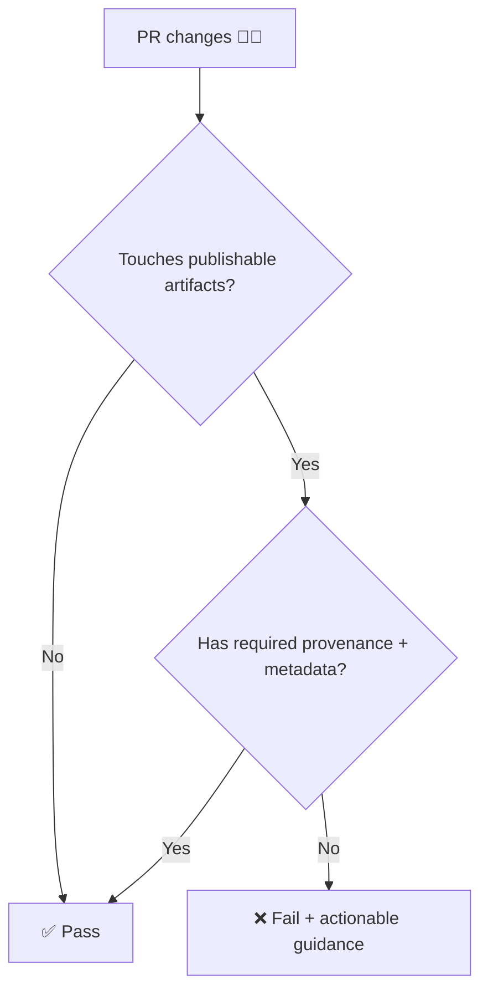

# PR Provenance Gate 🧾🔒  
<sub>📁 Local GitHub Action: <code>./.github/actions/pr-provenance</code></sub>

<p align="left">
  
  
  
  
</p>

> [!IMPORTANT]  
> **KFM is provenance-first.** If a PR adds/updates *publishable artifacts*, it must also add/update the corresponding provenance (and often metadata) so we can always answer: **“How was this produced?”** 🧬

---

## ✨ What this action does

This action validates **Pull Requests** to ensure that changes which impact published or user-facing artifacts are accompanied by the **required provenance + catalog metadata updates**.

Typical use cases:
- ✅ A PR modifies `data/processed/**` → must include matching updates in `data/provenance/**` (and often `data/catalog/**` / `data/stac/**`)
- ✅ A PR adds a new dataset output → must include *new* provenance and registration metadata
- ✅ A PR updates a pipeline output → provenance must reflect the new run + inputs + parameters

---

## 🧠 Quick mental model



---

## 📦 Repository contract (what this gate protects)

KFM’s pipeline expects artifacts to move through a strict lifecycle. This action helps enforce the **“no orphan outputs”** rule.

### 🗂️ Key folders

```text
📦 repo-root/
├─ 📁 data/
│  ├─ 📁 raw/                 # raw inputs (often external references / checksums)
│  ├─ 📁 work/                # intermediate outputs
│  ├─ 📁 processed/           # publishable outputs (GeoJSON/Parquet/etc.)
│  ├─ 📁 provenance/          # PROV lineage docs (sidecars/logs)
│  ├─ 📁 catalog/             # DCAT & other catalog entries
│  └─ 📁 stac/                # STAC collections/items (if used)
└─ 📁 .github/
   └─ 📁 actions/
      └─ 📁 pr-provenance/    # ✅ this action
```

---

## 🚀 Usage

Add it to a PR workflow (example: `.github/workflows/pr.yml`).

```yaml
name: PR Checks

on:
  pull_request:
    types: [opened, synchronize, reopened, ready_for_review]

permissions:
  contents: read
  pull-requests: read

jobs:
  provenance:
    name: Provenance Gate 🧾
    runs-on: ubuntu-latest
    steps:
      - name: Checkout 🧰
        uses: actions/checkout@v4
        with:
          fetch-depth: 0

      - name: PR Provenance Gate 🧾🔒
        uses: ./.github/actions/pr-provenance
        with:
          # See "Inputs" below (exact names depend on action.yml)
          mode: strict
          artifact_glob: data/processed/**
          provenance_dir: data/provenance
          catalog_dir: data/catalog
          stac_dir: data/stac
```

> [!TIP]  
> If your workflow also posts comments to PRs, set `pull-requests: write` and pass a token input (if supported).

---

## 🧩 Inputs

> [!NOTE]  
> **This README documents the intended interface.** The canonical source of truth is `action.yml`.  
> If your input names differ, update this README to match your implementation.

| Input | Type | Default | What it controls |
|------|------|---------|------------------|
| `mode` | string | `strict` | `strict` fails the job; `warn` emits annotations but does not fail |
| `artifact_glob` | string | `data/processed/**` | Which files are treated as “publishable artifacts” |
| `provenance_dir` | string | `data/provenance` | Where provenance (PROV) sidecars/logs live |
| `catalog_dir` | string | `data/catalog` | Where catalog metadata (e.g., DCAT) lives |
| `stac_dir` | string | `data/stac` | Where STAC collections/items live |
| `require_provenance` | boolean | `true` | Whether provenance is required when artifacts change |
| `require_catalog` | boolean | `true` | Whether catalog registration is required when artifacts change |
| `require_stac` | boolean | `false` | Whether STAC updates are required when artifacts change |
| `ignore_glob` | string | *(empty)* | Exclude files (e.g., `**/*.md`, temp outputs) |
| `github_token` | string | *(empty)* | Optional: token for PR annotations/comments (if supported) |

---

## 📤 Outputs

| Output | Type | Meaning |
|--------|------|---------|
| `ok` | boolean | `true` if all checks passed |
| `missing` | string (JSON) | A machine-readable list of missing companion files/requirements |
| `summary` | string (markdown) | A markdown summary suitable for `GITHUB_STEP_SUMMARY` |

---

## 🧾 Provenance expectations (what “good” looks like)

A provenance record should make it easy to reconstruct and audit a build/run:

- 🧩 **Entities:** inputs + outputs (file refs, checksums, source URLs where relevant)
- ⚙️ **Activity:** the pipeline run (what script, when, parameters, environment hints)
- 🧑‍🤝‍🧑 **Agents:** the actor(s) — automated pipeline + human trigger when applicable

### ✅ Suggested filename conventions

Pick one consistent rule and stick to it:

- **Sidecar style:**  
  `data/processed/foo/bar.geojson` → `data/provenance/foo/bar.geojson.prov.json`
- **Basename style:**  
  `data/processed/foo/bar.geojson` → `data/provenance/foo/bar.prov.json`

> [!WARNING]  
> Inconsistent naming is the #1 reason provenance gates become noisy. Standardize early. 🧯

---

## 🧪 Example: adding a dataset (happy path)

<details>
<summary><strong>✅ PR changes</strong> (click to expand)</summary>

- `data/processed/climate/rainfall_1850_2020.geojson` *(new)*
- `data/provenance/climate/rainfall_1850_2020.geojson.prov.json` *(new)*
- `data/catalog/dcat/rainfall_1850_2020.dataset.jsonld` *(new/updated)*
- `data/stac/items/rainfall_1850_2020.json` *(optional; if used)*

</details>

---

## 🧯 Troubleshooting (common failures)

### ❌ “Processed artifact changed but no provenance updated”
**Fix:** add/update the matching `data/provenance/**` file (include new inputs/params/checksums).

### ❌ “Catalog entry missing for new processed output”
**Fix:** register the dataset in `data/catalog/**` (and/or STAC if required).

### ❌ “False positive: this artifact shouldn’t require provenance”
**Fix options:**
- add an `ignore_glob` rule for that path, or
- move the file to a non-published folder (`data/work/**`), or
- mark the file as non-publishable in your workflow configuration

---

## 🔐 Security notes

- This action should run with **minimal permissions** (`contents: read`, `pull-requests: read`).
- If it posts PR comments/annotations, use the smallest scope token possible and avoid exposing secrets in logs.
- Provenance files should **not** contain secrets (keys, tokens, private URLs). 🚫🔑

---

## 🤝 Contributing

- Keep checks **deterministic** and **fast** ⏱️  
- Prefer **actionable errors** (tell contributors *exactly* what file is missing and where it should go)
- Update this README whenever `action.yml` changes ✅

---

## 🧭 Related

- 📘 Project architecture & governance docs (see repo `docs/` and policy rules)
- 🗃️ Data contracts: `data/catalog/`, `data/stac/`, `data/provenance/`
- 🧰 CI workflows: `.github/workflows/`

---
<sub>Made with traceability in mind 🧬✨</sub>
