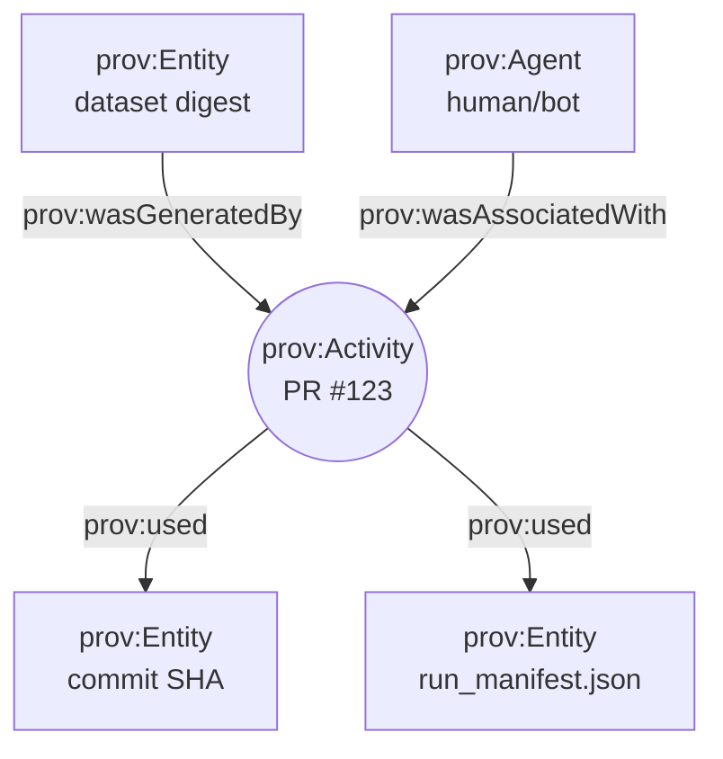

<!-- .github/actions/pr-provenance/README.md -->

# PR Provenance Action 🔏🌾
> **Provenance-first CI gate** for the Kansas Frontier Matrix (KFM): **Detect → Validate → Promote** with receipts. ✅🧾


---

## What this action does 🧭
`pr-provenance` is a **local GitHub Action** used in KFM workflows to:

- 🧾 **Generate provenance artifacts** for each PR (W3C PROV JSON-LD + summary report)
- 🚦 **Enforce Policy Gates** (OPA/Conftest style) so changes **fail closed** when governance rules aren’t met
- 🧩 **Map DevOps → PROV** so PR activity becomes queryable lineage (PR = Activity, commits/artifacts = Entities, humans/bots = Agents)
- 🔐 (Optional) **Attach supply-chain evidence** (SBOM / SLSA-style attestations, signatures) for trusted automation

KFM’s non-negotiable principle: **nothing is a black box**—not data, not pipelines, not AI answers, and not PR history. 🌾✨

---

## Why this exists 🌱
KFM’s platform spans:
- geospatial datasets (PMTiles, GeoParquet, COGs),
- catalogs (STAC/DCAT),
- provenance (PROV),
- stories (evidence manifests),
- AI features (Focus Mode citations + governance),
- and a growing automation stack (Watcher → Planner → Executor).

All of that only works if every PR preserves:
- ✅ **traceability**
- ✅ **licensing**
- ✅ **sensitivity classification**
- ✅ **reproducibility**
- ✅ **auditable lineage**

So this action exists to **block merges that would break chain-of-custody** and to **emit machine-readable receipts** for everything that gets promoted.

---

## Quick start 🚀

Add to a PR workflow (recommended on `pull_request`):

```yaml
name: PR Provenance

on:
  pull_request:
    types: [opened, synchronize, reopened, ready_for_review]

permissions:
  contents: read
  pull-requests: write
  actions: read
  id-token: write # only needed if you enable signing/attestations

jobs:
  provenance:
    runs-on: ubuntu-latest
    steps:
      - uses: actions/checkout@v4

      - name: Run PR Provenance
        uses: ./.github/actions/pr-provenance
        with:
          mode: enforce                # enforce | report-only
          policy_dir: tools/validation/policy
          emit_prov: true
          emit_summary: true
          comment_on_pr: true
          sign_artifacts: false        # set true if you wire cosign/OIDC
```

> 💡 **Tip:** Start with `mode: report-only` to see what it would enforce, then flip to `enforce` once the repo is compliant.

---

## Inputs 🧩
> **Source of truth is `action.yml`.** This README documents the intended interface and common knobs.

| Input | Type | Default | What it controls |
|------|------|---------|------------------|
| `mode` | string | `enforce` | `enforce` fails the job on violations; `report-only` never fails, only reports |
| `policy_dir` | path | `tools/validation/policy` | Where Rego/Conftest policies live (Policy Pack) |
| `emit_prov` | bool | `true` | Emit PROV JSON-LD mapping PR → lineage |
| `emit_summary` | bool | `true` | Emit a human-readable summary markdown |
| `comment_on_pr` | bool | `false` | Post a PR comment with the provenance summary |
| `fail_on_warnings` | bool | `false` | Treat warnings as failures (hard mode) |
| `sign_artifacts` | bool | `false` | Enable cosign/OIDC signing for generated attestations (if configured) |
| `artifact_dir` | path | `artifacts/pr-provenance` | Output folder for reports/JSON |
| `changed_paths` | string | *(auto)* | Override changed file discovery (advanced / debugging) |

---

## Outputs 📦

### Files produced (typical)
```text
🧾 artifacts/pr-provenance/
├─ summary.md                  # what happened + what failed
├─ pr.prov.jsonld              # PR mapped to W3C PROV
├─ run_manifest.json           # structured receipt (hashable)
├─ policy_report.json          # machine-readable policy results
└─ attestations/               # optional
   ├─ sbom.spdx.json
   └─ slsa.intoto.jsonl
```

### Job annotations
- ✅ Pass: provenance artifacts uploaded / summary posted (if enabled)
- ❌ Fail: policy gates violated (missing license, missing provenance, sensitivity violation, etc.)

---

## How it works ⚙️

```mermaid
flowchart LR
  PR[🔀 Pull Request] --> D[🛰️ Detect changes]
  D --> C[🧠 Classify change types]
  C --> P[🚦 Policy Gates<br/>OPA + Conftest]
  C --> M[🧾 Run Manifest<br/>(canonical JSON + SHA-256)]
  M --> V[🔗 PROV JSON-LD<br/>(PR → Activity)]
  P -->|pass| R[📦 Upload artifacts]
  P -->|fail| F[❌ Fail closed (block merge)]
  V --> R
  R --> S[💬 Optional PR comment]
  R --> O[🔐 Optional signing / attestations]
```

### Step-by-step (conceptual)
1. **Detect** changed files in the PR (catalogs, data, pipelines, stories, UI, AI configs).
2. **Classify** risk and required artifacts:
   - Data/catalog changes ⇒ require STAC/DCAT/PROV completeness.
   - New/updated dataset artifacts ⇒ require checksums/digests and licensing.
   - Story changes ⇒ require evidence manifests for citations.
   - AI changes ⇒ require governance/citation guardrails (no ungrounded outputs).
3. **Validate** via Policy Pack (fail closed by default).
4. **Emit** a **Run Manifest** (structured receipt) and **PROV JSON-LD** record.
5. **Publish** artifacts to workflow outputs (and optionally sign/attest).

---

## What gets enforced ✅🚫
KFM’s governance is implemented as **Policy Gates**. This action is the “PR-shaped entry point” for those rules.

### Minimum policy gates (baseline)
- 🧬 **Schema validation** (metadata and structured files)
- 🗂️ **STAC/DCAT/PROV completeness** (required fields must exist)
- 📜 **License presence** (no dataset without an approved license string)
- 🧯 **Sensitivity classification** (sensitive data must be flagged + handled correctly)
- 🔗 **Provenance completeness** (inputs + processing steps declared)
- 🧷 **No secrets in diffs** (block API keys, tokens, credentials patterns)
- 🧑‍⚖️ **FAIR + CARE safety rails** (authority/ethics checks for sensitive locations)

> ⚠️ **Fail-closed default:** If required provenance/metadata isn’t present, the job fails and the PR can’t merge.

---

## Provenance model 🧾➡️🕸️
KFM treats **DevOps history** like first-class data.

### Mapping concept
- `prov:Activity` = PR event (open/sync/merge) or “promotion” action
- `prov:Entity` = commits, catalogs, artifacts (files, digests), manifests
- `prov:Agent` = author, reviewers, bots (Watcher/Planner/Executor)



This lets KFM answer things like:
- “Which PR produced this dataset artifact?” 🔎
- “Who reviewed the pipeline that generated this layer?” 👥
- “Which stories relied on this dataset revision?” 📚

---

## Evidence-first stories 🧠📚
KFM stories (Story Nodes) are not “just markdown blobs” — they’re **traceable objects**.

If a PR touches story content, this action can require:
- ✅ an **evidence manifest** (YAML/JSON) mapping claims/citations → sources
- ✅ resolvable references (no broken links / missing files)
- ✅ provenance links so “story uses dataset” becomes queryable lineage

> Think: “research paper discipline,” but enforced in CI. 🧾✨

---

## Geospatial artifacts: hashes, packages, and registries 🗺️📦
KFM data products commonly include:
- PMTiles (fast web maps)
- GeoParquet (analytics-friendly)
- Cloud-Optimized GeoTIFFs (COGs)
- (future) 3D Tiles / AR-ready datasets

This action supports (or is designed to support) integration where:
- artifacts are **content-addressed** (digests/checksums)
- catalogs reference immutable digests
- (optional) artifacts are pushed to an **OCI registry** and **signed** (cosign/OIDC)

This matters because KFM’s UI can surface:
- “Source: …”
- “License: …”
- “Prepared by KFM on …”
- “Digest: …”
…directly in layer info/provenance panels. 🧩🔍

---

## Repo layout expectations 🧱📁
Your actual repo may vary, but KFM’s conventions generally look like:

```text
📦 repo-root/
├─ data/
│  ├─ catalog/           # DCAT / STAC metadata source of truth
│  ├─ processed/         # versioned outputs (GeoParquet, etc.)
│  └─ prov/              # PROV records (JSON-LD)
├─ stories/
│  ├─ nodes/             # story markdown
│  └─ evidence/          # evidence manifests (YAML/JSON)
├─ tools/
│  └─ validation/
│     └─ policy/         # OPA / Conftest policies (.rego)
└─ .github/
   └─ actions/
      └─ pr-provenance/
         ├─ action.yml
         ├─ README.md     👈 you are here
         └─ scripts/      # helpers (optional)
```

---

## Security model 🔐
### Recommended permissions
| Permission | Why |
|---|---|
| `contents: read` | checkout + diff |
| `pull-requests: write` | optional PR comment |
| `id-token: write` | only if signing/attesting via OIDC |
| `actions: read` | upload/download artifacts |

### Safety notes
- ✅ Avoid running privileged workflows on untrusted forks unless sandboxed.
- ✅ Treat provenance files as **audit artifacts**—don’t embed secrets.
- ✅ Keep policies versioned alongside code so you can answer: “Which rules were in effect?” 📜

---

## Troubleshooting 🧰

<details>
<summary><b>❌ “Missing license field”</b></summary>

**Meaning:** Your catalog metadata is missing a license string (or it’s not approved).

**Fix:** Add a license in STAC/DCAT metadata using an allowed identifier (often SPDX-style), then re-run CI.

</details>

<details>
<summary><b>❌ “Provenance required” / “PROV missing”</b></summary>

**Meaning:** A PR added/updated a dataset but didn’t add a PROV record linking it to sources + processing.

**Fix:** Add `data/prov/<something>.prov.jsonld` (or your repo’s equivalent) and ensure it references:
- input source entities (URLs/files)
- the activity (pipeline step)
- the resulting dataset entity
- the agent (human or bot)

</details>

<details>
<summary><b>❌ “Sensitive data policy violation”</b></summary>

**Meaning:** A dataset appears to include sensitive locations/attributes without required protections.

**Fix:** Classify appropriately (restricted/private), aggregate/redact, and add required review flags.

</details>

<details>
<summary><b>❌ “Secrets detected”</b></summary>

**Meaning:** Something in the diff matches credential patterns.

**Fix:** Remove immediately. Rotate the secret if it was real. Add safer configuration via GitHub Secrets or vault tooling.

</details>

---

## Extending the action 🧪
Want a new rule?

1. Add/modify Rego policies in: `tools/validation/policy/`
2. Add fixtures and tests for the policy (recommended)
3. Update this README “What gets enforced” section
4. Ship via PR (policies are versioned + reviewable)

> Governance changes should be intentional and auditable—**rules are part of the product**. ⚖️

---

## Design lineage 📚✨
This action is aligned with KFM’s broader architecture across data intake, mapping/UI, AI governance, and DevOps transparency. Key design sources used to shape this README:

- 📘 **Kansas Frontier Matrix (KFM) – Comprehensive Technical Documentation**
- 🧱 **Kansas Frontier Matrix (KFM) – Comprehensive Architecture, Features, and Design**
- 🧭🤖 **Kansas Frontier Matrix (KFM) – AI System Overview**
- 🎛️ **Kansas Frontier Matrix – Comprehensive UI System Overview**
- 📥 **KFM Data Intake – Technical & Design Guide**
- 🌟 **KFM – Latest Ideas & Future Proposals**
- 💡 **Innovative Concepts to Evolve the KFM**
- 🧠 **AI Concepts & more** (portfolio reference library)
- 🗺️ **Maps / Google Maps / Virtual Worlds / Archaeology / WebGL** (portfolio reference library)
- 🧬 **Data Management / Data Science / Bayesian Methods** (portfolio reference library)
- 🧰 **Various programming languages & resources** (portfolio reference library)
- 🧩 **Additional Project Ideas** (evidence manifests, run manifests, OCI artifacts, signing)

---

## License 📝
This action is part of the KFM repository and inherits the repo’s licensing and governance policies.

> 🌾 If it can’t be traced, it can’t be trusted.
