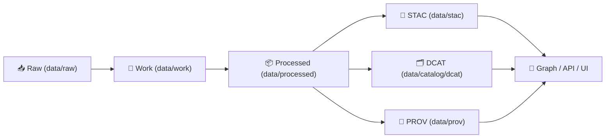

# 🛡️ Provenance Guard (Local GitHub Action)


> **Purpose:** Block merges when a PR adds/changes published datasets without the required **PROV lineage** (and optionally the companion metadata “boundary artifacts”).

KFM’s pipeline is *provenance-first*: **no data is considered “published” unless it’s traceable**. 🚦  
This action is the CI gate that enforces that rule at review time.

---

## ✨ What this action checks

At a high level, `provenance-guard` inspects the diff and verifies that changes to **published outputs** are accompanied by the required provenance artifacts.

Typical checks include:

- ✅ **Provenance presence:** any new/changed `data/processed/**` asset must have a matching PROV record in `data/prov/**` (or `data/provenance/**`, if configured).
- ✅ **Basic PROV sanity:** PROV files are valid JSON, non-empty, and include minimum lineage structure (**Entities → Activities → Agents**).
- ✅ **End-to-end lineage expectation:** PROV connects **raw → work → processed** (where applicable).
- ✅ **Optional cross-layer alignment:** enforce that dataset publication includes the other “boundary artifacts”:
  - 🧭 STAC (`data/stac/items/**`, `data/stac/collections/**`)
  - 🗂️ DCAT (`data/catalog/dcat/**`)
  - 🧬 PROV (`data/prov/**`)

> [!NOTE]
> The definitive contract (inputs/outputs/defaults) should live in **`action.yml`** in this same folder. This README describes the intended behavior and common workflow patterns.

---

## 🗺️ Where it fits in KFM



`provenance-guard` sits at the **PR gate**, ensuring the catalogs stay aligned and nothing “published” ships without lineage. 🧷

---

## 🚀 Quickstart

### ✅ Recommended PR workflow usage

```yaml
name: Provenance Guard

on:
  pull_request:

jobs:
  provenance-guard:
    runs-on: ubuntu-latest
    steps:
      - name: 📦 Checkout (full history for diff)
        uses: actions/checkout@v4
        with:
          fetch-depth: 0

      - name: 🛡️ Provenance Guard
        uses: ./.github/actions/provenance-guard
        with:
          # Recommended: be explicit for PRs
          base_sha: ${{ github.event.pull_request.base.sha }}
          head_sha: ${{ github.event.pull_request.head.sha }}

          # Defaults typically match KFM v13 layout
          processed_glob: "data/processed/**"
          prov_dir: "data/prov"
          # If your repo still uses the older folder name:
          # prov_dir: "data/provenance"

          # Optional enforcement
          require_stac: true
          require_dcat: true
          strict: true
```

> [!TIP]
> If you see “missing base commit” / “unknown revision” errors, it’s almost always because checkout used a shallow fetch. Use `fetch-depth: 0`.

---

## 🧩 Inputs

> **Source of truth:** `./action.yml`  
> These inputs are the *intended interface* and should be kept in sync with `action.yml`.

| Input | Required | Default | Description |
|------|----------|---------|-------------|
| `base_sha` | ⚠️ recommended | *(auto)* | Base commit SHA for diff (PR base / push “before”). |
| `head_sha` | ⚠️ recommended | *(auto)* | Head commit SHA for diff (PR head / push `github.sha`). |
| `processed_glob` | ❌ | `data/processed/**` | Which files count as “published outputs”. |
| `prov_dir` | ❌ | `data/prov` | Root folder for PROV bundles. (Older layouts may use `data/provenance`.) |
| `prov_exts` | ❌ | `.prov.json,.prov.jsonld` | Allowed PROV file extensions. |
| `require_stac` | ❌ | `false` | Also require STAC entries for changed/added datasets. |
| `require_dcat` | ❌ | `false` | Also require DCAT entries for changed/added datasets. |
| `strict` | ❌ | `true` | Fail if any required artifact is missing or malformed. |
| `soft_fail` | ❌ | `false` | Report findings but do not fail the workflow (useful for audits). |
| `report_path` | ❌ | `artifacts/provenance-guard/report.json` | Write a machine-readable JSON report here. |
| `debug` | ❌ | `false` | Print extra diagnostics (diff listing, match decisions). |

---

## 📤 Outputs

| Output | Description |
|--------|-------------|
| `status` | `pass` / `fail` |
| `changed_assets` | Newline- or JSON-list of changed `data/processed/**` assets detected |
| `missing_prov` | Newline- or JSON-list of missing provenance files |
| `report_path` | Where the JSON report was written (if enabled) |

---

## 📚 Provenance conventions (KFM default)

### 📌 Canonical folders (v13)
- `data/raw/<domain>/` — source ingests  
- `data/work/<domain>/` — intermediate outputs  
- `data/processed/<domain>/` — publish-ready outputs  
- `data/stac/collections/` + `data/stac/items/` — STAC catalogs  
- `data/catalog/dcat/` — DCAT dataset entries  
- `data/prov/` — PROV lineage bundles ✅

### 🧬 What a PROV bundle should capture
A PROV record should make it easy to answer:

- **What inputs** produced this output? (entities)
- **Which transformation** produced it? (activity)
- **Who/what ran it** and with what version/config? (agents + commit hash/run id)

> [!TIP]
> When possible, include:
> - input/output paths
> - timestamps
> - commit hash / pipeline version
> - parameters or config file references
> - checksums or stable IDs for artifacts

---

## 🧨 Common failure messages (and how to fix)

### ❌ “Missing PROV for processed asset”
✅ Fix by adding a provenance file that matches the asset.

Example expectation (default mapping):

```
data/processed/<domain>/my_dataset.parquet
data/prov/<domain>/my_dataset.prov.json
```

### ❌ “PROV file not valid JSON”
✅ Fix by ensuring the file parses cleanly (no trailing commas, valid quoting).

### ❌ “Strict mode: missing STAC/DCAT”
✅ Fix by adding/updating:
- `data/stac/items/...` and/or `data/stac/collections/...`
- `data/catalog/dcat/...`

If you are intentionally staging work and don’t want enforcement yet, set:

```yaml
with:
  require_stac: false
  require_dcat: false
  strict: false
```

(Use sparingly—KFM’s default posture is strict. 🚧)

---

## 🧪 Local development & testing

If you’re changing the action logic itself:

1. Open `./action.yml` and identify the runner script/entrypoint.
2. Reproduce the action’s diff inputs locally:

```bash
git fetch --all --tags
BASE=<base_sha>
HEAD=<head_sha>

# Then run the same command used in action.yml (example):
# ./scripts/provenance_guard.sh --base "$BASE" --head "$HEAD"
```

> [!NOTE]
> Keep changes deterministic and CI-friendly: avoid network calls unless absolutely necessary, and prefer repo-local validation.

---

## 🔐 Security notes

- This action is a **quality & governance gate**, not a full security scanner.
- It should run alongside:
  - secret scanning
  - dependency review
  - policy checks (OPA/Conftest), if enabled

---

## 🔗 Related KFM docs (recommended reading)

- 📘 Master guide: `../../../docs/MASTER_GUIDE_v13.md`
- 🧭 STAC profile: `../../../docs/standards/KFM_STAC_PROFILE.md`
- 🗂️ DCAT profile: `../../../docs/standards/KFM_DCAT_PROFILE.md`
- 🧬 PROV profile: `../../../docs/standards/KFM_PROV_PROFILE.md`
- 🧱 Markdown work protocol: `../../../docs/standards/KFM_MARKDOWN_WORK_PROTOCOL.md`

---

## 🧷 Repo location

```text
📁 .github/actions/provenance-guard/
├─ 📄 action.yml
├─ 📄 README.md   ← you are here
└─ (scripts / src / tests …)
```

---

### ✅ “Definition of Done” for a dataset PR

- [ ] Output assets are under `data/processed/<domain>/...`
- [ ] STAC Item/Collection updated (if applicable)
- [ ] DCAT entry updated
- [ ] PROV bundle added/updated (**required**)
- [ ] CI passes (including provenance-guard) 🟢
