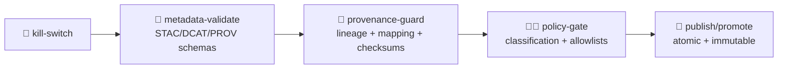

<a id="top"></a>

# 🧬🧾 `provenance-guard` — PROV + Lineage Enforcement Gate (KFM)

[](#-what-this-action-does)


> **Purpose:** make it impossible to “ship mystery artifacts.”  
> If something is **promoted** (data/catalog/story/model output), it must be **traceable**: inputs → transforms → outputs, with **W3C PROV** + **stable IDs** + (recommended) **checksums**.
>
> 🧭 KFM order stays sacred: **ETL → Metadata (STAC/DCAT/PROV) → Graph → API → UI → Story Nodes → Focus Mode**  
> This action protects the **metadata boundary** and prevents downstream trust collapse. ✅🧾

---

## 🧾 Action metadata

| Field | Value |
|---|---|
| Action name | `kfm/provenance-guard` |
| Action type | Composite Action |
| Folder | 📁 `.github/actions/provenance-guard/` |
| Action file | 📄 `.github/actions/provenance-guard/action.yml` *(expected)* |
| Docs | 📄 `.github/actions/provenance-guard/README.md` |
| Status | ✅ Active (spec + operating guide) |
| Last updated | **2026-01-10** |
| Default posture | 🧯 **Fail-closed** in promotion lanes |
| Typical lane | 🌙 nightly + 🚀 promotion (optional in PR lane) |

---

## ⚡ Quick links

| Need | Go |
|---|---|
| 🧩 Actions hub | 📄 [`../README.md`](../README.md) |
| 🤖 Workflows hub | 📄 [`../../workflows/README.md`](../../workflows/README.md) |
| 🧯 Kill switch | 📄 [`../kill-switch/README.md`](../kill-switch/README.md) |
| ✅ Fast catalog gate | 📄 [`../catalog-qa/README.md`](../catalog-qa/README.md) |
| 🧾 Full metadata validation | 📄 [`../metadata-validate/README.md`](../metadata-validate/README.md) |
| 🧑‍⚖️ Policy-as-code | 📄 [`../policy-gate/README.md`](../policy-gate/README.md) |
| 🧭 Governance scan | 📄 [`../governance-scan/README.md`](../governance-scan/README.md) |
| 🧾 Build traceability | 📄 [`../build-info/README.md`](../build-info/README.md) |
| 🛡️ Security policy | 📄 [`../../../SECURITY.md`](../../../SECURITY.md) |

---

<details>
<summary><strong>📌 Table of contents</strong></summary>

- [🎯 What this action does](#-what-this-action-does)
- [🧠 Why provenance is a *security* control in KFM](#-why-provenance-is-a-security-control-in-kfm)
- [🧭 Where it fits in the KFM pipeline](#-where-it-fits-in-the-kfm-pipeline)
- [🔎 What it checks](#-what-it-checks)
- [⚙️ Inputs](#️-inputs)
- [📤 Outputs](#-outputs)
- [📦 Output files](#-output-files)
- [✅ Usage patterns](#-usage-patterns)
- [🧪 Local developer run](#-local-developer-run)
- [🧩 Target folder shape](#-target-folder-shape)
- [🧯 Troubleshooting](#-troubleshooting)
- [🔐 Safety notes](#-safety-notes)
- [📚 Reference library](#-reference-library)

</details>

---

## 🎯 What this action does

`provenance-guard` is a **repo-local composite action** that enforces a simple but powerful rule:

> If an artifact is promoted, it must be **auditable**.

### ✅ Key capabilities (expected)
- 🧬 Detects “promotion-scope” artifacts (configurable paths/globs)
- 🧾 Requires a matching **PROV** record for promoted outputs
- 🔗 Checks **ID alignment** between:
  - 🗂️ STAC Items/Collections
  - 🗃️ DCAT datasets/distributions
  - 🧬 PROV entities/activities
- 🧠 Enforces “minimum provenance payload” (configurable):
  - activity exists (what ran)
  - agent exists (who/what ran it)
  - inputs used (sources)
  - outputs generated (what changed)
  - parameters + tool versions (recommended)
- 🧷 Optional checksum enforcement (recommended for big assets)
- 🧯 Fail-closed behavior for promotion lanes (no partial publish)

> [!TIP]
> Think of this as the **lineage guardrail** that keeps downstream systems honest:
> 🕸️ graph ingest • 🔌 API • 🖥️ UI • 🎬 story nodes • 🧠 focus mode

---

## 🧠 Why provenance is a *security* control in KFM

KFM is not just code—it’s **data + catalogs + narratives + models**.

Without provenance:
- a malicious or accidental change can slip into a catalog (supply-chain risk)
- “facts” in stories become un-auditable
- model outputs become “vibes” instead of evidence
- incident response becomes guesswork

With provenance:
- ✅ you can answer: *what changed, who did it, why, using what inputs & tools?*
- ✅ you can roll back safely
- ✅ you can prove “restricted in → not public out” behavior

> 🧾 In KFM, provenance is not decoration—it’s the **trust substrate**.

---

## 🧭 Where it fits in the KFM pipeline

This action is intended to run **after schema validation** and **before promotion/publish**.



> [!IMPORTANT]
> If `provenance-guard` fails, publishing MUST stop.  
> No “we’ll add provenance later.” 🚫🧾

---

## 🔎 What it checks

> Each check should emit a **rule ID** so CI failures are searchable and stable.

### 1) 🧬 Provenance required for promoted outputs
**Rule examples:**
- `PROV_MISSING_FOR_OUTPUT`
- `PROV_EMPTY_RUN`
- `PROV_ORPHAN_OUTPUT`

Checks:
- every promoted output has a corresponding PROV file
- PROV references include the output (stable ID or path mapping)

---

### 2) 🔗 ID & reference integrity (STAC/DCAT/PROV alignment)
**Rule examples:**
- `ID_MISMATCH_STAC_PROV`
- `ID_MISMATCH_DCAT_STAC`
- `BROKEN_MAPPING_OUTPUT_ASSET`

Checks:
- STAC item ID ↔ PROV entity ID mapping exists
- DCAT distribution points to STAC or asset hrefs consistently
- no “dangling” referenced IDs

---

### 3) 🧠 Minimum provenance payload (what ran, with what)
**Rule examples:**
- `PROV_MISSING_ACTIVITY`
- `PROV_MISSING_AGENT`
- `PROV_MISSING_INPUTS`
- `PROV_MISSING_PARAMETERS` *(strict lanes)*

Checks:
- at least one activity exists
- at least one agent exists
- activity uses inputs
- activity generates outputs
- optional: tool versions + parameters captured (especially for ETL/model runs)

---

### 4) 🧾 Checksums (optional but recommended)
**Rule examples:**
- `CHECKSUM_MISSING`
- `CHECKSUM_MISMATCH`
- `ASSET_SIZE_MISSING`

Checks:
- promoted outputs have checksums (either in STAC assets, a `checksums.sha256`, or PROV fields)
- (optional) checksum matches local file
- size present for large assets

---

### 5) 🧭 Classification propagation hooks (integration-friendly)
This action does **not** replace policy-as-code, but it can enforce **presence** of required hooks.

**Rule examples:**
- `CLASSIFICATION_MISSING_TAG`
- `CLASSIFICATION_MISSING_ON_PROV_ENTITY`

Checks:
- provenance includes a classification/sensitivity field (if profile requires it)
- promoted artifacts include a declared sensitivity (public/internal/restricted)

> For the *actual* propagation logic (“no output less restricted than input”), use 🧑‍⚖️ `policy-gate`.

---

## ⚙️ Inputs

> Inputs are strings. Use `"true"` / `"false"`.

| Input | Required | Default | Meaning |
|---|---:|---|---|
| `mode` | ❌ | `pr` | `pr` / `nightly` / `promotion` (controls strictness) |
| `root` | ❌ | `data/` | Root for resolving paths |
| `promoted_paths` | ❌ | `data/processed/**,data/catalog/**,docs/reports/story_nodes/published/**,mcp/**` | Where “promotion-scope” artifacts live |
| `prov_root` | ❌ | `data/prov/` | Where PROV records live |
| `prov_glob` | ❌ | `**/*.json*` | PROV file glob |
| `mapping_mode` | ❌ | `id_or_path` | `id_or_path` / `id_only` / `path_only` |
| `require_activity` | ❌ | `"true"` | Require at least one activity |
| `require_agent` | ❌ | `"true"` | Require at least one agent |
| `require_inputs` | ❌ | `"true"` | Require `used` relations |
| `require_parameters` | ❌ | `"false"` | Strict lane toggle |
| `require_tool_versions` | ❌ | `"false"` | Strict lane toggle |
| `require_checksums` | ❌ | `"false"` | Strongly recommended for promotion |
| `checksums_file` | ❌ | `out/checksums.sha256` | Optional checksum manifest path |
| `fail_on_warn` | ❌ | `"true"` | If `"true"`, warnings fail the run |
| `report_dir` | ❌ | `out/provenance-guard` | Report directory |
| `max_files` | ❌ | `5000` | Safety cap |
| `dry_run` | ❌ | `"false"` | Report only; never fails |

---

## 📤 Outputs

| Output | Meaning |
|---|---|
| `ok` | `"true"` if passed (or `dry_run=true`) |
| `error_count` | Integer-like string |
| `warning_count` | Integer-like string |
| `report_json` | Path to JSON report |
| `report_md` | Path to Markdown summary |

---

## 📦 Output files

Expected output layout:

```text
📁 out/
└─ 🧬📁 provenance-guard/
   ├─ 🧾 provenance-guard.json
   ├─ 📄 provenance-guard.md
   └─ 📁 findings/
      ├─ 🧬 prov-missing.csv
      ├─ 🔗 id-mismatches.csv
      └─ 🧾 checksum-issues.csv
```

Report rules:
- deterministic ordering (diffable)
- no secrets, no sensitive coordinates printed
- failures include rule IDs + file paths + IDs only

---

## ✅ Usage patterns

### 1) 🧪 PR lane (optional, scoped)
Use when PRs touch promoted paths:

```yaml
name: Provenance Guard

on:
  pull_request:
    paths:
      - "data/processed/**"
      - "data/catalog/**"
      - "data/prov/**"
      - "mcp/**"
      - "docs/reports/story_nodes/published/**"
      - ".github/actions/provenance-guard/**"
  workflow_dispatch:

permissions:
  contents: read

jobs:
  prov:
    runs-on: ubuntu-latest
    timeout-minutes: 12

    steps:
      - uses: actions/checkout@v4

      - name: 🧬 Provenance guard (PR)
        uses: ./.github/actions/provenance-guard
        with:
          mode: pr
          require_checksums: "false"
          require_parameters: "false"

      - name: 📦 Upload report
        uses: actions/upload-artifact@v4
        if: always()
        with:
          name: provenance-guard-${{ github.sha }}
          path: out/provenance-guard/**
```

---

### 2) 🚀 Promotion lane (required, strict)
Use right before publish:

```yaml
steps:
  - uses: actions/checkout@v4

  - name: 🧯 Kill switch
    uses: ./.github/actions/kill-switch
    with:
      scope: publish
      behavior: fail

  - name: 🧾 Metadata validate (schemas)
    uses: ./.github/actions/metadata-validate
    with:
      mode: promotion
      fail_on_warn: "true"

  - name: 🧬 Provenance guard (strict)
    uses: ./.github/actions/provenance-guard
    with:
      mode: promotion
      require_checksums: "true"
      require_parameters: "true"
      require_tool_versions: "true"
      fail_on_warn: "true"
```

---

### 3) 🧠 Modeling lane (MCP artifacts are first-class)
If you publish experiment outputs:

```yaml
- name: 🧬 Provenance guard for MCP
  uses: ./.github/actions/provenance-guard
  with:
    promoted_paths: |
      mcp/**
    require_parameters: "true"
    require_checksums: "true"
```

> [!NOTE]
> Treat model outputs as governed artifacts: provenance + metrics + manifest + (recommended) model card.

---

## 🧪 Local developer run

If your implementation lives in a repo tool (recommended), keep CI and local parity:

```bash
python3 tools/validation/provenance_guard/run_provenance_guard.py \
  --mode promotion \
  --root data \
  --promoted-paths "data/processed,data/catalog,data/prov,mcp,docs/reports/story_nodes/published" \
  --prov-root data/prov \
  --require-checksums \
  --require-parameters \
  --require-tool-versions \
  --out out/provenance-guard
```

> Keep the CLI deterministic: stable ordering, stable rule IDs, stable output shapes.

---

## 🧩 Target folder shape

```text
📁 .github/
└─ 🧩📁 actions/
   └─ 🧬📁 provenance-guard/
      ├─ 📄 action.yml
      └─ 📄 README.md
```

---

## 🧯 Troubleshooting

### “PROV missing for output”
- Ensure your pipeline emits a PROV record per run
- Ensure the PROV output entity matches:
  - the STAC `id`, or
  - the output file path, depending on `mapping_mode`

### “ID mismatch (STAC ↔ PROV)”
- Confirm you’re using stable IDs:
  - `kfm.ks.<domain>.<layer>.<time>.<version>`
- Confirm the same ID appears in:
  - STAC item/collection
  - PROV entity `id` (or mapped field)

### “Checksum missing”
- Generate `checksums.sha256` (recommended in promotion lanes)
- Or include checksum fields in STAC `assets` and/or PROV entities

### “Too slow in PRs”
- Scope `promoted_paths` to just what changed
- Keep strict checks (checksums/tool versions) in nightly/promotion lanes

---

## 🔐 Safety notes

- ✅ Prefer offline-first checks. Provenance checks should not fetch remote assets.
- ✅ Never print secrets or sensitive coordinates in reports.
- ✅ In fork PRs, do not use secrets or publish permissions.
- 🧯 Treat provenance failures as **merge blockers** for promoted artifacts.

---

## 📚 Reference library

> These project files shape provenance-guard’s philosophy: reproducibility, auditability, governance, and trust.

<details>
<summary><strong>📦 KFM reading pack (project files)</strong></summary>

### 🧭 Canonical KFM system direction
- 📄 `docs/specs/Kansas Frontier Matrix (KFM) – Comprehensive Technical Documentation.docx`
- 📄 `docs/specs/MARKDOWN_GUIDE_v13.md(.gdoc)`
- 📄 `docs/specs/Scientific Method _ Research _ Master Coder Protocol Documentation.pdf`
- 📄 `docs/specs/Latest Ideas.pdf`

### 🧪 Reproducibility, V&V, and scientific discipline
- 📄 `docs/library/Scientific Modeling and Simulation_ A Comprehensive NASA-Grade Guide.pdf`
- 📄 `docs/library/Understanding Statistics & Experimental Design.pdf`
- 📄 `docs/library/think-bayes-bayesian-statistics-in-python.pdf`

### 🗺️ GIS + data integrity at scale
- 📄 `docs/library/python-geospatial-analysis-cookbook.pdf`
- 📄 `docs/library/PostgreSQL Notes for Professionals - PostgreSQLNotesForProfessionals.pdf`
- 📄 `docs/library/Cloud-Based Remote Sensing with Google Earth Engine-Fundamentals and Applications.pdf`

### ❤️ Governance & classification thinking
- 📄 `docs/library/Data Spaces.pdf`
- 📄 `docs/library/Introduction to Digital Humanism.pdf`

</details>

---

<p align="right"><a href="#top">⬆️ Back to top</a></p>

