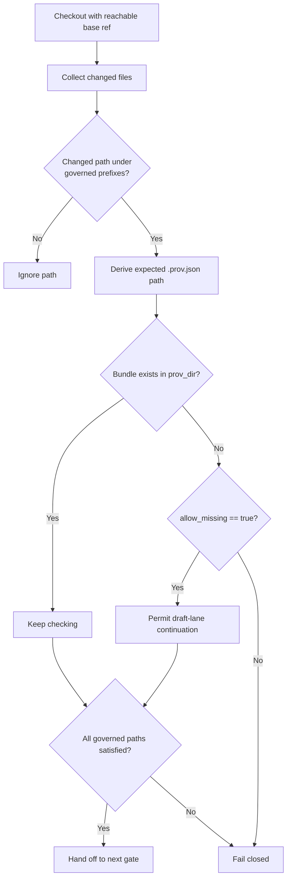

<!-- [KFM_META_BLOCK_V2]
doc_id: kfm://doc/NEEDS-VERIFICATION
title: provenance-guard
type: standard
version: v1
status: draft
owners: NEEDS VERIFICATION
created: YYYY-MM-DD
updated: 2026-04-09
policy_label: NEEDS VERIFICATION
related: [./action.yml, NEEDS_VERIFICATION: adjacent .github/actions index, NEEDS_VERIFICATION: consuming workflow documentation]
tags: [kfm, github-actions, provenance, prov, ci, governance]
notes: [Drafted from attached KFM doctrine and reusable-action design notes; mounted repo tree, current action.yml, workflow inventory, tests, and ownership were not directly visible in this session.]
[/KFM_META_BLOCK_V2] -->

# provenance-guard

Fail-closed composite action contract for checking that changed KFM artifacts carry linked W3C PROV evidence before promotion-facing CI continues.

> [!NOTE]
> **Status:** experimental  
> **Owners:** NEEDS VERIFICATION  
>      
> **Quick jumps:** [Scope](#scope) · [Repo fit](#repo-fit) · [Accepted inputs](#accepted-inputs) · [Exclusions](#exclusions) · [Directory tree](#directory-tree) · [Quickstart](#quickstart) · [Usage](#usage) · [Decision flow](#decision-flow) · [Reference tables](#reference-tables) · [Task list](#task-list--definition-of-done) · [FAQ](#faq) · [Appendix](#appendix--open-verification-items)  
> **Repo fit:** `.github/actions/provenance-guard/` → sibling: [`./action.yml`](./action.yml) *(named in corpus; mounted file NEEDS VERIFICATION)* · likely consumers: [`../../workflows/kfm__policy_gates.yml`](../../workflows/kfm__policy_gates.yml) and lane workflows *(caller inventory NEEDS VERIFICATION in current session)*

> [!IMPORTANT]
> This action is a **guard**, not a provenance generator, catalog compiler, or publish step.
>
> The current corpus supports a narrow responsibility: if a pull request changes governed artifact paths, the action should verify that matching PROV bundles exist and fail closed when they do not.

> [!WARNING]
> Current-session workspace inspection was **PDF-only**. Treat any claim about the mounted `action.yml`, exact workflow wiring, fixture coverage, or active merge-blocking enforcement as **NEEDS VERIFICATION** unless you re-open the repository tree directly.

## Scope

`provenance-guard` exists to keep KFM's promotion and publication path evidence-linked.

Within the evidence currently visible, the action's intended job is to:

- inspect changed files in a PR or branch comparison
- focus on KFM artifact lanes that should not move forward without provenance
- derive the expected `.prov.json` path for each changed artifact
- fail when required provenance files are missing, unless an explicit draft-branch escape hatch is enabled

That fits KFM's larger doctrine: publication is not just a successful build, and outward artifacts must survive catalog, policy, and lineage checks before they are treated as publishable scope.

[Back to top](#provenance-guard)

## Repo fit

| Path | Role | Relationship |
| --- | --- | --- |
| `.github/actions/provenance-guard/README.md` | this file | maintainer-facing contract and operating guide |
| [`.github/actions/provenance-guard/action.yml`](./action.yml) | composite action entrypoint | named in corpus; mounted file **NEEDS VERIFICATION** |
| [`.github/actions/kfm__metadata__validate/action.yml`](../kfm__metadata__validate/action.yml) | sibling composite action | validates STAC/DCAT/PROV payloads and policy according to the reusable-actions design notes |
| [`.github/actions/sbom-produce-and-sign/action.yml`](../sbom-produce-and-sign/action.yml) | sibling composite action | handles SBOM generation, signing, and attestation in the same reusable-actions family |
| [`.github/workflows/kfm__policy_gates.yml`](../../workflows/kfm__policy_gates.yml) | likely upstream workflow consumer | corpus example composes metadata validation, `provenance-guard`, and SBOM/signing |
| `data/prov/` | default provenance root | default `prov_dir` shown in the action design snippet |

### Why it lives under `.github/actions/`

The corpus frames provenance checks as reusable CI policy, not as one-off shell snippets duplicated across pipelines. A repo-local composite action keeps the rule consistent across lanes and lets workflows compose it beside metadata validation and signing without copy-paste drift.

## Accepted inputs

Use this action for changes that should already have machine-readable provenance generated elsewhere in the workflow.

| Input or runtime dependency | Purpose | Status in current evidence |
| --- | --- | --- |
| `prov_dir` | Root directory where PROV bundles are expected; corpus example defaults to `data/prov` | **CONFIRMED in corpus snippet** |
| `allow_missing` | Draft-lane escape hatch; corpus example defaults to `"false"` | **CONFIRMED in corpus snippet** |
| git comparison base | Used to calculate changed files with `git diff origin/${{ github.base_ref || 'main' }}...` | **CONFIRMED in corpus snippet** |
| changed artifact paths under governed lanes | The snippet checks `data/processed/`, `data/catalog/`, and `docs/reports/story_nodes/` | **CONFIRMED in corpus snippet** |
| pre-generated `.prov.json` files | Expected evidence objects that prove a lineage record exists for each changed artifact | **INFERRED from action contract + KFM doctrine** |
| full fetch history / reachable base ref | Needed so the git diff step resolves correctly in CI | **INFERRED from workflow examples using `fetch-depth: 0`** |

### Accepted change classes

- processed artifact updates under `data/processed/`
- catalog-facing artifact updates under `data/catalog/`
- story-node report outputs under `docs/reports/story_nodes/`
- other governed artifact lanes **only after** the action and its tests are extended in the same change set

## Exclusions

Do **not** use `provenance-guard` as a substitute for the responsibilities below:

- generating PROV bundles from raw pipeline activity → do that in the producing pipeline or receipt step
- validating full STAC/DCAT/PROV schema semantics → use the metadata-validation lane
- generating SBOMs, signatures, or attestations → use the signing/attestation lane
- publishing catalogs or runtime artifacts → use the publish or release lane
- approving policy-significant release actions → keep those in review/policy workflows, not in this action

It should also **not** silently infer provenance from neighboring files, build logs, or human-readable notes. If the expected PROV object is absent, the safe answer is to fail.

[Back to top](#provenance-guard)

## Directory tree

```text
.github/actions/provenance-guard/
├── action.yml    # composite action entrypoint (named in corpus; NEEDS VERIFICATION in mounted repo)
└── README.md     # this file
```

> [!NOTE]
> No additional files in this directory were directly surfaced in the current session. If tests, helper scripts, or fixtures exist here now, update this tree after mounted repo inspection.

## Quickstart

### Minimal usage

```yaml
- uses: ./.github/actions/provenance-guard
  with:
    prov_dir: data/prov
    allow_missing: "false"
```

### Recommended workflow preconditions

```yaml
- uses: actions/checkout@v4
  with:
    fetch-depth: 0

- name: Generate receipts or provenance bundles
  run: |
    # illustrative only — verify the producing command in the mounted repo
    make receipts

- uses: ./.github/actions/provenance-guard
  with:
    prov_dir: data/prov
    allow_missing: "false"
```

### Expected outcome

- **Pass** when every changed governed artifact has its matching `.prov.json` bundle in `prov_dir`
- **Fail** when one or more required bundles are missing and `allow_missing != "true"`
- **Draft escape hatch** only when maintainers intentionally permit temporary missing provenance on non-promotable branches

## Usage

### Decision rule currently supported by the corpus

The most concrete action design currently visible is path-based and intentionally small:

1. compute changed files from the base ref
2. filter only the governed artifact prefixes
3. derive the expected provenance filename by replacing `/` with `__`
4. look for `<prov_dir>/<derived-name>.prov.json`
5. fail closed if any required file is missing and `allow_missing` is not enabled

### Corpus-derived core logic (illustrative excerpt)

```yaml
# Illustrative only — verify against the mounted action.yml
inputs:
  prov_dir:
    default: data/prov
  allow_missing:
    default: "false"
runs:
  using: composite
  steps:
    - shell: bash
      run: |
        set -euo pipefail
        CHANGED=$(git diff --name-only origin/${{ github.base_ref || 'main' }}... | tr '\n' ' ')
        python - <<'PY'
        import os, sys
        prov_dir = os.environ["PROV_DIR"]
        missing = []
        for path in os.environ["CHANGED"].split():
            if path.startswith(("data/processed/", "data/catalog/", "docs/reports/story_nodes/")):
                stem = path.replace("/", "__")
                prov = os.path.join(prov_dir, f"{stem}.prov.json")
                if not os.path.exists(prov):
                    missing.append((path, prov))
        if missing and os.environ["ALLOW_MISSING"] != "true":
            sys.exit(1)
        PY
```

### Path-to-PROV mapping

| Changed path | Expected PROV filename in `prov_dir` |
| --- | --- |
| `data/processed/hydrology/nwis/site-06892350.parquet` | `data__processed__hydrology__nwis__site-06892350.parquet.prov.json` |
| `data/catalog/hydrology/collection.json` | `data__catalog__hydrology__collection.json.prov.json` |
| `docs/reports/story_nodes/kansas-from-above.md` | `docs__reports__story_nodes__kansas-from-above.md.prov.json` |

```python
# corpus-derived filename rule
stem = path.replace("/", "__")
expected = f"{prov_dir}/{stem}.prov.json"
```

### What "pass" means here

A passing run means only that the **expected provenance files are present** for the changed governed artifacts under the action's current rule set.

It does **not** prove, by itself, that:

- the PROV document is schema-valid
- the lineage claims inside the PROV are complete or correct
- related STAC/DCAT records resolve cleanly
- the artifact is signed, attested, or approved for publication

Those remain separate gates.

### Draft-branch relaxation

`allow_missing: "true"` should be treated as a narrow drafting aid, not as a way to bypass promotion discipline. If a workflow can reach a promotable lane, keep it `"false"`.

[Back to top](#provenance-guard)

## Decision flow


```mermaid
flowchart TD
    A[Checkout with reachable base ref] --> B[Collect changed files]
    B --> C{Changed path under<br/>governed prefixes?}
    C -- No --> D[Ignore path]
    C -- Yes --> E[Derive expected .prov.json path]
    E --> F{Bundle exists in prov_dir?}
    F -- Yes --> G[Keep checking]
    F -- No --> H{allow_missing == true?}
    H -- Yes --> I[Permit draft-lane continuation]
    H -- No --> J[Fail closed]
    G --> K{All governed paths satisfied?}
    I --> K
    K -- Yes --> L[Hand off to next gate]
    K -- No --> J
```

## Reference tables

### Inputs and defaults

| Input | Type | Default shown in corpus | Meaning |
| --- | --- | --- | --- |
| `prov_dir` | string | `data/prov` | Directory searched for matching `.prov.json` bundles |
| `allow_missing` | string boolean | `"false"` | Lets draft branches tolerate missing provenance temporarily |

### Tracked prefixes currently named in the corpus

| Prefix | Why it matters |
| --- | --- |
| `data/processed/` | publishable or near-publishable artifacts |
| `data/catalog/` | outward metadata closure and discoverability artifacts |
| `docs/reports/story_nodes/` | narrative/report surfaces that still require evidence linkage |

### Neighboring gate responsibilities

| Gate or sibling action | Owns | Should not be collapsed into `provenance-guard` |
| --- | --- | --- |
| `kfm__metadata__validate` | schema + policy checks over STAC/DCAT/PROV payloads | full metadata validation |
| `provenance-guard` | presence + naming linkage for required PROV bundles | catalog compilation, signing, publish |
| `sbom-produce-and-sign` | SBOM creation, signing, and attestation | provenance presence checks |

## Task list / definition of done

### Maintainer checklist

- [ ] Mounted `action.yml` reviewed and this README updated to match the real implementation
- [ ] Inputs, defaults, and tracked prefixes verified against the current composite action
- [ ] At least one fixture proves pass behavior and one proves fail-closed behavior
- [ ] Workflow examples verified against a real caller with `fetch-depth: 0` or equivalent base-ref availability
- [ ] Any use of `allow_missing: "true"` documented as draft-only and blocked from promotion lanes
- [ ] README examples stay aligned with sibling actions and reusable workflow names
- [ ] Open verification items below resolved or deliberately left flagged

### Reviewer checklist

- [ ] No claim in this README overstates mounted enforcement beyond visible evidence
- [ ] Path-to-PROV mapping examples match the action's real filename logic
- [ ] Exclusions stay narrow so this action does not absorb signing, publishing, or review responsibilities
- [ ] Diagram and examples remain consistent with fail-closed KFM doctrine

[Back to top](#provenance-guard)

## FAQ

### Does this action generate PROV?

Not from the strongest currently visible evidence. The corpus shows `provenance-guard` as a presence-and-linkage gate. Separate notes propose Weaver-based PROV fetch-and-publish hooks, but those appear as a later expansion pattern rather than a clearly verified replacement for the diff-based guard.

### Why is this action small instead of doing full provenance validation?

Because KFM's doctrine separates proof objects, policy decisions, catalog closure, and release assembly. Keeping this action small makes failures easier to explain and keeps responsibilities composable.

### Why does it need git history?

Its current corpus-derived implementation compares changed files against a base ref. Shallow checkout can break that comparison.

### Should story-node docs really require provenance?

The visible corpus says story and other outward surfaces remain downstream of evidence and policy. That makes provenance linkage appropriate for generated or governed story/report outputs, even though the exact repo inventory still needs direct verification.

### What should happen when provenance is missing?

Fail the gate unless the run is explicitly in a non-promotable draft mode. KFM's truth path and fail-closed posture treat missing lineage as a governance failure, not as a warning to ignore.

## Appendix / open verification items

<details>
<summary>Open questions that still need mounted repo verification</summary>

### Current implementation inventory

- whether `./action.yml` exactly matches the corpus snippet
- whether this directory also contains tests, fixtures, helper scripts, or example workflows
- whether the action still uses `data/prov/` or has moved to `data/provenance/`
- whether tracked prefixes have expanded beyond the three currently named paths

### Possible extension variants mentioned elsewhere in the corpus

- a Weaver-connected variant that fetches PROV from `.../jobs/{jobId}/prov?format=provjson`
- a publish-step hook that emits STAC/DCAT/PROV together after provenance retrieval
- run-log enrichment around `kfm_prov_id` and `dataset_version`

Those are important design signals, but they should remain **PROPOSED** here unless the mounted repository proves that this action now owns them.

### Suggested next verification pass

1. Open `.github/actions/provenance-guard/action.yml`.
2. Inspect all callers under `.github/workflows/`.
3. Confirm whether pass/fail fixtures exist.
4. Reconcile this README against the real path prefixes, output naming, and error messages.
5. Update owners, related links, and status from placeholders to verified values.

</details>

[Back to top](#provenance-guard)
