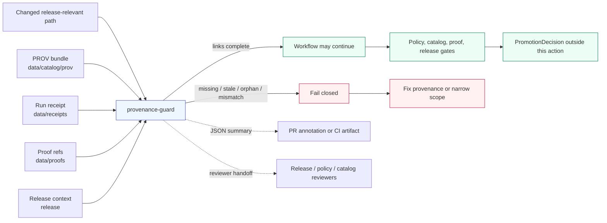

<!-- [KFM_META_BLOCK_V2]
doc_id: kfm://doc/NEEDS-VERIFICATION-provenance-guard-readme
title: provenance-guard
type: standard
version: v1
status: draft
owners: NEEDS_VERIFICATION
created: NEEDS_VERIFICATION
updated: 2026-05-06
policy_label: NEEDS_VERIFICATION
related: [
  ../README.md,
  ../../README.md,
  ../../CODEOWNERS,
  ../../PULL_REQUEST_TEMPLATE.md,
  ../../workflows/README.md,
  ../../../contracts/README.md,
  ../../../schemas/README.md,
  ../../../schemas/contracts/v1/README.md,
  ../../../policy/README.md,
  ../../../tests/README.md,
  ../../../data/catalog/prov/README.md,
  ../../../data/receipts/README.md,
  ../../../data/proofs/README.md,
  ../../../release/README.md
]
tags: [kfm, github-actions, provenance, prov, receipts, proofs, release-evidence, fail-closed]
notes: [
  "Target README exists on main; executable action metadata remains NEEDS_VERIFICATION because action.yml was not confirmed in this inspection.",
  "CODEOWNERS and PULL_REQUEST_TEMPLATE content require maintainer completion before owner and review claims can be upgraded.",
  "This README keeps provenance-guard as a thin CI wrapper; provenance, receipts, proofs, policy, release, and publication authority remain in their owning responsibility roots."
]
[/KFM_META_BLOCK_V2] -->

<a id="top"></a>

# `provenance-guard`

Fail-closed repo-local GitHub Action contract for checking that release-relevant KFM artifacts keep linked provenance, receipts, and reviewable trace context.

> [!NOTE]
> **Status:** `experimental`  
> **Owners:** `NEEDS_VERIFICATION`  
> **Path:** `.github/actions/provenance-guard/README.md`  
> **Authority:** README contract is `CONFIRMED`; executable action implementation is `NEEDS_VERIFICATION`  
> **Repo fit:** child of [`../README.md`](../README.md), governed by the `.github` gatehouse, downstream from workflow orchestration, and upstream only as thin CI step glue.  
> **Upstream links:** [`../../README.md`](../../README.md) · [`../../workflows/README.md`](../../workflows/README.md) · [`../../CODEOWNERS`](../../CODEOWNERS) · [`../../PULL_REQUEST_TEMPLATE.md`](../../PULL_REQUEST_TEMPLATE.md)  
> **Downstream links:** [`../../../data/catalog/prov/README.md`](../../../data/catalog/prov/README.md) · [`../../../data/receipts/README.md`](../../../data/receipts/README.md) · [`../../../data/proofs/README.md`](../../../data/proofs/README.md) · [`../../../release/README.md`](../../../release/README.md)  
>
> 
> 
> 
> 
> 
>   
>
> **Quick jumps:** [Scope](#scope) · [Repo fit](#repo-fit) · [Current inspection posture](#current-inspection-posture) · [Accepted inputs](#accepted-inputs) · [Exclusions](#exclusions) · [Action contract](#action-contract) · [Failure behavior](#failure-behavior) · [Evidence emitted](#evidence-emitted) · [Example caller](#example-caller) · [Diagram](#diagram) · [Validation](#validation) · [Review gates](#review-gates) · [Rollback](#rollback) · [FAQ](#faq) · [Appendix](#appendix)

> [!IMPORTANT]
> Passing `provenance-guard` must never mean **published**, **approved**, or **true**. It means only that the guard found the required provenance linkage for the declared scope. KFM promotion remains a governed state transition with policy, review, release manifest, correction path, and rollback target.

---

## Scope

`provenance-guard` answers one narrow CI question:

> Do changed release-relevant artifacts have reviewable provenance, receipt, proof, and release linkage before a workflow continues?

It should fail closed when release-relevant artifacts become detached from lineage, run memory, proof context, or release context.

### This action guards

| Guarded surface | Why it matters | Default posture |
|---|---|---:|
| `data/processed/**` | Processed candidates need lineage before catalog or release movement. | `guard` |
| `data/published/**` | Published outputs carry the strictest provenance and rollback burden. | `guard` |
| `data/catalog/**` | STAC, DCAT, PROV, and catalog closure must not drift from subjects. | `guard` |
| `data/proofs/**` | Proof packs should remain reachable from release, decision, or manifest context. | `guard` |
| `release/**` | Release records must link manifests, proof refs, rollback refs, and decisions. | `guard` |
| `docs/reports/story_nodes/**` | Public-facing story/report nodes must not make unsupported claims. | `guard` |

### This action does not decide

| Decision | Correct owner |
|---|---|
| Whether evidence is authoritative enough for a claim | `contracts/`, evidence resolver, reviewer, and release gate |
| Whether source rights allow release | `policy/`, source registry, and steward review |
| Whether a sensitive artifact may be public | `policy/`, release review, and domain-specific controls |
| Whether a candidate is promoted | `release/` and promotion gate |
| Whether a UI or Focus Mode answer is true | governed API with EvidenceBundle-backed response envelope |

[Back to top](#top)

---

## Repo fit

`provenance-guard` belongs under `.github/actions/` because it is a **thin local action wrapper**. It should call or wrap governed checks; it should not become the provenance authority itself.

| Direction | Surface | Relationship |
|---|---|---|
| Parent lane | [`../README.md`](../README.md) | Defines local actions as thin wrappers, not hidden authority surfaces. |
| Gatehouse | [`../../README.md`](../../README.md) | Keeps `.github/` governance, workflow, review, and security boundaries visible. |
| Workflow orchestration | [`../../workflows/README.md`](../../workflows/README.md) | Decides when this guard runs and whether it is advisory or blocking. |
| Owner and PR intake | [`../../CODEOWNERS`](../../CODEOWNERS), [`../../PULL_REQUEST_TEMPLATE.md`](../../PULL_REQUEST_TEMPLATE.md) | Must route reviewer responsibility and PR evidence expectations before enforcement claims are upgraded. |
| Contract meaning | [`../../../contracts/README.md`](../../../contracts/README.md) | Human-readable semantics for trust-bearing objects. |
| Machine schemas | [`../../../schemas/README.md`](../../../schemas/README.md), [`../../../schemas/contracts/v1/README.md`](../../../schemas/contracts/v1/README.md) | Shape validation belongs in schema roots, not action glue. |
| Policy authority | [`../../../policy/README.md`](../../../policy/README.md) | Rights, sensitivity, deny/default behavior, obligations, and finite policy outcomes. |
| Test proof | [`../../../tests/README.md`](../../../tests/README.md) | Positive and negative fixture proof belongs in tests. |
| Catalog provenance | [`../../../data/catalog/prov/README.md`](../../../data/catalog/prov/README.md) | Catalog-facing PROV bundles and provenance closure. |
| Process memory | [`../../../data/receipts/README.md`](../../../data/receipts/README.md) | Run receipts, validation reports, and replay/correction memory. |
| Proof spine | [`../../../data/proofs/README.md`](../../../data/proofs/README.md) | Release-supporting proof objects; currently synthetic-only unless later evidence proves otherwise. |
| Release coordination | [`../../../release/README.md`](../../../release/README.md) | Release candidates, manifests, decisions, rollback cards, and correction handoff. |

> [!CAUTION]
> Do not create a parallel provenance home inside this action directory. The action may inspect or summarize provenance, but durable provenance and proof objects belong in the data, proof, release, contract, schema, policy, and test lanes.

[Back to top](#top)

---

## Current inspection posture

This README is written against current connector-visible repo evidence and should be rechecked in the active checkout before merge.

| Item | Status | Maintainer reading |
|---|---:|---|
| `.github/actions/provenance-guard/README.md` | `CONFIRMED` | This README exists and is the current lane contract. |
| `.github/actions/provenance-guard/action.yml` | `NEEDS_VERIFICATION` | Executable action metadata was not confirmed in this inspection. |
| `.github/actions/README.md` | `CONFIRMED` | Parent action lane says local actions are thin wrappers and must not become authority. |
| `.github/workflows/README.md` | `CONFIRMED` | Workflow directory is active, but provenance-guard callers remain unconfirmed here. |
| `.github/CODEOWNERS` | `NEEDS_VERIFICATION` | File exists, but owner coverage must be populated or intentionally documented. |
| `.github/PULL_REQUEST_TEMPLATE.md` | `NEEDS_VERIFICATION` | File exists, but PR evidence prompts need maintainer completion. |
| `data/catalog/prov/README.md` | `CONFIRMED` | Catalog-facing PROV lane exists as a draft/experimental provenance surface. |
| `data/receipts/README.md` | `CONFIRMED` | Receipts are process memory and must remain separate from proofs. |
| `data/proofs/README.md` | `CONFIRMED / LIMITED` | Current README states synthetic fixtures only. Do not claim live proof-pack maturity from this lane alone. |
| `release/README.md` | `CONFIRMED` | Release lane is draft and keeps promotion as governed state transition. |

[Back to top](#top)

---

## Accepted inputs

Inputs should be explicit, reviewable, and safe to echo in CI logs. Hidden environment inference should be avoided when a caller can pass a path or file.

| Input | Default | Required | Status | Purpose |
|---|---|---:|---:|---|
| `changed_paths` | `""` | no | `PROPOSED` | Newline, comma, or space separated paths. Prefer `changed_paths_file` for large diffs. |
| `changed_paths_file` | `""` | no | `PROPOSED` | File containing changed paths, one path per line. |
| `prov_dir` | `data/catalog/prov` | no | `PROPOSED` | Preferred catalog-layer PROV bundle directory. |
| `additional_prov_dirs` | `""` | no | `NEEDS_VERIFICATION` | Compatibility directories such as `data/prov` only when active callers require them. |
| `receipt_dir` | `data/receipts` | no | `PROPOSED` | Run receipts and validation/process-memory records. |
| `proof_dir` | `data/proofs` | no | `PROPOSED` | Proof-pack or proof-summary refs where present. |
| `release_dir` | `release` | no | `PROPOSED` | Release manifests, decisions, rollback refs, and candidate context. |
| `artifact_globs` | `data/processed/**,data/published/**,data/catalog/**,data/proofs/**,release/**,docs/reports/story_nodes/**` | no | `PROPOSED` | Path classes that require provenance checks. |
| `require_run_receipt` | `"true"` | no | `PROPOSED` | Require process-memory support for guarded artifacts. |
| `allow_missing` | `"false"` | no | `PROPOSED` | Must remain false for protected branches, release candidates, and publication-significant changes. |
| `strict` | `"true"` | no | `PROPOSED` | Fail on orphan provenance, stale provenance, digest mismatch, and missing required links. |
| `summary_path` | `""` | no | `PROPOSED` | If empty, write to `${RUNNER_TEMP}/provenance-guard-summary.json`. |

### Input rules

1. Treat missing input as `ERROR`, not as an implicit allow.
2. Treat unknown path class as `ABSTAIN` or `ERROR` in strict mode.
3. Treat `allow_missing: "true"` as an auditable exception, never a normal release path.
4. Do not print secrets, raw payloads, restricted geometry, or unpublished candidate bodies.
5. Use refs and digests instead of copying evidence bodies into summaries.

[Back to top](#top)

---

## Exclusions

| Do not place or decide here | Why | Correct home |
|---|---|---|
| Canonical PROV generation | Provenance creation semantics belong to pipeline or catalog tooling. | `tools/`, `pipelines/`, `data/catalog/prov/` |
| Contract meaning | Action glue must not define object law. | `contracts/` |
| Machine schemas | Shape validation must stay versioned and reusable. | `schemas/` |
| Policy decisions | Rights, sensitivity, obligations, and deny/default behavior belong to policy. | `policy/` |
| Receipt authority | The action may inspect receipts, not own process memory. | `data/receipts/` |
| Proof-pack authority | The action may verify reachability, not become proof storage. | `data/proofs/` |
| Publication or promotion | Promotion is a governed state transition. | `release/`, promotion validators, reviewer decisions |
| SBOM/signing authority | Keep signing and attestation helpers separate and reviewed. | `tools/attest/`, adjacent action lanes, release workflows |
| Secrets, keys, tokens, trust roots | Action folders must never become secret stores. | GitHub environments, OIDC, approved secret management |
| Public access to internal lifecycle data | This would bypass the trust membrane. | governed API and released artifacts only |

[Back to top](#top)

---

## Action contract

A real executable implementation should remain small enough to review and easy to disable.

```text
.github/actions/provenance-guard/
├── README.md                 # this lane contract
├── action.yml                # PROPOSED composite action metadata
├── src/
│   └── provenance_guard.py   # PROPOSED narrow helper or delegator
├── templates/
│   └── summary.md            # PROPOSED reviewer-summary template
└── tests/
    └── fixtures/             # optional action-local smoke fixtures only
```

> [!NOTE]
> Large fixtures, contract examples, policy cases, and negative-path suites should live in `tests/`, `fixtures/`, `policy/`, or the relevant root. Action-local tests should be smoke tests only unless a README explains why locality is required.

### Minimum executable behavior

| Requirement | Rule |
|---|---|
| Narrow purpose | Check provenance linkage for guarded paths only. |
| Explicit inputs | No hidden path expansion beyond documented defaults. |
| Least privilege | Caller workflows should start with `contents: read`. |
| Fail closed | Missing provenance, missing run receipt, digest mismatch, stale provenance, and orphan evidence fail in strict mode. |
| No secret custody | Consume caller-provided short-lived context only. |
| Reviewer-readable output | Emit stable JSON and a concise Markdown summary. |
| Separation of duties | Do not create policy, approve releases, or publish artifacts. |

[Back to top](#top)

---

## Failure behavior

### Minimum check set

| Check | Blocking? | Expected output |
|---|---:|---|
| Path classification | yes | Which changed paths are guarded and why. |
| PROV presence | yes for guarded artifacts | Matching PROV bundle path or declared provenance ref. |
| Run receipt presence | default yes | Receipt ID, run ID, activity time, runner context, and linked outputs. |
| Subject linkage | yes where subject refs exist | Artifact path, digest, catalog ID, or release ID linked to PROV entity. |
| Digest alignment | yes where digests exist | Declared digest equals computed or verified subject digest. |
| Release reachability | yes for release-significant changes | Release manifest, decision, rollback ref, or candidate context exists when required. |
| Orphan evidence detection | yes in strict mode | PROV/proof files not linked to guarded or declared subjects. |
| Compatibility alias warning | warning | Use of non-default paths such as `data/prov` is surfaced. |
| Reviewer summary | always | JSON and Markdown summary suitable for artifact upload or PR annotation. |

### Finding codes

| Code | Meaning | Normal fix |
|---|---|---|
| `MISSING_PROV_BUNDLE` | Guarded artifact lacks a discoverable PROV bundle. | Generate or link the PROV bundle. |
| `MISSING_RUN_RECEIPT` | Guarded artifact lacks process-memory support. | Emit or link a run receipt. |
| `CATALOG_PROV_UNLINKED` | Catalog metadata lacks provenance pointer. | Add provenance pointer or catalog-closure record. |
| `ORPHAN_PROV_BUNDLE` | PROV file does not link to a guarded subject. | Link it to a subject or move it out of the guarded path. |
| `ORPHAN_PROOF_PACK` | Proof pack is not reachable from release or decision context. | Add manifest, decision, or release linkage. |
| `DIGEST_MISMATCH` | Declared and actual digests disagree. | Rebuild, correct manifest, or roll back candidate. |
| `STALE_PROVENANCE` | Provenance predates the changed artifact or subject. | Regenerate provenance after the artifact change. |
| `MISSING_ROLLBACK_REF` | Release-significant change lacks rollback context. | Add rollback card or release rollback reference. |
| `ALLOW_MISSING_USED` | Caller allowed missing provenance. | Keep only for draft branches and document why. |
| `UNSUPPORTED_PATH_CLASS` | Changed path appears release-relevant but is unmapped. | Add mapping or explicit exclusion with rationale. |

### Outcome grammar

| Outcome | Meaning |
|---|---|
| `PASS` | Guarded scope has required links and no strict findings. |
| `REVIEWABLE_PASS` | Guard passed but emitted warnings that require reviewer attention. |
| `ABSTAIN` | Scope cannot be assessed from available evidence. |
| `DENY` | Policy-like hard block from missing, stale, orphan, or mismatched provenance. |
| `ERROR` | Tooling, malformed input, unreadable files, or configuration failure. |

[Back to top](#top)

---

## Evidence emitted

The guard should emit stable evidence for reviewers without claiming release approval.

```json
{
  "ok": false,
  "action": "provenance-guard",
  "version": "v1",
  "outcome": "DENY",
  "guarded_paths": [
    {
      "path": "data/published/example/example.pmtiles",
      "path_class": "published_artifact",
      "required": ["prov_bundle", "run_receipt", "subject_digest", "rollback_ref"],
      "status": "failed",
      "findings": [
        {
          "code": "MISSING_PROV_BUNDLE",
          "message": "No linked PROV bundle found for published artifact."
        }
      ]
    }
  ],
  "orphan_evidence": [],
  "warnings": [],
  "summary": {
    "guarded_count": 1,
    "failed_count": 1,
    "warning_count": 0
  }
}
```

Recommended outputs for a composite action:

| Output | Status | Purpose |
|---|---:|---|
| `summary_path` | `PROPOSED` | Path to JSON summary file. |
| `outcome` | `PROPOSED` | `PASS`, `REVIEWABLE_PASS`, `ABSTAIN`, `DENY`, or `ERROR`. |
| `guarded_count` | `PROPOSED` | Number of guarded changed paths. |
| `finding_count` | `PROPOSED` | Number of strict findings. |

[Back to top](#top)

---

## Example caller

The example below is a target pattern. It is not proof that this action is already executable or workflow-called on `main`.

```yaml
name: provenance-check

on:
  pull_request:
    paths:
      - "data/processed/**"
      - "data/published/**"
      - "data/catalog/**"
      - "data/proofs/**"
      - "release/**"
      - "docs/reports/story_nodes/**"
      - ".github/actions/provenance-guard/**"

permissions:
  contents: read

jobs:
  provenance_guard:
    runs-on: ubuntu-latest
    steps:
      - uses: actions/checkout@v4
        with:
          fetch-depth: 0
          persist-credentials: false

      - name: Build changed-path list
        shell: bash
        run: |
          set -euo pipefail
          git diff --name-only "origin/${{ github.base_ref || 'main' }}...HEAD" > changed-paths.txt
          cat changed-paths.txt

      - name: Provenance Guard
        uses: ./.github/actions/provenance-guard
        with:
          changed_paths_file: changed-paths.txt
          prov_dir: data/catalog/prov
          receipt_dir: data/receipts
          proof_dir: data/proofs
          release_dir: release
          require_run_receipt: "true"
          allow_missing: "false"
          strict: "true"

      - name: Upload provenance guard summary
        if: always()
        uses: actions/upload-artifact@v4
        with:
          name: provenance-guard-summary
          path: ${{ runner.temp }}/provenance-guard-summary.json
          if-no-files-found: ignore
```

[Back to top](#top)

---

## Diagram


```mermaid
flowchart LR
  A[Changed release-relevant path] --> G[provenance-guard]

  B[PROV bundle<br/>data/catalog/prov] --> G
  C[Run receipt<br/>data/receipts] --> G
  D[Proof refs<br/>data/proofs] --> G
  E[Release context<br/>release] --> G

  G -->|links complete| H[Workflow may continue]
  G -->|missing / stale / orphan / mismatch| I[Fail closed]
  G -. JSON summary .-> J[PR annotation or CI artifact]
  G -. reviewer handoff .-> K[Release / policy / catalog reviewers]

  H --> L[Policy, catalog, proof, release gates]
  I --> M[Fix provenance or narrow scope]
  L --> N[PromotionDecision outside this action]

  classDef guard fill:#eef6ff,stroke:#4051b5,stroke-width:1px;
  classDef fail fill:#fff1f2,stroke:#be123c,stroke-width:1px;
  classDef pass fill:#ecfdf5,stroke:#047857,stroke-width:1px;
  class G guard;
  class I,M fail;
  class H,L,N pass;
```

[Back to top](#top)

---

## Validation

Run these checks from the repository root before relying on the action.

```bash
# Confirm checkout and branch.
git status --short
git branch --show-current || true
git rev-parse --show-toplevel || true

# Inspect this lane.
find .github/actions/provenance-guard -maxdepth 4 -type f | sort

# Confirm executable metadata exists.
test -s .github/actions/provenance-guard/action.yml \
  && sed -n '1,260p' .github/actions/provenance-guard/action.yml \
  || echo "NEEDS_VERIFICATION: no non-empty action.yml found"

# Find workflow callers.
grep -R "uses: ./.github/actions/provenance-guard" -n .github/workflows .github/actions 2>/dev/null || true

# Inspect adjacent governance and review surfaces.
sed -n '1,160p' .github/CODEOWNERS 2>/dev/null || true
sed -n '1,220p' .github/PULL_REQUEST_TEMPLATE.md 2>/dev/null || true
sed -n '1,260p' .github/actions/README.md 2>/dev/null || true
sed -n '1,260p' .github/workflows/README.md 2>/dev/null || true

# Inspect provenance-related repo surfaces.
find data/catalog/prov data/receipts data/proofs release -maxdepth 4 -type f 2>/dev/null \
  | sort \
  | sed -n '1,240p'

# Check release-relevant paths changed in the branch.
git diff --name-only origin/main...HEAD 2>/dev/null \
  | grep -E '^(data/(processed|published|catalog|proofs)/|release/|docs/reports/story_nodes/)' || true
```

When `src/provenance_guard.py` exists, the local smoke check should be explicit:

```bash
python .github/actions/provenance-guard/src/provenance_guard.py \
  --changed-paths-file /tmp/changed-paths.txt \
  --prov-dir data/catalog/prov \
  --receipt-dir data/receipts \
  --proof-dir data/proofs \
  --release-dir release \
  --require-run-receipt true \
  --strict true \
  --summary-path /tmp/provenance-guard-summary.json
```

[Back to top](#top)

---

## Review gates

Before merging a change under this action lane, reviewers should be able to check:

- [ ] Active branch inventory was inspected.
- [ ] `../../CODEOWNERS` coverage was checked and owner placeholders were not upgraded without evidence.
- [ ] `action.yml` exists and has a narrow interface, or this README clearly remains contract-only.
- [ ] Inputs, outputs, failure behavior, and evidence emitted are documented.
- [ ] Required workflow permissions are minimal.
- [ ] No secrets, private keys, trust roots, or long-lived credentials are stored here.
- [ ] Heavy reusable logic remains in `tools/`, `scripts/`, `packages/`, or other reviewed implementation roots.
- [ ] Contracts, schemas, policies, receipts, proofs, and release manifests keep their owning homes.
- [ ] Negative-path tests fail closed.
- [ ] Workflow callers are updated or explicitly out of scope.
- [ ] Rollback or disablement path is documented.
- [ ] This action does not bypass promotion, review, release manifest, correction, or rollback controls.

### Definition of done for first executable action

- [ ] Add non-empty `.github/actions/provenance-guard/action.yml`.
- [ ] Keep inputs explicit and stable.
- [ ] Add a narrow helper or call repo-reviewed helper logic.
- [ ] Emit stable JSON summary and optional Markdown summary.
- [ ] Fail closed by default for guarded paths.
- [ ] Treat `allow_missing` as an auditable exception.
- [ ] Add at least one valid and one invalid fixture.
- [ ] Test missing PROV, missing run receipt, orphan PROV, digest mismatch, stale provenance, and allowed draft exception.
- [ ] Verify actual `data/catalog/prov`, `data/receipts`, `data/proofs`, and `release` conventions.
- [ ] Update workflow docs when the first caller lands.

[Back to top](#top)

---

## Rollback

| Change type | Safe rollback |
|---|---|
| README-only contract change | Revert this file. Runtime behavior should not change. |
| New unused executable action | Delete the executable files and update the parent action inventory. |
| Changed action used by workflows | Revert the action and workflow caller together. |
| Permission expansion | Revert workflow permissions first, then inspect logs for unexpected write behavior. |
| Failure-rule change | Revert guard code, preserve summaries/logs, and document whether release posture was affected. |
| Provenance-path convention change | Keep compatibility warnings until caller inventory proves old paths are gone. |

Do not delete receipts, proof packs, release manifests, PROV bundles, correction notices, or rollback records merely because this action changed. Those artifacts are audit history.

[Back to top](#top)

---

## FAQ

### Is this action a provenance generator?

No. It checks provenance linkage for changed release-relevant paths. Provenance generation belongs to pipeline, catalog, or provenance tooling.

### Can this action approve publication?

No. It can produce a reviewer-visible result. Publication still requires governed promotion, review state, release manifest, correction path, and rollback target.

### Is a receipt the same thing as a proof?

No. A receipt records process memory. Proof objects support release-grade claims. This action may check that both are linked, but it must not flatten them into one generic artifact.

### Should this action accept `allow_missing: "true"`?

Only for draft or exploratory branches where missing provenance is intentionally permitted and visible to reviewers. It should never be normal on protected branches, promotion paths, or release candidates.

### Can public UI read the action summary?

Only if the summary is explicitly safe, released, and governed. Ordinary public UI should consume governed APIs, released artifacts, catalog records, and EvidenceBundle-backed envelopes — not raw CI output.

[Back to top](#top)

---

## Appendix

<details>
<summary><strong>Appendix A — proposed target <code>action.yml</code> skeleton</strong></summary>

```yaml
name: provenance-guard
description: Enforce provenance, receipt, proof, and release-linkage checks for KFM release-relevant artifacts.

inputs:
  changed_paths:
    description: Newline, comma, or space separated changed paths. Prefer changed_paths_file for large diffs.
    required: false
    default: ""
  changed_paths_file:
    description: Path to a file containing changed paths, one path per line.
    required: false
    default: ""
  prov_dir:
    description: Preferred directory for catalog-layer PROV bundles.
    required: false
    default: data/catalog/prov
  additional_prov_dirs:
    description: Optional comma-separated compatibility PROV directories, such as data/prov.
    required: false
    default: ""
  receipt_dir:
    description: Directory for run receipts and process-memory objects.
    required: false
    default: data/receipts
  proof_dir:
    description: Directory for proof packs and release-supporting proof objects.
    required: false
    default: data/proofs
  release_dir:
    description: Directory for release candidates, manifests, decisions, and rollback refs.
    required: false
    default: release
  artifact_globs:
    description: Comma-separated guarded path globs.
    required: false
    default: data/processed/**,data/published/**,data/catalog/**,data/proofs/**,release/**,docs/reports/story_nodes/**
  require_run_receipt:
    description: Require run receipt support for guarded artifacts.
    required: false
    default: "true"
  allow_missing:
    description: Allow missing provenance for draft-only exploratory branches.
    required: false
    default: "false"
  strict:
    description: Fail on orphan provenance, digest mismatch, stale provenance, and missing required release links.
    required: false
    default: "true"
  summary_path:
    description: JSON summary output path.
    required: false
    default: ""

outputs:
  summary_path:
    description: Path to the JSON summary emitted by provenance-guard.
    value: ${{ steps.guard.outputs.summary_path }}
  outcome:
    description: PASS, REVIEWABLE_PASS, ABSTAIN, DENY, or ERROR.
    value: ${{ steps.guard.outputs.outcome }}

runs:
  using: composite
  steps:
    - id: guard
      name: Run provenance guard
      shell: bash
      run: |
        set -euo pipefail

        summary_path="${{ inputs.summary_path }}"
        if [ -z "$summary_path" ]; then
          summary_path="${RUNNER_TEMP:-/tmp}/provenance-guard-summary.json"
        fi

        python .github/actions/provenance-guard/src/provenance_guard.py \
          --changed-paths "${{ inputs.changed_paths }}" \
          --changed-paths-file "${{ inputs.changed_paths_file }}" \
          --prov-dir "${{ inputs.prov_dir }}" \
          --additional-prov-dirs "${{ inputs.additional_prov_dirs }}" \
          --receipt-dir "${{ inputs.receipt_dir }}" \
          --proof-dir "${{ inputs.proof_dir }}" \
          --release-dir "${{ inputs.release_dir }}" \
          --artifact-globs "${{ inputs.artifact_globs }}" \
          --require-run-receipt "${{ inputs.require_run_receipt }}" \
          --allow-missing "${{ inputs.allow_missing }}" \
          --strict "${{ inputs.strict }}" \
          --summary-path "$summary_path"

        outcome="$(python -c 'import json,sys; print(json.load(open(sys.argv[1])).get("outcome","ERROR"))' "$summary_path")"

        echo "summary_path=$summary_path" >> "$GITHUB_OUTPUT"
        echo "outcome=$outcome" >> "$GITHUB_OUTPUT"
        echo "KFM_PROVENANCE_GUARD_SUMMARY=$summary_path" >> "$GITHUB_ENV"
```

</details>

<details>
<summary><strong>Appendix B — anti-patterns to reject</strong></summary>

| Anti-pattern | Why it weakens KFM |
|---|---|
| Treating successful CI as publication approval | Collapses validation and governed release state. |
| Writing proof semantics inside shell glue | Creates hidden authority outside contracts and schemas. |
| Using `allow_missing` on release paths | Makes missing provenance normal instead of exceptional. |
| Storing secrets or signing keys in action folders | Turns GitHub config into a secret store. |
| Copying proof packs into action summaries | Creates drift between summaries and proof objects. |
| Reading RAW, WORK, or QUARANTINE as public truth | Bypasses the trust membrane. |
| Letting direct model output satisfy provenance | Confuses generated language with evidence. |
| Deleting failed receipts after a rollback | Erases audit and correction memory. |

</details>

<details>
<summary><strong>Appendix C — maintainer verification before promoting this README</strong></summary>

- [ ] Replace `doc_id` with a registered document ID.
- [ ] Replace `owners` with CODEOWNERS-backed owner or documented maintainer decision.
- [ ] Fill `created` from repo history.
- [ ] Confirm `policy_label`.
- [ ] Confirm whether `action.yml` is intentionally absent, pending, or should be added in the same PR.
- [ ] Confirm workflow callers and required-check status.
- [ ] Confirm whether `data/catalog/prov` is the only PROV home or whether compatibility paths remain.
- [ ] Confirm receipt/proof/release object schemas and fixture locations.
- [ ] Add link-check evidence after committing.

</details>

[Back to top](#top)
