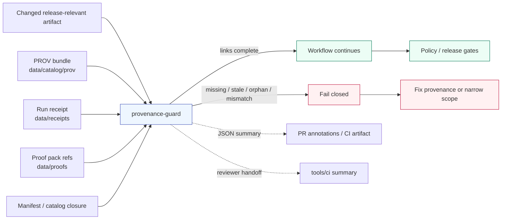

<!-- [KFM_META_BLOCK_V2]
doc_id: kfm://doc/TODO-NEEDS-VERIFICATION
title: provenance-guard
type: standard
version: v1
status: draft
owners: @bartytime4life
created: NEEDS-VERIFICATION
updated: 2026-04-27
policy_label: public
related: [../README.md, ../../README.md, ../../workflows/README.md, ../../watchers/README.md, ../../CODEOWNERS, ../../PULL_REQUEST_TEMPLATE.md, ../../SECURITY.md, ../../../README.md, ../../../contracts/README.md, ../../../schemas/README.md, ../../../schemas/contracts/README.md, ../../../schemas/contracts/v1/README.md, ../../../policy/README.md, ../../../tests/README.md, ../../../tests/contracts/README.md, ../../../scripts/README.md, ../../../tools/attest/README.md, ../../../tools/ci/README.md, ../../../data/catalog/prov/README.md, ../../../data/receipts/README.md, ../../../data/proofs/README.md]
tags: [kfm, github-actions, provenance, prov, receipts, validation, ci-cd, governance]
notes: [doc_id and created date require registry or git-history verification, owner is grounded in surfaced public CODEOWNERS-backed docs for .github but should be rechecked in the active branch, action implementation and workflow callers remain NEEDS VERIFICATION until action.yml and callers are inspected]
[/KFM_META_BLOCK_V2] -->

<a id="top"></a>

# provenance-guard

Fail-closed repo-local action contract for proving that release-relevant KFM artifacts have linked provenance, receipts, and reviewable trace context.

> [!IMPORTANT]
> **Status:** experimental  
> **Owners:** `@bartytime4life` *(surfaced public-doc signal; active-branch ownership still needs verification before merge)*  
> **Path:** `.github/actions/provenance-guard/README.md`  
> **Repo fit:** child action lane under [`../README.md`](../README.md); orchestrated by [`../../workflows/README.md`](../../workflows/README.md); related to catalog provenance in [`../../../data/catalog/prov/README.md`](../../../data/catalog/prov/README.md), process memory in `../../../data/receipts/`, proof packs in `../../../data/proofs/`, contract meaning in [`../../../contracts/README.md`](../../../contracts/README.md), machine profiles in [`../../../schemas/contracts/v1/README.md`](../../../schemas/contracts/v1/README.md), policy decisions in [`../../../policy/README.md`](../../../policy/README.md), and release-evidence helpers in [`../../../tools/attest/README.md`](../../../tools/attest/README.md).  
> **Current posture:** README-defined contract first; executable `action.yml`, callers, and merge-blocking enforcement remain **NEEDS VERIFICATION** on the active branch.  
>
> 
> 
> 
> 
> 
> 
>
> **Quick jumps:** [Scope](#scope) · [Repo fit](#repo-fit) · [Accepted inputs](#accepted-inputs) · [Exclusions](#exclusions) · [Directory tree](#directory-tree) · [Quickstart](#quickstart) · [Usage](#usage) · [Diagram](#diagram) · [Operating tables](#operating-tables) · [Task list](#task-list--definition-of-done) · [FAQ](#faq) · [Appendix](#appendix)

> [!WARNING]
> `provenance-guard` may enforce provenance linkage, but it must not become a hidden publication authority. KFM promotion remains a governed state transition, not a file move, not a workflow side effect, and not a client-side convenience.

---

## Scope

`provenance-guard` is the repo-local action seam for one narrow question:

> **Do changed release-relevant artifacts have reviewable, linked provenance and run-memory support before CI allows the workflow to continue?**

It should check for provenance presence, linkage, digest alignment, and orphan evidence. It should produce a clear reviewer summary and fail closed when required provenance is missing.

### What this action guards

- release-candidate or release-bearing data artifacts
- catalog closure artifacts, including STAC / DCAT / PROV-adjacent outputs
- run receipts, manifest references, and provenance-bundle links
- story or report artifacts that make outward-facing claims
- artifact digests and subject references when they are declared by the active branch

### Truth posture used here

| Label | Meaning in this README |
|---|---|
| **CONFIRMED** | Supported by surfaced repo-facing docs or KFM doctrine already visible to this authoring pass. |
| **INFERRED** | Strongly implied by directory role, adjacent docs, or repeated KFM doctrine, but not directly proven as executable behavior here. |
| **PROPOSED** | Recommended action contract or implementation target. |
| **UNKNOWN** | Not proven from the available active checkout evidence. |
| **NEEDS VERIFICATION** | Must be checked against the mounted repo, workflows, branch protections, or platform settings before stronger claims are made. |

[Back to top](#top)

---

## Repo fit

`provenance-guard` belongs in `.github/actions/` because it is a **thin step wrapper** for workflow reuse. It does not own the durable meaning of provenance, policy, release evidence, or publication state.

| Direction | Surface | Relationship |
|---|---|---|
| Parent | [`../README.md`](../README.md) | Defines the repo-local action family and keeps step wrappers thin. |
| Workflow caller | [`../../workflows/README.md`](../../workflows/README.md) | Workflows decide when this guard runs and whether its result blocks merge or release. |
| Governance | [`../../CODEOWNERS`](../../CODEOWNERS), [`../../PULL_REQUEST_TEMPLATE.md`](../../PULL_REQUEST_TEMPLATE.md), [`../../SECURITY.md`](../../SECURITY.md) | Ownership, review posture, and security expectations stay at the `.github/` level. |
| Contract meaning | [`../../../contracts/README.md`](../../../contracts/README.md) | Human-readable meaning of KFM trust-bearing objects lives here, not inside this action. |
| Machine profiles | [`../../../schemas/contracts/v1/README.md`](../../../schemas/contracts/v1/README.md) | Versioned machine profiles may define `EvidenceBundle`, `ReleaseManifest`, `DecisionEnvelope`, `RunReceipt`, and related object shapes. |
| Policy authority | [`../../../policy/README.md`](../../../policy/README.md) | Policy owns allow/deny outcomes, reasons, obligations, and no-silent-publish rules. |
| Verification burden | [`../../../tests/README.md`](../../../tests/README.md), [`../../../tests/contracts/README.md`](../../../tests/contracts/README.md) | Valid/invalid examples and negative-path proof should live in tests, not only in action shell code. |
| Provenance catalog surface | [`../../../data/catalog/prov/README.md`](../../../data/catalog/prov/README.md) | Outward provenance bundles belong in the catalog layer when they support release or release-candidate artifacts. |
| Receipts and proofs | `../../../data/receipts/`, `../../../data/proofs/` | Receipts are process memory; proofs are release-supporting evidence. This action may inspect them but should not flatten them. |
| Reusable helpers | [`../../../tools/attest/README.md`](../../../tools/attest/README.md), [`../../../tools/ci/README.md`](../../../tools/ci/README.md), [`../../../scripts/README.md`](../../../scripts/README.md) | Larger helper logic, summaries, and operator-safe scripts should stay reviewable outside workflow glue. |

[Back to top](#top)

---

## Accepted inputs

`provenance-guard` should accept small, explicit, reviewable inputs. It should never infer authority from hidden environment state when a caller can pass a path, manifest, or subject reference.

| Input class | Examples | Status | Why it belongs |
|---|---|---:|---|
| Changed artifact paths | `data/processed/**`, `data/published/**`, `data/catalog/**`, `docs/reports/story_nodes/**` | **PROPOSED** | These are the objects most likely to require provenance linkage before merge or release. |
| PROV bundle directory | `data/catalog/prov/` | **PROPOSED** | Catalog-layer provenance should be checked where outward lineage is expected. |
| Compatibility PROV directory | `data/prov/` | **NEEDS VERIFICATION** | Older packet examples used this path; keep only if active workflows already depend on it. |
| Run receipts | `data/receipts/**/*.json`, `run_receipt.json` | **PROPOSED** | Receipts connect activity, runner, timestamps, digests, and outputs. |
| Release or catalog manifests | `release_manifest.json`, STAC / DCAT / catalog-closure JSON | **PROPOSED** | Manifests can declare subject refs, digests, release IDs, and provenance pointers. |
| Declared subject refs | OCI digest, file SHA-256, release ID, catalog ID | **PROPOSED** | Linkage checks are stronger when artifacts have stable subjects. |
| Policy context output | `DecisionEnvelope`, reason codes, obligations | **INFERRED** | This action may confirm policy outputs are linked, but policy meaning stays in `policy/`. |
| Caller-provided changed list | newline-delimited or JSON file path | **PROPOSED** | Avoids brittle git-diff assumptions in reusable workflow contexts. |

### Proposed action inputs

| Input | Default | Required | Status | Notes |
|---|---:|---:|---|---|
| `changed_paths` | `""` | no | **PROPOSED** | Newline, comma, or space separated list from the caller. If omitted, the action may compute a PR diff. |
| `changed_paths_file` | `""` | no | **PROPOSED** | Safer for large diffs and paths with spaces. |
| `prov_dir` | `data/catalog/prov` | no | **PROPOSED** | Preferred catalog provenance directory. |
| `additional_prov_dirs` | `""` | no | **PROPOSED** | Use for branch-local compatibility such as `data/prov`; do not expand silently. |
| `receipt_dir` | `data/receipts` | no | **PROPOSED** | Process-memory receipts. |
| `proof_dir` | `data/proofs` | no | **PROPOSED** | Release proof packs, if present. |
| `artifact_globs` | `data/processed/**,data/published/**,data/catalog/**,docs/reports/story_nodes/**` | no | **PROPOSED** | Path classes that require provenance. |
| `require_run_receipt` | `true` | no | **PROPOSED** | Require run-level receipt support for guarded artifacts. |
| `allow_missing` | `false` | no | **PROPOSED** | Should remain `false` for release, promotion, and protected branches. |
| `summary_path` | `${RUNNER_TEMP}/provenance-guard-summary.json` | no | **PROPOSED** | Stable JSON summary for PR annotations or uploaded artifacts. |
| `strict` | `true` | no | **PROPOSED** | Fail on orphan provenance, digest mismatches, and missing required links. |

[Back to top](#top)

---

## Exclusions

Keep this action narrow. The following responsibilities belong elsewhere.

| Does not belong here | Why | Better home |
|---|---|---|
| Creating canonical provenance facts | Creation and derivation semantics should be owned by pipeline code or provenance emitters, not a guard wrapper. | `tools/`, `scripts/`, pipeline implementation, `data/catalog/prov/` profile docs |
| Deciding rights, sensitivity, or publication eligibility | This action may observe a policy decision, but it must not invent one. | [`../../../policy/README.md`](../../../policy/README.md), review workflows |
| Defining schemas or contract law | Contract meaning must be reviewable outside action glue. | [`../../../contracts/README.md`](../../../contracts/README.md), [`../../../schemas/contracts/v1/README.md`](../../../schemas/contracts/v1/README.md) |
| Generating SBOMs or signatures | Adjacent action family has a dedicated SBOM/signing lane. | `../sbom-produce-and-sign/`, [`../../../tools/attest/README.md`](../../../tools/attest/README.md) |
| Publishing, promoting, or moving artifacts | Promotion is a governed state transition with proof, policy, and rollback context. | release / promotion workflows, `tools/validators/promotion_gate/` |
| Storing secrets, trust roots, or long-lived credentials | Action directories must not become secret stores. | GitHub environments, OIDC, external secret management |
| Reading RAW, WORK, QUARANTINE, or canonical stores directly for public claims | Guard checks should avoid bypassing KFM’s trust membrane. | governed pipeline and release surfaces |
| Hiding runtime maturity behind green checks | A check can pass while the broader release system remains immature. | PR summary, verification backlog, branch-protection review |

[Back to top](#top)

---

## Directory tree

### Current public subtree signal

The surfaced repo-facing docs describe `.github/actions/` as real but placeholder-heavy, with `provenance-guard/` present as a named local action lane. Recheck the active checkout before claiming executable depth.

```text
.github/actions/
├── README.md
├── action.yml                  # root file reported as placeholder/empty in surfaced docs
├── metadata-validate/
├── metadata-validate-v2/
├── opa-gate/
├── provenance-guard/
│   └── README.md               # this file
├── sbom-produce-and-sign/
└── src/
```

### Target executable shape

```text
.github/actions/provenance-guard/
├── action.yml                  # PROPOSED composite action contract
├── README.md                   # this lane contract
├── src/
│   └── provenance_guard.py     # PROPOSED narrow implementation helper
├── templates/
│   └── summary.md              # PROPOSED reviewer summary template
└── tests/
    └── fixtures/               # PROPOSED action-local smoke fixtures only
```

> [!NOTE]
> Large fixtures, contract fixtures, and negative-path suites should live under `tests/`, not be hidden inside this action directory.

[Back to top](#top)

---

## Quickstart

Use these commands to inspect the active branch without overstating implementation maturity.

```bash
# 1) Inventory the action lane.
find .github/actions/provenance-guard -maxdepth 3 -type f | sort

# 2) Check whether the action is executable yet.
test -s .github/actions/provenance-guard/action.yml \
  && sed -n '1,220p' .github/actions/provenance-guard/action.yml \
  || echo "NEEDS VERIFICATION: no non-empty action.yml found"

# 3) Find workflow callers.
grep -R "uses: ./.github/actions/provenance-guard" -n .github/workflows .github/actions 2>/dev/null || true

# 4) Find provenance-related repo surfaces.
find data/catalog data/receipts data/proofs -maxdepth 3 -type f 2>/dev/null | sort | sed -n '1,160p'

# 5) Look for release-relevant paths changed in the current branch.
git diff --name-only origin/main...HEAD 2>/dev/null \
  | grep -E '^(data/(processed|published|catalog)/|docs/reports/story_nodes/)' || true
```

### Local smoke check once the helper exists

```bash
python .github/actions/provenance-guard/src/provenance_guard.py \
  --changed-paths-file /tmp/changed-paths.txt \
  --prov-dir data/catalog/prov \
  --receipt-dir data/receipts \
  --proof-dir data/proofs \
  --require-run-receipt true \
  --summary-path /tmp/provenance-guard-summary.json
```

> [!WARNING]
> Treat the local command above as a target contract until `src/provenance_guard.py` exists on the active branch.

[Back to top](#top)

---

## Usage

### Workflow usage target

```yaml
name: provenance-check

on:
  pull_request:
    paths:
      - "data/processed/**"
      - "data/published/**"
      - "data/catalog/**"
      - "docs/reports/story_nodes/**"
      - ".github/actions/provenance-guard/**"

jobs:
  provenance_guard:
    runs-on: ubuntu-latest
    permissions:
      contents: read
    steps:
      - uses: actions/checkout@v4
        with:
          fetch-depth: 0

      - name: Build changed-path list
        shell: bash
        run: |
          set -euo pipefail
          git diff --name-only "origin/${{ github.base_ref || 'main' }}...HEAD" > changed-paths.txt
          cat changed-paths.txt

      - name: Provenance Guard
        uses: ./.github/actions/provenance-guard
        with:
          changed_paths_file: changed-paths.txt
          prov_dir: data/catalog/prov
          receipt_dir: data/receipts
          proof_dir: data/proofs
          require_run_receipt: "true"
          allow_missing: "false"
          strict: "true"

      - name: Upload provenance guard summary
        if: always()
        uses: actions/upload-artifact@v4
        with:
          name: provenance-guard-summary
          path: ${{ runner.temp }}/provenance-guard-summary.json
          if-no-files-found: ignore
```

### When `allow_missing` is acceptable

`allow_missing: "true"` is only acceptable for draft-only exploratory branches where the PR explicitly states that provenance emission is not yet wired. It should be denied for protected-branch checks, release candidates, promotion flows, and any public-facing publication path.

[Back to top](#top)

---

## Diagram


```mermaid
flowchart LR
  A[Changed release-relevant artifact] --> G[provenance-guard]
  B[PROV bundle<br/>data/catalog/prov] --> G
  C[Run receipt<br/>data/receipts] --> G
  D[Proof pack refs<br/>data/proofs] --> G
  E[Manifest / catalog closure] --> G

  G -->|links complete| H[Workflow continues]
  G -->|missing / stale / orphan / mismatch| I[Fail closed]

  G -. JSON summary .-> J[PR annotations / CI artifact]
  G -. reviewer handoff .-> K[tools/ci summary]

  H --> L[Policy / release gates]
  I --> M[Fix provenance or narrow scope]

  classDef guard fill:#eef6ff,stroke:#4051b5,stroke-width:1px;
  classDef fail fill:#fff1f2,stroke:#be123c,stroke-width:1px;
  classDef pass fill:#ecfdf5,stroke:#047857,stroke-width:1px;

  class G guard;
  class I,M fail;
  class H,L pass;
```

[Back to top](#top)

---

## Operating tables

### Guarded path classes

| Path class | Requires | Failure if missing | Notes |
|---|---|---|---|
| `data/processed/**` | run receipt + source/provenance link | `MISSING_RUN_RECEIPT` or `MISSING_PROV_BUNDLE` | Processed artifacts are not public by default, but lineage still matters. |
| `data/published/**` | provenance bundle + release/proof linkage + digest subject | `MISSING_RELEASE_LINKAGE` or `DIGEST_MISMATCH` | Published artifacts require the strictest posture. |
| `data/catalog/stac/**` | catalog closure ref + provenance pointer | `CATALOG_PROV_UNLINKED` | STAC should not stand alone when release traceability is required. |
| `data/catalog/dcat/**` | distribution provenance and release context | `CATALOG_PROV_UNLINKED` | DCAT should carry or link outward lineage. |
| `data/catalog/prov/**` | declared subject and non-orphan relationship | `ORPHAN_PROV_BUNDLE` | PROV without a subject is not useful release evidence. |
| `docs/reports/story_nodes/**` | evidence or release refs for consequential claims | `MISSING_EVIDENCE_REF` | Story artifacts must not detach from evidence. |
| `data/proofs/**` | manifest, decision, or release support refs | `ORPHAN_PROOF_PACK` | Proof packs should be discoverable from release or decision surfaces. |

### Minimum check set

| Check | Blocking? | Expected output |
|---|---:|---|
| Path classification | yes | Which changed paths are guarded and why. |
| PROV presence | yes for guarded artifacts | Matching bundle path or declared provenance ref. |
| Run receipt presence | configurable; default yes | Receipt ID, run ID, activity time, runner context. |
| Subject linkage | yes where subject refs exist | Artifact path / digest / catalog ID linked to PROV entity. |
| Digest alignment | yes where digests exist | Local digest equals declared digest. |
| Orphan evidence detection | yes in strict mode | PROV/proof files not linked to any changed or declared subject. |
| Compatibility alias warning | no by default | Use of legacy `data/prov` or branch-specific paths is surfaced. |
| Reviewer summary | always | JSON summary and optional markdown annotation. |

### Failure codes

| Code | Meaning | Normal fix |
|---|---|---|
| `MISSING_PROV_BUNDLE` | A guarded artifact lacks a discoverable PROV bundle. | Generate or link the PROV bundle before merge. |
| `MISSING_RUN_RECEIPT` | A guarded artifact lacks run-level process memory. | Emit a run receipt or point to an existing receipt. |
| `CATALOG_PROV_UNLINKED` | Catalog metadata does not link to the provenance surface. | Add a provenance pointer or catalog-closure record. |
| `ORPHAN_PROV_BUNDLE` | A PROV file exists but does not link to a guarded subject. | Link it to a subject or move it out of the release path. |
| `ORPHAN_PROOF_PACK` | A proof pack is not reachable from release or decision context. | Add manifest / decision linkage. |
| `DIGEST_MISMATCH` | Declared digest and local artifact digest disagree. | Rebuild, correct manifest, or roll back the changed artifact. |
| `STALE_PROVENANCE` | Provenance timestamp or subject predates the changed artifact. | Regenerate provenance after the artifact change. |
| `ALLOW_MISSING_USED` | Caller allowed missing provenance. | Keep only for draft branches and state the reason in the PR. |
| `UNSUPPORTED_PATH_CLASS` | A changed path looks release-relevant but is not mapped. | Add an explicit mapping or exclude with documented reason. |

[Back to top](#top)

---

## Task list / definition of done

### README readiness

- [x] States the lane purpose in KFM terms.
- [x] Includes KFM Meta Block v2 with reviewable placeholders.
- [x] Includes status, owner, path, badges, and quick jumps.
- [x] Defines repo fit, accepted inputs, and exclusions.
- [x] Separates confirmed/surfaced posture from proposed executable behavior.
- [x] Includes a meaningful Mermaid boundary diagram.
- [x] Defines failure codes and action boundaries.

### First executable action

- [ ] Add non-empty `.github/actions/provenance-guard/action.yml`.
- [ ] Keep action inputs explicit and stable.
- [ ] Add a narrow implementation helper or call a repo-reviewed helper from `tools/`.
- [ ] Emit a stable JSON summary.
- [ ] Fail closed by default for guarded paths.
- [ ] Treat `allow_missing` as an auditable exception.
- [ ] Add at least one valid and one invalid fixture.
- [ ] Add tests for missing PROV, orphan PROV, digest mismatch, and allowed draft exception.
- [ ] Verify paths against the active branch’s actual `data/catalog/prov`, `data/receipts`, and `data/proofs` conventions.
- [ ] Update workflow docs when the first caller lands.

### Merge checks worth asking

- [ ] Does this action verify linkage rather than merely assert it?
- [ ] Can a reviewer understand the failure from the CI summary alone?
- [ ] Are receipts, proofs, manifests, and PROV bundles kept distinct?
- [ ] Does this action avoid becoming a policy or publication authority?
- [ ] Are legacy paths such as `data/prov` explicitly justified if used?
- [ ] Does the PR include rollback notes if provenance expectations change?

[Back to top](#top)

---

## FAQ

### Does this action create provenance?

No. It guards provenance linkage. Provenance creation belongs to pipeline code, provenance emitters, or reusable helpers outside the action wrapper.

### Does passing `provenance-guard` mean an artifact is publishable?

No. A pass means the checked artifact has the required provenance linkage for this guard. Publication still depends on policy, rights, sensitivity, review, release manifests, proof packs, and promotion state.

### Why not keep all provenance logic in workflow YAML?

Workflow YAML is a poor place to preserve durable contract meaning. This action centralizes a repeated step, while contract meaning, schemas, policy, tests, receipts, proofs, and release objects remain in their owning repo surfaces.

### Why prefer `data/catalog/prov/` over `data/prov/`?

Surfaced repo-facing documentation treats `data/catalog/prov/` as the catalog provenance lane. Older implementation packets use `data/prov`. Keep compatibility only when the active branch proves it is still required.

### What should happen when an artifact is intentionally exploratory?

Exploratory artifacts should stay outside guarded release-relevant path classes or carry an explicit `allow_missing` exception in a draft-only workflow. Do not let exploratory exceptions reach protected release or promotion gates.

[Back to top](#top)

---

## Appendix

<details>
<summary>PROPOSED target <code>action.yml</code> skeleton</summary>

```yaml
name: provenance-guard
description: Enforce provenance, receipt, and subject-linkage checks for KFM release-relevant artifacts.

inputs:
  changed_paths:
    description: Newline, comma, or space separated changed paths. Prefer changed_paths_file for large diffs.
    required: false
    default: ""
  changed_paths_file:
    description: Path to a file containing changed paths, one path per line.
    required: false
    default: ""
  prov_dir:
    description: Preferred directory for catalog-layer PROV bundles.
    required: false
    default: data/catalog/prov
  additional_prov_dirs:
    description: Optional comma-separated compatibility PROV directories, such as data/prov.
    required: false
    default: ""
  receipt_dir:
    description: Directory for run receipts and process-memory objects.
    required: false
    default: data/receipts
  proof_dir:
    description: Directory for proof packs and release-supporting proof objects.
    required: false
    default: data/proofs
  artifact_globs:
    description: Comma-separated guarded path globs.
    required: false
    default: data/processed/**,data/published/**,data/catalog/**,docs/reports/story_nodes/**
  require_run_receipt:
    description: Require run receipt support for guarded artifacts.
    required: false
    default: "true"
  allow_missing:
    description: Allow missing provenance for draft-only exploratory branches.
    required: false
    default: "false"
  strict:
    description: Fail on orphan provenance, digest mismatch, and stale provenance.
    required: false
    default: "true"
  summary_path:
    description: JSON summary output path.
    required: false
    default: ""

runs:
  using: composite
  steps:
    - name: Run provenance guard
      shell: bash
      run: |
        set -euo pipefail
        summary_path="${{ inputs.summary_path }}"
        if [ -z "$summary_path" ]; then
          summary_path="${RUNNER_TEMP:-/tmp}/provenance-guard-summary.json"
        fi

        python .github/actions/provenance-guard/src/provenance_guard.py \
          --changed-paths "${{ inputs.changed_paths }}" \
          --changed-paths-file "${{ inputs.changed_paths_file }}" \
          --prov-dir "${{ inputs.prov_dir }}" \
          --additional-prov-dirs "${{ inputs.additional_prov_dirs }}" \
          --receipt-dir "${{ inputs.receipt_dir }}" \
          --proof-dir "${{ inputs.proof_dir }}" \
          --artifact-globs "${{ inputs.artifact_globs }}" \
          --require-run-receipt "${{ inputs.require_run_receipt }}" \
          --allow-missing "${{ inputs.allow_missing }}" \
          --strict "${{ inputs.strict }}" \
          --summary-path "$summary_path"

        echo "KFM_PROVENANCE_GUARD_SUMMARY=$summary_path" >> "$GITHUB_ENV"
```

</details>

<details>
<summary>Reviewer summary shape</summary>

```json
{
  "ok": false,
  "action": "provenance-guard",
  "version": "v1",
  "guarded_paths": [
    {
      "path": "data/published/example/example.pmtiles",
      "path_class": "published_artifact",
      "required": ["prov_bundle", "run_receipt", "subject_digest"],
      "status": "failed",
      "findings": [
        {
          "code": "MISSING_PROV_BUNDLE",
          "message": "No linked PROV bundle found for published artifact."
        }
      ]
    }
  ],
  "orphan_evidence": [],
  "warnings": [],
  "summary": {
    "guarded_count": 1,
    "failed_count": 1,
    "warning_count": 0
  }
}
```

</details>

<details>
<summary>Compatibility notes to verify before implementation</summary>

| Question | Why it matters |
|---|---|
| Is `data/catalog/prov/` the active branch’s provenance bundle home? | Determines default `prov_dir`. |
| Do any historical callers still expect `data/prov/`? | Determines whether compatibility aliases are needed. |
| Are run receipts under `data/receipts/`, `receipts/`, or workflow artifacts only? | Determines `receipt_dir` and artifact upload strategy. |
| Does the branch already define `RunReceipt`, `ReleaseManifest`, or `EvidenceBundle` schemas? | Determines how deep this action can validate versus only preflight. |
| Which workflow checks are required by branch protection? | Determines whether this guard is advisory or merge-blocking. |
| Is signing handled by `sbom-produce-and-sign`, `tools/attest`, or a release workflow? | Avoids duplicate or conflicting attestation behavior. |
| Are exact source rights and sensitivity policies available for guarded artifacts? | Prevents provenance checks from being mistaken for publication approval. |

</details>

[Back to top](#top)
