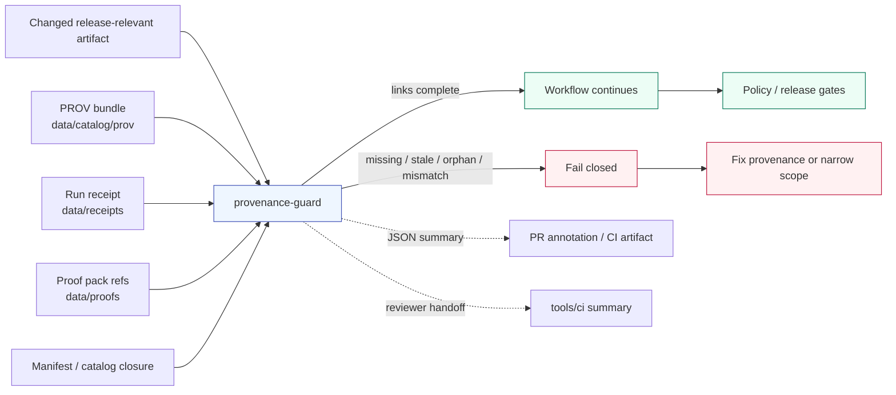

<!-- [KFM_META_BLOCK_V2]
doc_id: kfm://doc/TODO
title: provenance-guard
type: README
version: v1
status: experimental
owners: <TODO: verify against ../../CODEOWNERS>
created: <TODO: YYYY-MM-DD>
updated: <TODO: YYYY-MM-DD>
policy_label: <TODO: public|internal|restricted>
related: [
  ../README.md,
  ../../workflows/README.md,
  ../../CODEOWNERS,
  ../../PULL_REQUEST_TEMPLATE.md,
  ../../../contracts/README.md,
  ../../../schemas/contracts/v1/README.md,
  ../../../policy/README.md,
  ../../../tests/README.md,
  ../../../data/catalog/prov/README.md,
  ../../../data/receipts/,
  ../../../data/proofs/,
  ../../../release/
]
tags: [kfm, github-actions, provenance, receipts, proofs, release-evidence, fail-closed]
notes: [
  "README contract is present before executable maturity is confirmed.",
  "Non-empty action.yml, workflow callers, CODEOWNERS coverage, branch protections, and merge-blocking status require active-checkout verification.",
  "This action is a thin wrapper only; contracts, schemas, policy, data receipts, proofs, and release state remain in their owning responsibility roots."
]
[/KFM_META_BLOCK_V2] -->

<a id="top"></a>

# provenance-guard

Fail-closed repo-local GitHub Action contract for checking that release-relevant KFM artifacts have linked provenance, receipts, and reviewable trace context.

> [!NOTE]
> **Status:** `experimental`  
> **Owners:** `TODO: verify against ../../CODEOWNERS`  
> **Authority:** `PROPOSED` action contract; executable implementation is `NEEDS VERIFICATION`  
> **Repo fit:** `.github/actions/provenance-guard/README.md`  
> **Review burden:** platform, security, policy, contract/schema, data-lifecycle, and release-evidence reviewers must confirm this action remains thin workflow glue and does not become hidden provenance, policy, or publication authority.


**Quick jumps:** [Scope](#scope) · [Repo fit](#repo-fit) · [Accepted inputs](#accepted-inputs) · [Exclusions](#exclusions) · [Action contract](#action-contract) · [Failure behavior](#failure-behavior) · [Evidence emitted](#evidence-emitted) · [Example caller](#example-caller) · [Validation](#validation) · [Review gates](#review-gates) · [Rollback](#rollback) · [Open verification](#open-verification)

> [!IMPORTANT]
> Passing `provenance-guard` must never mean “published,” “approved,” or “true.” It means only that this guard found the required provenance linkage for the guarded paths. KFM promotion remains a governed state transition with policy, review, release manifest, correction path, and rollback target.

## Scope

`provenance-guard` answers one narrow CI question:

> Do changed release-relevant artifacts have reviewable, linked provenance and run-memory support before the workflow continues?

The action should check provenance presence, subject linkage, digest alignment, run receipt support, and orphan evidence. It should produce a reviewer-readable summary and fail closed when required linkage is missing.

### This action guards

| Guarded surface | Why it matters |
| --- | --- |
| `data/processed/**` | Processed artifacts are not automatically public, but lineage still matters before promotion. |
| `data/published/**` | Published artifacts require the strictest provenance, proof, and release linkage. |
| `data/catalog/**` | STAC, DCAT, PROV, and catalog-closure records should not detach from evidence. |
| `data/proofs/**` | Proof packs should be reachable from release or decision context. |
| `docs/reports/story_nodes/**` | Story/report nodes that make outward-facing claims must not detach from EvidenceRefs. |
| Release-candidate manifests | Release context should link subjects, digests, provenance, receipts, and rollback targets. |

### Truth posture

| Label | Meaning here |
| --- | --- |
| `CONFIRMED` | Verified from current active checkout, command output, or directly inspected file. |
| `PROPOSED` | Recommended action contract or implementation target not yet verified as executable. |
| `UNKNOWN` | Not proven from available evidence. |
| `NEEDS VERIFICATION` | Checkable before merge, branch protection, or release reliance. |

[Back to top](#top)

## Repo fit

`provenance-guard` belongs under `.github/actions/` only because it is a thin repo-local action wrapper for workflow reuse. It does not own the durable meaning of provenance, policy, release evidence, or publication state.

| Direction | Surface | Relationship |
| --- | --- | --- |
| Parent action lane | `../README.md` | Defines repo-local actions as thin wrappers, not hidden authority. |
| Workflow callers | `../../workflows/README.md` | Workflows decide when this guard runs and whether it is advisory or blocking. |
| Ownership and PR review | `../../CODEOWNERS`, `../../PULL_REQUEST_TEMPLATE.md`, `../../SECURITY.md` | Review coverage, platform posture, and security expectations stay at `.github/`. |
| Contract meaning | `../../../contracts/README.md` | Human-readable semantics for trust objects live outside action glue. |
| Machine schemas | `../../../schemas/contracts/v1/README.md` | JSON Schema profiles for objects such as `RunReceipt`, `ReleaseManifest`, and `EvidenceBundle` belong here if present. |
| Policy authority | `../../../policy/README.md` | Allow, deny, restrict, abstain, reason codes, and obligations belong to policy. |
| Tests and fixtures | `../../../tests/README.md` | Positive and negative proof should live in tests, not only in shell code. |
| Provenance catalog | `../../../data/catalog/prov/README.md` | Catalog-layer provenance bundles belong in the data/catalog lifecycle when they support release artifacts. |
| Receipts and proofs | `../../../data/receipts/`, `../../../data/proofs/` | Receipts are process memory; proofs are release-supporting evidence. This action may inspect them but must not flatten them. |
| Release state | `../../../release/` | Release candidates, manifests, promotion decisions, rollback cards, and release operations stay outside the action wrapper. |
| Helper logic | `../../../tools/`, `../../../scripts/`, `../../../packages/` | Larger validators, summaries, and attest helpers should live in reviewable implementation roots. |

[Back to top](#top)

## Accepted inputs

The action should accept explicit, reviewable inputs. It should not infer authority from hidden environment state when a caller can pass a path, manifest, or subject reference.

| Input | Default | Required | Status | Notes |
| --- | --- | --- | --- | --- |
| `changed_paths` | `""` | no | `PROPOSED` | Newline, comma, or space separated changed paths. Prefer `changed_paths_file` for large diffs. |
| `changed_paths_file` | `""` | no | `PROPOSED` | File containing changed paths, one path per line. |
| `prov_dir` | `data/catalog/prov` | no | `PROPOSED` | Preferred catalog-layer PROV bundle directory. |
| `additional_prov_dirs` | `""` | no | `NEEDS VERIFICATION` | Optional compatibility directories such as `data/prov`; use only when active workflows require them. |
| `receipt_dir` | `data/receipts` | no | `PROPOSED` | Process-memory receipts. |
| `proof_dir` | `data/proofs` | no | `PROPOSED` | Proof packs, if present. |
| `artifact_globs` | `data/processed/**,data/published/**,data/catalog/**,docs/reports/story_nodes/**` | no | `PROPOSED` | Path classes that require provenance checks. |
| `require_run_receipt` | `"true"` | no | `PROPOSED` | Require run-level process memory for guarded artifacts. |
| `allow_missing` | `"false"` | no | `PROPOSED` | Must remain false for protected branches, release candidates, and promotion paths. |
| `strict` | `"true"` | no | `PROPOSED` | Fail on orphan provenance, digest mismatch, stale provenance, and missing required links. |
| `summary_path` | `""` | no | `PROPOSED` | If empty, write to `${RUNNER_TEMP}/provenance-guard-summary.json`. |

[Back to top](#top)

## Exclusions

| Do not place here | Why | Correct home |
| --- | --- | --- |
| Canonical provenance generation | Creation semantics belong to pipeline code or provenance emitters. | `tools/`, `scripts/`, `packages/`, pipeline implementation, `data/catalog/prov/` |
| Contract meaning | Action glue must not define object law. | `contracts/` |
| Machine schema authority | Shape validation belongs in schema roots. | `schemas/` |
| Policy decisions | This guard may observe policy output; it must not invent rights, sensitivity, or publication eligibility. | `policy/` and review workflows |
| SBOM creation or signing authority | Adjacent action lanes and attest helpers should own this if implemented. | `../sbom-produce-and-sign/`, `tools/attest/`, release workflows |
| Publication or promotion | Promotion is a governed state transition, not an action side effect. | `release/`, promotion workflows, promotion-gate validators |
| Secrets, private keys, trust roots | Action folders must never become secret stores. | GitHub environments, OIDC, external secret management |
| Public access to internal lifecycle data | Guards must not bypass the trust membrane. | governed pipeline/release surfaces and public-safe artifacts |

[Back to top](#top)

## Action contract

A real executable implementation should remain small enough to review.

```text
.github/actions/provenance-guard/
├── README.md                 # this lane contract
├── action.yml                # PROPOSED composite action interface
├── src/
│   └── provenance_guard.py   # PROPOSED narrow helper or delegator
├── templates/
│   └── summary.md            # PROPOSED reviewer summary template
└── tests/
    └── fixtures/             # optional action-local smoke fixtures only
```

> [!NOTE]
> Large fixtures, contract fixtures, policy fixtures, and negative-path suites should live under `tests/` unless the action README explains why locality is required.

### Minimum executable behavior

| Requirement | Rule |
| --- | --- |
| Narrow purpose | Check provenance linkage for guarded paths only. |
| Explicit inputs | No hidden path expansion beyond documented defaults. |
| Minimal permissions | Caller workflows should start with `contents: read`; OIDC or write scopes require justification. |
| Fail closed | Missing provenance, missing run receipt, digest mismatch, stale provenance, and orphan proofs fail in strict mode. |
| No secret custody | The action consumes caller-provided short-lived context only. |
| Clear output | Emit stable JSON and a concise reviewer summary. |
| Separation of duties | Do not create policy, approve releases, or publish artifacts. |

[Back to top](#top)

## Failure behavior

### Minimum check set

| Check | Blocking? | Expected output |
| --- | --- | --- |
| Path classification | yes | Which changed paths are guarded and why. |
| PROV presence | yes for guarded artifacts | Matching PROV bundle path or declared provenance reference. |
| Run receipt presence | configurable; default yes | Receipt ID, run ID, activity time, runner context, and linked outputs. |
| Subject linkage | yes where subject refs exist | Artifact path, digest, catalog ID, or release ID linked to PROV entity. |
| Digest alignment | yes where digests exist | Declared digest equals computed or verified subject digest. |
| Orphan evidence detection | yes in strict mode | PROV/proof files not linked to any guarded or declared subject. |
| Compatibility alias warning | no by default | Use of `data/prov` or branch-local paths is surfaced. |
| Reviewer summary | always | JSON summary suitable for upload or PR annotation. |

### Failure codes

| Code | Meaning | Normal fix |
| --- | --- | --- |
| `MISSING_PROV_BUNDLE` | Guarded artifact lacks a discoverable PROV bundle. | Generate or link the PROV bundle. |
| `MISSING_RUN_RECEIPT` | Guarded artifact lacks run-level process memory. | Emit a run receipt or link an existing one. |
| `CATALOG_PROV_UNLINKED` | Catalog metadata lacks a provenance pointer. | Add a provenance pointer or catalog-closure record. |
| `ORPHAN_PROV_BUNDLE` | A PROV file does not link to a guarded subject. | Link it to a subject or move it out of the guarded path. |
| `ORPHAN_PROOF_PACK` | A proof pack is not reachable from release or decision context. | Add manifest, decision, or release linkage. |
| `DIGEST_MISMATCH` | Declared and actual digests disagree. | Rebuild, correct manifest, or roll back the artifact. |
| `STALE_PROVENANCE` | Provenance predates the changed artifact or declared subject. | Regenerate provenance after the artifact change. |
| `ALLOW_MISSING_USED` | Caller allowed missing provenance. | Keep only for draft branches and state the reason in the PR. |
| `UNSUPPORTED_PATH_CLASS` | A changed path looks release-relevant but is not mapped. | Add an explicit mapping or exclude with documented reason. |

[Back to top](#top)

## Evidence emitted

The guard should emit stable evidence for reviewers without claiming release approval.

```json
{
  "ok": false,
  "action": "provenance-guard",
  "version": "v1",
  "guarded_paths": [
    {
      "path": "data/published/example/example.pmtiles",
      "path_class": "published_artifact",
      "required": ["prov_bundle", "run_receipt", "subject_digest"],
      "status": "failed",
      "findings": [
        {
          "code": "MISSING_PROV_BUNDLE",
          "message": "No linked PROV bundle found for published artifact."
        }
      ]
    }
  ],
  "orphan_evidence": [],
  "warnings": [],
  "summary": {
    "guarded_count": 1,
    "failed_count": 1,
    "warning_count": 0
  }
}
```

[Back to top](#top)

## Example caller

```yaml
name: provenance-check

on:
  pull_request:
    paths:
      - "data/processed/**"
      - "data/published/**"
      - "data/catalog/**"
      - "docs/reports/story_nodes/**"
      - ".github/actions/provenance-guard/**"

jobs:
  provenance_guard:
    runs-on: ubuntu-latest
    permissions:
      contents: read
    steps:
      - uses: actions/checkout@v4
        with:
          fetch-depth: 0
          persist-credentials: false

      - name: Build changed-path list
        shell: bash
        run: |
          set -euo pipefail
          git diff --name-only "origin/${{ github.base_ref || 'main' }}...HEAD" > changed-paths.txt
          cat changed-paths.txt

      - name: Provenance Guard
        uses: ./.github/actions/provenance-guard
        with:
          changed_paths_file: changed-paths.txt
          prov_dir: data/catalog/prov
          receipt_dir: data/receipts
          proof_dir: data/proofs
          require_run_receipt: "true"
          allow_missing: "false"
          strict: "true"

      - name: Upload provenance guard summary
        if: always()
        uses: actions/upload-artifact@v4
        with:
          name: provenance-guard-summary
          path: ${{ runner.temp }}/provenance-guard-summary.json
          if-no-files-found: ignore
```

> [!WARNING]
> This caller is a target pattern, not proof that the active repo has a non-empty `action.yml`, installed helper script, or branch-protected required check.

[Back to top](#top)

## Diagram


```mermaid
flowchart LR
  A[Changed release-relevant artifact] --> G[provenance-guard]
  B[PROV bundle<br/>data/catalog/prov] --> G
  C[Run receipt<br/>data/receipts] --> G
  D[Proof pack refs<br/>data/proofs] --> G
  E[Manifest / catalog closure] --> G

  G -->|links complete| H[Workflow continues]
  G -->|missing / stale / orphan / mismatch| I[Fail closed]
  G -. JSON summary .-> J[PR annotation / CI artifact]
  G -. reviewer handoff .-> K[tools/ci summary]
  H --> L[Policy / release gates]
  I --> M[Fix provenance or narrow scope]

  classDef guard fill:#eef6ff,stroke:#4051b5,stroke-width:1px;
  classDef fail fill:#fff1f2,stroke:#be123c,stroke-width:1px;
  classDef pass fill:#ecfdf5,stroke:#047857,stroke-width:1px;
  class G guard;
  class I,M fail;
  class H,L pass;
```

[Back to top](#top)

## Validation

Run these checks in the active checkout before relying on this action.

```bash
# Inspect the lane.
find .github/actions/provenance-guard -maxdepth 3 -type f | sort

# Confirm executable metadata exists.
test -s .github/actions/provenance-guard/action.yml \
  && sed -n '1,220p' .github/actions/provenance-guard/action.yml \
  || echo "NEEDS VERIFICATION: no non-empty action.yml found"

# Find workflow callers.
grep -R "uses: ./.github/actions/provenance-guard" -n .github/workflows .github/actions 2>/dev/null || true

# Inspect provenance-related repo surfaces.
find data/catalog data/receipts data/proofs -maxdepth 3 -type f 2>/dev/null | sort | sed -n '1,160p'

# Check release-relevant paths changed in the branch.
git diff --name-only origin/main...HEAD 2>/dev/null \
  | grep -E '^(data/(processed|published|catalog)/|docs/reports/story_nodes/)' || true
```

When `src/provenance_guard.py` exists, the local smoke check should be explicit:

```bash
python .github/actions/provenance-guard/src/provenance_guard.py \
  --changed-paths-file /tmp/changed-paths.txt \
  --prov-dir data/catalog/prov \
  --receipt-dir data/receipts \
  --proof-dir data/proofs \
  --require-run-receipt true \
  --summary-path /tmp/provenance-guard-summary.json
```

[Back to top](#top)

## Review gates

Before merging a change under this action lane, reviewers should be able to check:

- [ ] Active branch inventory was inspected.
- [ ] `../../CODEOWNERS` coverage was checked.
- [ ] `action.yml` exists and has a narrow interface, or this README clearly remains contract-only.
- [ ] Inputs, outputs, failure behavior, and evidence emitted are documented.
- [ ] Required workflow permissions are minimal.
- [ ] No secrets, private keys, trust roots, or long-lived credentials are stored here.
- [ ] Heavy reusable logic remains in `tools/`, `scripts/`, or `packages/`.
- [ ] Contracts, schemas, policies, receipts, proofs, and release manifests keep their owning homes.
- [ ] Negative-path tests fail closed.
- [ ] Workflow callers are updated or explicitly out of scope.
- [ ] Rollback or disablement path is documented.
- [ ] This action does not bypass promotion, review, release manifest, correction, or rollback controls.

### Definition of done for first executable action

- [ ] Add non-empty `.github/actions/provenance-guard/action.yml`.
- [ ] Keep inputs explicit and stable.
- [ ] Add a narrow helper or call repo-reviewed helper logic.
- [ ] Emit stable JSON summary.
- [ ] Fail closed by default for guarded paths.
- [ ] Treat `allow_missing` as an auditable exception.
- [ ] Add at least one valid and one invalid fixture.
- [ ] Test missing PROV, orphan PROV, digest mismatch, stale provenance, and allowed draft exception.
- [ ] Verify actual `data/catalog/prov`, `data/receipts`, and `data/proofs` conventions.
- [ ] Update workflow docs when the first caller lands.

[Back to top](#top)

## Rollback

| Change type | Safe rollback |
| --- | --- |
| README-only contract change | Revert this file. No runtime behavior should change. |
| New unused executable action | Delete the action directory contents added for execution and update the parent action inventory. |
| Changed action used by workflows | Revert the action and workflow caller together. |
| Permission expansion | Revert workflow permissions first, then inspect logs for unexpected write behavior. |
| Failure rule change | Revert guard code, preserve summaries/logs, and document whether any release or promotion posture was affected. |
| Provenance-path convention change | Keep compatibility warning until caller inventory proves old paths are gone. |

Do not delete receipts, proof packs, release manifests, provenance bundles, correction notices, or rollback records merely because this action changed. Those artifacts are audit history.

[Back to top](#top)

## Open verification

| Item | Status | Why it matters |
| --- | --- | --- |
| Non-empty `.github/actions/provenance-guard/action.yml` | `NEEDS VERIFICATION` | Determines whether this is executable or README-only. |
| `../../CODEOWNERS` coverage | `NEEDS VERIFICATION` | Determines true owners and review burden. |
| Workflow callers | `NEEDS VERIFICATION` | Prevents breaking branch-local dependencies. |
| Branch protections / required checks | `NEEDS VERIFICATION` | Determines whether this guard is advisory or merge-blocking. |
| `data/catalog/prov/` vs `data/prov/` | `NEEDS VERIFICATION` | Determines default and compatibility provenance homes. |
| Receipt and proof homes | `NEEDS VERIFICATION` | Determines `receipt_dir`, `proof_dir`, and artifact upload behavior. |
| Schemas for `RunReceipt`, `ReleaseManifest`, `EvidenceBundle` | `NEEDS VERIFICATION` | Determines whether the guard can validate shape or only preflight linkage. |
| Signing / SBOM relationship | `NEEDS VERIFICATION` | Avoids duplicate or conflicting attestation behavior. |
| Source rights and sensitivity policies | `NEEDS VERIFICATION` | Provenance checks must not be mistaken for publication approval. |

[Back to top](#top)

<details>
<summary>Appendix: proposed target <code>action.yml</code> skeleton</summary>

```yaml
name: provenance-guard
description: Enforce provenance, receipt, and subject-linkage checks for KFM release-relevant artifacts.

inputs:
  changed_paths:
    description: Newline, comma, or space separated changed paths. Prefer changed_paths_file for large diffs.
    required: false
    default: ""
  changed_paths_file:
    description: Path to a file containing changed paths, one path per line.
    required: false
    default: ""
  prov_dir:
    description: Preferred directory for catalog-layer PROV bundles.
    required: false
    default: data/catalog/prov
  additional_prov_dirs:
    description: Optional comma-separated compatibility PROV directories, such as data/prov.
    required: false
    default: ""
  receipt_dir:
    description: Directory for run receipts and process-memory objects.
    required: false
    default: data/receipts
  proof_dir:
    description: Directory for proof packs and release-supporting proof objects.
    required: false
    default: data/proofs
  artifact_globs:
    description: Comma-separated guarded path globs.
    required: false
    default: data/processed/**,data/published/**,data/catalog/**,docs/reports/story_nodes/**
  require_run_receipt:
    description: Require run receipt support for guarded artifacts.
    required: false
    default: "true"
  allow_missing:
    description: Allow missing provenance for draft-only exploratory branches.
    required: false
    default: "false"
  strict:
    description: Fail on orphan provenance, digest mismatch, and stale provenance.
    required: false
    default: "true"
  summary_path:
    description: JSON summary output path.
    required: false
    default: ""

runs:
  using: composite
  steps:
    - name: Run provenance guard
      shell: bash
      run: |
        set -euo pipefail

        summary_path="${{ inputs.summary_path }}"
        if [ -z "$summary_path" ]; then
          summary_path="${RUNNER_TEMP:-/tmp}/provenance-guard-summary.json"
        fi

        python .github/actions/provenance-guard/src/provenance_guard.py \
          --changed-paths "${{ inputs.changed_paths }}" \
          --changed-paths-file "${{ inputs.changed_paths_file }}" \
          --prov-dir "${{ inputs.prov_dir }}" \
          --additional-prov-dirs "${{ inputs.additional_prov_dirs }}" \
          --receipt-dir "${{ inputs.receipt_dir }}" \
          --proof-dir "${{ inputs.proof_dir }}" \
          --artifact-globs "${{ inputs.artifact_globs }}" \
          --require-run-receipt "${{ inputs.require_run_receipt }}" \
          --allow-missing "${{ inputs.allow_missing }}" \
          --strict "${{ inputs.strict }}" \
          --summary-path "$summary_path"

        echo "KFM_PROVENANCE_GUARD_SUMMARY=$summary_path" >> "$GITHUB_ENV"
```

</details>

[Back to top](#top)
