<a id="top"></a>

# 🧬🧾 `provenance-guard` — PROV + Lineage Enforcement Gate (KFM)

[](#-what-this-action-does)


> **Purpose:** make it impossible to “ship mystery artifacts.” 
> If something is **promoted** (data/catalog/story/model output), it must be **traceable**: **inputs → transforms → outputs**, with **W3C PROV JSON‑LD**, **stable IDs**, and (recommended) **checksums**.
>
> 🧭 KFM order stays sacred: **ETL → Metadata (STAC/DCAT/PROV) → Graph → API → UI → Story Nodes → Focus Mode**  
> This action protects the **metadata boundary** and prevents downstream trust collapse. ✅🧾

---

## 🧾 Action metadata

| Field | Value |
|---|---|
| Action name | `kfm/provenance-guard` |
| Action type | Composite Action |
| Folder | 📁 `.github/actions/provenance-guard/` |
| Action file | 📄 `.github/actions/provenance-guard/action.yml` *(expected)* |
| Docs | 📄 `.github/actions/provenance-guard/README.md` |
| Status | ✅ Active (spec + operating guide) |
| Last updated | **2026-01-11** |
| Default posture | 🧯 **Fail‑closed** in promotion lanes |
| Typical lane | 🌙 Nightly + 🚀 Promotion *(optional in PR lane)* |

---

## ⚡ Quick links

| Need | Go |
|---|---|
| 🧩 Actions hub | 📄 [`../README.md`](../README.md) |
| 🤖 Workflows hub | 📄 [`../../workflows/README.md`](../../workflows/README.md) |
| 🧯 Kill switch | 📄 [`../kill-switch/README.md`](../kill-switch/README.md) |
| ✅ Fast catalog gate | 📄 [`../catalog-qa/README.md`](../catalog-qa/README.md) |
| 🧾 Full metadata validation | 📄 [`../metadata-validate/README.md`](../metadata-validate/README.md) |
| 🧑‍⚖️ Policy-as-code | 📄 [`../policy-gate/README.md`](../policy-gate/README.md) |
| 🧭 Governance scan | 📄 [`../governance-scan/README.md`](../governance-scan/README.md) |
| 📦 Build traceability | 📄 [`../build-info/README.md`](../build-info/README.md) |
| 🖊️ Attestations + SBOM | 📄 [`../attest/README.md`](../attest/README.md) |
| 🛡️ Security policy | 📄 [`../../../SECURITY.md`](../../../SECURITY.md) |

---

<details>
<summary><strong>📌 Table of contents</strong></summary>

- [🎯 What this action does](#-what-this-action-does)
- [🧱 Canonical directories & boundary-artifact contract](#-canonical-directories--boundary-artifact-contract)
- [🧠 Why provenance is a <em>security</em> control in KFM](#-why-provenance-is-a-security-control-in-kfm)
- [🧭 Where it fits in the KFM pipeline](#-where-it-fits-in-the-kfm-pipeline)
- [🔎 What it checks (rule IDs)](#-what-it-checks-rule-ids)
- [⚙️ Inputs](#️-inputs)
- [📤 Outputs](#-outputs)
- [📦 Output files](#-output-files)
- [✅ Usage patterns](#-usage-patterns)
- [🧪 Local developer run](#-local-developer-run)
- [🧩 Target folder shape](#-target-folder-shape)
- [🧯 Troubleshooting](#-troubleshooting)
- [🔐 Safety notes](#-safety-notes)
- [📚 Reference library](#-reference-library)

</details>

---

## 🎯 What this action does

`provenance-guard` is a **repo‑local composite action** that enforces one simple rule:

> If an artifact is promoted, it must be **auditable**.

### ✅ Key capabilities (expected)

- 🧬 Detects “promotion‑scope” artifacts (configurable paths/globs)
- 🧾 Requires a matching **PROV JSON‑LD** record for promoted outputs
- 🔗 Checks **ID alignment** between:
  - 🛰️ **STAC** Items/Collections
  - 🗃️ **DCAT** datasets/distributions
  - 🧬 **PROV** entities/activities
- 🧠 Enforces a **minimum provenance payload** (configurable):
  - activity exists (what ran)
  - agent exists (who/what ran it)
  - inputs used (sources)
  - outputs generated (what changed)
  - parameters + tool versions *(recommended; required in strict lanes)*
- 🧾 Optional checksum enforcement (recommended for promotion)
- 🧯 Fail‑closed behavior for promotion lanes (no partial publish)

> [!TIP]
> Think of this as the lineage guardrail that keeps downstream systems honest:
> 🕸️ graph ingest → 🔌 API → 🖥️ UI → 🎬 story nodes → 🧠 focus mode

---

## 🧱 Canonical directories & boundary-artifact contract

KFM’s **Master Guide v13** expects a repo layout where **data moves through stable stages** and **boundary artifacts** (STAC/DCAT/PROV) exist before anything is treated as “fully published.” 🧭🧾

### ✅ Canonical data stages (KFM-shaped)

| Stage | Typical path | Meaning | Guard behavior |
|---|---|---|---|
| 🧪 Raw | `data/raw/**` | Ingested, untrusted, may be sensitive | 🚫 Never “promotion-scope” |
| 🧰 Work | `data/work/**` | Intermediate/transient | 🚫 Never referenced by publish catalogs |
| ✅ Processed | `data/processed/**` | Publish-ready artifacts | ✅ Promotion-scope (default) |

### ✅ Canonical boundary artifacts (v13 contract)

| Artifact layer | Canonical path (v13) | Notes |
|---|---|---|
| 🛰️ STAC | `data/stac/collections/**` + `data/stac/items/**` | Discovery + asset addressing |
| 🗃️ DCAT | `data/catalog/dcat/**` | Dataset/distribution rollups |
| 🧬 PROV | `data/prov/**` | Lineage + reproducibility record (JSON‑LD) |
| 🎬 Story Nodes | `docs/reports/story_nodes/**` | Narrative artifacts that must be evidence-linked |
| 🧠 MCP | `mcp/**` | “Methods & Computational Experiments” (models/experiments are governed) |

### ♻️ Legacy compatibility notes (common during migration)

Some older docs/pipelines use:
- STAC under `data/catalog/**`  
- PROV under `data/provenance/**`

This action **should support both** via inputs:
- set `prov_root` to your canonical folder, or
- provide multiple `prov_roots` (recommended), and
- keep the mapping deterministic (no “search the universe” guesswork).

> [!IMPORTANT]
> **Boundary artifacts are not optional.**  
> If STAC/DCAT exists without PROV (or PROV exists without catalog linkage), promotion should stop. 🧯

---

## 🧠 Why provenance is a *security* control in KFM

KFM is not just code — it’s **data + catalogs + narratives + models**.

Without provenance:
- a malicious or accidental change can slip into a catalog (supply‑chain risk)
- “facts” in stories become un-auditable
- model outputs become “vibes” instead of evidence
- incident response becomes guesswork

With provenance:
- ✅ you can answer: *what changed, who did it, why, using what inputs & tools?*
- ✅ you can roll back safely
- ✅ you can prove “restricted in → not public out” behavior (with policy + classification propagation)

> 🧾 In KFM, provenance is not decoration — it’s the **trust substrate**.

---

## 🧭 Where it fits in the KFM pipeline

This action is intended to run **after schema validation** and **before promotion/publish**.

```mermaid
flowchart LR
  A["🧯 kill-switch"] --> B["🧾 metadata-validate<br/>STAC/DCAT/PROV schemas"]
  B --> C["🧬 provenance-guard<br/>lineage + mapping + (optional) checksums"]
  C --> D["🧑‍⚖️ policy-gate<br/>classification + allowlists"]
  D --> E["📦 build-info<br/>checksums + receipt (recommended)"]
  E --> F["🖊️ attest/SBOM<br/>(promotion lanes)"]
  F --> G["🚀 publish/promote<br/>atomic + immutable refs"]
```



> [!IMPORTANT]
> If `provenance-guard` fails, publishing MUST stop.  
> No “we’ll add provenance later.” 🚫🧾

---

## 🔎 What it checks (rule IDs)

Each check should emit a **rule ID** so failures are searchable, stable, and dashboard-friendly.

### 1) 🧬 Provenance required for promoted outputs

**Rule examples**
- `PROV_MISSING_FOR_OUTPUT`
- `PROV_EMPTY_RUN`
- `PROV_ORPHAN_OUTPUT`

**Checks**
- every promoted output has a corresponding PROV record
- PROV references include the output (stable ID or deterministic path mapping)
- PROV files are parseable JSON/JSON‑LD (fail on invalid JSON)

---

### 2) 🔗 ID & reference integrity (STAC/DCAT/PROV alignment)

**Rule examples**
- `ID_MISMATCH_STAC_PROV`
- `ID_MISMATCH_DCAT_STAC`
- `BROKEN_MAPPING_OUTPUT_ASSET`

**Checks**
- STAC Item/Collection ID ↔ PROV entity ID mapping exists (configurable strategy)
- DCAT distribution points to STAC and/or the same asset hrefs consistently
- no “dangling IDs” referenced by catalogs/provenance

> [!TIP]
> Keep your primary mapping boring: **same stable ID everywhere** whenever possible.

---

### 3) 🧠 Minimum provenance payload (“what ran, with what”)

**Rule examples**
- `PROV_MISSING_ACTIVITY`
- `PROV_MISSING_AGENT`
- `PROV_MISSING_INPUTS`
- `PROV_MISSING_OUTPUTS`
- `PROV_MISSING_PARAMETERS` *(strict lanes)*
- `PROV_MISSING_TOOL_VERSIONS` *(strict lanes)*

**Checks**
- at least one `activity` exists
- at least one `agent` exists
- activity `used` at least one input entity
- activity generated at least one output entity
- optional: parameters + tool versions captured (recommended for ETL/model runs)

---

### 4) 🧾 Checksums (optional but strongly recommended for promotion)

**Rule examples**
- `CHECKSUM_MANIFEST_MISSING`
- `CHECKSUM_MISSING_FOR_OUTPUT`
- `CHECKSUM_MISMATCH`
- `ASSET_SIZE_MISSING`

**Checks**
- promoted outputs have checksums (one of):
  - STAC `assets.*.checksum:*` fields *(if you adopt them)*
  - a checksums manifest (e.g., `out/checksums.sha256` from `build-info`)
  - PROV entity fields (e.g., `sha256`/`digest` in a profile)
- optional: checksum matches local file
- optional: size present for large assets

> [!NOTE]
> ✅ Checksums help detect drift and support reproducibility.  
> 🔏 Cryptographic *attestation/signing* happens in `attest/`.

---

### 5) 🧭 Classification propagation hooks (integration-friendly)

This action does **not** replace policy-as-code, but it can enforce **presence** of required hooks.

**Rule examples**
- `CLASSIFICATION_MISSING_TAG`
- `CLASSIFICATION_MISSING_ON_PROV_ENTITY`

**Checks**
- promoted artifacts declare sensitivity (e.g., `public/internal/restricted`)
- PROV entities carry required sensitivity fields (if your profile requires it)

> For propagation logic (“no output less restricted than input”), use 🧑‍⚖️ `policy-gate`.

---

## ⚙️ Inputs

> Inputs are strings. Use `"true"` / `"false"`.

| Input | Required | Default | Meaning |
|---|---:|---|---|
| `mode` | ❌ | `pr` | `pr` / `nightly` / `promotion` (controls strictness) |
| `root` | ❌ | `data/` | Root for resolving paths |
| `promoted_paths` | ❌ | `data/processed/**,data/stac/**,data/catalog/dcat/**,docs/reports/story_nodes/published/**,mcp/**` | Where “promotion-scope” artifacts live |
| `prov_root` | ❌ | `data/prov/` | Canonical PROV root (v13); can be overridden |
| `legacy_prov_root` | ❌ | `data/provenance/` | Optional legacy PROV root (set empty to disable) |
| `prov_glob` | ❌ | `**/*.json*` | PROV file glob |
| `mapping_mode` | ❌ | `id_or_path` | `id_or_path` / `id_only` / `path_only` |
| `require_activity` | ❌ | `"true"` | Require ≥1 activity |
| `require_agent` | ❌ | `"true"` | Require ≥1 agent |
| `require_inputs` | ❌ | `"true"` | Require `used` relations |
| `require_outputs` | ❌ | `"true"` | Require generated outputs |
| `require_parameters` | ❌ | `"false"` | Strict lane toggle |
| `require_tool_versions` | ❌ | `"false"` | Strict lane toggle |
| `require_checksums` | ❌ | `"false"` | Strongly recommended for promotion |
| `checksums_file` | ❌ | `out/checksums.sha256` | Optional checksum manifest path |
| `fail_on_warn` | ❌ | `"true"` | If `"true"`, warnings fail the run |
| `report_dir` | ❌ | `out/provenance-guard` | Report directory |
| `max_files` | ❌ | `5000` | Safety cap |
| `dry_run` | ❌ | `"false"` | Report only; never fails |

> [!TIP]
> If you’re migrating folders, set:
> - `prov_root=data/prov` ✅ and
> - `legacy_prov_root=data/provenance` ♻️  
> …then remove legacy once catalogs and pipelines fully converge.

---

## 📤 Outputs

| Output | Meaning |
|---|---|
| `ok` | `"true"` if passed (or `dry_run=true`) |
| `error_count` | Integer-like string |
| `warning_count` | Integer-like string |
| `report_json` | Path to JSON report |
| `report_md` | Path to Markdown summary |

---

## 📦 Output files

Expected output layout:

```text
📁 out/
└─ 🧬📁 provenance-guard/
   ├─ 🧾 provenance-guard.json
   ├─ 📄 provenance-guard.md
   └─ 📁 findings/
      ├─ 🧬 prov-missing.csv
      ├─ 🔗 id-mismatches.csv
      └─ 🧾 checksum-issues.csv
```

Report rules:
- deterministic ordering (diffable)
- **no secrets**
- **no sensitive coordinates**
- failures include **rule IDs + file paths + stable IDs only**

---

## ✅ Usage patterns

### 1) 🧪 PR lane (optional, scoped)

Use when PRs touch promoted paths:

```yaml
name: Provenance Guard

on:
  pull_request:
    paths:
      - "data/processed/**"
      - "data/stac/**"
      - "data/catalog/dcat/**"
      - "data/prov/**"
      - "data/provenance/**"
      - "mcp/**"
      - "docs/reports/story_nodes/published/**"
      - ".github/actions/provenance-guard/**"
  workflow_dispatch:

permissions:
  contents: read

jobs:
  prov:
    runs-on: ubuntu-latest
    timeout-minutes: 12

    steps:
      - uses: actions/checkout@v4

      - name: 🧬 Provenance guard (PR)
        uses: ./.github/actions/provenance-guard
        with:
          mode: pr
          require_checksums: "false"
          require_parameters: "false"
          require_tool_versions: "false"

      - name: 📦 Upload report
        uses: actions/upload-artifact@v4
        if: always()
        with:
          name: provenance-guard-${{ github.sha }}
          path: out/provenance-guard/**
```

---

### 2) 🚀 Promotion lane (required, strict)

Run right before publish:

```yaml
steps:
  - uses: actions/checkout@v4

  - name: 🧯 Kill switch
    uses: ./.github/actions/kill-switch
    with:
      scope: publish
      behavior: fail

  - name: 🧾 Metadata validate (schemas)
    uses: ./.github/actions/metadata-validate
    with:
      mode: promotion
      fail_on_warn: "true"

  - name: 🧬 Provenance guard (strict)
    uses: ./.github/actions/provenance-guard
    with:
      mode: promotion
      require_checksums: "true"
      require_parameters: "true"
      require_tool_versions: "true"
      fail_on_warn: "true"
```

> [!IMPORTANT]
> In promotion lanes, prefer coupling this with:
> - 📦 `build-info` (receipt + checksum manifest)
> - 🧬 `sbom` (materials inventory)
> - 🖊️ `attest` (keyless signing where enabled)

---

### 3) 🧠 Modeling lane (MCP artifacts are first-class)

If you publish experiment outputs:

```yaml
- name: 🧬 Provenance guard for MCP
  uses: ./.github/actions/provenance-guard
  with:
    promoted_paths: |
      mcp/**
    require_parameters: "true"
    require_tool_versions: "true"
    require_checksums: "true"
```

> [!NOTE]
> Treat model outputs as governed artifacts: provenance + metrics + manifest + (recommended) model card.

---

## 🧪 Local developer run

If your implementation lives in a repo tool (recommended), keep CI/local parity:

```bash
python3 tools/validation/provenance_guard/run_provenance_guard.py \
  --mode promotion \
  --root data \
  --promoted-paths "data/processed,data/stac,data/catalog/dcat,mcp,docs/reports/story_nodes/published" \
  --prov-root data/prov \
  --legacy-prov-root data/provenance \
  --require-checksums \
  --require-parameters \
  --require-tool-versions \
  --out out/provenance-guard
```

✅ Local expectations:
- same rule IDs as CI
- same report shapes
- deterministic output order

---

## 🧩 Target folder shape

```text
📁 .github/
└─ 🧩📁 actions/
   └─ 🧬📁 provenance-guard/
      ├─ 📄 action.yml
      └─ 📄 README.md   # 👈 you are here
```

---

## 🧯 Troubleshooting

### “PROV missing for output”
- Ensure your pipeline emits a PROV record per run
- Ensure the PROV output entity matches:
  - the STAC `id`, or
  - the output file path, depending on `mapping_mode`

### “ID mismatch (STAC ↔ PROV)”
- Prefer using the same **stable ID** in:
  - STAC item/collection `id`
  - PROV entity `id`
  - DCAT identifiers/distributions (or a deterministic mapping field)
- If you must map by path, keep the mapping deterministic and documented.

### “Checksum missing”
- Generate `checksums.sha256` (recommended in promotion lanes via `build-info`)
- Or include checksum fields in STAC `assets` and/or PROV entities (profile-defined)

### “Too slow in PRs”
- Scope `promoted_paths` to what changed
- Keep strict checks (checksums/tool versions) in nightly/promotion lanes

---

## 🔐 Safety notes

- ✅ Prefer offline-first checks. Provenance checks should not fetch remote assets.
- ✅ Never print secrets or sensitive coordinates in reports.
- ✅ In fork PRs, do not use secrets or publish permissions.
- 🧯 Treat provenance failures as **merge blockers** for promoted artifacts.

> [!CAUTION]
> If your provenance or catalogs may contain sensitive-location precision, keep reports redacted:
> - show file path + rule ID + stable ID
> - avoid printing raw coordinate pairs

---

## 📚 Reference library

> These project files shape `provenance-guard`’s philosophy: **reproducibility**, **auditability**, **governance**, and **trust**.

### 🧭 Core KFM direction
- `docs/specs/Kansas Frontier Matrix (KFM) – Comprehensive Technical Documentation.docx`
- `docs/specs/MARKDOWN_GUIDE_v13.md(.gdoc)`
- `docs/specs/Latest Ideas.(pdf|docx)`

### 🧪 Reproducibility & scientific discipline (why lineage matters)
- `docs/library/Scientific Modeling and Simulation_ A Comprehensive NASA-Grade Guide.pdf`
- `docs/library/Understanding Statistics & Experimental Design.pdf`
- `docs/library/think-bayes-bayesian-statistics-in-python.pdf`

### 🗺️ GIS & data integrity at scale (why IDs/CRS/bounds/links can’t drift)
- `docs/library/python-geospatial-analysis-cookbook.pdf`
- `docs/library/PostgreSQL Notes for Professionals - PostgreSQLNotesForProfessionals.pdf`
- `docs/library/Cloud-Based Remote Sensing with Google Earth Engine-Fundamentals and Applications.pdf`

### ❤️ Governance & classification thinking
- `docs/library/Data Spaces.pdf`
- `docs/library/Introduction to Digital Humanism.pdf`

---

<p align="right"><a href="#top">⬆️ Back to top</a></p>
