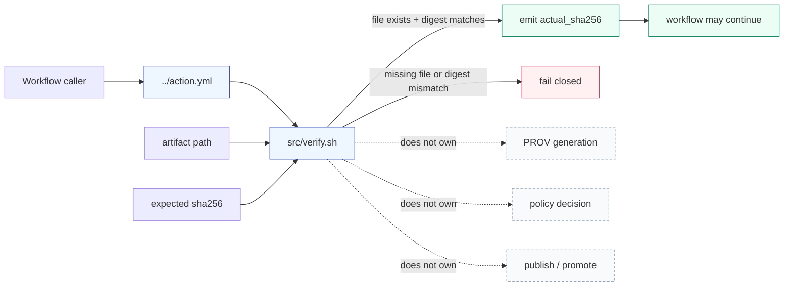

<!-- [KFM_META_BLOCK_V2]
doc_id: kfm://doc/NEEDS-VERIFICATION__github_actions_provenance_guard_src_readme
title: provenance-guard/src
type: standard
version: v1
status: draft
owners: @bartytime4life
created: NEEDS-VERIFICATION
updated: 2026-04-27
policy_label: public
related: [../README.md, ../action.yml, ./verify.sh, ../../README.md, ../../../workflows/README.md, ../../../CODEOWNERS, ../../../PULL_REQUEST_TEMPLATE.md, ../../../../README.md, ../../../../contracts/README.md, ../../../../schemas/contracts/v1/README.md, ../../../../policy/README.md, ../../../../tests/README.md, ../../../../tests/contracts/README.md, ../../../../data/catalog/prov/README.md, ../../../../data/receipts/, ../../../../data/proofs/, ../../../../tools/attest/README.md, ../../../../tools/ci/README.md, ../../../../scripts/README.md]
tags: [kfm, github-actions, provenance-guard, source-helper, sha256, fail-closed]
notes: [doc_id and created date need registry/git-history verification, generated for .github/actions/provenance-guard/src/README.md, current public source lane contains verify.sh and an empty README.md, active-branch line endings executable bit tests workflow callers and merge-blocking enforcement remain NEEDS VERIFICATION]
[/KFM_META_BLOCK_V2] -->

<a id="top"></a>

# `provenance-guard/src/`

Source helpers for the KFM `provenance-guard` action, limited to deterministic digest and linkage checks that support fail-closed provenance review.


> [!IMPORTANT]
> **Status:** experimental  
> **Owners:** `@bartytime4life` *(repo-facing public docs identify this owner; active-branch ownership should still be checked before merge)*  
> **Path:** `.github/actions/provenance-guard/src/README.md`  
> **Repo fit:** child source-helper lane under [`../README.md`](../README.md), invoked through [`../action.yml`](../action.yml), and currently centered on [`./verify.sh`](./verify.sh)  
> **Authority class:** source-helper documentation; not canonical provenance law, not policy authority, not release authority  
> **Quick jumps:** [Scope](#scope) · [Repo fit](#repo-fit) · [Accepted inputs](#accepted-inputs) · [Exclusions](#exclusions) · [Current evidence boundary](#current-evidence-boundary) · [Directory tree](#directory-tree) · [Quickstart](#quickstart) · [Usage](#usage) · [Diagram](#diagram) · [Operating tables](#operating-tables) · [Task list](#task-list--definition-of-done) · [FAQ](#faq) · [Appendix](#appendix)

> [!WARNING]
> This directory may contain action implementation helpers, but the durable meanings of provenance, receipts, proofs, manifests, policy decisions, and publication state live outside `src/`. Keep this lane small, deterministic, reviewable, and subordinate to KFM’s governed trust path.

---

## Scope

`provenance-guard/src/` is the implementation-helper surface for the repo-local `provenance-guard` action.

The current public helper surface is narrow:

- compute a local artifact SHA-256 digest
- compare it to a caller-declared expected digest
- emit the observed digest to GitHub Actions output
- fail closed when the artifact is missing or the digest does not match

That narrow digest check is useful, but it is not the whole KFM provenance model. It is one helper step inside a larger trust posture where receipts, proofs, manifests, catalog records, EvidenceBundles, policy decisions, review records, and release state remain distinct.

[Back to top](#top)

---

## Repo fit

| Relation | Surface | Why it matters |
|---|---|---|
| Parent action README | [`../README.md`](../README.md) | Maintainer-facing contract for the `provenance-guard` action |
| Composite action entrypoint | [`../action.yml`](../action.yml) | Declares caller inputs, outputs, and the step that invokes `src/verify.sh` |
| Current helper | [`./verify.sh`](./verify.sh) | Performs the current digest verification behavior |
| Local actions family | [`../../README.md`](../../README.md) | Keeps repo-local actions as thin reusable workflow seams |
| Workflow orchestration | [`../../../workflows/README.md`](../../../workflows/README.md) | Workflows decide when this guard runs and whether a failure blocks merge, release, or promotion |
| `.github` governance | [`../../../CODEOWNERS`](../../../CODEOWNERS), [`../../../PULL_REQUEST_TEMPLATE.md`](../../../PULL_REQUEST_TEMPLATE.md) | Ownership, review expectations, and proof links belong above individual helper scripts |
| Contract meaning | [`../../../../contracts/README.md`](../../../../contracts/README.md) | Human-readable trust-object meaning lives outside action glue |
| Machine profiles | [`../../../../schemas/contracts/v1/README.md`](../../../../schemas/contracts/v1/README.md) | Versioned schema families may define trust-bearing object shapes; this helper must not replace them |
| Policy authority | [`../../../../policy/README.md`](../../../../policy/README.md) | Allow, deny, obligation, and no-silent-publish decisions belong to policy surfaces |
| Verification burden | [`../../../../tests/README.md`](../../../../tests/README.md), [`../../../../tests/contracts/README.md`](../../../../tests/contracts/README.md) | Valid, invalid, and negative-path proof should be testable outside this helper |
| Release evidence helpers | [`../../../../tools/attest/README.md`](../../../../tools/attest/README.md) | Larger signing, digest, attestation, and verification helpers should stay reviewable outside workflow glue |

[Back to top](#top)

---

## Accepted inputs

### Helper files that belong here

Use `src/` for tiny implementation helpers that are:

- deterministic
- public-safe
- shellcheckable or otherwise testable
- invoked explicitly by [`../action.yml`](../action.yml)
- narrow enough that reviewers can understand the failure mode from logs
- free of secrets, credentials, long-lived tokens, and hidden network dependencies

### Current `verify.sh` runtime inputs

| Input | Source | Required | Current meaning |
|---|---|---:|---|
| `file` | first positional argument | yes | File to hash |
| `expected-sha256` | second positional argument | yes | Expected lowercase or uppercase hexadecimal SHA-256 digest |
| `GITHUB_OUTPUT` | GitHub Actions environment | yes in action context | Output file where `actual_sha256=<digest>` is appended |
| `sha256sum` | runner toolchain | yes | Computes local digest |
| `awk` | runner toolchain | yes | Extracts the digest from `sha256sum` output |

> [!NOTE]
> Running the helper outside GitHub Actions requires a temporary `GITHUB_OUTPUT` path. Without it, `set -u` should make the helper fail rather than silently drop the observed digest.

### Future helper additions

Future helpers may belong here only when the same PR updates:

1. [`../action.yml`](../action.yml)
2. this README
3. fixtures or tests proving success and fail-closed behavior
4. workflow docs or caller examples, when caller behavior changes

[Back to top](#top)

---

## Exclusions

Do not place the following responsibilities in `provenance-guard/src/`:

| Does not belong here | Why | Better home |
|---|---|---|
| Creating canonical PROV facts | A guard should not invent provenance after the fact | producing pipeline, provenance emitter, `data/catalog/prov/` profile docs |
| Defining provenance schemas | Schema meaning must remain reviewable outside helper code | `../../../../schemas/contracts/v1/`, `../../../../contracts/` |
| Deciding publication eligibility | Policy and review gates own allow/deny/release decisions | `../../../../policy/`, workflow-level promotion gates |
| Generating SBOMs, signatures, or attestations | Neighboring lanes own signing and attestation support | `../sbom-produce-and-sign/`, `../../../../tools/attest/` |
| Publishing or moving artifacts | Promotion is a governed state transition, not a helper side effect | release/promotion workflows, `tools/validators/promotion_gate/` |
| Storing trust roots or secrets | Action source directories must not become secret stores | GitHub environments, OIDC, external secret management |
| Reading RAW, WORK, or QUARANTINE as public truth | The guard must not bypass the trust membrane | governed pipeline and release surfaces |
| Large shared runtime logic | Hidden helper mass is hard to review and test | `../../../../tools/`, `../../../../scripts/`, `../../../../packages/` |

[Back to top](#top)

---

## Current evidence boundary

| Claim | Label | Basis | Verification note |
|---|---|---|---|
| `src/` is a real child directory under `.github/actions/provenance-guard/` | **CONFIRMED** | Current public tree shows `src/` under the action lane | Recheck active branch before merge |
| `src/README.md` existed as an empty file before this revision | **CONFIRMED** | Current raw file returned no Markdown body | This README replaces that placeholder state |
| `src/verify.sh` is currently the source helper surfaced in the public tree | **CONFIRMED** | Current public tree lists `verify.sh` beside `README.md` | Recheck active branch for any additional helpers |
| `../action.yml` invokes `src/verify.sh` with `file` and `expected-sha256` | **CONFIRMED** | Current raw action metadata shows those inputs and call path | Confirm line breaks and YAML parse in the active checkout |
| Current helper intent is SHA-256 digest verification | **CONFIRMED** | Current helper computes `sha256sum`, emits `actual_sha256`, and fails on mismatch | Run a local smoke test before relying on CI enforcement |
| Broader PROV bundle presence, receipt linkage, policy, and release checks are fully implemented here | **UNKNOWN / NEEDS VERIFICATION** | Parent action doctrine is broader than the current helper | Do not claim broader enforcement until tests and code prove it |
| Current public raw `verify.sh` line formatting is safe for direct execution | **NEEDS VERIFICATION** | Public raw view appears compact enough to require an active-checkout syntax check | Run `wc -l`, `bash -n`, and an action smoke test |

[Back to top](#top)

---

## Directory tree

### Current public source lane

```text
.github/actions/provenance-guard/src/
├── README.md
└── verify.sh
```

### Target source lane once the action matures

```text
.github/actions/provenance-guard/src/
├── README.md
├── verify.sh                 # current digest helper
├── summarize.sh              # PROPOSED only if action.yml and tests land with it
└── provenance_guard.py       # PROPOSED only if shell helper scope becomes too complex
```

> [!IMPORTANT]
> Keep action-local source small. Large or reusable verification logic should move to `tools/` or `scripts/` with tests, then be called from this action.

[Back to top](#top)

---

## Quickstart

### 1) Inspect the active branch

```bash
# From repo root
find .github/actions/provenance-guard/src -maxdepth 2 -type f | sort

# Confirm helper line count, executable bit, and syntax.
# If this reports only one physical line, inspect whether the helper was accidentally flattened.
wc -l .github/actions/provenance-guard/src/verify.sh
ls -l .github/actions/provenance-guard/src/verify.sh
bash -n .github/actions/provenance-guard/src/verify.sh
```

### 2) Run a local digest smoke test

```bash
tmp_dir="$(mktemp -d)"
artifact="$tmp_dir/artifact.txt"
output="$tmp_dir/github-output.txt"

printf 'kfm-provenance-guard\n' > "$artifact"
expected="$(sha256sum "$artifact" | awk '{print $1}')"

GITHUB_OUTPUT="$output" \
  bash .github/actions/provenance-guard/src/verify.sh "$artifact" "$expected"

cat "$output"
```

Expected output shape:

```text
actual_sha256=<sha256-hex>
```

### 3) Prove fail-closed behavior

```bash
tmp_dir="$(mktemp -d)"
artifact="$tmp_dir/artifact.txt"
output="$tmp_dir/github-output.txt"

printf 'kfm-provenance-guard\n' > "$artifact"

GITHUB_OUTPUT="$output" \
  bash .github/actions/provenance-guard/src/verify.sh "$artifact" \
  "0000000000000000000000000000000000000000000000000000000000000000"
```

Expected behavior: the helper exits non-zero and emits a digest mismatch error.

[Back to top](#top)

---

## Usage

### Current action-level usage

The current composite action shape is digest-focused:

```yaml
- name: Verify provenance digest
  uses: ./.github/actions/provenance-guard
  with:
    file: data/proofs/example/proof.json
    expected-sha256: 0000000000000000000000000000000000000000000000000000000000000000
```

### Current helper-level usage

```bash
GITHUB_OUTPUT=/tmp/provenance-guard-output.txt \
  .github/actions/provenance-guard/src/verify.sh \
  data/proofs/example/proof.json \
  0000000000000000000000000000000000000000000000000000000000000000
```

### Output contract

| Output | Source | Meaning |
|---|---|---|
| `actual_sha256` | `verify.sh` via `$GITHUB_OUTPUT` | Observed SHA-256 digest for the checked file |

### Failure modes

| Failure | Current behavior | Review meaning |
|---|---|---|
| Missing file | Emits `::error::File does not exist: <file>` and exits non-zero | Caller passed an invalid artifact path or artifact generation failed |
| Digest mismatch | Emits expected and actual digest values and exits non-zero | Declared provenance or manifest digest no longer matches local artifact |
| Missing expected digest | Shell parameter expansion fails before digesting | Caller did not supply the required second argument |
| Missing `GITHUB_OUTPUT` | `set -u` should fail when writing output | Local smoke tests must provide a temporary output file |

[Back to top](#top)

---

## Diagram



[Back to top](#top)

---

## Operating tables

### Helper contract

| Behavior | Current helper | Label |
|---|---|---|
| File existence check | yes | **CONFIRMED** |
| SHA-256 computation | yes, via `sha256sum` | **CONFIRMED** |
| Output emission | yes, `actual_sha256` through `$GITHUB_OUTPUT` | **CONFIRMED** |
| Digest mismatch fail-closed | yes | **CONFIRMED** |
| PROV schema validation | no direct evidence in `src/` | **UNKNOWN / OUT OF SCOPE** |
| PROV bundle generation | not this helper | **OUT OF SCOPE** |
| Policy allow/deny decision | not this helper | **OUT OF SCOPE** |
| Signing or attestation | not this helper | **OUT OF SCOPE** |
| Publication or promotion | not this helper | **OUT OF SCOPE** |

### Digest check responsibilities

| Responsibility | Owner |
|---|---|
| Declare expected digest | caller, manifest, receipt, or proof-producing step |
| Compute observed digest | `src/verify.sh` |
| Compare expected vs observed | `src/verify.sh` |
| Decide whether digest mismatch blocks merge | workflow / branch protection / required checks |
| Explain provenance meaning | parent action README, contracts, schemas, policy, tests, and proof surfaces |
| Emit reviewer summary beyond raw logs | **PROPOSED**, not current helper proof |

### Naming conventions

| Item | Current name | Notes |
|---|---|---|
| Helper script | `verify.sh` | Keep name stable unless `../action.yml` and README are updated together |
| Output key | `actual_sha256` | Matches current shell output name |
| Action output | `actual-sha256` | Hyphenated output exposed by `../action.yml` |
| Required input | `file` | Artifact path |
| Required input | `expected-sha256` | Declared expected digest |

[Back to top](#top)

---

## Task list / definition of done

### README readiness

- [x] States the source-helper role in KFM terms.
- [x] Includes KFM Meta Block v2 with reviewable placeholders.
- [x] Includes status, owner, path, badges, and quick jumps.
- [x] Separates current SHA-256 helper behavior from broader provenance doctrine.
- [x] Defines accepted inputs and exclusions.
- [x] Includes a meaningful Mermaid diagram.
- [x] Provides local smoke-test commands.
- [x] Calls out remaining active-branch verification items.

### Helper readiness

- [ ] Confirm `verify.sh` has safe line endings and one logical command per line.
- [ ] Confirm `verify.sh` is executable or called explicitly through `bash`.
- [ ] Run `bash -n .github/actions/provenance-guard/src/verify.sh`.
- [ ] Add or verify a positive fixture test for a matching digest.
- [ ] Add or verify a negative fixture test for a digest mismatch.
- [ ] Add or verify a missing-file test.
- [ ] Confirm `$GITHUB_OUTPUT` behavior in GitHub Actions runner context.
- [ ] Confirm `../action.yml` exposes `actual-sha256` exactly as callers expect.

### Governance readiness

- [ ] Confirm active-branch owner coverage for `.github/actions/provenance-guard/`.
- [ ] Confirm workflow callers and required-check behavior.
- [ ] Confirm whether this helper is only digest verification or part of a broader PROV linkage guard.
- [ ] Keep policy, publication, signing, and contract authority outside `src/`.
- [ ] Update parent [`../README.md`](../README.md) if implementation scope changes.
- [ ] Document any compatibility path from older `data/prov` patterns to `data/catalog/prov`.

[Back to top](#top)

---

## FAQ

### Does `src/verify.sh` create provenance?

No. It currently verifies a local file digest against a caller-declared expected SHA-256 value.

### Does a passing digest check mean an artifact is publishable?

No. A digest match only proves that one local file matches one declared hash. Publication still depends on source rights, sensitivity handling, policy decisions, review state, release manifests, proof packs, catalog closure, and promotion state.

### Why keep this helper under `.github/actions/` instead of `tools/`?

Because the current helper is tightly coupled to the composite action and GitHub Actions output handling. If the logic grows beyond a tiny action-local helper, move reusable behavior into `tools/` or `scripts/` and call it from the action.

### Why mention PROV if the helper only checks SHA-256?

Because `provenance-guard` sits inside a provenance-facing action lane. This `src/` README keeps the current helper honest: digest verification can support provenance review, but it is not the same thing as generating, validating, or approving provenance.

### What should reviewers check first?

Start with the active branch:

```bash
sed -n '1,220p' .github/actions/provenance-guard/action.yml
sed -n '1,220p' .github/actions/provenance-guard/src/verify.sh
bash -n .github/actions/provenance-guard/src/verify.sh
```

Then run one matching-digest case and one mismatch case.

[Back to top](#top)

---

## Appendix

<details>
<summary>Truth labels used in this README</summary>

| Label | Meaning |
|---|---|
| **CONFIRMED** | Directly supported by current surfaced repo evidence or by the checked public file contents used for this revision |
| **INFERRED** | Strongly implied by repo structure and KFM doctrine, but not directly proven by this helper |
| **PROPOSED** | Recommended future behavior or target shape, not yet proven as current implementation |
| **UNKNOWN** | Not verified strongly enough from available evidence |
| **NEEDS VERIFICATION** | Must be checked against active branch files, tests, workflow callers, branch protection, or platform settings |

</details>

<details>
<summary>Why this helper must stay narrow</summary>

KFM’s trust posture depends on keeping object classes separate:

- a digest is not provenance
- a receipt is not a proof
- a PROV bundle is not a release manifest
- a release manifest is not a policy decision
- a passing workflow step is not publication approval

`src/verify.sh` can support that posture by making digest drift visible. It weakens the posture if maintainers treat it as proof of complete provenance, policy clearance, or release readiness.

</details>

<details>
<summary>Suggested future checks, only if implemented and tested</summary>

Possible future helper behavior may include:

- checking a digest declared in a manifest file
- checking that a PROV bundle declares the artifact as a subject
- detecting orphan PROV files in strict mode
- writing a stable JSON summary for CI annotations
- normalizing failure codes for reviewer handoff

Each addition should land with tests and should keep policy, schema, signing, and publication authority outside this directory.

</details>

[Back to top](#top)
