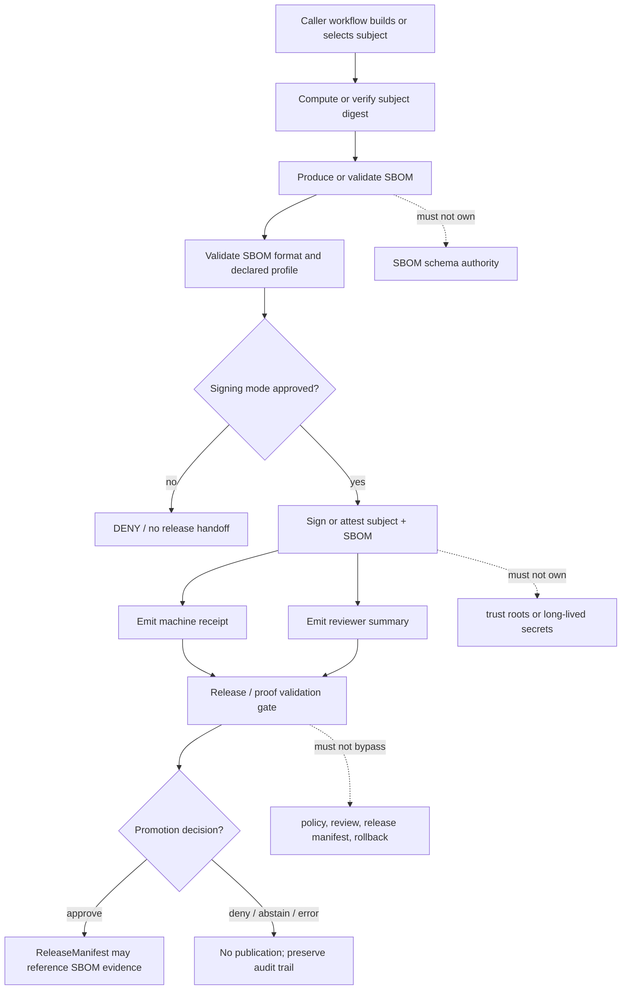

<!-- [KFM_META_BLOCK_V2]
doc_id: kfm://doc/TODO-uuid-sbom-produce-and-sign-readme
title: SBOM Produce and Sign Action
type: standard
version: v1
status: draft
owners: TODO: verify CODEOWNERS/action owner
created: TODO: verify original creation date
updated: 2026-05-06
policy_label: public
related: [../README.md, ../../README.md, ../../workflows/README.md, ../../../README.md, ../../../contracts/, ../../../schemas/, ../../../policy/, ../../../release/, ../../../data/receipts/, ../../../data/proofs/, ../../../tools/]
tags: [kfm, github-actions, sbom, signing, attestation, supply-chain, release-evidence]
notes: [Leaf action README for .github/actions/sbom-produce-and-sign. doc_id, owner, original creation date, action.yml interface, caller workflows, required checks, and platform permissions remain verification items.]
[/KFM_META_BLOCK_V2] -->

<a id="top"></a>

# SBOM Produce and Sign Action

Repo-local GitHub Action boundary for producing SBOM evidence, binding it to a declared subject, and handing signatures or attestations to KFM release review without becoming release authority.

> [!NOTE]
> **Status:** `experimental`  
> **Owners:** `TODO: verify CODEOWNERS/action owner`  
> **Path:** `.github/actions/sbom-produce-and-sign/README.md`  
> **Current source-check state:** `README.md` is present; `action.yml`, executable implementation, caller workflows, branch rules, OIDC settings, receipt schemas, and release-gate consumption remain `NEEDS VERIFICATION`.  
> **Quick jumps:** [Scope](#scope) · [Repo fit](#repo-fit) · [Accepted inputs](#accepted-inputs) · [Exclusions](#exclusions) · [Directory tree](#directory-tree) · [Quickstart](#quickstart) · [Usage](#usage) · [Diagram](#diagram) · [Operating tables](#operating-tables) · [Task list](#task-list--definition-of-done) · [FAQ](#faq) · [Appendix](#appendix)


> [!IMPORTANT]
> This action may prepare SBOMs, digests, signatures, attestations, receipts, and reviewer summaries. It must not decide that a release is publishable. KFM release approval belongs to policy gates, review records, proof packs, release manifests, correction paths, and rollback targets.

---

## Scope

`.github/actions/sbom-produce-and-sign/` is the **step-level wrapper** for SBOM and signing/attestation work inside GitHub Actions.

Use it when a workflow needs to:

- describe a declared release-candidate subject with an SBOM
- compute or verify subject and SBOM digests
- sign or attest the subject/SBOM pair using a repo-approved mode
- emit a machine-readable receipt for release review
- emit a reviewer-readable summary for CI or PR review
- fail closed when inputs, formats, tools, permissions, digests, or signing state are unclear

This directory is intentionally narrow. Durable policy, schema, contract, receipt, proof, release, and tooling authority lives outside this action folder.

### What this action protects

| KFM concern | Boundary rule |
|---|---|
| SBOM evidence | The action may produce or validate SBOM material for a declared subject. |
| Integrity | The action should expose subject digest and SBOM digest, not just filenames. |
| Signing / attestation | The action may call a repo-approved signing or attestation path, but must not own long-lived trust roots. |
| Receipts | The action may emit a receipt file; durable receipt storage belongs in `data/receipts/` or a verified equivalent. |
| Proof packs | The action may feed proof validation; proof storage belongs in `data/proofs/`, `release/`, or a verified release evidence lane. |
| Promotion | The action can block unsafe evidence paths, but cannot approve publication. |

[Back to top](#top)

---

## Repo fit

| Relation | Path | Status | Why it matters |
|---|---:|---|---|
| This README | `README.md` | `CONFIRMED` | Human-facing contract for this action leaf. |
| Action metadata | `action.yml` or `action.yaml` | `NEEDS IMPLEMENTATION / NEEDS VERIFICATION` | Executable GitHub Action interface must match this README before callers rely on it. |
| Parent action lane | [`../`](../) | `CONFIRMED` | `.github/actions/` is the repo-local repeated-step seam. |
| GitHub gatehouse | [`../../`](../../) | `CONFIRMED` | `.github/` owns GitHub-native review, workflow, ownership, and security-adjacent routing. |
| Workflow callers | [`../../workflows/`](../../workflows/) | `NEEDS VERIFICATION` | Workflows own triggers, permissions, environments, and job choreography. |
| Root orientation | [`../../../README.md`](../../../README.md) | `CONFIRMED` | KFM identity, lifecycle law, and trust posture start at the repo root. |
| Contract meaning | [`../../../contracts/`](../../../contracts/) | `CONFIRMED surface / deeper fields NEEDS VERIFICATION` | Contracts explain trust-object meaning; this action must not redefine it. |
| Machine validation | [`../../../schemas/`](../../../schemas/) | `CONFIRMED surface / enforcement depth NEEDS VERIFICATION` | SBOM receipt, release, and envelope shapes should validate here or through a documented temporary validator. |
| Policy authority | [`../../../policy/`](../../../policy/) | `CONFIRMED surface / enforcement depth NEEDS VERIFICATION` | Policy owns allow, deny, abstain, release, sensitivity, and obligation logic. |
| Release operations | [`../../../release/`](../../../release/) | `CONFIRMED surface / release maturity NEEDS VERIFICATION` | Release manifests, candidates, rollback cards, and promotion decisions belong here or in the verified release lane. |
| Process memory | [`../../../data/receipts/`](../../../data/receipts/) | `CONFIRMED surface / emitted instances UNKNOWN` | Long-lived receipts should remain inspectable outside action logs. |
| Release evidence | [`../../../data/proofs/`](../../../data/proofs/) | `CONFIRMED surface / emitted instances UNKNOWN` | Proof packs, signatures, attestations, and release evidence should not be hidden inside `.github/`. |
| Durable tooling | [`../../../tools/`](../../../tools/) | `CONFIRMED surface / helper inventory NEEDS VERIFICATION` | Reusable SBOM, digest, signing, verification, or summary logic should graduate here when it outgrows thin action glue. |

> [!WARNING]
> A successful SBOM/signing step is evidence for review. It is not a promotion decision.

[Back to top](#top)

---

## Accepted inputs

This action should accept only declared, reviewable subjects from caller workflows.

| Input class | Examples | Required posture |
|---|---|---|
| Subject artifact | release binary, package file, generated dataset bundle, tile bundle, container image reference | Must already be produced by a governed build or release-candidate job. |
| Subject identity | stable subject name, path, image ref, package coordinate, release candidate ID | Must be explicit enough to reconstruct what was signed or attested. |
| Subject digest | `sha256:<hex>`, checksum file, registry digest | Must be verified or computed before release handoff. |
| SBOM format request | `spdx-json`, `cyclonedx-json` | Must be format-declared and validated before signing or attestation claims are made. |
| Existing SBOM path | prebuilt SBOM from a build tool | Must still be digest-checked and validated. |
| Tool pin set | SBOM generator version, signing tool version, attestation action version | Must be recorded in receipt or summary. |
| Signing mode | `github-attestation`, `sigstore-cosign-keyless`, `sigstore-cosign-key`, `repo-approved-other` | Must be approved for the branch, release class, and secret posture. |
| Output paths | SBOM output, signature output, attestation output, receipt output, summary output | Must be caller-declared; avoid hidden temp-only evidence. |
| GitHub run context | repository, workflow, run ID, actor, commit SHA, ref | Must be captured for audit and reviewer context. |

### Compatibility note

Older KFM proposal material used a compact interface:

| Prior input | Preserve? | Current posture |
|---|---:|---|
| `subject` | Yes | Compatible alias for the declared subject path/ref. |
| `format` | Yes | Compatible alias for `sbom-format`; default should remain `spdx-json` unless `action.yml` says otherwise. |
| `cosign_key` | Caution | Legacy explicit-key path. Do not store long-lived keys in the repo; prefer verified OIDC/keyless or platform attestation where policy permits. |

> [!CAUTION]
> A subject without a digest, a digest without a subject identity, or an SBOM without a declared format is an `ERROR`, not a warning.

[Back to top](#top)

---

## Exclusions

| Keep out of this action | Why | Correct home |
|---|---|---|
| Policy rule bodies | Policy meaning must remain inspectable and testable outside workflow glue. | [`../../../policy/`](../../../policy/) |
| Contract semantics | Action wrappers should not redefine trust-object meaning. | [`../../../contracts/`](../../../contracts/) |
| JSON Schema authority | Machine validation belongs in schema roots. | [`../../../schemas/`](../../../schemas/) |
| RAW source data | GitHub action folders are not lifecycle data stores. | `../../../data/raw/` or the verified lifecycle lane |
| WORK / QUARANTINE candidates | Release-facing actions must not expose internal candidates as published truth. | `../../../data/work/`, `../../../data/quarantine/` |
| Long-lived signing secrets | Secrets must not be committed, printed, or captured in receipts. | GitHub environments, OIDC, or approved external secret management |
| Vulnerability adjudication | SBOM existence does not decide vulnerability risk. | security review, policy gates, and release review |
| Release approval | Signing is evidence, not promotion. | [`../../../release/`](../../../release/) plus review and promotion records |
| Proof-pack storage | Proofs must remain inspectable outside action folders and logs. | [`../../../data/proofs/`](../../../data/proofs/) or verified release proof lane |
| Public publish shortcuts | KFM promotion is a governed state transition, not a convenience step. | governed workflow + release manifest + rollback target |

[Back to top](#top)

---

## Directory tree

### Current source-check snapshot

```text
.github/actions/sbom-produce-and-sign/
└── README.md
```

### Target implementation shape

```text
.github/actions/sbom-produce-and-sign/
├── README.md
├── action.yml              # PROPOSED / NEEDS IMPLEMENTATION
├── src/
│   └── build.sh            # PROPOSED: only if action-local logic stays tiny
├── templates/
│   └── summary.md          # PROPOSED: optional reviewer summary template
└── tests/
    └── fixtures/           # PROPOSED: minimal public-safe happy and failure cases
```

### Reading rule

| Path claim | Status | How to read it |
|---|---|---|
| `README.md` | `CONFIRMED` | This is the file you are reading. |
| `action.yml` / `action.yaml` | `NEEDS IMPLEMENTATION / NEEDS VERIFICATION` | Required before this leaf can be treated as executable. |
| `src/build.sh` | `PROPOSED` | Use only if shell logic remains small; graduate durable logic to `tools/`. |
| `templates/` | `PROPOSED` | Acceptable for action-local summaries only. |
| `tests/fixtures/` | `PROPOSED` | Useful for action-local smoke proof; broader proof belongs in `tests/`. |
| Caller workflows | `NEEDS VERIFICATION` | Do not claim runtime behavior until workflow YAML and platform settings prove it. |

[Back to top](#top)

---

## Quickstart

Run these from the repository root.

### 1. Inspect the leaf and neighbors

```bash
git status --short
git branch --show-current || true
git rev-parse --show-toplevel || true

find .github/actions/sbom-produce-and-sign -maxdepth 3 -type f 2>/dev/null | sort
find .github/actions/sbom-produce-and-sign -maxdepth 2 \( -name 'action.yml' -o -name 'action.yaml' \) -print 2>/dev/null | sort

sed -n '1,260p' .github/actions/README.md 2>/dev/null || true
sed -n '1,260p' .github/actions/sbom-produce-and-sign/README.md
sed -n '1,240p' .github/actions/sbom-produce-and-sign/action.yml 2>/dev/null || true
```

### 2. Find caller workflows and release handoffs

```bash
grep -R "uses: ./.github/actions/sbom-produce-and-sign" -n .github/workflows 2>/dev/null || true
git grep -nE "sbom-produce-and-sign|sbom|spdx-json|cyclonedx-json|cosign|attest" -- .github release tools tests docs contracts schemas policy data 2>/dev/null || true
```

### 3. Check authority surfaces before expanding action logic

```bash
for path in \
  contracts schemas policy tests tools release data/receipts data/proofs
do
  test -e "$path" && printf 'OK %s\n' "$path" || printf 'MISSING %s\n' "$path"
done
```

> [!TIP]
> Keep the first executable action small: one subject, one generated SBOM, one digest, one signature or attestation mode, one receipt, one summary, and one negative fixture.

[Back to top](#top)

---

## Usage

Use this action only after the caller workflow has produced or selected a release-candidate subject.

### Proposed caller pattern

```yaml
jobs:
  sbom_evidence:
    runs-on: ubuntu-latest

    permissions:
      contents: read
      id-token: write        # NEEDS VERIFICATION for keyless signing or GitHub attestation
      attestations: write    # NEEDS VERIFICATION for GitHub artifact/SBOM attestations

    steps:
      - uses: actions/checkout@v4
        with:
          persist-credentials: false

      - name: Build or select release candidate
        shell: bash
        run: |
          set -euo pipefail
          mkdir -p build/release
          printf 'placeholder\n' > build/release/kfm-artifact.txt
          sha256sum build/release/kfm-artifact.txt > build/release/kfm-artifact.txt.sha256

      - name: Produce SBOM and signing evidence
        uses: ./.github/actions/sbom-produce-and-sign
        with:
          subject: build/release/kfm-artifact.txt
          format: spdx-json
          sbom-out: build/release/kfm-artifact.sbom.spdx.json
          signing-mode: github-attestation
          receipt-out: build/release/kfm-artifact.sbom.receipt.json
          summary-out: build/release/kfm-artifact.sbom.summary.md
```

> [!IMPORTANT]
> The workflow owns permissions, identity, environments, and artifact retention. This action owns only the repeated SBOM/signing step.

### Proposed action interface

| Input | Required | Status | Purpose | Failure behavior |
|---|---:|---|---|---|
| `subject` | yes | retained from prior proposal | Path/ref for artifact being described. | `ERROR` if missing or unreadable. |
| `format` | no | retained from prior proposal | SBOM format; default `spdx-json`. | `ERROR` for unsupported value. |
| `cosign_key` | no | retained with caution | Base64 explicit key material for legacy keyed signing. | `DENY` unless caller policy allows explicit-key mode. |
| `subject-digest` | no | proposed | Expected digest for subject. | `ERROR` on malformed or mismatched digest. |
| `subject-checksums` | no | proposed | Checksum file for one or more subjects. | `ERROR` on unresolved entries. |
| `sbom-path` | no | proposed | Existing SBOM to validate/sign instead of generating. | `ERROR` if invalid or missing. |
| `sbom-out` | yes for generation | proposed | Output path for generated or normalized SBOM. | `ERROR` if unwritable. |
| `signing-mode` | yes | proposed | `github-attestation`, `sigstore-cosign-keyless`, `sigstore-cosign-key`, or `repo-approved-other`. | `DENY` if not allowed for branch/release class. |
| `receipt-out` | yes | proposed | Machine-readable KFM receipt path. | `ERROR` if unwritable. |
| `summary-out` | no | proposed | Reviewer-readable Markdown summary path. | `ERROR` only when caller marks summary required. |
| `fail-on-warnings` | no | proposed | Promote warnings to blocking failure on release branches. | `DENY` when policy requires strict mode. |

### Proposed outputs

| Output | Meaning | Review note |
|---|---|---|
| `sbom-path` | Generated or validated SBOM path. | Must be deterministic enough to inspect. |
| `sbom-sha256` | SHA-256 digest of the SBOM. | Must appear in receipt. |
| `subject-digest` | Digest of signed or attested subject. | Must match caller expectation. |
| `signature-path` | Local signature path, when produced. | Optional when platform attestation is used instead. |
| `attestation-path` | Local attestation bundle, when produced. | Must not be treated as release proof by itself. |
| `attestation-url` | Platform URL, when available. | Reviewer aid, not publication authority. |
| `receipt-path` | Machine-readable receipt. | Required for governed release handoff. |
| `summary-path` | Reviewer-facing Markdown summary. | Suitable for `GITHUB_STEP_SUMMARY`. |
| `action-status` | `ANSWER`, `ABSTAIN`, `DENY`, or `ERROR`. | Finite status prevents ambiguous success language. |

[Back to top](#top)

---

## Diagram



[Back to top](#top)

---

## Operating tables

### Truth labels used here

| Label | Meaning in this README |
|---|---|
| `CONFIRMED` | Verified from the current source check, checked-in public repository evidence, or directly inspectable adjacent files. |
| `INFERRED` | Conservative interpretation from confirmed structure and KFM doctrine. |
| `PROPOSED` | Recommended action shape, contract, field, or workflow pattern not yet verified as implementation. |
| `UNKNOWN` | Not proven from current source check, mounted checkout, workflow inventory, platform settings, or emitted artifacts. |
| `NEEDS VERIFICATION` | Must be checked against the active branch, platform settings, generated outputs, or release evidence before merge or rollout. |
| `DENY` | Policy or release posture blocks the operation. |
| `ABSTAIN` | Evidence is insufficient to decide safely. |
| `ERROR` | Tooling, input, format, digest, or runtime failure. |

### Minimum receipt shape

```json
{
  "receipt_type": "kfm.sbom_produce_and_sign.v1",
  "status": "TODO: ANSWER|DENY|ABSTAIN|ERROR",
  "subject": {
    "name": "TODO",
    "path": "TODO",
    "digest": "sha256:TODO"
  },
  "sbom": {
    "format": "TODO: spdx-json|cyclonedx-json",
    "path": "TODO",
    "sha256": "TODO"
  },
  "signing": {
    "mode": "TODO",
    "tool": "TODO",
    "tool_version": "TODO",
    "signature_path": "TODO",
    "attestation_path": "TODO",
    "attestation_url": "TODO"
  },
  "github_context": {
    "repository": "TODO",
    "workflow": "TODO",
    "run_id": "TODO",
    "actor": "TODO",
    "sha": "TODO",
    "ref": "TODO"
  },
  "validation": {
    "warnings": [],
    "errors": []
  }
}
```

### Failure behavior

| Condition | Expected status | Release consequence |
|---|---|---|
| Missing subject | `ERROR` | No release handoff. |
| Unsupported SBOM format | `ERROR` | No release handoff. |
| Subject digest mismatch | `ERROR` | Release candidate evidence chain is invalid. |
| SBOM validation unavailable | `ABSTAIN` or `ERROR` | Hold until validator/schema is available. |
| Signing mode not approved | `DENY` | No signing or attestation. |
| Long-lived secret required without approved secret path | `DENY` | No signing or attestation. |
| Signer failure | `ERROR` | No release handoff. |
| Receipt cannot be written | `ERROR` | No release handoff. |
| Summary cannot be written | `ERROR` only if summary is required | Otherwise warn and continue only if policy permits. |
| Successful SBOM + digest + signature/attestation + receipt | `ANSWER` | Evidence may move to release/proof validation; publication still requires promotion. |

[Back to top](#top)

---

## Task list / definition of done

A change to this action is merge-ready when:

- [ ] `action.yml` or `action.yaml` exists and matches this README
- [ ] the action has one narrow responsibility
- [ ] inputs, outputs, permissions, failure behavior, and emitted evidence are documented
- [ ] caller workflow permissions are minimal and explicit
- [ ] SBOM generator and signing/attestation tools are pinned, installed by workflow, or centrally governed
- [ ] no action code stores long-lived secrets, private keys, tokens, or trust roots
- [ ] explicit-key signing is disabled by default or guarded by policy
- [ ] keyless/OIDC behavior is verified from workflow permissions and runner identity
- [ ] SBOM validation exists for declared formats or the README marks validation as `NEEDS VERIFICATION`
- [ ] subject digest, SBOM digest, and attestation subject are checked for closure
- [ ] receipt output validates against a schema or temporary validator
- [ ] at least one success fixture and one failure fixture exist where risk matters
- [ ] no workflow step can publish, promote, or approve a release by invoking this action
- [ ] related docs are updated when the action interface changes
- [ ] rollback or disablement path is clear
- [ ] current inventory is updated if files beyond `README.md` are added

### Review gates

| Gate | Required evidence |
|---|---|
| Path fit | Action remains a thin repeated-step wrapper under `.github/actions/`. |
| Caller clarity | Every caller declares permissions, inputs, outputs, and release class. |
| Tool pinning | SBOM generator and signing/attestation tooling are pinned or centrally governed. |
| No secret leakage | No private keys, tokens, raw credentials, or sensitive environment values are logged or written to receipts. |
| SBOM validation | SBOM output validates for the declared format or the limitation is explicit. |
| Digest closure | Subject digest, SBOM digest, and attestation subject match. |
| Receipt validation | Receipt output validates against repo schema or temporary validator. |
| Release separation | Action cannot publish, promote, or approve release. |
| Failure states | Missing inputs, unsupported formats, signer failures, and digest mismatch produce finite failure outcomes. |
| Rollback | Caller can disable the step without deleting canonical source evidence or release history. |

[Back to top](#top)

---

## Validation

Run these after the real checkout is mounted.

```bash
# Verify target and neighbors.
find .github/actions -maxdepth 3 -type f | sort
sed -n '1,260p' .github/actions/README.md
sed -n '1,260p' .github/actions/sbom-produce-and-sign/README.md
sed -n '1,260p' .github/actions/sbom-produce-and-sign/action.yml 2>/dev/null || true

# Find callers and release evidence consumers.
git grep -nE "sbom-produce-and-sign|sbom-path|attestation|spdx-json|cyclonedx-json|cosign" -- .github release tools tests docs contracts schemas policy data 2>/dev/null || true

# Markdown and whitespace checks.
git diff --check
```

Optional checks, depending on repo tooling:

```bash
# NEEDS VERIFICATION: run only if installed or provided by repo tooling.
actionlint .github/workflows/*.yml
yamllint .github/actions/sbom-produce-and-sign/action.yml
shellcheck .github/actions/sbom-produce-and-sign/src/*.sh
python -m pytest tests/ci tests/contracts tests/policy tests/validators
```

### Expected validation posture

| Check | Expected result |
|---|---|
| README renders in GitHub | Pass |
| `action.yml` exists and matches documented inputs/outputs | `NEEDS VERIFICATION` until implemented |
| caller workflow exists | `NEEDS VERIFICATION` |
| SBOM format validation exists | `NEEDS VERIFICATION` |
| receipt schema validation exists | `NEEDS VERIFICATION` |
| release gate consumes receipt without granting release authority to the action | `NEEDS VERIFICATION` |
| keyless/OIDC signing path is configured | `NEEDS VERIFICATION` |
| long-lived key path is denied or explicitly governed | `NEEDS VERIFICATION` |

[Back to top](#top)

---

## Rollback

Rollback should be boring, auditable, and reversible.

1. Disable caller workflow steps that invoke `./.github/actions/sbom-produce-and-sign`.
2. Preserve emitted receipts, summaries, logs, signatures, and attestations for audit unless they contain secrets.
3. If a release candidate referenced a bad SBOM, signature, or attestation, invalidate that release candidate.
4. Open or update the relevant correction, withdrawal, or rollback record.
5. Produce a corrected SBOM, receipt, and release decision before restoring release eligibility.
6. Re-run release validation after replacement.
7. Do not rewrite published release history silently.

> [!IMPORTANT]
> A bad SBOM/signing action does not invalidate source evidence by itself. It invalidates the affected release-candidate evidence chain until corrected evidence and a governed decision exist.

[Back to top](#top)

---

## FAQ

### Is this action currently executable?

`NEEDS VERIFICATION`. The current source-check for this README revision confirms the README leaf, but not an executable `action.yml` contract or caller workflow for this action.

### Does this action publish artifacts?

No. It may prepare SBOM/signing evidence. Publication requires governed release review, release manifests, correction path, and rollback target.

### Should this action own vulnerability triage?

No. SBOM production helps reviewers inspect composition. Vulnerability acceptance, denial, exceptions, and release eligibility belong to security review and policy gates.

### Can this action use `cosign_key`?

Only with explicit approval. `cosign_key` is retained as compatibility language from earlier KFM action proposals, but long-lived key material is high-risk. Prefer verified OIDC/keyless or platform attestation where the branch, environment, and release policy support it.

### Does an attestation URL count as proof?

Not by itself. It is a reference that may feed a proof pack or release manifest after validation, review, and promotion.

### Where should reusable signing logic live?

If the logic grows beyond thin action glue, move it to `tools/`, `scripts/`, or `packages/` with tests and leave this action as a wrapper.

[Back to top](#top)

---

## Appendix

<details>
<summary><strong>Prior proposal compatibility notes</strong></summary>

Earlier KFM reusable-action proposal material described a compact composite action:

- `name: sbom-produce-and-sign`
- `inputs.subject`
- `inputs.format`, defaulting to `spdx-json`
- `inputs.cosign_key`
- SBOM generation through Syft
- blob signing through Cosign
- an SLSA/provenance-style attestation command

This README preserves those names as compatibility cues while tightening the KFM boundary:

- subject identity and digest should be explicit
- SBOM format should be validated
- signing mode should be policy-approved
- key custody should not live in the action folder
- receipts should be machine-readable
- summaries should be reviewer-readable
- release authority must stay outside the action

</details>

<details>
<summary><strong>Lowest-friction next PR</strong></summary>

Recommended next executable fill:

1. Add `action.yml` with the smallest compatible interface: `subject`, `format`, `sbom-out`, `signing-mode`, `receipt-out`, `summary-out`.
2. Add `src/build.sh` only if it remains short and action-local.
3. Add one fixture subject and one intentionally bad subject/digest case.
4. Add a receipt validator or point to the repo’s existing schema/validator surface.
5. Add a dry-run caller workflow or migration note.
6. Confirm OIDC/keyless, GitHub attestation, or Cosign behavior from current official docs and repo settings before marking signing behavior `CONFIRMED`.

</details>

[Back to top](#top)
