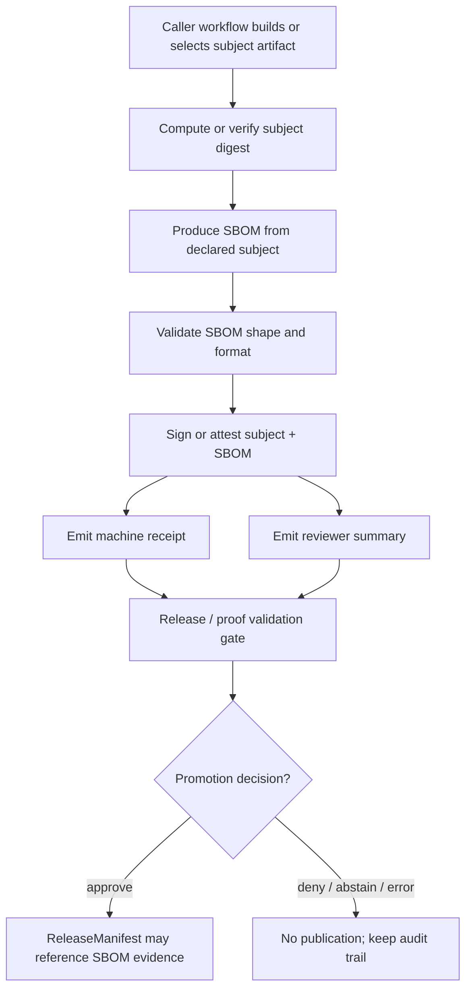

<!-- [KFM_META_BLOCK_V2]
doc_id: kfm://doc/TODO-sbom-produce-and-sign-readme
title: SBOM Produce and Sign Action
type: standard
version: v1
status: draft
owners: TODO: owner not verified
created: TODO: YYYY-MM-DD
updated: TODO: YYYY-MM-DD
policy_label: TODO: public|internal|restricted
related: [../README.md, ../../README.md, ../../workflows/README.md, ../../CODEOWNERS, ../../../release/, ../../../data/receipts/, ../../../data/proofs/, ../../../contracts/, ../../../schemas/, ../../../policy/, ../../../tools/]
tags: [kfm, github-actions, sbom, attestations, release, provenance, supply-chain]
notes: [Target repository was not mounted in the authoring session. This README is a proposed directory-local contract and must be reconciled with action.yml, caller workflows, CODEOWNERS, release policy, and the repo-approved signing tool before merge.]
[/KFM_META_BLOCK_V2] -->

<a id="top"></a>

# SBOM Produce and Sign Action

Repo-local GitHub Action contract for producing SBOM material, binding it to reviewed artifacts, and emitting signing or attestation receipts without becoming release authority.

> [!NOTE]
> **Status:** `draft`  
> **Owners:** `TODO: owner not verified`  
> **Authority:** `PROPOSED`  
> **Repo fit:** `.github/actions/sbom-produce-and-sign/README.md`  
> **Review burden:** Changes affect supply-chain evidence, release-candidate integrity, and reviewer trust surfaces; require review from CI/release, security, and KFM governance maintainers.


**Quick jumps:** [Scope](#scope) · [Repo fit](#repo-fit) · [Accepted inputs](#accepted-inputs) · [Exclusions](#exclusions) · [Operating flow](#operating-flow) · [Proposed action contract](#proposed-action-contract) · [Caller example](#caller-example) · [Review gates](#review-gates) · [Validation](#validation) · [Rollback](#rollback) · [Open verification](#open-verification)

> [!IMPORTANT]
> This action may produce SBOMs, digests, signatures, attestations, receipts, and summaries. It must not decide whether a release is publishable. Release approval belongs to governed release gates, review records, policy decisions, proof packs, and release manifests.

---

## Scope

`.github/actions/sbom-produce-and-sign/` is a thin workflow-step wrapper for SBOM production and signing/attestation handoff.

Use this action to:

- generate a small, release-candidate SBOM from declared artifact inputs
- compute and expose artifact/SBOM digests
- call the repo-approved signing or attestation mechanism
- emit a machine-readable receipt and a reviewer-readable summary
- fail closed when inputs, tool versions, permissions, or digests are missing or inconsistent

Do not use this action to:

- define SBOM schema meaning
- define release policy
- store canonical evidence
- hold signing keys or secrets
- fetch live source data
- bypass release manifests, proof packs, or promotion decisions
- publish artifacts by itself

[Back to top](#top)

---

## Repo fit

| Relation | Path | Why it matters |
| --- | --- | --- |
| Parent action lane | [`../README.md`](../README.md) | Defines `.github/actions/` as the repeated-step seam, not a truth authority. |
| GitHub gatehouse | [`../../README.md`](../../README.md) | Keeps local actions inside review, ownership, and platform-governance boundaries. |
| Caller workflow lane | [`../../workflows/README.md`](../../workflows/README.md) | Workflows own triggers, permissions, job ordering, and required-check behavior. |
| Review ownership | [`../../CODEOWNERS`](../../CODEOWNERS) | Must route action and release-signing changes to verified maintainers. |
| Semantic contracts | [`../../../contracts/`](../../../contracts/) | Defines what receipts, manifests, and proof objects mean. |
| Machine schemas | [`../../../schemas/`](../../../schemas/) | Defines machine validation for receipts and release artifacts. |
| Policy gates | [`../../../policy/`](../../../policy/) | Owns admissibility and fail-closed release rules. |
| Release surfaces | [`../../../release/`](../../../release/) | Owns release candidates, release manifests, and release operations. |
| Operational memory | [`../../../data/receipts/`](../../../data/receipts/) and [`../../../data/proofs/`](../../../data/proofs/) | Long-lived receipts and proof objects belong outside `.github/`. |
| Helper tooling | [`../../../tools/`](../../../tools/) | Repo-native SBOM/signing helpers may live here if they are reusable outside GitHub Actions. |

[Back to top](#top)

---

## Accepted inputs

This action should accept only declared, reviewable artifacts from the caller workflow.

| Input class | Examples | Required posture |
| --- | --- | --- |
| Subject artifact | release binary, container digest, package file, release manifest bundle | Must already be produced by a governed build or release-candidate job. |
| Subject digest | SHA-256 digest, checksum file | Must be computed or verified before signing. |
| SBOM format request | `spdx-json`, `cyclonedx-json` | Must be schema-valid before attestation or signing. |
| Tool pin set | generator version, signer version, attestation action version | Must be logged in the receipt. |
| Output paths | SBOM path, attestation path, receipt path, summary path | Must write to declared build/release locations, not hidden temp-only state. |
| GitHub run metadata | repo, workflow, run ID, actor, commit SHA, ref | Must be captured for audit and reviewer context. |

> [!WARNING]
> The action should reject ambiguous inputs. A subject artifact without a digest, a digest without a subject name, or an SBOM without a declared format is an `ERROR`, not a warning.

[Back to top](#top)

---

## Exclusions

| Keep out of this action | Why | Put it here instead |
| --- | --- | --- |
| Policy rule bodies | Policy meaning must remain inspectable outside workflow glue. | [`../../../policy/`](../../../policy/) |
| Contract semantics | Action wrappers should not redefine trust-object meaning. | [`../../../contracts/`](../../../contracts/) |
| JSON Schema authority | Machine validation belongs in schema roots. | [`../../../schemas/`](../../../schemas/) |
| Raw source data | GitHub actions are not lifecycle data stores. | [`../../../data/raw/`](../../../data/raw/) or the appropriate lifecycle lane |
| Work/quarantine candidates | Public or release-facing actions must not expose internal candidates as published truth. | [`../../../data/work/`](../../../data/work/) and [`../../../data/quarantine/`](../../../data/quarantine/) |
| Long-lived signing secrets | Secrets must not be committed or logged. | GitHub environments or approved secret management |
| Release approval | Signing is evidence, not promotion. | [`../../../release/`](../../../release/) plus review/promotion records |
| Vulnerability adjudication | SBOM existence does not decide vulnerability risk. | Security review and policy gates |

[Back to top](#top)

---

## Operating flow



Operating rules:

1. The caller workflow owns permissions and job context.
2. This action owns only the repeated SBOM/signing step.
3. Receipts and summaries are outputs, not release decisions.
4. Release manifests may reference outputs only after validation and review.
5. Any digest mismatch, missing subject, unsupported format, or signer failure blocks the release path.

[Back to top](#top)

---

## Proposed action contract

> [!CAUTION]
> This contract is proposed until `action.yml`, caller workflows, and repo-approved tooling are inspected in the target checkout.

### Inputs

| Name | Required | Purpose | Failure behavior |
| --- | --- | --- | --- |
| `subject-path` | conditional | Path or glob for the artifact being described and signed. | `ERROR` if missing and no digest/checksum alternative is provided. |
| `subject-name` | conditional | Stable subject name for digest-based or registry-based signing. | `ERROR` when required by the signer/attester and absent. |
| `subject-digest` | conditional | Explicit digest for the subject. | `ERROR` if malformed or inconsistent with computed digest. |
| `subject-checksums` | conditional | Checksum file for one or more subjects. | `ERROR` if entries are malformed or unresolved. |
| `sbom-format` | yes | Requested SBOM format, initially `spdx-json` or `cyclonedx-json`. | `ERROR` for unsupported or unvalidated formats. |
| `sbom-path` | no | Existing SBOM to validate and attest instead of generating. | `ERROR` if file is missing or invalid. |
| `sbom-out` | yes | Output path for generated or normalized SBOM. | `ERROR` if unwritable. |
| `signing-mode` | yes | `github-attestation`, `sigstore-cosign`, or `repo-approved-other`. | `DENY` if the mode is not approved for the branch/release class. |
| `receipt-out` | yes | Machine-readable receipt path. | `ERROR` if receipt cannot be written. |
| `summary-out` | no | Reviewer-readable Markdown summary path. | `ERROR` only if caller marks summaries required. |
| `fail-on-warnings` | no | Promote warnings to hard failure for release branches. | `DENY` when policy requires strict mode. |

### Outputs

| Name | Meaning | Notes |
| --- | --- | --- |
| `sbom-path` | Path to generated or normalized SBOM | Must be deterministic enough for review. |
| `sbom-sha256` | SHA-256 digest of SBOM | Must be included in receipt. |
| `subject-digest` | Digest of signed/attested subject | Must match caller expectation. |
| `attestation-path` | Path to local attestation bundle, when produced | Optional if signing mode does not produce a local bundle. |
| `attestation-url` | Platform URL for attestation, when available | Must not be treated as release proof by itself. |
| `receipt-path` | Machine-readable KFM receipt | Required for governed release handoff. |
| `summary-path` | Reviewer-facing Markdown summary | Should be suitable for `GITHUB_STEP_SUMMARY`. |

### Receipt minimum fields

```json
{
  "receipt_type": "kfm.sbom_produce_and_sign.v1",
  "status": "TODO: ANSWER|DENY|ABSTAIN|ERROR",
  "subject": {
    "name": "TODO",
    "path": "TODO",
    "digest": "sha256:TODO"
  },
  "sbom": {
    "format": "TODO: spdx-json|cyclonedx-json",
    "path": "TODO",
    "sha256": "TODO"
  },
  "signing": {
    "mode": "TODO",
    "tool": "TODO",
    "tool_version": "TODO",
    "attestation_path": "TODO",
    "attestation_url": "TODO"
  },
  "github_context": {
    "repository": "TODO",
    "workflow": "TODO",
    "run_id": "TODO",
    "actor": "TODO",
    "sha": "TODO",
    "ref": "TODO"
  },
  "validation": {
    "warnings": [],
    "errors": []
  }
}
```

[Back to top](#top)

---

## Caller example

This is an illustrative caller pattern, not evidence that a workflow currently exists.

```yaml
name: release-candidate-sbom

on:
  workflow_dispatch:

permissions:
  contents: read
  id-token: write          # NEEDS VERIFICATION for selected signing/attestation mode
  attestations: write      # NEEDS VERIFICATION for GitHub artifact attestations
  artifact-metadata: write # NEEDS VERIFICATION for selected GitHub attestation flow

jobs:
  sbom:
    runs-on: ubuntu-latest
    steps:
      - uses: actions/checkout@v4

      - name: Build release candidate
        run: |
          mkdir -p build/release
          printf 'placeholder\n' > build/release/kfm-artifact.txt

      - name: Produce and sign SBOM
        uses: ./.github/actions/sbom-produce-and-sign
        with:
          subject-path: build/release/kfm-artifact.txt
          sbom-format: spdx-json
          sbom-out: build/release/kfm-artifact.sbom.spdx.json
          signing-mode: github-attestation
          receipt-out: build/release/kfm-artifact.sbom.receipt.json
          summary-out: build/release/kfm-artifact.sbom.summary.md
```

[Back to top](#top)

---

## Review gates

A change to this action is not merge-ready until reviewers can answer all of the following.

| Gate | Required evidence |
| --- | --- |
| Path fit | The action remains a thin repeated-step wrapper under `.github/actions/`. |
| Caller clarity | Every caller workflow declares permissions, inputs, outputs, and release class. |
| Tool pinning | SBOM generator and signing/attestation tools are pinned or centrally governed. |
| No secret leakage | No private keys, tokens, raw credentials, or sensitive environment values are logged or written to receipts. |
| Receipt validation | Receipt output validates against a repo schema or a documented temporary validator. |
| SBOM validation | SBOM output is valid for the declared format. |
| Digest closure | Subject digest, SBOM digest, and attestation subject match. |
| Release separation | The action cannot publish, promote, or approve a release. |
| Failure states | Missing inputs, unsupported formats, signer failure, and digest mismatch produce finite failure outcomes. |
| Rollback path | Callers can disable the step without deleting canonical source evidence or release history. |

[Back to top](#top)

---

## Validation

Run these from the repository root after the real checkout is mounted.

```bash
# Verify target and neighbors
find .github/actions -maxdepth 3 -type f | sort
sed -n '1,260p' .github/actions/README.md
sed -n '1,260p' .github/actions/sbom-produce-and-sign/README.md
sed -n '1,220p' .github/actions/sbom-produce-and-sign/action.yml 2>/dev/null || true

# Find callers and related release validation
git grep -n "sbom-produce-and-sign\|sbom-path\|attestation\|spdx-json\|cyclonedx-json" -- .github release tools tests docs contracts schemas policy || true

# Markdown and whitespace checks
git diff --check
```

Optional checks, depending on repo tooling:

```bash
# NEEDS VERIFICATION: run only if installed or provided by repo tooling
actionlint .github/workflows/*.yml
yamllint .github/actions/sbom-produce-and-sign/action.yml
shellcheck .github/actions/sbom-produce-and-sign/*.sh
python -m pytest tests/ci tests/contracts tests/policy
```

Expected validation posture:

| Check | Expected result |
| --- | --- |
| README renders in GitHub | Pass |
| `action.yml` exists and matches documented inputs/outputs | NEEDS VERIFICATION |
| Caller workflows exist | NEEDS VERIFICATION |
| SBOM schema validation exists | NEEDS VERIFICATION |
| Receipt schema validation exists | NEEDS VERIFICATION |
| Release gate consumes receipt without granting release authority to the action | NEEDS VERIFICATION |

[Back to top](#top)

---

## Rollback

Rollback should be boring and reversible.

1. Disable caller workflow steps that invoke `./.github/actions/sbom-produce-and-sign`.
2. Keep emitted receipts and summaries for audit unless they contain secrets.
3. If a release candidate referenced a bad SBOM or attestation, invalidate the release candidate and create a correction or withdrawal record.
4. Re-run release validation after removing or replacing the bad SBOM evidence.
5. Do not rewrite published release history silently.

> [!IMPORTANT]
> A bad SBOM/signing action does not invalidate source evidence by itself. It invalidates the affected release-candidate evidence chain until a corrected SBOM, receipt, and release decision are produced.

[Back to top](#top)

---

## Open verification

| Item | Status | Why it matters |
| --- | --- | --- |
| Leaf owner for this action | `TODO` | CODEOWNERS coverage must be confirmed before merge. |
| `action.yml` presence and interface | `UNKNOWN` | README must match executable action contract. |
| Caller workflow inventory | `UNKNOWN` | Permissions, branch gates, and release usage depend on callers. |
| Repo-approved SBOM generator | `NEEDS VERIFICATION` | Tool choice affects format, determinism, licenses, and output shape. |
| Repo-approved signing/attestation mode | `NEEDS VERIFICATION` | GitHub attestations, Sigstore cosign, or another signer have different permissions and outputs. |
| Receipt schema home | `NEEDS VERIFICATION` | Do not create parallel schema authority. |
| Release artifact storage path | `NEEDS VERIFICATION` | Long-lived release evidence must not live only in `.github/`. |
| Public/private repo behavior | `NEEDS VERIFICATION` | Attestation behavior and availability may differ by GitHub plan and hosting environment. |
| External network allowance | `NEEDS VERIFICATION` | Signing/attestation often uses external services unless offline mode is explicitly designed. |

[Back to top](#top)
