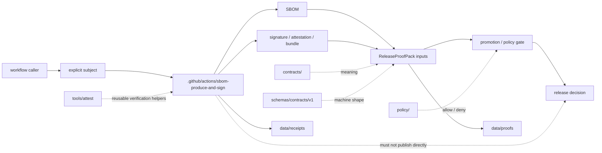

<!-- [KFM_META_BLOCK_V2]
doc_id: kfm://doc/TODO-VERIFY-UUID
title: SBOM Produce and Sign Action
type: standard
version: v1
status: draft
owners: @bartytime4life (NEEDS VERIFICATION for this leaf action)
created: TODO(verify-created-date)
updated: 2026-04-27
policy_label: TODO(verify-public-or-restricted)
related: [../README.md, ../../README.md, ../../workflows/README.md, ../../../README.md, ../../../contracts/README.md, ../../../schemas/README.md, ../../../schemas/contracts/v1/README.md, ../../../policy/README.md, ../../../tests/README.md, ../../../tests/contracts/README.md, ../../../scripts/README.md, ../../../tools/attest/README.md, ../../../tools/validators/promotion_gate/README.md, ../../../data/proofs/README.md, ../../../data/receipts/README.md]
tags: [kfm, github-actions, sbom, sigstore, cosign, supply-chain, release-proof, provenance]
notes: [doc_id, created date, policy label, active action.yml contract, workflow callers, OIDC trust rules, and leaf-specific ownership require active-checkout verification. This README documents the KFM action lane and graduated target contract without claiming live implementation depth.]
[/KFM_META_BLOCK_V2] -->

<a id="top"></a>

# SBOM Produce and Sign Action

Generate a release-reviewable SBOM for an explicit subject and attach signing / attestation evidence without turning action glue into KFM release authority.


> [!IMPORTANT]
> **Status:** experimental  
> **Owners:** `@bartytime4life` *(inherited from surfaced `.github/` ownership patterns; verify this leaf before merge)*  
> **Path:** `.github/actions/sbom-produce-and-sign/README.md`  
> **Repo fit:** child repo-local action under [`../README.md`](../README.md); upstream workflow orchestration belongs in [`../../workflows/README.md`](../../workflows/README.md); canonical policy, schema, proof, and release meaning stays outside action glue  
> **Current posture:** README-first / contract-first. The active `action.yml`, live callers, exact outputs, tool pins, and enforcement depth are **NEEDS VERIFICATION** in the active checkout.  
> **Quick jumps:** [Scope](#scope) · [Repo fit](#repo-fit) · [Accepted inputs](#accepted-inputs) · [Exclusions](#exclusions) · [Current evidence snapshot](#current-evidence-snapshot) · [Directory tree](#directory-tree) · [Quickstart](#quickstart) · [Usage](#usage) · [Action contract](#action-contract) · [Trust boundaries](#trust-boundaries) · [Diagram](#diagram) · [Operating tables](#operating-tables) · [Task list / definition of done](#task-list--definition-of-done) · [FAQ](#faq) · [Appendix](#appendix)

> [!WARNING]
> This action may **produce evidence**, but it must not decide release truth. KFM promotion remains a governed state transition backed by contracts, policy, review, proof packs, receipts, catalog closure, and rollback posture.

---

## Scope

`sbom-produce-and-sign/` is the repo-local action lane for one narrow supply-chain step:

1. receive an explicit build or release **subject**;
2. generate a machine-readable SBOM for that subject;
3. sign the SBOM or a related attestation using an approved Cosign / Sigstore posture;
4. expose stable artifact paths or summaries for downstream gates, reviewers, and proof-pack assembly.

It is a **thin step wrapper**, not a hidden release system.

Use this lane when a workflow needs a repeatable SBOM + signing step that remains easy to inspect in Git review and easy to call from `.github/workflows/`.

[Back to top](#top)

---

## Repo fit

This action lives in the `.github` gatehouse, but it depends on the wider KFM trust lattice.

| Direction | Surface | Relationship |
|---|---|---|
| Parent | [`../README.md`](../README.md) | Defines the repo-local action family and the rule that actions are thin step wrappers. |
| Gatehouse | [`../../README.md`](../../README.md) | Places this action inside `.github` review, CI/CD, disclosure, and control-plane posture. |
| Workflow callers | [`../../workflows/README.md`](../../workflows/README.md) | Whole-job orchestration belongs here, not inside this action README. |
| Root posture | [`../../../README.md`](../../../README.md) | KFM remains evidence-first, map-first, time-aware, policy-aware, and rollback-aware. |
| Contract meaning | [`../../../contracts/README.md`](../../../contracts/README.md) | Human-readable meaning for trust-bearing objects belongs outside action glue. |
| Machine schemas | [`../../../schemas/README.md`](../../../schemas/README.md), [`../../../schemas/contracts/v1/README.md`](../../../schemas/contracts/v1/README.md) | Versioned machine-file families should define stable object shapes where available. |
| Policy authority | [`../../../policy/README.md`](../../../policy/README.md) | Allow / deny decisions, reason codes, obligations, and no-silent-publish behavior belong here. |
| Contract proof burden | [`../../../tests/contracts/README.md`](../../../tests/contracts/README.md) | Valid / invalid fixtures and negative-path contract tests should prove this action’s assumptions. |
| Helper sibling | [`../../../tools/attest/README.md`](../../../tools/attest/README.md) | Reusable attestation verification, summarization, or signing helpers may live there. |
| Promotion consumer | [`../../../tools/validators/promotion_gate/README.md`](../../../tools/validators/promotion_gate/README.md) | Promotion gates may consume this action’s outputs; this action does not replace them. |
| Proof storage / review | [`../../../data/proofs/README.md`](../../../data/proofs/README.md) | Release proof packs, signatures, SBOM refs, and attestation refs belong in governed proof surfaces. |
| Process memory | [`../../../data/receipts/README.md`](../../../data/receipts/README.md) | Run receipts are process memory and must remain separate from release proof. |

> [!NOTE]
> Relative links above are written for this file’s path. Re-run a link checker in the active checkout before merge.

[Back to top](#top)

---

## Accepted inputs

### Source-backed first-wave action inputs

The first-wave source sketch for this action names these inputs. Treat them as the minimum documented contract to verify against `action.yml`.

| Input | Required | Expected value | Status | Notes |
|---|---:|---|---|---|
| `subject` | yes | artifact directory, release bundle path, or image reference | **PROPOSED / NEEDS VERIFICATION** | The subject must be explicit. Do not infer it from the whole repo unless the caller deliberately passes `.`. |
| `format` | no | `spdx-json` or `cyclonedx-json` | **PROPOSED / NEEDS VERIFICATION** | Default in the source sketch is `spdx-json`; active implementation should confirm exact Syft format strings. |
| `cosign_key` | no | approved encoded key material, only when key-pair mode is authorized | **PROPOSED / SECURITY-HEAVY** | Prefer keyless OIDC where allowed. This action must not become a secret store. |

### Acceptable subject classes

| Subject class | Example | Why it belongs |
|---|---|---|
| Build output directory | `dist/` | Common release bundle or app artifact target. |
| Container / OCI image ref | `ghcr.io/org/repo@sha256:...` | Useful when the release unit is an image. |
| Packaged release bundle | `release/<release_id>/bundle/` | Keeps SBOM production tied to release inventory. |
| Static asset bundle | `public/release/` | Useful for published docs, tiles, story assets, or public-safe artifacts. |
| Explicit fixture bundle | `tests/fixtures/release_bundle/pass/` | Supports no-network positive and negative tests. |

> [!TIP]
> Prefer digest-addressed or immutable subject refs during release work. A mutable tag or path may be acceptable for PR smoke checks but should not be the final release proof anchor.

[Back to top](#top)

---

## Exclusions

This action must stay small and non-sovereign.

| Does **not** belong here | Why | Better home |
|---|---|---|
| Canonical schemas or contract meaning | Action glue should not define truth-object semantics. | [`../../../contracts/`](../../../contracts/), [`../../../schemas/`](../../../schemas/) |
| Policy law or final allow / deny authority | Policy must be executable, testable, and reviewable outside workflow snippets. | [`../../../policy/`](../../../policy/) |
| Long-lived signing keys, trust roots, or private identity material | Actions must not become secret custody surfaces. | GitHub environments, OIDC trust config, or approved external secret management |
| Direct publication or promotion | Promotion is a governed state transition, not an action side effect. | Workflow-controlled promotion gate and release path |
| Canonical evidence archives | Action outputs may feed proof packs, but they are not canonical truth by themselves. | [`../../../data/proofs/`](../../../data/proofs/), catalog / release surfaces |
| Raw, WORK, QUARANTINE, or restricted evidence publication | SBOM signing does not make unpublished data public-safe. | Governed lifecycle and release review |
| Browser-side signature verification | Browser UI should consume CI-produced verdicts or trust summaries, not own raw signing logic. | CI / Node helper, [`../../../tools/attest/`](../../../tools/attest/) |
| Vulnerability triage policy | An SBOM can inform triage but does not decide severity posture alone. | Security policy, advisory workflow, promotion gate |

[Back to top](#top)

---

## Current evidence snapshot

| Item | Posture | Current reading |
|---|---|---|
| `.github/actions/sbom-produce-and-sign/` name | **CONFIRMED in surfaced public-main docs / NEEDS LOCAL VERIFICATION** | The action name is part of the visible local-action family in project evidence. |
| Directory-local `README.md` | **CONFIRMED in surfaced public-main docs / revised here** | This file should replace placeholder text with a repo-ready lane contract. |
| Directory-local `action.yml` | **UNKNOWN / NEEDS VERIFICATION** | Surfaced public-main evidence describes named action directories as placeholder-heavy; do not claim a live contract until reopened. |
| Workflow callers | **UNKNOWN** | Search the active checkout before assuming workflows call this action. |
| Tool installation method | **PROPOSED** | Prefer pinned, reviewable installation or wrapper helpers; avoid curl-to-shell in release-critical paths unless explicitly accepted. |
| OIDC / keyless signing | **NEEDS VERIFICATION** | Caller workflows need `id-token: write` for keyless flows, but actual trust policy and identity constraints must be configured outside this README. |
| Proof-pack integration | **PROPOSED** | Outputs should feed `ReleaseProofPack`, `ReleaseManifest`, receipts, and promotion gates; do not claim this is already wired. |

[Back to top](#top)

---

## Directory tree

### Current local-action snapshot to verify

```text
.github/actions/sbom-produce-and-sign/
└── README.md
```

### Graduated target shape

```text
.github/actions/sbom-produce-and-sign/
├── README.md
├── action.yml
├── templates/
│   └── slsa-predicate.template.json
├── src/
│   └── README.md
└── tests/
    └── fixtures/
        ├── valid/
        └── invalid/
```

### Reading rule

Use the first tree as the **minimum current evidence target** to confirm in the active checkout.

Use the second tree as a **reviewable graduation path**, not as a claim that implementation files already exist.

[Back to top](#top)

---

## Quickstart

### 1) Inspect the action lane before changing behavior

```bash
find .github/actions/sbom-produce-and-sign -maxdepth 4 -type f | sort
find .github/actions/sbom-produce-and-sign -name action.yml -size 0 -print
sed -n '1,260p' .github/actions/sbom-produce-and-sign/README.md
sed -n '1,260p' .github/actions/sbom-produce-and-sign/action.yml 2>/dev/null || true
```

### 2) Search for active callers

```bash
grep -R "uses: ./.github/actions/sbom-produce-and-sign" -n \
  .github/workflows scripts tools tests 2>/dev/null || true
```

### 3) Confirm adjacent trust surfaces

```bash
sed -n '1,240p' .github/actions/README.md
sed -n '1,240p' .github/workflows/README.md
sed -n '1,240p' contracts/README.md
sed -n '1,240p' schemas/contracts/v1/README.md
sed -n '1,240p' policy/README.md
sed -n '1,240p' tools/attest/README.md
sed -n '1,240p' tools/validators/promotion_gate/README.md
sed -n '1,240p' data/proofs/README.md
```

### 4) Confirm local tool availability

```bash
command -v syft || true
command -v cosign || true
command -v jq || true

syft version 2>/dev/null || true
cosign version 2>/dev/null || true
```

> [!CAUTION]
> Tool presence is not enough for release use. Release-critical usage also needs version pinning, advisory checks, identity constraints, bundle / predicate verification, and negative fixtures.

[Back to top](#top)

---

## Usage

### PROPOSED workflow caller

Use this only after `action.yml` exists, the active branch confirms the input names, and the security posture has been reviewed.

```yaml
name: release-trust-smoke

on:
  pull_request:
  workflow_dispatch:

permissions:
  contents: read
  id-token: write # required for keyless OIDC signing flows

jobs:
  sbom_and_sign:
    runs-on: ubuntu-latest

    steps:
      - uses: actions/checkout@v4

      - name: Produce SBOM and signing evidence
        uses: ./.github/actions/sbom-produce-and-sign
        with:
          subject: dist/
          format: spdx-json

      - name: Upload SBOM trust artifacts
        uses: actions/upload-artifact@v4
        with:
          name: sbom-trust-artifacts
          path: |
            sbom.json
            sbom.sig
            predicate.json
            *.bundle
            *.attestation
```

### PROPOSED release-gate relationship

```text
build subject
  -> sbom-produce-and-sign
  -> SBOM + signature / attestation refs
  -> proof-pack assembly
  -> policy and promotion gate
  -> release decision
```

> [!IMPORTANT]
> A green SBOM + signing step is not a release decision. It is one input to release review.

[Back to top](#top)

---

## Action contract

### Minimum source-backed inputs

| Field | Status | Expected contract |
|---|---|---|
| `subject` | **PROPOSED / NEEDS VERIFICATION** | Required path or image reference to scan. |
| `format` | **PROPOSED / NEEDS VERIFICATION** | Optional SBOM format, expected to support `spdx-json` and `cyclonedx-json`. |
| `cosign_key` | **PROPOSED / SECURITY-HEAVY** | Optional key-pair mode input; prefer keyless OIDC unless an approved exception exists. |

### Preferred graduated outputs

These names are **PROPOSED** until `action.yml` implements them.

| Output | Purpose | Downstream consumer |
|---|---|---|
| `sbom_path` | Path to generated SBOM | proof-pack assembly, vulnerability scan, reviewer artifact |
| `signature_path` | Detached signature or signature ref | verifier, release gate |
| `attestation_path` | Attestation or predicate path | verifier, promotion gate, proof pack |
| `bundle_path` | Offline verification bundle where supported | verifier, release review, rollback drill |
| `summary_path` | Small machine-readable summary | PR summary, release evidence summary |
| `result` | `PASS`, `HOLD`, `DENY`, or `ERROR` | workflow branching and reviewer triage |

### Preferred result classes

| Result | Meaning | Merge / release posture |
|---|---|---|
| `PASS` | SBOM and signing evidence were produced and basic checks passed. | May continue to later gates. |
| `HOLD` | Non-blocking or optional artifact missing; human review needed. | Safe for report-only mode, not release default. |
| `DENY` | Required artifact, digest, identity, or predicate check failed. | Block release. |
| `ERROR` | Tooling unavailable, unsupported input, malformed output, or verifier failure. | Block until corrected. |

[Back to top](#top)

---

## Trust boundaries

| Boundary | Rule |
|---|---|
| Subject boundary | The caller must pass the subject explicitly. The action should not silently choose a release subject. |
| Signing boundary | This action may call signing tooling, but it must not own long-lived secrets or trust-root policy. |
| Policy boundary | Verification and signing output must feed policy; it must not replace policy. |
| Proof boundary | SBOMs, signatures, bundles, and attestations are proof inputs, not proof conclusions by themselves. |
| Publication boundary | This action must not publish or promote artifacts directly. |
| Logging boundary | Logs should not expose private evidence, secrets, restricted paths, or unpublished release internals. |
| Browser boundary | Public UI should consume CI-produced trust summaries or verdicts, not raw browser-side signing logic. |
| Rollback boundary | Outputs must be stable enough to inspect later, but rollback decisions belong to release / correction flows. |

[Back to top](#top)

---

## Diagram



[Back to top](#top)

---

## Operating tables

### File-family placement

| Artifact | Preferred placement | Status |
|---|---|---|
| Generated SBOM from CI | uploaded workflow artifact, release proof input, or `data/proofs/.../sbom/` when release-bound | **PROPOSED** |
| Detached signature / verification bundle | release proof input or governed proof-pack path | **PROPOSED** |
| Run receipt | `data/receipts/` or caller-chosen receipt path | **PROPOSED** |
| Release proof pack | `data/proofs/` | **PROPOSED / depends on release flow** |
| Policy result | policy / promotion gate output, not this action’s README | **PROPOSED** |
| Canonical schema | `schemas/contracts/v1/` or repo-ratified schema home | **NEEDS VERIFICATION** |

### Security posture

| Concern | Expected handling |
|---|---|
| OIDC keyless signing | Caller grants `id-token: write`; issuer, repo, ref, workflow identity, and audience constraints are defined outside this README. |
| Key-pair signing | Use only under approved exception; never commit key material; avoid broad reusable secrets. |
| Tool versions | Pin and review release-critical tools; recheck current advisories before promotion. |
| Attestation verification | Verify subject digest, predicate type, and signing identity; do not treat signature success as policy success. |
| Network use | Keep PR smoke checks bounded; release gates may use approved network verification if policy allows. |
| Negative fixtures | Include missing SBOM, bad digest, wrong subject, wrong predicate type, and unsupported format cases before hard enforcement. |

[Back to top](#top)

---

## Task list / definition of done

### README readiness

- [ ] KFM Meta Block V2 is present and synchronized with the title.
- [ ] Status, owners, path, repo fit, badges, and quick jumps are present.
- [ ] Accepted inputs and exclusions are explicit.
- [ ] Current state is separated from graduated target shape.
- [ ] Relative links are checked from `.github/actions/sbom-produce-and-sign/`.

### Action graduation

- [ ] `action.yml` exists and is not an empty placeholder.
- [ ] `subject` is required and documented.
- [ ] `format` behavior is verified against the actual SBOM generator.
- [ ] Keyless vs key-pair signing modes are explicitly separated.
- [ ] Caller workflow permissions are documented and tested.
- [ ] Outputs are stable, machine-readable, and usable by tests or downstream gates.
- [ ] The action does not publish, promote, or mutate canonical truth.
- [ ] Tool versions are pinned or otherwise controlled by a documented repo policy.
- [ ] Verification checks include predicate type, subject digest, and expected identity where applicable.
- [ ] At least one valid fixture and one invalid fixture exist.
- [ ] Logs avoid secret leakage and unpublished evidence leakage.
- [ ] The downstream promotion gate consumes results without treating signatures as automatic release approval.

### Merge questions

- [ ] Is this change still just a thin action wrapper?
- [ ] Does any logic belong in `tools/attest/`, `scripts/`, `policy/`, `schemas/`, or `tests/` instead?
- [ ] Can a reviewer tell exactly what subject was scanned and signed?
- [ ] Can a failure be explained without reading raw logs?
- [ ] Would the release remain blocked if this action succeeded but policy, catalog closure, or proof-pack completeness failed?
- [ ] Is rollback or correction evidence preserved outside the action itself?

[Back to top](#top)

---

## FAQ

### Does this README prove that `sbom-produce-and-sign/action.yml` works?

No. It documents the intended lane contract and the graduation checks. The active checkout must confirm `action.yml`, live callers, tool pins, output names, and tests.

### Why not put all signing logic directly inside this action?

Because repo-local actions are workflow glue. Reusable verification logic should remain inspectable in `tools/attest/`, `scripts/`, or tests where it can be exercised outside a single workflow step.

### Does a valid signature make a KFM release trustworthy?

No. A signature binds bytes and identity. A KFM release still needs policy checks, proof-pack completeness, source-role correctness, catalog closure, review state, and rollback posture.

### Can this action use key-pair signing?

Only as an approved exception. Keyless OIDC is generally preferable for avoiding long-lived keys, but it still requires constrained identity policy and workflow permissions.

### Where should the SBOM go?

For PR smoke checks, upload it as a workflow artifact. For governed releases, carry it into the release proof surface alongside checksums, attestations, signatures, and promotion / rollback evidence.

### Should the action scan the whole repository by default?

No. The subject should be explicit. Whole-repo scanning may be useful for a smoke check, but release proof should target the actual release artifact or bundle.

[Back to top](#top)

---

## Appendix

### Verification backlog

| Item | Why it remains open |
|---|---|
| Leaf-specific owner | Surfaced docs indicate parent ownership patterns, but this action’s specific owner should be rechecked against current `CODEOWNERS`. |
| `action.yml` implementation | Current local workspace did not expose the real checkout; public-source evidence describes placeholder-heavy action directories. |
| Exact output names | The source sketch names inputs but does not prove stable output fields. |
| Tool pinning policy | Release-critical use should verify current Syft, Cosign, and installer posture before hard enforcement. |
| Workflow caller identity | Keyless signing requires constrained issuer / identity rules that belong in workflow and environment configuration. |
| Proof-pack storage path | Link action outputs to the repo’s active `data/proofs/` or release proof convention after checkout inspection. |
| Negative fixtures | Required before turning this action into a merge-blocking or release-blocking gate. |

### Minimal review packet for first implementation PR

A first executable PR should include:

- `action.yml`
- one no-network test fixture for a tiny subject
- one invalid fixture that must fail
- a generated SBOM sample, or a documented reason samples are not committed
- a short CI or script caller
- a reviewer-readable summary artifact
- documentation updates in this README and any touched parent README
- evidence that the action does not publish or promote directly

[Back to top](#top)
