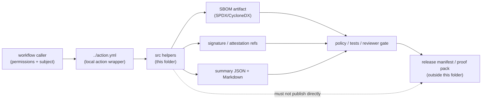

<!-- [KFM_META_BLOCK_V2]
doc_id: kfm://doc/NEEDS_VERIFICATION__sbom_produce_and_sign_src_readme
title: sbom-produce-and-sign/src
type: standard
version: v1
status: draft
owners: @bartytime4life
created: NEEDS_VERIFICATION__YYYY-MM-DD
updated: 2026-04-27
policy_label: NEEDS_VERIFICATION__public_or_internal
related: [../README.md, ../../README.md, ../../../workflows/README.md, ../../../CODEOWNERS, ../../../../contracts/README.md, ../../../../schemas/README.md, ../../../../policy/README.md, ../../../../tests/README.md, ../../../../tests/contracts/README.md, ../../../../tools/attest/README.md]
tags: [kfm, github-actions, sbom, provenance, sigstore, cosign, supply-chain, attestations]
notes: [Created as a source-folder README for the repo-local sbom-produce-and-sign action; doc_id, created date, policy label, active helper inventory, exact action.yml inputs, workflow callers, and trust-root handling still need mounted-repo verification.]
[/KFM_META_BLOCK_V2] -->

<a id="top"></a>

# `sbom-produce-and-sign/src`

Source-helper boundary for generating SBOM support artifacts and preparing signature or attestation outputs without becoming KFM’s policy, proof, or publication authority.

<div align="left">


</div>

> [!IMPORTANT]
> **Status:** experimental  
> **Owners:** `@bartytime4life` *(broad `.github/` ownership is surfaced in adjacent repo-facing docs; leaf-specific ownership still needs verification)*  
> **Path:** `.github/actions/sbom-produce-and-sign/src/README.md`  
> **Repo fit:** child source-helper folder under the repo-local `sbom-produce-and-sign` action; parent action docs live at [`../README.md`](../README.md), the local-action family at [`../../README.md`](../../README.md), workflow orchestration at [`../../../workflows/README.md`](../../../workflows/README.md), reusable attestation helpers at [`../../../../tools/attest/README.md`](../../../../tools/attest/README.md), and authority surfaces at [`../../../../contracts/README.md`](../../../../contracts/README.md), [`../../../../schemas/README.md`](../../../../schemas/README.md), and [`../../../../policy/README.md`](../../../../policy/README.md).  
> **Quick jumps:** [Scope](#scope) · [Repo fit](#repo-fit) · [Accepted inputs](#accepted-inputs) · [Exclusions](#exclusions) · [Current verification snapshot](#current-verification-snapshot) · [Directory tree](#directory-tree) · [Quickstart](#quickstart) · [Usage contract](#usage-contract) · [Diagram](#diagram) · [Operating tables](#operating-tables) · [Task list](#task-list--definition-of-done) · [FAQ](#faq) · [Appendix](#appendix)

> [!WARNING]
> This folder must not hold Cosign private keys, long-lived credentials, release approval state, canonical proof packs, or policy decisions. It may help produce or summarize SBOM/signing artifacts, but KFM promotion remains a governed state transition outside this source folder.

---

## Scope

`src/` is the implementation-support area for the local `sbom-produce-and-sign` action.

Its job is intentionally narrow:

- generate or normalize SBOM outputs for an explicit subject;
- prepare signature, attestation, or verification-adjacent helper output;
- emit reviewer-readable and machine-readable summaries;
- fail closed when required inputs, tools, digests, or output paths are missing;
- stay subordinate to contracts, schemas, policy, tests, workflows, receipts, proofs, and release manifests.

This folder is **not** the release system. It is a step-helper seam.

### What this lane should prove

A mature version of this folder should help reviewers answer four questions:

| Question | Expected answer shape |
|---|---|
| What subject was inspected? | Explicit path, image reference, artifact digest, or caller-supplied subject ref |
| What SBOM was produced? | Format, path, digest, generator, and warnings |
| What was signed or attested? | Subject ref, predicate type, signature or bundle ref, and signing mode |
| What should block promotion? | Stable exit code plus JSON/Markdown summary for policy and reviewer gates |

[Back to top](#top)

---

## Repo fit

`src/` should remain useful only because it is embedded in the surrounding KFM trust lattice.

| Direction | Surface | Boundary |
|---|---|---|
| Parent action | [`../README.md`](../README.md) and `../action.yml` | Defines the public composite-action interface. Exact inputs and outputs are **NEEDS VERIFICATION**. |
| Local actions family | [`../../README.md`](../../README.md) | Defines repo-local action boundaries and keeps step wrappers reviewable. |
| Workflow orchestration | [`../../../workflows/README.md`](../../../workflows/README.md) | Chooses when this action runs and what permissions it receives. |
| Governance / ownership | [`../../../CODEOWNERS`](../../../CODEOWNERS) | Routes review; leaf-level ownership still needs active-branch confirmation. |
| Human contract meaning | [`../../../../contracts/README.md`](../../../../contracts/README.md) | Explains release, proof, evidence, decision, and source objects. |
| Machine contract scaffolds | [`../../../../schemas/README.md`](../../../../schemas/README.md) | Carries schema-side validation targets where they exist. |
| Policy authority | [`../../../../policy/README.md`](../../../../policy/README.md) | Owns allow/deny behavior, reasons, obligations, and no-silent-publish rules. |
| Verification burden | [`../../../../tests/README.md`](../../../../tests/README.md) and [`../../../../tests/contracts/README.md`](../../../../tests/contracts/README.md) | Holds valid/invalid examples, negative-path proof, and drift checks. |
| Attestation helpers | [`../../../../tools/attest/README.md`](../../../../tools/attest/README.md) | Reusable helper logic may live there when it is bigger than a local action step. |

> [!NOTE]
> If a helper grows beyond “thin local action support,” move the reusable logic into `tools/attest/`, `scripts/`, or a repo-native package, then keep this folder as a small wrapper.

[Back to top](#top)

---

## Accepted inputs

Accepted content belongs here only when it directly supports the parent action’s SBOM/signing job.

| Belongs in `src/` | Status | Notes |
|---|---:|---|
| Tiny shell or Python helpers called by the parent action | **PROPOSED** | Helper names and runtime language must be verified against `../action.yml`. |
| SBOM output normalization helpers | **PROPOSED** | Expected formats include `spdx-json` and `cyclonedx-json` only if the parent action confirms them. |
| Signature or attestation summary helpers | **PROPOSED** | Emit references and status, not policy approval. |
| Predicate or summary templates | **PROPOSED** | Templates must be non-secret and explicitly marked as examples. |
| Tool preflight checks | **PROPOSED** | Check presence/version of required CLIs without auto-upgrading silently. |
| Reviewer-facing Markdown or JSON summary emitters | **PROPOSED** | Output should be stable enough for tests and workflow summaries. |
| Small local docs explaining helper behavior | **CONFIRMED fit** | This README is the first boundary document. |

### Expected caller inputs

The parent action may expose some or all of these values. Confirm in `../action.yml` before relying on them.

| Input | Meaning | Required posture |
|---|---|---|
| `subject` | Artifact directory, file, image reference, or release candidate to inspect | Required; must be explicit |
| `format` | SBOM format, commonly `spdx-json` or `cyclonedx-json` | Must be allow-listed |
| `output_dir` | Directory for generated SBOM, signatures, bundles, and summaries | Must be caller-controlled and writable |
| `predicate_path` | SLSA or provenance predicate path | Required only for attestation mode |
| `signing_mode` | `keyless`, `keyful`, `none`, or `verify-only` | Must be workflow/policy controlled |
| `cosign_key` or key ref | Keyful signing material or reference | Must come from secrets or external trust management, never from this folder |

[Back to top](#top)

---

## Exclusions

Do not put these here.

| Exclusion | Correct home or owner |
|---|---|
| Composite action metadata | `../action.yml` |
| Workflow triggers, permissions, and matrix orchestration | [`../../../workflows/`](../../../workflows/) |
| Rego, Conftest, or allow/deny policy rules | [`../../../../policy/`](../../../../policy/) |
| Canonical schema or contract definitions | [`../../../../contracts/`](../../../../contracts/) and [`../../../../schemas/`](../../../../schemas/) |
| Release manifests, proof packs, receipts, or published evidence archives | governed release/proof/receipt locations outside `.github/actions/` |
| Cosign private keys, tokens, or long-lived credentials | GitHub environments, OIDC, external secret manager, or approved secret storage |
| Live production SBOMs for released artifacts | release evidence locations, not source folders |
| Broad reusable attestation libraries | [`../../../../tools/attest/`](../../../../tools/attest/) or repo-native package homes |
| Silent publish, promote, or rollback shortcuts | governed workflow + promotion gate |

[Back to top](#top)

---

## Current verification snapshot

This file is written to be safe under shallow evidence.

| Surface | Status | What to verify before claiming more |
|---|---:|---|
| Target folder `.github/actions/sbom-produce-and-sign/src/` | **NEEDS VERIFICATION** | Confirm the folder exists in the active branch and list helper files. |
| Parent `sbom-produce-and-sign` action | **NEEDS VERIFICATION** | Inspect `../action.yml` for inputs, outputs, permissions, shell behavior, and called helper names. |
| Workflow callers | **UNKNOWN** | Search `.github/workflows/`, `scripts/`, and release docs for `uses: ./.github/actions/sbom-produce-and-sign`. |
| SBOM generator | **NEEDS VERIFICATION** | Confirm whether Syft or another generator is installed, pinned, and tested. |
| Signing / attestation mode | **NEEDS VERIFICATION** | Confirm keyless vs keyful posture, issuer constraints, Rekor behavior, and verification expectations. |
| Output paths | **PROPOSED** | Confirm stable output names before writing workflow summaries or tests. |
| Policy gate integration | **UNKNOWN** | Confirm whether SBOM/provenance outputs are evaluated by OPA/Conftest or another gate. |
| Test coverage | **UNKNOWN** | Add positive and negative fixtures before calling this merge-blocking. |

[Back to top](#top)

---

## Directory tree

### Target shape for this folder

The exact helper inventory is **NEEDS VERIFICATION**. The shape below is a proposed landing pattern, not a claim that these files already exist.

```text
.github/actions/sbom-produce-and-sign/
├── README.md
├── action.yml                         # parent action contract; verify in active branch
└── src/
    ├── README.md                      # this file
    ├── produce-sbom.sh                # PROPOSED: call SBOM generator and write digest
    ├── sign-or-attest.sh              # PROPOSED: call signing / attestation tool
    ├── emit-summary.py                # PROPOSED: stable JSON + Markdown summary
    └── templates/
        ├── slsa-predicate.example.json
        └── sbom-summary.example.json
```

### Minimum viable helper set

A first useful implementation can be smaller:

```text
src/
├── README.md
└── emit-summary.py
```

That is acceptable if `../action.yml` still performs the external SBOM/signing commands directly and the helper only normalizes outputs for review.

[Back to top](#top)

---

## Quickstart

### Inspect the active branch

Run from the repository root.

```bash
# Confirm the parent action and source folder.
find .github/actions/sbom-produce-and-sign -maxdepth 3 -type f | sort

# Inspect the parent action interface before trusting this README.
sed -n '1,220p' .github/actions/sbom-produce-and-sign/action.yml

# Find workflow or script callers.
grep -R "sbom-produce-and-sign" -n .github/workflows scripts tests docs 2>/dev/null || true

# Check that no private key material was committed here.
find .github/actions/sbom-produce-and-sign/src -type f \
  \( -name "*key*" -o -name "*.pem" -o -name "*.p12" -o -name "*.pfx" \) -print
```

### Preflight helper scripts

Use only for files that actually exist.

```bash
# Shell helpers
find .github/actions/sbom-produce-and-sign/src -name "*.sh" -print0 \
  | xargs -0 -r bash -n

# Python helpers
find .github/actions/sbom-produce-and-sign/src -name "*.py" -print0 \
  | xargs -0 -r python -m py_compile
```

> [!CAUTION]
> Do not run signing commands against release candidates until workflow permissions, signing mode, issuer/key policy, output storage, and promotion-gate behavior are verified.

[Back to top](#top)

---

## Usage contract

The helper contract should be explicit enough for both machines and reviewers.

### Proposed helper invocation

The command below is illustrative. Verify helper names and flags before use.

```bash
# PROPOSED interface; verify against actual helper files and ../action.yml.
.github/actions/sbom-produce-and-sign/src/produce-sbom.sh \
  --subject "$SUBJECT" \
  --format "$FORMAT" \
  --out "$RUNNER_TEMP/kfm-sbom"
```

```bash
# PROPOSED interface; signing mode must be policy/workflow controlled.
.github/actions/sbom-produce-and-sign/src/sign-or-attest.sh \
  --sbom "$RUNNER_TEMP/kfm-sbom/sbom.json" \
  --subject "$SUBJECT" \
  --predicate "$PREDICATE_PATH" \
  --mode "$SIGNING_MODE" \
  --out "$RUNNER_TEMP/kfm-sbom"
```

### Proposed machine-readable result

Helpers should produce one compact summary that downstream CI, tests, and reviewers can inspect.

```json
{
  "schema": "kfm.sbom_produce_and_sign.summary.v1",
  "status": "PASS",
  "subject": "NEEDS_VERIFICATION__caller_supplied_subject",
  "subject_digest": "sha256:NEEDS_VERIFICATION",
  "sbom": {
    "path": "sbom.json",
    "format": "cyclonedx-json",
    "sha256": "sha256:NEEDS_VERIFICATION"
  },
  "signature": {
    "mode": "keyless",
    "path": "sbom.sig",
    "bundle_ref": "NEEDS_VERIFICATION"
  },
  "attestation": {
    "predicate_type": "https://slsa.dev/provenance",
    "path": "attestation.intoto.jsonl"
  },
  "warnings": [],
  "needs_verification": [
    "tool versions",
    "issuer or key policy",
    "workflow permissions",
    "promotion-gate caller"
  ]
}
```

### Failure behavior

All helpers should fail closed.

```text
0 = completed and produced declared outputs
1 = input, output, tool, digest, signing, or attestation failure
2 = unsupported mode or format
3 = policy/workflow precondition missing
```

[Back to top](#top)

---

## Diagram



### Interpretation

`src/` helps create inspectable support artifacts. It does not decide whether an artifact is publishable. The publication decision belongs to governed policy and release surfaces.

[Back to top](#top)

---

## Operating tables

### Helper responsibility matrix

| Helper responsibility | Allowed here? | Gate expectation |
|---|---:|---|
| Generate an SBOM for an explicit subject | Yes | Subject and format must be explicit. |
| Write SBOM digest and summary | Yes | Summary shape should be tested. |
| Sign or attest an SBOM output | Conditional | Signing mode and identity policy must be controlled outside `src/`. |
| Verify output paths exist | Yes | Missing paths fail closed. |
| Decide whether release can proceed | No | Policy gate / promotion gate owns that decision. |
| Store private signing keys | No | Never commit secrets. |
| Store release proof packs | No | Proof storage belongs outside local action source. |
| Mutate canonical evidence | No | Local actions must not become canonical truth paths. |

### Truth labels used here

| Label | Meaning in this README |
|---|---|
| **CONFIRMED** | Supported by adjacent KFM documentation patterns or by this README’s own stated boundary. |
| **PROPOSED** | Recommended source-helper structure or behavior that must be implemented and tested. |
| **UNKNOWN** | Not proven without active-branch repository inspection. |
| **NEEDS VERIFICATION** | A concrete check is required before merge, rollout, or stronger documentation claims. |

### Common failure modes

| Failure mode | Required response |
|---|---|
| `subject` is empty or ambiguous | Exit non-zero; do not generate placeholder SBOM. |
| Unsupported SBOM format | Exit non-zero; report accepted formats. |
| SBOM generator missing | Exit non-zero; do not silently install unless parent action explicitly owns install. |
| Signing mode not configured | Exit non-zero unless `none` or `verify-only` is explicitly allowed. |
| Key material appears in `src/` | Block PR; remove material; rotate if exposure occurred. |
| Attestation predicate is `{}` or missing subject digest | Mark as incomplete; block promotion-significant release use. |
| Summary cannot be parsed | Fail tests; reviewers need stable output. |

[Back to top](#top)

---

## Task list — definition of done

Before this folder can be treated as executable rather than documentary, complete the checks below.

- [ ] `../action.yml` calls only helpers that actually exist in `src/`.
- [ ] Parent action inputs and helper arguments are documented together.
- [ ] `subject` is required and never inferred from the whole repository by default.
- [ ] SBOM formats are allow-listed and tested.
- [ ] Output paths are deterministic and caller-controlled.
- [ ] Every helper emits a stable machine-readable summary.
- [ ] Every helper has at least one valid and one invalid fixture or test.
- [ ] Missing tools, missing subject, unsupported format, failed signing, and malformed predicate all fail closed.
- [ ] Keyless/keyful signing posture is documented in workflow or security docs, not hidden here.
- [ ] No keys, tokens, or generated production SBOMs are committed under `src/`.
- [ ] Workflow callers are identified or explicitly marked absent.
- [ ] Downstream policy or promotion gate expectations are linked.
- [ ] Adjacent docs are updated if this folder creates a new repo expectation.
- [ ] Rollback is simple: remove helper calls from `../action.yml` and leave no orphan release artifacts.

[Back to top](#top)

---

## FAQ

### Is this folder allowed to run Cosign?

Yes, but only as a caller-controlled helper. The signing identity, workflow permissions, keyless/keyful posture, and verification policy must be owned outside this folder.

### Can this folder decide that a release is approved?

No. It can emit SBOM, signature, attestation, and summary artifacts. Approval belongs to policy, review, and promotion surfaces.

### Should generated SBOM files be committed here?

No. Generated production SBOMs are release evidence, not source-helper code. Keep only tiny examples or templates when they are needed for tests and clearly marked as fixtures.

### What should happen if the active branch has no helper files yet?

Keep this README as the source-folder contract, then either add the smallest useful helper or remove `src/` references from `../action.yml` until implementation is ready.

[Back to top](#top)

---

## Appendix

<details>
<summary>Reviewer checklist for a first PR touching this folder</summary>

### Evidence checks

- [ ] Active branch contains `.github/actions/sbom-produce-and-sign/src/README.md`.
- [ ] Active branch contains or intentionally omits helper files; either state is documented.
- [ ] Parent `../action.yml` has been inspected.
- [ ] Workflow callers have been searched.
- [ ] No secret-like files are present.
- [ ] Tool installation and version pinning are owned by action/workflow policy, not guessed here.

### Governance checks

- [ ] The helper does not bypass `policy/`.
- [ ] The helper does not replace `contracts/` or `schemas/`.
- [ ] The helper does not write canonical evidence stores.
- [ ] The helper does not publish artifacts.
- [ ] The helper emits enough output for reviewers and tests.

### Suggested negative tests

- [ ] Empty subject.
- [ ] Unsupported format.
- [ ] Missing SBOM generator.
- [ ] Missing output directory.
- [ ] Empty predicate.
- [ ] Predicate subject digest mismatch.
- [ ] Signing disabled without explicit `none` mode.
- [ ] Summary JSON schema mismatch.

</details>

[Back to top](#top)
