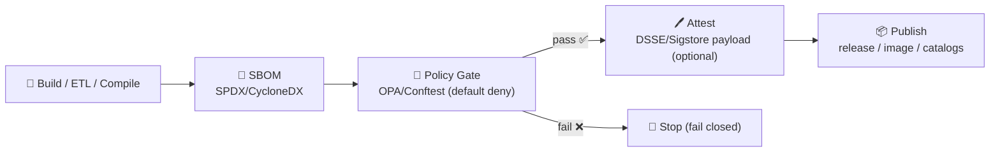
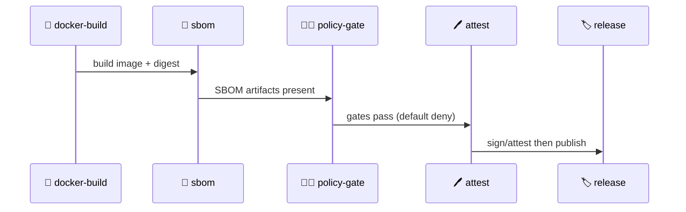

<a id="top"></a>

# 🧬 `sbom` — Software Bill of Materials (SBOM) Action for KFM

[](https://github.com/bartytime4life/Kansas-Frontier-Matrix/actions/workflows/ci.yml)
[](https://github.com/bartytime4life/Kansas-Frontier-Matrix/actions/workflows/codeql.yml)


> This folder is a **repo-local composite action** used to generate **SBOM artifacts** for KFM builds and releases.  
> In KFM, SBOMs are not “nice to have” — they’re part of the **supply-chain + provenance** story that keeps the Atlas trustworthy. ✅🧾  
>
> **KFM order (don’t break it):** 🧰 ETL → 🗂️ Catalogs (STAC/DCAT/PROV) → 🕸️ Graph → 🔌 API → 🌐 UI → 🎬 Story Nodes → 🧠 Focus Mode

<!-- Why SBOM is explicitly part of KFM supply-chain posture:contentReference[oaicite:0]{index=0} -->

---

## 🧾 Action metadata

| Field | Value |
|---|---|
| 📄 Action folder | `📁 .github/actions/sbom/` |
| 🧩 Action type | Composite Action (`action.yml`) |
| 🎯 Primary job | Generate SBOM artifacts (SPDX/CycloneDX) |
| 🧯 Philosophy | **Fail-closed** for promotion lanes |
| 🔐 Default stance | Least privilege, no secrets required |
| 🧬 KFM alignment | Supply-chain gate expects SBOM present |

---

## ⚡ Quick links

| Need | Go |
|---|---|
| 🧩 Actions hub | [`../README.md`](../README.md) |
| 🧰 Workflows hub | [`../../workflows/README.md`](../../workflows/README.md) |
| 🛡️ Security policy | [`../../../SECURITY.md`](../../../SECURITY.md) *(or `../../SECURITY.md` if mirrored in `.github/`)* |
| 🧾 Policy gates (OPA/Conftest) | `📁 tools/validation/policy/` |
| 📦 Release lane (spec) | `📄 .github/workflows/release.yml` |
| 🖊️ Attest action (pairing) | `📁 .github/actions/attest/` |

---

## 🧠 Why KFM has an SBOM action

KFM spans **web + GIS + pipelines + modeling**. That means the “what did we ship?” question is broader than app code:

- 🐍 Python dependencies (pip/poetry)
- 🟩 Node dependencies (npm/pnpm)
- 🐳 Container base images + OS packages
- 🧰 GIS tooling (GDAL/PROJ) and native libs
- 🧪 Pipeline toolchain images pinned by **digest**
- 📦 Release artifacts that downstream users will run

An **SBOM** is one of the easiest ways to make this auditable and reviewable, and it pairs naturally with:
- 📦 `build-info` (who/what/when)
- 🧾 PROV lineage (inputs → transforms → outputs)
- 🧑‍⚖️ policy gates (default-deny promotion)
- 🖊️ attestations (prove the SBOM matches the built thing)

<!-- KFM doc explicitly frames supply-chain & reproducibility, including SBOM generation for releases:contentReference[oaicite:1]{index=1} -->

---

## ✅ What this action does

### Primary outputs (recommended)
- 🧬 **SPDX JSON SBOM** (machine-readable)
- 🧬 **CycloneDX JSON SBOM** (optional but useful)
- 📝 **Human summary** (quick scan in PRs/releases)
- 🧾 **Metadata sidecar** (what target, digest, run id, etc.)

### Targets this action can support
- 📦 **Repo SBOM** (dependencies from the repository workspace)
- 🐳 **Image SBOM** (SBOM for a built container image by digest)
- 🧰 **Toolchain snapshot** (run toolchain / lane toolset)

> [!IMPORTANT]
> For KFM promotion lanes, we treat “SBOM present” as a **hard requirement** (default deny).  
> That requirement is called out explicitly in the project’s gate design. ✅🧯  
<!-- “Supply‑chain: SBOM present …” is an explicit default-deny gate in the project’s gate concept:contentReference[oaicite:2]{index=2} -->

---

## 🧱 Where SBOM fits in the KFM gate stack



> [!TIP]
> SBOM first, then policy gate, then attest/publish.  
> That ordering keeps “what we’re signing/publishing” deterministic.

---

## 📦 Expected artifact layout (KFM-friendly)

KFM’s “run artifacts” design explicitly includes an SBOM snapshot inside an `attestations/` folder:

```text
📁 <artifact-root>/
├─ 📁 📄 stac/                         # 🛰️ STAC (KFM profile)
├─ 📁 📄 dcat/                         # 📚 DCAT datasets/distributions
├─ 📁 📄 prov/                         # 🧾 PROV JSON-LD
├─ 📁 📄 reports/                      # 📝 summary + ✅/❌ gates
└─ 📁 🔏 attestations/
   ├─ 📄 provenance.dsse.json          # 🔏 DSSE/Sigstore-compatible payload
   └─ 📄 materials.sbom.spdx.json      # 🧬 SBOM snapshot of the run toolchain
```

<!-- Artifact layout + SBOM filename are explicitly described in project “Latest Ideas” doc:contentReference[oaicite:3]{index=3} -->

> [!NOTE]
> This action supports that layout out-of-the-box by defaulting SBOM output into:
> - `🔏 attestations/materials.sbom.spdx.json` *(SPDX JSON)*  
> and optionally:
> - `🔏 attestations/materials.sbom.cdx.json` *(CycloneDX JSON)*

---

## 🎛️ Inputs

> Inputs are strings (GitHub Actions limitation). Use `"true"` / `"false"` for booleans.

| Input | Required | Default | Purpose |
|---|---:|---|---|
| `mode` | ❌ | `repo` | `repo` \| `image` \| `both` |
| `formats` | ❌ | `spdx-json` | `spdx-json`, `cyclonedx-json`, or `spdx-json,cyclonedx-json` |
| `output_dir` | ❌ | `.artifacts/sbom` | Where to write SBOM outputs |
| `attestations_dir` | ❌ | `.artifacts/attestations` | Where to place KFM-style attest artifacts |
| `image_ref` | ⚠️ | _(none)_ | Required when `mode=image` or `mode=both` (prefer digest ref) |
| `tool` | ❌ | `syft` | SBOM generator backend (`syft` recommended) |
| `upload_artifact` | ❌ | `true` | Upload generated files via `actions/upload-artifact` |
| `artifact_name` | ❌ | `sbom-${{ github.sha }}` | Name for uploaded artifact bundle |
| `fail_on_warn` | ❌ | `true` | Promotion lanes should fail-closed on warnings |
| `fail_on_error` | ❌ | `true` | Always fail job if SBOM cannot be generated |

> [!TIP]
> For KFM determinism, prefer **digest-pinned** image refs:  
> `ghcr.io/<org>/<image>@sha256:<digest>`  
<!-- Determinism contract calls out tools containerized by digest and toolchain versions recorded:contentReference[oaicite:4]{index=4} -->

---

## 📤 Outputs

| Output | Meaning |
|---|---|
| `sbom_spdx_path` | Path to SPDX JSON SBOM (if produced) |
| `sbom_cdx_path` | Path to CycloneDX JSON SBOM (if produced) |
| `sbom_summary_path` | Path to human summary markdown |
| `sbom_target` | `repo` / `image` / `both` |
| `image_digest` | Digest extracted/confirmed from `image_ref` (if applicable) |

---

## 🧪 Example usage

### 1) ✅ PR lane: generate a repo SBOM (no secrets required)

```yaml
jobs:
  sbom:
    runs-on: ubuntu-latest
    permissions:
      contents: read

    steps:
      - uses: actions/checkout@v4

      - name: 🧬 Generate SBOM (repo)
        uses: ./.github/actions/sbom
        with:
          mode: repo
          formats: spdx-json,cyclonedx-json
          output_dir: .artifacts/sbom
          upload_artifact: "true"
```

### 2) 🐳 Main lane: generate an image SBOM after building

```yaml
jobs:
  docker:
    runs-on: ubuntu-latest
    permissions:
      contents: read
      packages: write

    steps:
      - uses: actions/checkout@v4

      - name: 🐳 Build image
        id: build
        uses: ./.github/actions/docker-build
        with:
          image: ghcr.io/${{ github.repository }}
          tags: |
            ${{ github.sha }}

      - name: 🧬 Generate SBOM (image)
        uses: ./.github/actions/sbom
        with:
          mode: image
          image_ref: ${{ steps.build.outputs.image_ref }} # prefer @sha256:...
          formats: spdx-json
          attestations_dir: .artifacts/attestations
```

### 3) 🏷️ Release lane: SBOM → policy gate → attest → publish



---

## 🧑‍⚖️ Policy-gate integration (default deny)

KFM’s policy design explicitly treats supply-chain checks as promotion blockers:
- ✅ SBOM present  
- ✅ images match pinned digests  
- ✅ signatures verified (when enabled)

<!-- Explicit gate language (SBOM present, digests match, signatures verified):contentReference[oaicite:5]{index=5} -->

### What this action guarantees (when configured)
- Writes SBOM(s) to known paths
- Produces a stable file name for policy evaluation (recommended)
- Avoids secret usage (safe to run in PR lanes)

### What policy-gate should still enforce
- Required file existence + non-empty content
- Digest pinning rules (no floating tags for promotion)
- Action pinning + least-privilege workflow permissions (supply-chain hygiene)
- License allowlists / URL allowlists for fetched artifacts (where applicable)

> [!TIP]
> If you’re using Conftest/OPA, keep the policy test inputs as:
> - a machine-readable `reports/gates.json`
> - plus SBOM existence checks under `attestations/`

---

## 🔐 Security posture

### Least privilege by default ✅
This action should run with:

```yaml
permissions:
  contents: read
```

No secrets are required for SBOM generation in the common case.  
If your pipeline downloads tooling, keep it pinned and verify checksums.

### Network considerations 🌐
- Prefer generating SBOM from:
  - the checked-out workspace (repo SBOM), or
  - the locally built container image (image SBOM)
- Avoid “download arbitrary URL passed via PR input” patterns
- If a download is unavoidable, use:
  - allowlists
  - checksums
  - provenance logging

---

## 🧯 Failure modes (and how we avoid them)

| Failure mode | Symptom | Fix |
|---|---|---|
| Floating container tags | SBOM differs across runs | Use `@sha256:` digests |
| Missing lockfiles | SBOM is incomplete | Commit lockfiles or declare intent |
| Mixed package managers | Duplicated components | Standardize per subproject |
| “Warn-only” pipelines | Broken promotion lanes | Use `fail_on_warn=true` in main/release |
| Artifact drift | Policy gate can’t find SBOM | Use stable output paths + names |

---

## 🧰 Local development tips (maintainers)

If you’re evolving the action:
- Keep output filenames stable (policy tests depend on them)
- Write a small `.github/workflows/actions-smoke.yml` that runs:
  - `sbom` (repo mode)
  - `docker-build` → `sbom` (image mode)
  - uploads `.artifacts/**`

---

## 📁 Suggested folder additions (if missing)

```text
📁 .github/
├─ 📁 actions/
│  ├─ 📁 🧬 sbom/
│  │  ├─ 📄 action.yml
│  │  └─ 📄 README.md   # 👈 you are here
│  ├─ 📁 🖊️ attest/
│  ├─ 📁 🐳 docker-build/
│  └─ 📁 📦 build-info/
└─ 📁 workflows/
   ├─ 📄 sbom.yml        # optional: run SBOM lane by itself
   └─ 📄 release.yml     # release lane should call sbom + attest
```

---

## 📚 Reference library (why this exists)

KFM’s stance is that **reproducibility is a security feature** and supply-chain clarity improves trust.  
This action operationalizes that stance by generating SBOM artifacts for releases and promotion lanes.

- 📘 `docs/specs/Kansas Frontier Matrix (KFM) – Comprehensive Technical Documentation.docx`
- 📄 `docs/notes/Latest Ideas.pdf` (run artifacts + gates; includes SBOM snapshot path)
- 🛡️ `SECURITY.md` (supply-chain + least privilege posture)
- 🧑‍⚖️ `tools/validation/policy/rego/supply_chain/*` (policy checks for least-privilege + pinning)

<!-- KFM spec explicitly mentions SBOM as part of supply-chain posture:contentReference[oaicite:6]{index=6} -->
<!-- Latest Ideas includes SBOM path and default-deny gates:contentReference[oaicite:7]{index=7} -->

---

<p align="right"><a href="#top">⬆️ Back to top</a></p>

