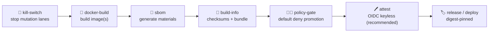
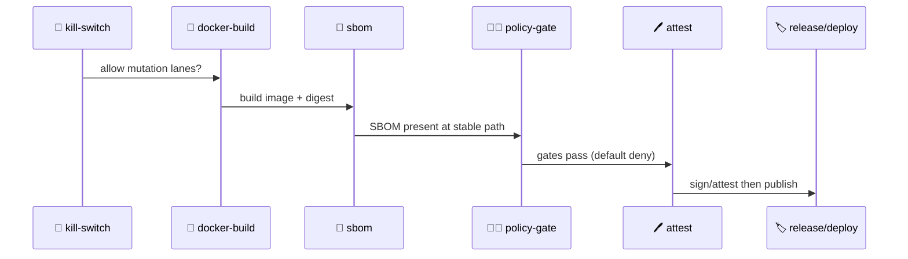

<a id="top"></a>

# 🧬 `sbom` — Software Bill of Materials (SBOM) Action for KFM

[](https://github.com/bartytime4life/Kansas-Frontier-Matrix/actions/workflows/ci.yml)
[](https://github.com/bartytime4life/Kansas-Frontier-Matrix/actions/workflows/codeql.yml)


> Repo‑local composite action that generates **SBOM artifacts** for KFM (repo and/or OCI images).  
> In KFM, reproducibility and traceability are *security features*—an SBOM is a first‑class **materials record** for what we ship. ✅🧾  
>
> **KFM ordering remains non‑negotiable:** 🧰 ETL → 🗂️ Catalogs (STAC/DCAT/PROV) → 🕸️ Graph → 🔌 API → 🌐 UI → 🎬 Story Nodes → 🧠 Focus Mode  
> SBOMs support supply‑chain trust across these lanes without changing pipeline order.

---

## 🧾 Action metadata

| Field | Value |
|---|---|
| Action ID (suggested) | `kfm/sbom` |
| Folder | `.github/actions/sbom/` |
| Action file | `.github/actions/sbom/action.yml` |
| Docs file | `.github/actions/sbom/README.md` |
| Type | Composite Action |
| Status | ✅ Active (contract + operating guide) |
| Last updated | **2026-01-12** |
| Default posture | **Fail‑closed** for promotion lanes (missing SBOM blocks promotion) |
| Primary use | PR review artifacts • release/promotion materials • agent/automation hardening |

> [!NOTE]
> `action.yml` is always the source of truth for implementation.  
> This README describes the **contract** workflows and policy gates should rely on.

---

## ⚡ Quick links

| Need | Go |
|---|---|
| 🧩 Actions hub | [`../README.md`](../README.md) |
| 🧪 Workflows hub | [`../../workflows/README.md`](../../workflows/README.md) |
| 🧭 Master Guide (v13) | [`../../../docs/MASTER_GUIDE_v13.md`](../../../docs/MASTER_GUIDE_v13.md) *(draft)* |
| 🛡️ Security policy | [`../../../SECURITY.md`](../../../SECURITY.md) *(or `../../SECURITY.md` if mirrored in `.github/`)* |
| 🧑‍⚖️ Policy pack (OPA/Conftest) | [`../../../tools/validation/policy/`](../../../tools/validation/policy/) |
| 🧾 Build traceability | [`../build-info/`](../build-info/) |
| 🖊️ Attestation/signing | [`../attest/`](../attest/) |
| 🐳 Container builds | [`../docker-build/`](../docker-build/) |
| 🧬 Provenance enforcement | [`../provenance-guard/`](../provenance-guard/) |

---

<details>
  <summary><b>🧭 Table of contents</b> (click to expand)</summary>

- [🧾 Action metadata](#-action-metadata)
- [⚡ Quick links](#-quick-links)
- [🧭 Where SBOM fits in KFM](#-where-sbom-fits-in-kfm)
- [🧠 Why KFM has an SBOM action](#-why-kfm-has-an-sbom-action)
- [✅ What this action produces](#-what-this-action-produces)
- [📦 Expected artifact layout](#-expected-artifact-layout)
- [🎛️ Inputs](#-inputs)
- [📤 Outputs](#-outputs)
- [🧪 Example usage](#-example-usage)
- [🧑‍⚖️ Policy-gate integration](#-policy-gate-integration)
- [🔐 Security posture](#-security-posture)
- [🧯 Failure modes](#-failure-modes)
- [🧰 Maintainer notes](#-maintainer-notes)
- [📚 Reference library](#-reference-library)

</details>

---

## 🧭 Where SBOM fits in KFM

KFM’s “trust boundary artifacts” are not only STAC/DCAT/PROV for data—they also include **materials evidence** for the software supply chain.

Typical placement in CI/CD:



### SBOM ≠ provenance (but they should connect)
- **PROV** explains *how* an artifact was generated (inputs → transforms → outputs).
- **SBOM** explains *what* it contains (dependencies and components).

Best practice: in promotion lanes, reference SBOM paths/digests in:
- `build-info.json`
- provenance records (when you model build operations as activities)

---

## 🧠 Why KFM has an SBOM action

KFM spans a **multi‑stack** dependency surface, not just “app code”:

- 🐍 Python dependencies (ETL, validators, geo tooling)
- 🟩 Node dependencies (`web/` UI)
- 🐳 Container base images + OS packages
- 🧰 Native GIS libs (GDAL/PROJ stack), DB tooling (PostGIS clients)
- 🕸️ Graph toolchain (`src/graph/` import/build utilities)
- 🧪 Computational experiments (`mcp/` outputs treated as first‑class evidence)

An SBOM makes this auditable, policy‑testable, and (when paired with signing/attestation) verifiable.

> [!TIP]
> If your repo produces “evidence artifacts” (model outputs, derived datasets), SBOMs help prove which toolchain produced them—especially when containers or pinned envs are involved.

---

## ✅ What this action produces

This action generates SBOM artifacts in one or more formats and writes them to predictable paths.

### Supported targets
- `mode=repo` → SBOM for the checked‑out workspace (best‑effort dependency discovery)
- `mode=image` → SBOM for an OCI image (prefer digest‑pinned refs)
- `mode=both` → generate both in one run (promotion lanes)

### Supported formats
- **SPDX JSON** (recommended baseline)
- **CycloneDX JSON** (optional but useful for tooling compatibility)

### Recommended outputs (stable naming)
- `repo.sbom.spdx.json` / `repo.sbom.cdx.json`
- `image.sbom.spdx.json` / `image.sbom.cdx.json`
- `sbom.summary.md` (PR-friendly “what changed” summary)
- `sbom.meta.json` (tool/version/target/run metadata)

### Policy-friendly canonical copy (recommended)
In addition to storing outputs under `output_dir`, this action should write/copy a stable file for policy checks:

- `artifacts/attestations/materials.sbom.spdx.json`

That stable name lets OPA/Conftest rules stay simple and deterministic.

---

## 📦 Expected artifact layout

KFM documentation expects a `releases/` directory carrying packaged artifacts (including SBOM). In CI we keep a parallel stable layout for uploaded artifacts.

### 🧪 CI run artifacts (recommended)
```text
artifacts/
├─ sbom/
│  ├─ repo.sbom.spdx.json
│  ├─ repo.sbom.cdx.json
│  ├─ image.sbom.spdx.json
│  ├─ image.sbom.cdx.json
│  ├─ sbom.meta.json
│  └─ sbom.summary.md
└─ attestations/
   ├─ materials.sbom.spdx.json        # stable canonical name for policy checks
   └─ provenance.dsse.json            # usually produced by ../attest (not by sbom)
```

### 🏷️ Release artifacts (repo-level contract)
```text
releases/
└─ <version-or-run-id>/
   ├─ manifest.json
   ├─ sbom.spdx.json
   └─ provenance.dsse.json
```

> [!NOTE]
> You can keep “release folder” names semantic (e.g., `v1.2.3/`) or immutable run IDs.  
> The critical requirement is: **manifest + sbom + provenance are present and stable.**

---

## 🎛️ Inputs

> GitHub Actions inputs are strings — use `"true"` / `"false"` for booleans.

| Input | Required | Default | Purpose |
|---|---:|---|---|
| `mode` | ❌ | `repo` | `repo` \| `image` \| `both` |
| `formats` | ❌ | `spdx-json` | `spdx-json`, `cyclonedx-json`, or `spdx-json,cyclonedx-json` |
| `output_dir` | ❌ | `artifacts/sbom` | Where SBOM outputs are written |
| `attestations_dir` | ❌ | `artifacts/attestations` | Where canonical policy-checked SBOM copy lives |
| `image_ref` | ⚠️ | *(none)* | Required when `mode=image` or `mode=both` *(prefer `@sha256:` digest ref)* |
| `tool` | ❌ | `syft` | SBOM generator backend (`syft` recommended) |
| `upload_artifact` | ❌ | `true` | If `"true"`, upload the generated files as a workflow artifact bundle |
| `artifact_name` | ❌ | `sbom-${{ github.sha }}` | Artifact bundle name (used only if uploading) |
| `fail_on_warn` | ❌ | `true` | Promotion lanes should be fail‑closed on warnings |
| `fail_on_error` | ❌ | `true` | Always fail if SBOM cannot be generated |

> [!TIP]
> For determinism: prefer digest‑pinned image refs → `ghcr.io/<org>/<image>@sha256:<digest>`  
> Avoid floating tags (like `latest`) in promotion lanes.

---

## 📤 Outputs

| Output | Meaning |
|---|---|
| `sbom_spdx_path` | Path to SPDX JSON SBOM (if produced) |
| `sbom_cdx_path` | Path to CycloneDX JSON SBOM (if produced) |
| `sbom_summary_path` | Path to human summary markdown |
| `sbom_meta_path` | Path to metadata sidecar (recommended) |
| `sbom_target` | `repo` / `image` / `both` |
| `image_digest` | Digest extracted/confirmed from `image_ref` (if applicable) |
| `materials_path` | Canonical policy-checked SBOM path (recommended) |

---

## 🧪 Example usage

### 1) ✅ PR lane: generate a repo SBOM (no secrets required)

```yaml
jobs:
  sbom:
    runs-on: ubuntu-latest
    permissions:
      contents: read

    steps:
      - uses: actions/checkout@v4

      - name: 🧬 Generate SBOM (repo)
        uses: ./.github/actions/sbom
        with:
          mode: repo
          formats: spdx-json,cyclonedx-json
          output_dir: artifacts/sbom
          upload_artifact: "true"
```

---

### 2) 🐳 Build lane: generate an image SBOM after pushing (digest-pinned)

```yaml
jobs:
  docker:
    runs-on: ubuntu-latest
    permissions:
      contents: read
      packages: write

    steps:
      - uses: actions/checkout@v4

      - name: 🐳 Build & push image
        id: build
        uses: ./.github/actions/docker-build
        with:
          image: ghcr.io/${{ github.repository }}/kfm-api
          push: "true"
          tags: |
            sha-${{ github.sha }}

      - name: 🧬 Generate SBOM (image)
        uses: ./.github/actions/sbom
        with:
          mode: image
          image_ref: ${{ steps.build.outputs.image }}@${{ steps.build.outputs.digest }}
          formats: spdx-json
          output_dir: artifacts/sbom
          attestations_dir: artifacts/attestations
```

> [!NOTE]
> If your SBOM tool needs to pull an image from a private registry, login first.  
> If the image was built locally in the same job, registry access may not be required.

---

### 3) 🚀 Promotion lane: SBOM → policy gate → attest → publish (fail‑closed)



---

### 4) 🤖 Automation/agent lanes: attach SBOMs to change PRs (recommended posture)

If a workflow can open PRs or publish artifacts, generate SBOMs as part of the PR evidence bundle:

- repo SBOM (what changed)
- image SBOM (what would be deployed)
- policy-gate reports
- provenance/attestation (promotion lanes)

This keeps “automated change” reviewable and auditable.

---

## 🧑‍⚖️ Policy-gate integration

Policy gates should enforce:
- SBOM file existence + non-empty content
- digest pinning rules (no floating tags for promotion)
- license allowlists / forbidden dependency rules (optional)

### ✅ What `sbom` should guarantee
- deterministic output paths
- a stable “materials” filename for policy checks (recommended)
- no secrets required for repo mode

### ✅ What policy should still enforce
- “promotion requires SBOM”
- “promotion requires digest-pinned image refs”
- “workflows must be least privilege”
- “third-party actions pinned appropriately in hardened lanes”

---

## 🔐 Security posture

### Least privilege defaults ✅
Repo SBOM generation should run with:

```yaml
permissions:
  contents: read
```

Image SBOM generation **after a build** usually needs no extra permissions.  
If scanning a private image in a registry, you may need to authenticate.

### Threat model notes 🧯
- Avoid “download arbitrary URL from PR input” patterns.
- Don’t run `push/deploy` on untrusted fork PRs.
- Keep SBOM generation deterministic and offline‑first where possible.

---

## 🧯 Failure modes

| Failure mode | Symptom | Fix |
|---|---|---|
| Floating container tags | SBOM differs across runs | Use `@sha256:` digests for image refs |
| Missing lockfiles | SBOM incomplete/noisy | Commit lockfiles (poetry/npm/pnpm/etc.) |
| Mixed package managers | Duplicate components | Standardize per subproject; document exceptions |
| Warn-only promotion | Drift slips through | `fail_on_warn=true` in promotion lanes |
| Policy gate can’t find SBOM | Gate fails despite generation | Keep stable output paths + `materials.*` copy |
| Over-permissioned workflows | Larger blast radius | Enforce least privilege; add OPA rules |
| Unpinned actions/tooling | Supply chain risk | Pin action/tool versions for hardened lanes |

---

## 🧰 Maintainer notes

### ✅ Keep these stable (policy relies on them)
- output filenames used by policy checks
- directory layout under `artifacts/` and `releases/`
- summary format (so PR reviewers can scan quickly)

### 🧪 Suggested smoke test workflow (recommended)
Run:
- `sbom` in repo mode
- `docker-build` → `sbom` in image mode
- upload `artifacts/**` always (including on failure)

### 🌍 Geo-stack reminder
KFM’s geo stack often pulls native/OS dependencies into images (GDAL/PROJ/PostGIS clients, etc.).  
Image SBOMs are the best place to capture those—don’t ignore them.

---

## 📚 Reference library

KFM’s SBOM posture is influenced by:
- contract-first + evidence-first design (schemas, boundary artifacts)
- deterministic CI and provenance-first promotion
- supply-chain security and least-privilege discipline
- “automated change must be reviewable” (agents/automation)

Recommended repo documents:
- `docs/MASTER_GUIDE_v13.md` *(draft)* — canonical ordering + repo layout
- `docs/specs/Kansas Frontier Matrix (KFM) – Comprehensive Technical Documentation.docx` — supply chain security posture (SBOM/SPDX/CycloneDX, pinning, least privilege)
- `docs/specs/🌟 Kansas Frontier Matrix – Latest Ideas & Future Proposals.docx` — Detect→Validate→Promote, Sigstore, PR evidence bundles, policy pack direction
- `SECURITY.md` — repo security posture and reporting guidance

---

<p align="right"><a href="#top">⬆️ Back to top</a></p>
