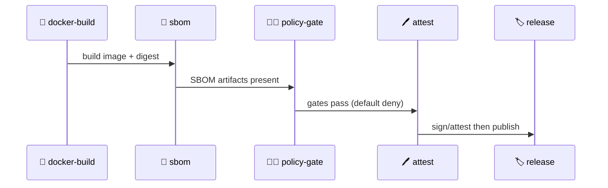

<a id="top"></a>

# 🧬 `sbom` — Software Bill of Materials (SBOM) Action for KFM

[](https://github.com/bartytime4life/Kansas-Frontier-Matrix/actions/workflows/ci.yml)
[](https://github.com/bartytime4life/Kansas-Frontier-Matrix/actions/workflows/codeql.yml)


> This folder is a **repo-local composite action** used to generate **SBOM artifacts** for KFM builds, toolchains, and (optionally) release packaging.  
> In KFM, reproducibility is a security feature — we want to be able to point to the *exact* code + dependencies that produced an artifact. ✅🧾  
<!-- Reproducibility + CI rigor + traceability to exact code version are treated as core trust mechanisms in “NASA-grade” workflow guidance: :contentReference[oaicite:0]{index=0} -->
<!-- KFM explicitly calls for SBOMs (SPDX/CycloneDX), dependency pinning, and least-privilege workflows as part of supply-chain posture: :contentReference[oaicite:1]{index=1} -->

> **KFM non-negotiable ordering (don’t break it):** 🧰 ETL → 🗂️ Catalogs (STAC/DCAT/PROV) → 🕸️ Graph → 🔌 API → 🌐 UI → 🎬 Story Nodes → 🧠 Focus Mode  
<!-- Canonical ordering & boundaries: :contentReference[oaicite:2]{index=2} -->

---

<details>
  <summary><b>🧭 Table of contents</b> (click to expand)</summary>

- [🧾 Action metadata](#-action-metadata)
- [⚡ Quick links](#-quick-links)
- [🧭 Where SBOM fits in KFM](#-where-sbom-fits-in-kfm)
- [🧠 Why KFM has an SBOM action](#-why-kfm-has-an-sbom-action)
- [✅ What this action produces](#-what-this-action-produces)
- [📦 Expected artifact layout](#-expected-artifact-layout)
- [🎛️ Inputs](#️-inputs)
- [📤 Outputs](#-outputs)
- [🧪 Example usage](#-example-usage)
- [🧑‍⚖️ Policy-gate integration](#-policy-gate-integration)
- [🔐 Security posture](#-security-posture)
- [🧯 Failure modes](#-failure-modes)
- [🧰 Maintainer notes](#-maintainer-notes)
- [📚 Reference library](#-reference-library)

</details>

---

## 🧾 Action metadata

| Field | Value |
|---|---|
| 📄 Action folder | `📁 .github/actions/sbom/` |
| 🧩 Action type | Composite Action (`action.yml`) |
| 🎯 Primary job | Generate SBOM artifacts (SPDX/CycloneDX) |
| 🧯 Philosophy | **Fail-closed** for promotion lanes |
| 🔐 Default stance | Least privilege, no secrets required |
| 🧬 KFM alignment | Supply-chain gates expect SBOM presence + traceability |

> [!NOTE]
> `action.yml` is always the source of truth for *actual* implementation details — this README describes the **contract** we want policy + workflows to rely on.

---

## ⚡ Quick links

| Need | Go |
|---|---|
| 🧩 Actions hub | [`../README.md`](../README.md) |
| 🧰 Workflows hub | [`../../workflows/README.md`](../../workflows/README.md) |
| 🧭 KFM Master Guide (v13) | [`../../../docs/MASTER_GUIDE_v13.md`](../../../docs/MASTER_GUIDE_v13.md) |
| 🛡️ Security policy | [`../../../SECURITY.md`](../../../SECURITY.md) *(or `../../SECURITY.md` if mirrored in `.github/`)* |
| 🧑‍⚖️ Policy pack (OPA/Conftest) | [`../../../tools/validation/policy/`](../../../tools/validation/policy/) |
| 📦 Release artifacts | [`../../../releases/`](../../../releases/) |
| 🖊️ Attest action (pairing) | [`../attest/`](../attest/) |
| 🐳 Docker build action (common pairing) | [`../docker-build/`](../docker-build/) |

<!-- Repo structure expectations (dirs + releases include “manifest, SBOM”): :contentReference[oaicite:3]{index=3} -->

---

## 🧭 Where SBOM fits in KFM

KFM is **contract-first + provenance-first** (schemas, API contracts, and governed docs define the system boundaries).  
That makes “what did we ship?” a first-class artifact — not an afterthought. 🧾  
<!-- Contract-first + determinism principles: :contentReference[oaicite:4]{index=4} -->

### 🧱 Architectural boundaries (relevant to SBOM)
- **UI never queries Neo4j directly** — the API boundary is intentional.  
<!-- API boundary invariant: :contentReference[oaicite:5]{index=5} -->
- **Catalog outputs (STAC/DCAT/PROV) are the boundary artifacts** between ETL and Graph/API/UI.  
<!-- Ordering + catalog boundary artifacts: :contentReference[oaicite:6]{index=6} -->
- **Pipelines are deterministic + idempotent** (same inputs → same outputs), which requires pinned tooling and traceable deps.  
<!-- Determinism contract: :contentReference[oaicite:7]{index=7} -->

### 🧬 Release-time signing vs PR-time generation
KFM’s baseline guidance: **official releases** can produce **signed artifacts** (including SBOMs + provenance attestations), and those steps can be done at *release time* rather than on every PR.  
<!-- Release-time signed artifacts note: :contentReference[oaicite:8]{index=8} -->

KFM’s forward direction (proposed): automated change pipelines can attach SBOMs + SLSA attestations to PRs for review.  
<!-- Proposed PR-time SBOM + SLSA + Sigstore in agent/change pipeline: :contentReference[oaicite:9]{index=9} -->

---

## 🧠 Why KFM has an SBOM action

KFM spans **web + GIS + pipelines + modeling + graph systems**. The dependency surface is *bigger than app code*:

- 🐍 Python deps (pip/poetry) for ETL + validators
- 🟩 Node deps (npm/pnpm) for `web/` (React/MapLibre, optional Cesium)
- 🐳 Container base images + OS packages
- 🧰 GIS tooling + native libs (GDAL/PROJ; PostGIS tooling)
- 🕸️ Graph build tooling for `src/graph/` (Neo4j import/build steps)
- 🧪 Modeling & simulation tooling (runs/notebooks/model cards in `mcp/`)

<!-- KFM directory layout covering pipelines/graph/server/web/mcp: :contentReference[oaicite:10]{index=10} -->
<!-- Web stack mention (React/MapLibre, optional Cesium) in KFM architecture diagram: :contentReference[oaicite:11]{index=11} -->
<!-- Geo tooling examples (PostGIS/ogr2ogr usage illustrates native/DB dependencies): :contentReference[oaicite:12]{index=12} -->

An SBOM makes this auditable, reviewable, and policy-testable — and it pairs naturally with:
- 🧾 **PROV lineage** (inputs → transforms → outputs)
- 🧑‍⚖️ **Policy gates** (default-deny promotion)
- 🖊️ **Attestations** (prove the SBOM matches what was built)

> [!TIP]
> A good SBOM isn’t “compliance theater” — it’s how we keep the Atlas trustworthy when dependencies move.

---

## ✅ What this action produces

### Primary outputs (recommended)
- 🧬 **SPDX JSON SBOM** (machine-readable)
- 🧬 **CycloneDX JSON SBOM** (optional but useful)
- 📝 **Human summary** (quick scan in PRs/releases)
- 🧾 **Metadata sidecar** (target info, digest, run id, tool version, etc.)

### Targets this action can support
- 📦 **Repo SBOM** (dependencies from the repository workspace)
- 🐳 **Image SBOM** (SBOM for a built container image, ideally pinned by digest)
- 🧰 **Toolchain snapshot** (build lane tooling, validators, GIS/native deps)

> [!IMPORTANT]
> KFM promotion lanes are designed to be **fail-closed**: missing or empty SBOMs should block promotion.  
<!-- Supply-chain security posture includes SBOM generation and pinning: :contentReference[oaicite:13]{index=13} -->

---

## 📦 Expected artifact layout

KFM’s repo layout explicitly includes a release artifacts directory that carries a **manifest + SBOM**. ✅  
<!-- Releases directory includes “manifest, SBOM”: :contentReference[oaicite:14]{index=14} -->

### 🧪 CI run artifacts (recommended)
These paths are **policy-friendly** (stable, easy to check, and uploadable):

```text
📁 .artifacts/
├─ 📁 sbom/
│  ├─ 📄 repo.sbom.spdx.json
│  ├─ 📄 repo.sbom.cdx.json
│  ├─ 📄 image.sbom.spdx.json
│  └─ 📄 sbom.summary.md
└─ 📁 attestations/
   ├─ 📄 provenance.dsse.json          # 🔏 (usually produced by attest action)
   └─ 📄 materials.sbom.spdx.json      # 🧬 stable name for policy checks
```

> [!NOTE]
> The *stable name* (e.g., `materials.sbom.spdx.json`) is helpful because policy gates can target a single canonical path.

### 🏷️ Release artifacts (repo-level contract)
```text
📁 releases/
└─ 📁 <version-or-run-id>/
   ├─ 📄 manifest.json
   ├─ 📄 sbom.spdx.json
   └─ 📄 provenance.dsse.json
```

---

## 🎛️ Inputs

> GitHub Actions inputs are strings — use `"true"` / `"false"` for booleans.

| Input | Required | Default | Purpose |
|---|---:|---|---|
| `mode` | ❌ | `repo` | `repo` \| `image` \| `both` |
| `formats` | ❌ | `spdx-json` | `spdx-json`, `cyclonedx-json`, or `spdx-json,cyclonedx-json` |
| `output_dir` | ❌ | `.artifacts/sbom` | Where to write SBOM outputs |
| `attestations_dir` | ❌ | `.artifacts/attestations` | Where to place canonical policy-checked SBOM file(s) |
| `image_ref` | ⚠️ | _(none)_ | Required when `mode=image` or `mode=both` *(prefer digest ref)* |
| `tool` | ❌ | `syft` | SBOM generator backend (`syft` recommended) |
| `upload_artifact` | ❌ | `true` | Upload generated files via `actions/upload-artifact` |
| `artifact_name` | ❌ | `sbom-${{ github.sha }}` | Name for uploaded artifact bundle |
| `fail_on_warn` | ❌ | `true` | Promotion lanes should fail-closed on warnings |
| `fail_on_error` | ❌ | `true` | Always fail job if SBOM cannot be generated |

> [!TIP]
> For determinism: prefer digest-pinned images → `ghcr.io/<org>/<image>@sha256:<digest>`  
<!-- “Pin dependencies/tools” and “pinned container base images” are part of KFM supply-chain posture: :contentReference[oaicite:15]{index=15} -->

---

## 📤 Outputs

| Output | Meaning |
|---|---|
| `sbom_spdx_path` | Path to SPDX JSON SBOM (if produced) |
| `sbom_cdx_path` | Path to CycloneDX JSON SBOM (if produced) |
| `sbom_summary_path` | Path to human summary markdown |
| `sbom_target` | `repo` / `image` / `both` |
| `image_digest` | Digest extracted/confirmed from `image_ref` (if applicable) |

---

## 🧪 Example usage

### 1) ✅ PR lane: generate a repo SBOM (no secrets required)

```yaml
jobs:
  sbom:
    runs-on: ubuntu-latest
    permissions:
      contents: read

    steps:
      - uses: actions/checkout@v4

      - name: 🧬 Generate SBOM (repo)
        uses: ./.github/actions/sbom
        with:
          mode: repo
          formats: spdx-json,cyclonedx-json
          output_dir: .artifacts/sbom
          upload_artifact: "true"
```

### 2) 🐳 Build lane: generate an image SBOM after building

```yaml
jobs:
  docker:
    runs-on: ubuntu-latest
    permissions:
      contents: read
      packages: write

    steps:
      - uses: actions/checkout@v4

      - name: 🐳 Build image
        id: build
        uses: ./.github/actions/docker-build
        with:
          image: ghcr.io/${{ github.repository }}
          tags: |
            ${{ github.sha }}

      - name: 🧬 Generate SBOM (image)
        uses: ./.github/actions/sbom
        with:
          mode: image
          image_ref: ${{ steps.build.outputs.image_ref }} # prefer @sha256:...
          formats: spdx-json
          attestations_dir: .artifacts/attestations
```

### 3) 🏷️ Promotion lane: SBOM → policy gate → attest → publish



> [!NOTE]
> KFM’s “Detect → Validate → Promote” concept also fits this ordering, and proposes signing PRs with Sigstore plus emitting OpenLineage events for auditing.  
<!-- Detect→Validate→Promote with Sigstore signing + OpenLineage events: :contentReference[oaicite:16]{index=16} -->

---

## 🧑‍⚖️ Policy-gate integration

KFM’s governance direction includes a **Policy Pack** using **OPA (Rego) + Conftest** and running those rules in CI as a gate that rejects changes that violate rules.  
<!-- Policy pack using OPA/Rego + Conftest, run in CI as gate: :contentReference[oaicite:17]{index=17} -->

### ✅ What this action should guarantee
- Writes SBOM(s) to known paths
- Produces stable file name(s) for policy evaluation (recommended)
- Avoids secret usage (safe in PR lanes)

### ✅ What policy-gate should still enforce
- Required SBOM file existence + non-empty content
- Digest pinning rules (no floating tags for promotion)
- Action pinning + least-privilege workflow permissions
- Optional: license allowlists / forbidden package rules

> [!TIP]
> Keep policy test inputs deterministic — e.g. `reports/gates.json` + canonical SBOM path under `attestations/`.

---

## 🔐 Security posture

### Least privilege by default ✅
This action should run with:

```yaml
permissions:
  contents: read
```

KFM explicitly emphasizes least-privilege workflows and pinned dependencies as part of supply-chain posture.  
<!-- Least-privilege + pinning in KFM supply chain guidance: :contentReference[oaicite:18]{index=18} -->

### Threat model notes 🧯
- **Untrusted PR inputs**: avoid “download arbitrary URL from PR input” patterns.
- **Self-hosted runners**: treat as high-risk; isolate credentials and deployment lanes.
- **Signed artifacts**: verify signatures in promotion lanes when enabled.

<!-- CI/CD security practices include signed artifacts + verification and runner hardening considerations: :contentReference[oaicite:19]{index=19} -->

### Why we care about supply chains at all 🧩
In complex ICT supply chains, trust is hard because many suppliers and components are integrated together (often with remote updates).  
<!-- ICT supply chain security framing: :contentReference[oaicite:20]{index=20} -->

---

## 🧯 Failure modes

| Failure mode | Symptom | Fix |
|---|---|---|
| Floating container tags | SBOM differs across runs | Use `@sha256:` digests |
| Missing lockfiles | SBOM is incomplete | Commit lockfiles or declare intent |
| Mixed package managers | Duplicated components | Standardize per subproject |
| “Warn-only” pipelines | Promotion lets drift through | `fail_on_warn=true` in main/release |
| Artifact drift | Policy gate can’t find SBOM | Stable output paths + stable names |
| Unpinned actions | Supply-chain risk increases | Pin actions (commit SHA or trusted tags) |
| Over-permissioned workflows | Blast radius too big | Enforce least-privilege permissions |

---

## 🧰 Maintainer notes

### 🧪 Smoke test workflow (recommended)
Create a workflow that runs:
- `sbom` (repo mode)
- `docker-build` → `sbom` (image mode)
- Uploads `.artifacts/**`

### 📌 Keep these stable
- Output filenames used by policy checks
- Directory layout under `.artifacts/` and `releases/`
- Summary format (so PR reviewers can scan quickly)

### 🌍 Geo-stack reminder (native deps matter)
KFM’s GIS workflows often involve PostGIS and conversion tooling (e.g., `ogr2ogr`). Native/OS packages show up in image SBOMs — don’t ignore them.  
<!-- Example shows ogr2ogr pushing to PostGIS (native + DB dependency surface): :contentReference[oaicite:21]{index=21} -->

---

## 📚 Reference library

<details>
  <summary><b>📖 KFM docs + library touchpoints</b> (click to expand)</summary>

### 🧭 KFM core docs
- `docs/MASTER_GUIDE_v13.md` — repo structure + canonical ordering (ETL → catalogs → graph → API → UI → story → focus)  
  <!-- Ordering + boundaries + directory layout: :contentReference[oaicite:22]{index=22} :contentReference[oaicite:23]{index=23} -->
- `Kansas Frontier Matrix (KFM) – Comprehensive Technical Documentation.docx` — SBOM (SPDX/CycloneDX), pinning, least privilege  
  <!-- Supply chain section: :contentReference[oaicite:24]{index=24} -->
- `🌟 Kansas Frontier Matrix – Latest Ideas & Future Proposals.docx` — Detect→Validate→Promote, Sigstore, OpenLineage, Policy Pack (OPA/Conftest), PR→PROV integration  
  <!-- Sigstore + OpenLineage + policy pack: :contentReference[oaicite:25]{index=25} -->

### 🧪 Reproducibility mindset
- `Scientific Modeling and Simulation_ A Comprehensive NASA-Grade Guide.pdf` — reproducibility via version control/logging/CI + traceability to exact code version  
  <!-- Reproducibility framing: :contentReference[oaicite:26]{index=26} -->

### 🔐 Governance + trust in the real world
- `Introduction to Digital Humanism.pdf` — ICT supply chain security is a governance/trust problem (many suppliers & integrators)  
  <!-- Supply chain security case framing: :contentReference[oaicite:27]{index=27} -->

</details>

---

<p align="right"><a href="#top">⬆️ Back to top</a></p>
