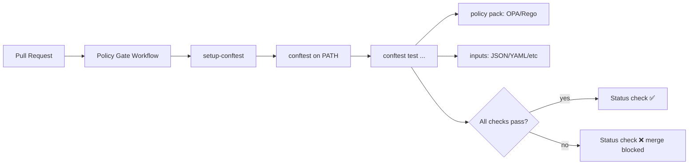

<!-- [KFM_META_BLOCK_V2]
doc_id: kfm://doc/2776f0a7-0be1-46fa-a84c-ba22e4a3a7a5
title: setup-conftest (Composite GitHub Action)
type: standard
version: v1
status: draft
owners: kfm-platform (TODO: confirm)
created: 2026-02-23
updated: 2026-02-28
policy_label: public
related:
  - .github/actions/setup-conftest/action.yml
  - .github/workflows/kfm-policy-gate.yml
  - policy/opa/
tags: [kfm, ci, github-actions, conftest, opa, rego, supply-chain]
notes:
  - Keep this README in sync with action.yml (inputs/outputs are authoritative there).
  - Tool version updates are governed changes: pin versions and review diffs.
[/KFM_META_BLOCK_V2] -->

# setup-conftest

> Install a **pinned** `conftest` binary in CI so policy gates are deterministic, reviewable, and consistent.


**Status:** draft • **Owners:** `kfm-platform` (TODO) • **Last updated:** 2026-02-28

---

## Jump to

- [Why this exists](#why-this-exists)
- [Non-goals](#non-goals)
- [How it fits in the repo](#how-it-fits-in-the-repo)
- [Usage](#usage)
- [Inputs and outputs](#inputs-and-outputs)
- [Version pinning and governance](#version-pinning-and-governance)
- [Security and supply chain](#security-and-supply-chain)
- [Permissions guidance](#permissions-guidance)
- [Troubleshooting](#troubleshooting)
- [Directory contract](#directory-contract)

---

## Why this exists

KFM uses **Conftest-based** merge-blocking checks to enforce **policy-as-code** in pull requests.
This action exists as a *tiny* reusable installer so workflows can:

- install the same `conftest` version everywhere, and
- treat tool upgrades as explicit, reviewed changes.

> **NOTE**
> This action is intentionally “small and boring.” It should do one job: put a pinned `conftest` on `PATH`.

[Back to top](#setup-conftest)

---

## Non-goals

This action should **not** become a policy runner, a linter framework, or a general “toolbox” action.

- ❌ Not a place to encode Rego policy logic (that belongs in `policy/…`)
- ❌ Not a place to decide allow/deny (that belongs in OPA/Rego + Conftest invocation)
- ❌ Not a place to fetch “latest” tool versions at runtime

> **TIP**
> If you find yourself adding lots of inputs, you probably want a workflow-level abstraction instead.

[Back to top](#setup-conftest)

---

## How it fits in the repo

This action is typically consumed by a policy gate workflow (for example, a merge-blocking
`kfm-policy-gate.yml`), which then runs Conftest against OPA/Rego policies.



[Back to top](#setup-conftest)

---

## Usage

### Minimal (local action)

Because this is a **local** composite action, make sure the repository is checked out first:

```yaml
- uses: actions/checkout@v4

- name: Setup conftest
  uses: ./.github/actions/setup-conftest
```

### Smoke test (recommended)

Print the version so failures are obvious in logs:

```yaml
- name: Setup conftest
  uses: ./.github/actions/setup-conftest

- name: Verify conftest install
  run: conftest --version
```

### Run a policy gate

After setup, call `conftest` in a `run:` step. Example (receipt policy check):

```yaml
- name: Policy checks
  run: |
    conftest test run_receipt.json --policy policy/opa
```

> **TIP**
> Keep deny messages explainable. A failing policy should tell you:
> 1) what field is missing, 2) what constraint was violated, and 3) how to remediate.

[Back to top](#setup-conftest)

---

## Inputs and outputs

**Authoritative interface:** `action.yml`

Because this is a local composite action, the definitive contract lives in:

- `.github/actions/setup-conftest/action.yml`

### Interface summary

This section is intentionally **fail-closed**: do not rely on README defaults.
If anything here differs from `action.yml`, **`action.yml` wins**.

| Item | What it means | Where to verify |
|---|---|---|
| Inputs | Optional parameters to control install behavior | `action.yml` `inputs:` |
| Outputs | Values emitted for later steps (rare for installers) | `action.yml` `outputs:` |
| PATH behavior | How `conftest` is exposed to later steps | `action.yml` steps (look for `$GITHUB_PATH`) |
| Version pin | Exact Conftest version installed | `action.yml` (pinned value) |

### Expected behavior (design intent)

| Aspect | What you should expect | Source of truth |
|---|---|---|
| Side effect | `conftest` is installed and available on `PATH` for later steps | `action.yml` |
| Determinism | A specific `conftest` version is installed (not “latest”) | `action.yml` |
| Portability | Works on the runner OS/arch combinations used by KFM CI | `action.yml` + workflows |

[Back to top](#setup-conftest)

---

## Version pinning and governance

Tool pins are part of the **trust membrane**: if tools drift, policy gates drift.

### Change policy

- ✅ Allowed: bump `conftest` version in a PR with review + evidence.
- ❌ Not allowed: silently pulling “latest” at runtime.

### Definition of done for a version bump

- [ ] Update the pinned version in `action.yml`
- [ ] If you verify checksums, update the checksum too
- [ ] Run the policy gate workflow on representative fixtures
- [ ] Ensure Rego unit tests (`*_test.rego`) still pass
- [ ] Ensure deny messages remain readable (no cryptic failures)
- [ ] Update this README (only if interface/behavior changed)

### Suggested evidence to attach to the PR (pattern)

- Release notes / changelog link for the new Conftest version
- Before/after `conftest --version` output from CI
- Any policy behavior diffs (expected vs unexpected)

[Back to top](#setup-conftest)

---

## Security and supply chain

Installer-style actions are supply-chain sensitive. Recommended hardening:

1. **Pin versions** (required).
2. Prefer **checksum verification** for downloaded artifacts.
3. Avoid curl-piping unpinned scripts.
4. Keep job permissions tight (see below).
5. Prefer stable, official release URLs.

> **NOTE**
> If you add signing verification (Cosign/Sigstore, etc.), document:
> - what is verified,
> - which trust roots are used,
> - and what failure looks like (fail closed).

[Back to top](#setup-conftest)

---

## Permissions guidance

This action should not require elevated GitHub permissions.

Recommended job-level permissions for a typical policy gate:

```yaml
permissions:
  contents: read
```

> **WARNING**
> Do not grant write permissions “just in case.” Treat permissions as part of the governance surface.

[Back to top](#setup-conftest)

---

## Troubleshooting

### `conftest: command not found`

- Confirm the setup step ran (and did not get skipped).
- Confirm `action.yml` appends the install location to `$GITHUB_PATH`.
- Print version as a smoke test:

```yaml
- run: conftest --version
```

### Wrong architecture / “exec format error”

- Ensure the download URL (or package) selects the correct OS/arch for the runner.
- If you support multiple runner types, add an explicit mapping in `action.yml`.

### Policies pass locally but fail in CI

- Ensure CI is using the **same** Conftest version as local (`conftest --version`).
- Ensure `--policy` points to the intended policy directory.
- Confirm policy fixtures and inputs match what CI runs.

[Back to top](#setup-conftest)

---

## Directory contract

**Where this fits:** GitHub Actions local composite actions live under `.github/actions/`.

### Directory tree (expected)

```text
.github/actions/setup-conftest/
  action.yml        # composite action definition (authoritative contract)
  README.md         # this file (usage + governance)
  scripts/          # (optional) small helpers only if necessary
```

### Acceptable contents

- `action.yml` (or `action.yaml`) defining the composite action
- `README.md` describing purpose, usage, and governance rules
- Small helper scripts *only if needed* (keep them minimal and reviewed)

### Do not put here

- Rego policy packs (`policy/…`) — those belong in the policy directory
- Workflows (`.github/workflows/…`) — this directory is only for reusable actions
- Secrets, credentials, or long-lived tokens

---

<details>
<summary>Appendix: Example job snippet (pattern)</summary>

```yaml
jobs:
  policy-gate:
    runs-on: ubuntu-latest
    permissions:
      contents: read
    steps:
      - uses: actions/checkout@v4

      - name: Setup conftest
        uses: ./.github/actions/setup-conftest

      - name: Verify conftest install
        run: conftest --version

      - name: Policy checks
        run: |
          conftest test run_receipt.json --policy policy/opa
```

</details>

[Back to top](#setup-conftest)
