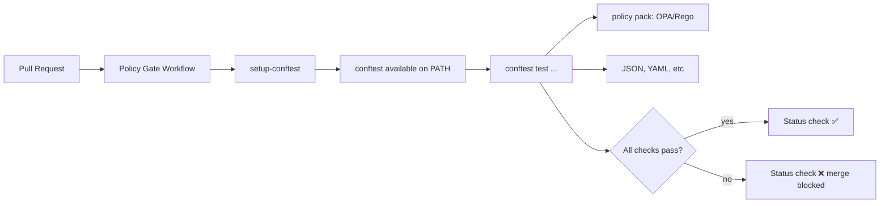

<!-- [KFM_META_BLOCK_V2]
doc_id: kfm://doc/2776f0a7-0be1-46fa-a84c-ba22e4a3a7a5
title: setup-conftest (Composite GitHub Action)
type: standard
version: v1
status: draft
owners: kfm-platform (TODO: confirm)
created: 2026-02-23
updated: 2026-02-23
policy_label: public
related:
  - .github/actions/setup-conftest/action.yml
  - .github/workflows/kfm-policy-gate.yml
  - policy/opa/
tags: [kfm, ci, github-actions, conftest, opa, rego]
notes:
  - Keep this README in sync with action.yml (inputs/outputs are authoritative there).
  - Tool version updates are governed changes: pin versions and review diffs.
[/KFM_META_BLOCK_V2] -->

# setup-conftest

> Install a **pinned** `conftest` binary in CI so policy gates are deterministic and reviewable.


**Status:** draft • **Owners:** `kfm-platform` (TODO) • **Last updated:** 2026-02-23

---

## Jump to

- [Why this exists](#why-this-exists)
- [How it fits in the repo](#how-it-fits-in-the-repo)
- [Usage](#usage)
- [Inputs and outputs](#inputs-and-outputs)
- [Version pinning and governance](#version-pinning-and-governance)
- [Security and supply chain](#security-and-supply-chain)
- [Troubleshooting](#troubleshooting)
- [Directory contract](#directory-contract)

---

## Why this exists

KFM uses **Conftest-based** merge-blocking checks to enforce **policy-as-code** in pull requests. This action exists as a *tiny* reusable installer so workflows can:

- install the same `conftest` version everywhere, and
- treat tool upgrades as explicit, reviewed changes.

> **NOTE**
> This action is intentionally “small and boring.” It should do one job: put a pinned `conftest` on `PATH`.

[Back to top](#setup-conftest)

---

## How it fits in the repo

This action is typically consumed by a policy gate workflow (for example, a merge-blocking `kfm-policy-gate.yml`), which then runs Conftest against OPA/Rego policies.



[Back to top](#setup-conftest)

---

## Usage

### Minimal

If your workflows want the repository-pinned version of `conftest`:

```yaml
- name: Setup conftest
  uses: ./.github/actions/setup-conftest
```

### Run a policy gate

After setup, call `conftest` in a `run:` step. Example (receipt policy check):

```yaml
- name: Policy checks
  run: |
    conftest test run_receipt.json --policy policy/opa
```

> **TIP**
> Keep deny messages explainable. A failing policy should tell you *what field is missing*, *what constraint was violated*, and *how to remediate*.

[Back to top](#setup-conftest)

---

## Inputs and outputs

**Authoritative interface:** `action.yml`

Because this is a local composite action, the definitive contract lives in:

- `.github/actions/setup-conftest/action.yml`

### Expected behavior

| Aspect | What you should expect | Source of truth |
|---|---|---|
| Side effect | `conftest` is installed and available on `PATH` for later steps | `action.yml` |
| Determinism | A specific `conftest` version is installed (not “latest”) | `action.yml` |
| Portability | Works on the runner OS/arch combinations used by KFM CI | `action.yml` |

### Common optional inputs (pattern)

If you choose to expose inputs in `action.yml`, keep them **minimal**:

| Input | Type | Typical default | Why it exists |
|---|---:|---|---|
| `version` | string | pinned in `action.yml` | Controlled overrides for experiments (still reviewed) |
| `cache` | boolean | `true` | Speed up CI by caching the downloaded binary |
| `install-dir` | string | runner temp dir | Avoid writing to restricted locations |

> **WARNING**
> Do not add inputs that encourage “floating” installs (e.g., `version: latest`). That breaks the governance model.

[Back to top](#setup-conftest)

---

## Version pinning and governance

Tool pins are part of the **trust membrane**. Updating `conftest` is a governed change.

### Change policy

- ✅ Allowed: bump `conftest` version in a PR with review + evidence.
- ❌ Not allowed: silently pulling “latest” at runtime.

### Definition of done for a version bump

- [ ] Update the pinned version in `action.yml`
- [ ] If you verify checksums, update the checksum too
- [ ] Run the policy gate workflow on representative fixtures
- [ ] Ensure Rego unit tests (`*_test.rego`) still pass
- [ ] Update this README (if interface/behavior changed)

[Back to top](#setup-conftest)

---

## Security and supply chain

Recommended hardening for installer-style actions:

1. **Pin versions** (required).
2. Prefer **checksum verification** for downloaded artifacts.
3. Avoid curl-piping unpinned scripts.
4. Keep permissions tight: this action should not need elevated GitHub permissions.

> **NOTE**
> If you add artifact signing verification (Cosign/Sigstore, etc.), document the verification mode and required trust roots here.

[Back to top](#setup-conftest)

---

## Troubleshooting

### `conftest: command not found`

- Confirm the setup step ran (and did not get skipped).
- Confirm `action.yml` appends the install location to `$GITHUB_PATH`.
- Print version as a smoke test:

```yaml
- run: conftest --version
```

### Wrong architecture / “exec format error”

- Ensure the download URL (or package) selects the correct OS/arch for the runner.
- If you support multiple runner types, add an explicit mapping in `action.yml`.

### Policies pass locally but fail in CI

- Ensure CI is using the **same** Conftest version as local.
- Ensure `--policy` points to the intended policy directory.

[Back to top](#setup-conftest)

---

## Directory contract

**Where this fits:** GitHub Actions local composite actions live under `.github/actions/`.

### Acceptable contents

- `action.yml` (or `action.yaml`) defining the composite action
- `README.md` describing purpose, usage, and governance rules
- Small helper scripts *only if needed* (keep them minimal and reviewed)

### Do not put here

- Rego policy packs (`policy/…`) — those belong in the policy directory
- Workflows (`.github/workflows/…`) — this directory is only for reusable actions
- Secrets, credentials, or long-lived tokens

---

<details>
<summary>Appendix: Example job snippet (pattern)</summary>

```yaml
jobs:
  policy-gate:
    runs-on: ubuntu-latest
    steps:
      - uses: actions/checkout@v4

      - name: Setup conftest
        uses: ./.github/actions/setup-conftest

      - name: Policy checks
        run: |
          conftest test run_receipt.json --policy policy/opa
```

</details>

[Back to top](#setup-conftest)
