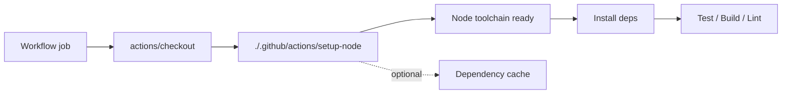

<!-- [KFM_META_BLOCK_V2]
doc_id: kfm://doc/a286e6a1-d73f-4f49-84a1-fcc250927f49
title: .github/actions/setup-node/README.md
type: standard
version: v1
status: draft
owners: TODO:DevEx
created: 2026-02-28
updated: 2026-02-28
policy_label: public
related:
  - .github/actions/setup-node/action.yml
  - .github/workflows/
tags: [kfm, github-actions, ci, nodejs]
notes:
  - Keep this README in sync with action.yml (source of truth for inputs/outputs).
[/KFM_META_BLOCK_V2] -->

# setup-node (local GitHub Action)

> Standardize Node.js setup (and optional dependency caching) for workflows in this repository.


---

## Quick links

- [Where this lives](#where-this-lives)
- [What it does](#what-it-does)
- [Usage](#usage)
- [Inputs](#inputs)
- [Outputs](#outputs)
- [Troubleshooting](#troubleshooting)
- [Security notes](#security-notes)
- [Maintenance](#maintenance)
- [Directory contract](#directory-contract)

---

## Where this lives

This is a **local** action stored at:

- `.github/actions/setup-node/`

It is meant to be referenced from workflow steps as:

- `uses: ./.github/actions/setup-node`

> **Important:** GitHub requires that the repository is checked out in the job before using a local action path.

---

## What it does

### Source of truth

The definitive behavior of this action is defined in:

- `./.github/actions/setup-node/action.yml`

This README is documentation. **`action.yml` is the contract** (inputs/outputs/steps).

### Typical responsibilities (design intent)

Most repos use a “setup-node” local action to:

- Select and install a Node.js runtime version for the job.
- Optionally enable dependency caching for the chosen package manager.
- Optionally enforce consistent registry/auth configuration in CI.

If this action wraps the official `actions/setup-node`, note that its built-in dependency caching:
- **caches package manager data (e.g., npm/pnpm/yarn cache)**
- **does _not_ cache `node_modules`** by default

---

## How it fits in CI



---

## Usage

### Minimal example

```yaml
jobs:
  test:
    runs-on: ubuntu-latest
    steps:
      - name: Check out repo (required for local actions)
        uses: actions/checkout@v5

      - name: Setup Node (repo-standard)
        uses: ./.github/actions/setup-node

      - name: Install deps
        run: npm ci

      - name: Run tests
        run: npm test
```

### Example with “expected” inputs (verify against `action.yml`)

If `action.yml` is implemented as a thin wrapper around `actions/setup-node`, you will often see inputs like:

```yaml
jobs:
  test:
    runs-on: ubuntu-latest
    strategy:
      matrix:
        node: [20, 22]
    steps:
      - uses: actions/checkout@v5

      - name: Setup Node (matrix)
        uses: ./.github/actions/setup-node
        with:
          node-version: ${{ matrix.node }}
          cache: npm
          # cache-dependency-path: package-lock.json  # monorepos/subdirs

      - run: npm ci
      - run: npm test
```

> ✅ **Update this example** if your `action.yml` uses different input names.

---

## Inputs

> **Required:** Keep this table synchronized with `action.yml`.

| Input | Required | Default | Meaning | Notes |
|------|----------|---------|---------|------|
| `node-version` | TODO | TODO | Node version spec (e.g., `20`, `22`, `lts/*`) | If passed through to `actions/setup-node`, semver/LTS syntaxes apply. |
| `node-version-file` | TODO | TODO | Path to a version file (e.g., `.nvmrc`, `.node-version`) | Common alternative to `node-version`. |
| `cache` | TODO | TODO | Enable dependency caching (`npm`, `yarn`, `pnpm`) | If passed through, this caches package manager data (not `node_modules`). |
| `cache-dependency-path` | TODO | TODO | Path(s) to lockfile(s) for cache key | Useful for monorepos or subdir apps. |
| `working-directory` | TODO | TODO | Run cache/install relative to a subdir | Only if your action supports it. |

**How to update this table (suggested):**
1. Open `./.github/actions/setup-node/action.yml`
2. Copy the `inputs:` keys into the table above.
3. Add defaults and required flags exactly as declared.

---

## Outputs

> **Required:** Keep this table synchronized with `action.yml`.

| Output | When set | Meaning |
|--------|----------|---------|
| `node-version` | TODO | The resolved Node version used |
| `cache-hit` | TODO | Whether dependency cache was restored |

> If this action exposes outputs from `actions/setup-node` or `actions/cache`, list them explicitly here.

---

## Troubleshooting

### “Unable to find action.yml” / “Action not found”
- Ensure the workflow includes `actions/checkout` **before** `uses: ./.github/actions/setup-node`.
- Ensure the directory contains `action.yml` (or `action.yaml`) at the root of this action folder.

### Cache not working / slow installs
If you’re using dependency caching via `actions/setup-node`:
- Ensure you **commit your lockfile** (`package-lock.json`, `pnpm-lock.yaml`, `yarn.lock`, etc.).
- For monorepos / subdirectories, set `cache-dependency-path` to the correct lockfile path(s).
- Remember: the built-in caching approach caches package-manager data and **does not cache `node_modules`**.

### GitHub Enterprise Server (GHES) / rate limits when downloading Node
If using `actions/setup-node` on GHES, you may need to pass a token to avoid rate limits when fetching Node distributions.

---

## Security notes

- **Treat workflow/action inputs as untrusted** unless you control the caller context (especially if workflows can be triggered from forks). Avoid `bash` interpolation vulnerabilities.
- Prefer **version-pinned** third-party actions (major tag at minimum; SHA for maximum stability) in `action.yml` and workflows.
- **Do not cache secrets.** Dependency caches are shared within repository access rules; never store tokens/credentials inside cached paths.

---

## Maintenance

### Definition of Done (DoD) for changes here
- [ ] `action.yml` updated (inputs/outputs/steps)
- [ ] This README updated to match `action.yml`
- [ ] Workflows that use this action updated (if inputs changed)
- [ ] CI run confirms at least one workflow path exercises this action
- [ ] Security review: no secret material added to cache paths or logs

### Recommended periodic checks
- [ ] Review Node LTS policy and update version pinning / matrix as needed
- [ ] Review caching config for correctness in monorepos
- [ ] Review third-party action versions for security updates

---

## Directory contract

**Purpose:** This directory contains a single reusable action for Node.js setup.

### Acceptable contents
- `action.yml` / `action.yaml`
- `README.md`
- Small helper scripts invoked by the action (if needed), e.g. `scripts/*.sh`
- Minimal fixtures for action tests (if used)

### Exclusions
- ❌ Workflow files (those belong in `.github/workflows/`)
- ❌ Application/business logic
- ❌ Secrets, tokens, or credentials (in any form)
- ❌ Large build artifacts or vendored dependencies

---

_If you update the action behavior, update the README the same PR._
