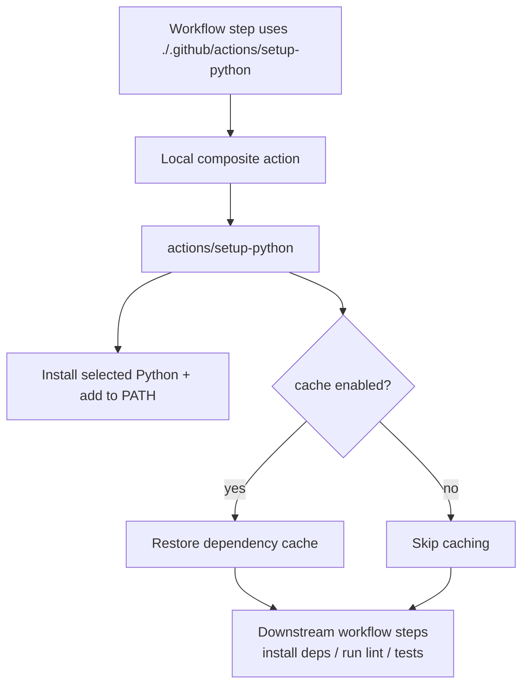

<!-- [KFM_META_BLOCK_V2]
doc_id: kfm://doc/7c8a5e9b-24c1-4e2b-9f9c-8c3d2a9a2d5b
title: setup-python (repo-local composite action)
type: standard
version: v1
status: draft
owners: devops@kfm (TODO)
created: 2026-02-28
updated: 2026-02-28
policy_label: public
related:
  - .github/actions/setup-python/action.yml
  - .github/workflows/
tags: [kfm, github-actions, composite-action, python, ci]
notes:
  - This README must be kept in sync with action.yml.
[/KFM_META_BLOCK_V2] -->

# setup-python (repo-local composite action)

> **One-line purpose:** Standardize Python runtime setup across KFM GitHub Actions workflows (version selection + optional dependency caching), so every lane behaves the same.

 <!-- TODO: promote to published -->


**Status:** draft • **Owners:** `devops@kfm` (TODO) • **Location:** `.github/actions/setup-python/`

---

## Quick navigation

- [Why this exists](#why-this-exists)
- [How to use](#how-to-use)
- [Inputs](#inputs)
- [Outputs](#outputs)
- [How it works](#how-it-works)
- [Troubleshooting](#troubleshooting)
- [Change policy](#change-policy)
- [Directory documentation](#directory-documentation)

---

## Why this exists

We use Python across multiple CI lanes (lint, tests, tooling, validation, data QA). This composite action exists to:

- reduce workflow duplication (`python-version`, caching, install patterns)
- enforce consistent defaults (same “golden path” across lanes)
- provide a single place to harden Python setup (security + determinism)

> **NOTE:** This README is **not a source of truth** for inputs/outputs — `action.yml` is. Keep the tables below synced with `.github/actions/setup-python/action.yml`.

---

## How to use

In a workflow job, reference the **local action**:

```yaml
steps:
  - uses: actions/checkout@v4 # or repo standard
  - name: Setup Python
    uses: ./.github/actions/setup-python
    with:
      python-version: "3.12"
      cache: "pip"
      cache-dependency-path: |
        requirements.txt
  - run: python --version
  - run: pip install -r requirements.txt
  - run: pytest -q
```

### Example: Poetry

```yaml
steps:
  - uses: actions/checkout@v4
  - uses: ./.github/actions/setup-python
    with:
      python-version: "3.12"
      cache: "poetry"
      cache-dependency-path: |
        poetry.lock
        pyproject.toml
  - run: poetry install --no-interaction --no-root
  - run: poetry run pytest -q
```

### Example: pipenv

```yaml
steps:
  - uses: actions/checkout@v4
  - uses: ./.github/actions/setup-python
    with:
      python-version: "3.12"
      cache: "pipenv"
      cache-dependency-path: |
        Pipfile.lock
  - run: pipenv sync --dev
  - run: pipenv run pytest -q
```

---

## Inputs

> **IMPORTANT:** The authoritative list lives in `action.yml`. Treat this table as a **documentation mirror**.

### Recommended “pass-through” inputs (when wrapping `actions/setup-python`)

| Input | Type | Default | Recommended | Notes |
|------|------|---------|-------------|------|
| `python-version` | string | (none) | ✅ yes | Semver / exact version like `3.12`, `3.13` |
| `python-version-file` | string | (none) | optional | Alternative to `python-version` (e.g., `.python-version`) |
| `architecture` | string | runner arch | optional | `x86`, `x64`, `arm64` |
| `cache` | string | `""` | optional | `pip`, `pipenv`, `poetry` |
| `cache-dependency-path` | string or multiline | auto-detect | optional | Use when dependency files live in subdirs or when multiple files should key the cache |
| `check-latest` | boolean | `false` | optional | Only enable if you want the latest patch within a major/minor range |

### KFM wrapper-specific inputs (if/when we add them)

If this composite action adds *extra behavior* beyond `actions/setup-python`, define wrapper-specific inputs here and in `action.yml`.

| Input | Type | Default | Purpose |
|------|------|---------|---------|
| `working-directory` | string | `.` | (Proposed) Used if we want cache keys / installs relative to a subproject |
| `install` | enum | `none` | (Proposed) `none\|pip\|poetry\|pipenv` to optionally install dependencies inside the composite action |
| `install-args` | string | (empty) | (Proposed) Extra args for install command |

> **TIP:** If you add wrapper-specific behavior, keep it minimal and deterministic. Prefer “setup” over “build/test”.

---

## Outputs

Composite actions can define outputs in `action.yml`. If this action is a thin wrapper around `actions/setup-python`, you may have **no outputs**.

| Output | Type | Description |
|--------|------|-------------|
| (none) | — | — |

> If outputs are added, update this table and document an example of consuming them.

---

## How it works

At a high level:



### Implementation notes (keep action.yml aligned)

- Composite actions are defined via an `action.yml` (or `action.yaml`) metadata file.
- In composite actions, access inputs using the `inputs` context (not environment-variable injection).
- If caching is enabled via `actions/setup-python`, it keys caches using a hash of dependency files; use `cache-dependency-path` when needed.

---

## Troubleshooting

### Cache “doesn’t work” / pip still installs every run
- Caching for pip typically stores the **pip cache directory** (wheels/downloads). It can speed up installs but doesn’t eliminate install steps.
- If your dependency file allows floating versions (e.g. `package>=1.0` or no pinned version), the resolver may pull newer packages and reduce cache reuse.

**Fixes**
- Pin dependency versions where practical.
- Ensure `cache-dependency-path` points at the file(s) you actually use for install.

### Installing from private repos fails
`actions/setup-python` does **not** handle auth for private repositories automatically.

**Fixes**
- Configure auth via environment variables, a token, or pip’s VCS/auth mechanisms in the workflow before `pip install`.

### Multiple Python subprojects in a monorepo
Use `cache-dependency-path` with multiple lines and/or add a wrapper `working-directory` input (if we support it).

---

## Change policy

Changes to this action can break CI across the repo. Treat edits as “governed infra changes”.

### Definition of done checklist
- [ ] `action.yml` updated
- [ ] README updated (inputs/outputs tables match `action.yml`)
- [ ] At least one workflow uses the action in CI (smoke proof)
- [ ] Versions are pinned appropriately (avoid unpinned `@main`)
- [ ] Minimal permissions documented in the calling workflow (principle of least privilege)

### Minimum verification steps
1. Open `.github/actions/setup-python/action.yml` and confirm:
   - inputs + defaults
   - what it calls (e.g., `actions/setup-python@...`)
2. Search workflows for usages:
   - `uses: ./.github/actions/setup-python`
3. Run a CI job (or `act` locally, if supported) to validate:
   - correct Python version
   - cache restore/save behavior

---

## Directory documentation

### Where it fits
This folder contains a **repository-local** GitHub Action that can be referenced by workflows:

```yaml
- uses: ./.github/actions/setup-python
```

### Acceptable inputs
- Action metadata: `action.yml` (or `action.yaml`)
- This README
- Optional helper scripts only if strictly necessary (prefer pure YAML steps)

### Exclusions
- Do **not** put workflow files here (those live under `.github/workflows/`)
- Do **not** embed test logic (pytest, lint) in this action unless explicitly intended as a “lane”
- Do **not** introduce network downloads beyond what’s required for Python setup and dependency install (keep it deterministic)
