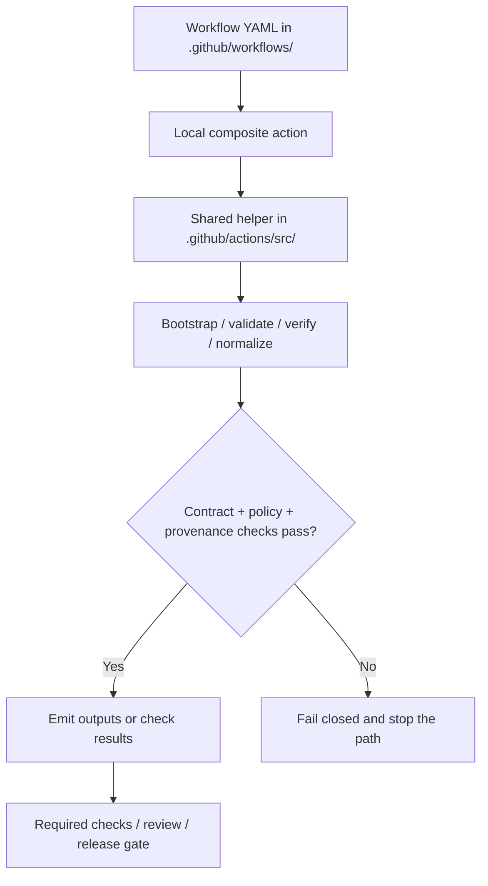

<!-- [KFM_META_BLOCK_V2]
doc_id: kfm://doc/NEEDS-VERIFICATION
title: GitHub Actions Source Helpers
type: standard
version: v1
status: draft
owners: NEEDS VERIFICATION
created: YYYY-MM-DD
updated: YYYY-MM-DD
policy_label: NEEDS VERIFICATION
related: [../../README.md, ../../workflows/README.md, ../../CODEOWNERS, ../../PULL_REQUEST_TEMPLATE.md, ../../SECURITY.md]
tags: [kfm, github, actions, ci, helpers, provenance, policy]
notes: [Current-session evidence did not directly surface the mounted .github/actions/src/ inventory; action-family examples below are grounded in attached design notes and marked where verification is still needed.]
[/KFM_META_BLOCK_V2] -->

# GitHub Actions Source Helpers

Shared helper lane for local composite actions under `.github/actions/`, keeping reusable CI internals small, deterministic, and easy to review.

> [!NOTE]
> **Status:** experimental  
> **Owners:** NEEDS VERIFICATION  
>      
> **Quick jumps:** [Scope](#scope) · [Repo fit](#repo-fit) · [Inputs](#accepted-inputs) · [Exclusions](#exclusions) · [Current verified snapshot](#current-verified-snapshot) · [Directory tree](#directory-tree) · [Quickstart](#quickstart) · [Usage](#usage) · [Diagram](#diagram) · [Design rules](#action-source-design-rules) · [Definition of done](#task-list--definition-of-done) · [FAQ](#faq)  
> **Repo fit:** `.github/actions/src/` → upstream: [`../../README.md`](../../README.md), [`../../workflows/README.md`](../../workflows/README.md), [`../../CODEOWNERS`](../../CODEOWNERS), [`../../PULL_REQUEST_TEMPLATE.md`](../../PULL_REQUEST_TEMPLATE.md), [`../../SECURITY.md`](../../SECURITY.md) · downstream: sibling local composite actions under [`../`](../) and workflow callers under [`../../workflows/`](../../workflows/) *(concrete action inventory still NEEDS VERIFICATION)*

> [!IMPORTANT]
> This directory should function as the **shared helper lane** for local composite actions, not as a second workflow lane, not as a policy dumping ground, and not as a catch-all scripts folder. Keep outward action interfaces in each action’s own `action.yml`; keep only the reusable implementation seams here.

> [!WARNING]
> Current-session evidence did **not** directly expose the mounted repository tree for `.github/actions/src/`. Treat concrete file names, language subfolders, and helper inventories below as **illustrative starter shape** unless and until the repo is directly reverified.

## Scope

This directory is the place for reusable implementation pieces that support multiple local composite actions in KFM. In practice, that usually means:

- shared shell or Python helpers for deterministic tool setup
- reusable wrappers for metadata, schema, provenance, or policy checks
- small helper libraries that keep local action directories thin
- common templates or fixtures used by several action entrypoints
- action-author guidance that explains what belongs in `src/` versus in an action folder

This directory should preserve KFM’s broader operating posture: artifact-first, fail-closed, provenance-aware, and explicit about what is verified versus what is only proposed.

## Repo fit

| Path | Role | Relationship |
| --- | --- | --- |
| `../../README.md` | `.github` subtree hub | Parent GitHub-facing documentation surface |
| `../../workflows/README.md` | workflow lane hub | Documents workflow callers that may consume local actions |
| `../../CODEOWNERS` | ownership surface | Governs review and stewardship routing |
| `../../PULL_REQUEST_TEMPLATE.md` | review entry surface | Adjacent contributor-facing review contract |
| `../../SECURITY.md` | security disclosure surface | Adjacent security and trust posture doc |
| `.github/actions/src/README.md` | this file | Directory README for shared action-source helpers |
| `../` | local action sibling lane | Composite action entrypoints should stay in their own directories |
| `../../workflows/` | workflow caller lane | Workflows orchestrate action use; they should not become the owner of reusable helper internals |

## Accepted inputs

Place material here when it is primarily **shared action implementation support**, such as:

- helper scripts reused by multiple local composite actions
- lightweight installer shims for common CI tools
- reusable validation wrappers around metadata, policy, provenance, or signing steps
- small common libraries for output handling, logging, or path normalization
- templates or examples that several action folders consume
- short, implementation-facing notes that help maintainers keep action internals consistent

## Exclusions

Do **not** place the following here:

- full workflow orchestration or lane-specific branching logic → keep that in `../../workflows/`
- repo-wide policy content or decision grammar registries → keep that in the policy-owning lane
- domain ETL, data transformation, or publication logic that belongs outside `.github/`
- generated artifacts such as receipts, SBOMs, signatures, bundles, or uploaded evidence
- secrets, tokens, credentials, or any helper that writes them into logs or workspace artifacts
- one-off scripts used by only one action with no reuse case → keep them next to the owning action until reuse is real
- claims that a helper, action, or gate is already wired in-tree when current evidence does not directly prove that state

## Status vocabulary used in this directory

| Label | Use here |
| --- | --- |
| **CONFIRMED** | Directly supported by visible repo-grounded evidence or cited KFM doctrine |
| **INFERRED** | Small structural completion strongly implied by KFM conventions |
| **PROPOSED** | Recommended starter shape or helper pattern not yet directly verified in the mounted repo |
| **UNKNOWN** | Not verified strongly enough in the current session |
| **NEEDS VERIFICATION** | Review flag for ownership, inventory, callers, dates, or exact file placement |

## Current verified snapshot

The current evidence base for this lane is intentionally narrow.

| Item | Verified state | Notes |
| --- | --- | --- |
| `.github/README.md` | present in repo-grounded evidence | Confirmed as an adjacent `.github` doc surface |
| `.github/CODEOWNERS` | present in repo-grounded evidence | Confirms an ownership/review surface exists |
| `.github/PULL_REQUEST_TEMPLATE.md` | present in repo-grounded evidence | Confirms adjacent review-entry material exists |
| `.github/SECURITY.md` | present in repo-grounded evidence | Confirms adjacent security documentation surface exists |
| `.github/workflows/README.md` | present in repo-grounded evidence | Confirms a workflow lane doc exists |
| `.github/actions/src/` live inventory | NEEDS VERIFICATION | The mounted repo tree was not directly surfaced in this session |
| Local composite action families such as `setup-conftest`, `kfm__metadata__validate`, `provenance-guard`, `sbom-produce-and-sign`, `setup-kfm-cli` | PROPOSED from attached design notes | Useful routing hints, but not yet asserted as live repo inventory |

That means this README should optimize for **boundary clarity, routing, and helper discipline** rather than pretending the current lane inventory is fully verified.

## Directory tree

Illustrative starter shape only — **not** a verified mounted tree:

```text
.github/
└── actions/
    ├── setup-conftest/
    │   └── action.yml
    ├── kfm__metadata__validate/
    │   └── action.yml
    ├── provenance-guard/
    │   └── action.yml
    ├── sbom-produce-and-sign/
    │   └── action.yml
    └── src/
        ├── README.md
        ├── bash/
        │   └── ...
        ├── python/
        │   └── ...
        ├── node/
        │   └── ...
        ├── templates/
        │   └── ...
        └── lib/
            └── ...
```

A safe reading of that shape is simple: sibling action directories own the public interface; `src/` owns only reusable internals.

## Quickstart

When adding a reusable helper for local composite actions:

1. Decide whether the logic is truly shared by more than one local action.
2. Keep the outward action contract in the action’s own `action.yml`.
3. Put only the reusable implementation seam in `src/`.
4. Make inputs, outputs, failure behavior, and tool versions explicit.
5. Fail closed on missing tools, schema failures, provenance gaps, or policy denials.
6. Update this README when the helper inventory or routing boundary changes.

Illustrative pattern:

```yaml
# .github/actions/setup-conftest/action.yml
# Illustrative only — exact pathing NEEDS VERIFICATION.
runs:
  using: composite
  steps:
    - shell: bash
      run: "${{ github.action_path }}/../src/bash/install-conftest.sh" "0.56.0"
```

Illustrative helper:

```bash
#!/usr/bin/env bash
set -euo pipefail

version="${1:?missing conftest version}"
curl -sSL -o conftest.tar.gz \
  "https://github.com/open-policy-agent/conftest/releases/download/v${version}/conftest_${version}_Linux_x86_64.tar.gz"
tar -xzf conftest.tar.gz
sudo mv conftest /usr/local/bin/conftest
conftest --version
```

> [!TIP]
> Prefer `${{ github.action_path }}`-anchored relative paths in local composite actions so sibling action directories can call shared helpers without hard-coding repository-root assumptions.

## Usage

### Put code here when the reuse is real

A good fit for `src/` usually has all of these traits:

- used by multiple local action directories
- deterministic enough to rerun safely
- small enough to review quickly
- not the owner of policy meaning or workflow orchestration
- able to fail with clear exit behavior and actionable logs

### Keep action interfaces thin

An action directory should usually own:

- `action.yml`
- user-facing inputs and outputs
- short action-local glue
- action-local docs or examples

`src/` should usually own:

- tool installers
- shared wrappers around validators or signers
- output normalization helpers
- small common libraries or templates
- cross-action shell/Python/Node implementation details

### Route failures so workflows can fail closed

Shared helpers should return failures in a way that keeps KFM’s larger trust posture visible:

- missing prerequisites should stop the action
- schema or provenance failures should not silently downgrade to warnings unless the caller explicitly documents that behavior
- emitted artifacts should be intentional and inspectable
- helpers should not mutate authoritative data or create hidden publish paths

### Keep secrets and provenance separate

This lane may help bootstrap or verify signing, provenance, or SBOM tooling, but it should **not** become the storage site for:

- raw secrets
- generated signatures
- receipts
- bundles
- proof packs

Those are artifacts of a run, not reusable action source.

[Back to top](#github-actions-source-helpers)

## Diagram



## Action-source design rules

| Rule | Why it matters |
| --- | --- |
| Keep the public interface in each action’s own `action.yml` | Prevents `src/` from becoming a second entrypoint layer |
| Move code into `src/` only when two or more actions benefit | Avoids premature shared abstractions |
| Prefer deterministic helpers over lane-specific business logic | Keeps CI support code reviewable and reusable |
| Make side effects explicit | Hidden downloads, writes, or environment mutation are hard to audit |
| Fail closed on validation, provenance, or signing errors | Matches KFM’s broader release and trust posture |
| Keep policy content outside this lane | Helpers may execute policy tooling, but should not become the owner of policy meaning |
| Keep secrets out of helper code and logs | Prevents the source lane from becoming a covert secret surface |
| Document filesystem and environment assumptions | Action authors need to know what the helper expects |
| Prefer small composable helpers to one giant bootstrap script | Easier reuse, clearer review, lower blast radius |
| Update this README when inventory or boundaries change | Prevents the lane from drifting into undocumented behavior |

## Table — likely helper families for this lane

The table below is **routing guidance**, not a verified inventory.

| Helper family | Likely job | Where the public interface should live | Evidence posture |
| --- | --- | --- | --- |
| Tool bootstrap | Install or pin tools such as Conftest or KFM CLI wrappers | sibling action directory | **PROPOSED** |
| Metadata validation | Run schema and policy checks over STAC / DCAT / PROV metadata | sibling action directory | **PROPOSED** |
| Provenance guard | Confirm required PROV / receipt linkages exist before promotion | sibling action directory | **PROPOSED** |
| SBOM and signing bootstrap | Produce or sign SBOM/provenance artifacts with external tools | sibling action directory | **PROPOSED** |
| Shared path/env normalization | Standardize temp paths, artifact paths, and action-local environment handling | `src/` helper code | **INFERRED** |
| Action templates/examples | Keep common starter patterns easy to copy without workflow drift | `src/` templates or examples | **INFERRED** |

## Task list / definition of done

- [ ] Mounted `.github/actions/src/` inventory is directly verified
- [ ] Meta block placeholders are replaced or consciously retained with review notes
- [ ] Every shared helper has a clear caller or owning action family
- [ ] Reuse is real, or the helper stays action-local until it is
- [ ] Inputs, outputs, and non-obvious environment assumptions are documented
- [ ] Failure behavior is explicit and fail-closed where trust-significant
- [ ] No secrets or generated signatures are stored in this source lane
- [ ] At least one example caller or smoke path is documented
- [ ] README reflects the current helper inventory and boundary rules
- [ ] Changes here are reviewed with workflow, policy, and security consequences in mind

## FAQ

### Why keep shared code in `.github/actions/src/` instead of copying it into every action?

Because repeated bootstrap or validation logic drifts quickly when copied. This lane gives maintainers one place to harden small shared internals while keeping each action’s outward interface local and legible.

### Why not put reusable workflows here too?

Because workflows and local actions do different jobs. Workflows orchestrate lanes and review surfaces; action helpers should stay focused on reusable implementation details.

### Can a workflow call scripts in `src/` directly?

It can, but that should be the exception, not the norm. The safer default is to call a local composite action that owns a documented interface and uses `src/` internally.

### Why not store policy files in this lane if helpers run policy checks?

Because execution support and policy ownership are different responsibilities. This lane may bootstrap policy tooling, but the policy semantics should stay in the policy-owning lane.

### What if a helper becomes domain-specific?

Move it out. If the logic is really hydrology-only, security-only, or UI-only, it should live with the owning lane rather than masquerading as general CI infrastructure.

[Back to top](#github-actions-source-helpers)

## Appendix

<details>
<summary><strong>Illustrative starter patterns from attached design notes</strong></summary>

These names are useful as routing clues because they recur in the attached ideation material, but they remain **NEEDS VERIFICATION** until the mounted repo is directly inspected.

| Proposed action directory | Suggested purpose |
| --- | --- |
| `.github/actions/setup-conftest/` | Install and expose Conftest for policy checks |
| `.github/actions/kfm__metadata__validate/` | Validate STAC / DCAT / PROV metadata against schema + policy |
| `.github/actions/provenance-guard/` | Enforce presence and linkage of provenance bundles or run manifests |
| `.github/actions/sbom-produce-and-sign/` | Generate SBOMs and sign/attest them with external tooling |
| `.github/actions/setup-kfm-cli/` | Bootstrap a local KFM CLI used by higher-level workflows |

Use these as **starter routing vocabulary**, not as already-proven inventory.

</details>

<details>
<summary><strong>One-sentence directory purpose</strong></summary>

`.github/actions/src/` should be the smallest possible shared implementation lane for local composite actions: reusable, deterministic, fail-closed helpers in service of workflows and reviews—not a second workflow system and not a hidden publish path.

</details>

[Back to top](#github-actions-source-helpers)
