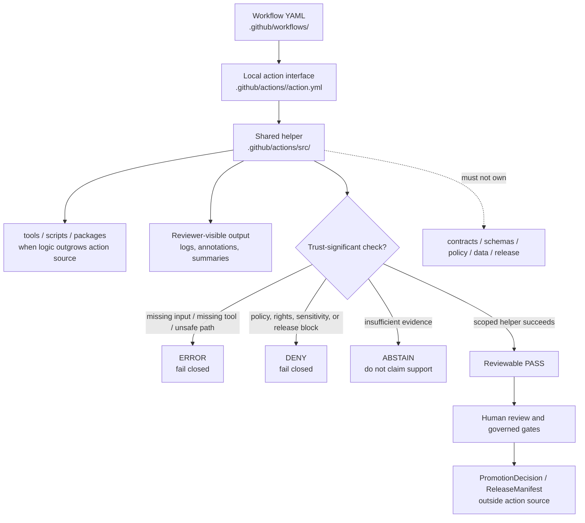

<!-- [KFM_META_BLOCK_V2]
doc_id: kfm://doc/NEEDS_VERIFICATION__github_actions_src_readme
title: GitHub Actions Source Helpers
type: standard
version: v1
status: draft
owners: NEEDS_VERIFICATION
created: NEEDS_VERIFICATION__YYYY-MM-DD
updated: 2026-05-06
policy_label: NEEDS_VERIFICATION__public_or_internal
related: [../README.md, ../../README.md, ../../workflows/README.md, ../../CODEOWNERS, ../../PULL_REQUEST_TEMPLATE.md, ../../../tools/ci/README.md, ../../../scripts/README.md]
tags: [kfm, github-actions, ci, helper-source, provenance, validation, fail-closed]
notes: [README-like directory guide for .github/actions/src; executable helper inventory, owners, workflow callers, branch protections, action metadata, and toolchain maturity remain NEEDS_VERIFICATION.]
[/KFM_META_BLOCK_V2] -->

<a id="top"></a>

# GitHub Actions Source Helpers

Shared helper lane for local GitHub Actions under `.github/actions/`, keeping reusable CI internals small, deterministic, reviewable, and subordinate to KFM evidence, policy, and release governance.

> [!NOTE]
> **Status:** `experimental`  
> **Owners:** `NEEDS_VERIFICATION`  
> **Repo fit:** `.github/actions/src/README.md`  
> **Authority:** helper-source guidance only; not contract, schema, policy, proof, release, or publication authority  
> **Current inventory posture:** `NEEDS_VERIFICATION` until a fresh checkout confirms helper files and workflow callers


**Quick jumps:** [Scope](#scope) · [Repo fit](#repo-fit) · [Accepted inputs](#accepted-inputs) · [Exclusions](#exclusions) · [Current inventory posture](#current-inventory-posture) · [Directory tree](#directory-tree) · [Quickstart](#quickstart) · [Usage patterns](#usage-patterns) · [Diagram](#diagram) · [Design rules](#design-rules) · [Security and policy](#security-and-policy) · [Definition of done](#definition-of-done) · [FAQ](#faq) · [Appendix](#appendix)

> [!IMPORTANT]
> This directory is a shared implementation seam for local action helpers. It must not become a second workflow lane, a scripts dumping ground, a policy authority, a schema authority, a proof store, a release mechanism, or a shortcut around KFM’s governed publication path.

---

## Scope

`.github/actions/src/` is for small reusable helper code used by multiple repo-local GitHub Actions.

Use this directory when the helper is:

- shared by more than one local action;
- deterministic enough to rerun safely in CI;
- small enough to review as action infrastructure;
- explicitly subordinate to the action interface in each sibling action directory;
- free of secrets, canonical evidence, release authority, and policy meaning;
- able to fail closed when a trust-significant prerequisite is missing.

This lane exists to keep sibling action directories thin. The public action interface stays in each action’s own `action.yml`; reusable internals may live here only when reuse is real.

[Back to top](#top)

---

## Repo fit

| Direction | Surface | Relationship |
| --- | --- | --- |
| This file | `.github/actions/src/README.md` | Directory README for shared local-action helper source. |
| Parent action lane | [`../README.md`](../README.md) | Defines repo-local actions as thin wrappers, not hidden authority. |
| GitHub gatehouse | [`../../README.md`](../../README.md) | Defines `.github/` as repo-wide governance, review, workflow, and automation boundary. |
| Workflow callers | [`../../workflows/README.md`](../../workflows/README.md) | Workflows orchestrate action use; they should not own reusable helper internals. |
| Ownership surface | [`../../CODEOWNERS`](../../CODEOWNERS) | Should route review for `.github/` and helper-source changes. Owner coverage remains `NEEDS_VERIFICATION`. |
| PR review surface | [`../../PULL_REQUEST_TEMPLATE.md`](../../PULL_REQUEST_TEMPLATE.md) | Should require evidence, validation, risk, and rollback notes for CI and action changes. |
| CI summary helpers | [`../../../tools/ci/README.md`](../../../tools/ci/README.md) | Larger reviewer-facing output helpers belong in `tools/ci/`, not hidden in action source. |
| Maintainer scripts | [`../../../scripts/README.md`](../../../scripts/README.md) | Broad orchestration scripts belong outside `.github/actions/src/`. |

### Directory Rules basis

`.github/` is a repo-wide automation and governance root. It is appropriate for workflow and local-action infrastructure because it supports validation, review, and runtime operation. Domain content, source registries, schemas, policies, lifecycle data, proof objects, and release artifacts must remain under their owning responsibility roots.

[Back to top](#top)

---

## Accepted inputs

Place material here only when it is shared action implementation support.

| Accepted material | Examples | Required posture |
| --- | --- | --- |
| Shared shell helpers | tool setup, path checks, output normalization | Use `set -euo pipefail`; fail on missing prerequisites. |
| Shared Python helpers | small validators, report shapers, action-local wrappers | Keep reusable logic small; promote larger code to `tools/` or `packages/`. |
| Shared Node helpers | GitHub Actions output handling, summary formatting | Do not assume a Node toolchain unless action metadata and tests prove it. |
| Templates | step summaries, compact Markdown snippets, JSON report shells | Templates must not redefine policy, release, or proof semantics. |
| Examples | minimal caller patterns, helper invocation examples | Mark illustrative examples clearly when no active caller is verified. |
| Helper tests | narrow action-local smoke tests | Prefer repo-wide `tests/` when fixtures prove contract, schema, policy, or release behavior. |
| Implementation notes | helper routing and failure-mode guidance | Keep notes aligned with parent action and workflow READMEs. |

[Back to top](#top)

---

## Exclusions

| Does not belong here | Correct home | Why |
| --- | --- | --- |
| Workflow orchestration | `../../workflows/` | Workflows own job composition, triggers, permissions, and caller sequencing. |
| Action public interfaces | sibling action directories such as `../provenance-guard/` | Each local action should own its own `action.yml`, inputs, outputs, and README. |
| Canonical contract meaning | `../../../contracts/` | Contracts define what KFM objects mean. |
| Machine schema authority | `../../../schemas/` | Schemas define machine-checkable shape. |
| Policy rules or decision grammar | `../../../policy/` | Policy owns allow, deny, restrict, abstain, obligations, and reason codes. |
| Reusable validators with repo-wide value | `../../../tools/validators/`, `../../../tools/`, or `../../../packages/` | Durable validation logic should be reviewable outside GitHub Action glue. |
| Broad maintainer scripts | `../../../scripts/` | Scripts are repo operations, not action internals. |
| RAW, WORK, QUARANTINE, PROCESSED, CATALOG, TRIPLET, PUBLISHED data | `../../../data/` | Lifecycle data must stay in governed data roots. |
| Receipts, proofs, release manifests, SBOMs, signatures, attestations | `../../../data/receipts/`, `../../../data/proofs/`, `../../../release/` | Run evidence and release evidence are emitted artifacts, not source helpers. |
| Secrets, tokens, private keys, credential examples | GitHub secrets, protected environments, OIDC, or approved secret manager | Never commit secret material or log-bearing credential helpers. |
| Domain-specific ETL or publication logic | domain pipeline, connector, data, tool, or package roots | Domain logic must not masquerade as generic CI infrastructure. |
| Direct model or AI-provider calls | governed AI/runtime surfaces with policy review | AI remains evidence-subordinate and must not be smuggled into action helpers. |

[Back to top](#top)

---

## Current inventory posture

This README intentionally does not claim executable maturity for `.github/actions/src/`.

| Item | Status | Safe reading |
| --- | --- | --- |
| `.github/actions/src/README.md` | `CONFIRMED` target document | This README defines the lane boundary. |
| Helper source files under `src/` | `NEEDS_VERIFICATION` | Re-run inventory in the active checkout before claiming helper filenames, languages, or callers. |
| Sibling local actions | `NEEDS_VERIFICATION` | Parent action docs may name expected action families; verify each directory and `action.yml` before use. |
| Workflow callers | `NEEDS_VERIFICATION` | Search workflow YAML for `uses: ./.github/actions/...` before changing helper paths. |
| Owners | `NEEDS_VERIFICATION` | Confirm `CODEOWNERS` coverage and branch-level review routing. |
| Toolchain | `NEEDS_VERIFICATION` | Do not assume Bash, Python, Node, Conftest, OPA, Cosign, SBOM tools, or KFM CLI wrappers are installed without workflow evidence. |

> [!WARNING]
> Directory existence is not executable proof. A placeholder-heavy helper lane can be useful as a control point, but it should not be described as active implementation until action metadata, callers, tests, and workflow runs are verified.

[Back to top](#top)

---

## Directory tree

### Current safe minimum

```text
.github/actions/src/
└── README.md
```

### Proposed growth shape

```text
.github/actions/src/
├── README.md
├── bash/
│   ├── README.md
│   └── <shared-helper>.sh
├── python/
│   ├── README.md
│   └── <shared_helper>.py
├── node/
│   ├── README.md
│   └── <shared-helper>.mjs
├── templates/
│   ├── README.md
│   └── <summary-template>.md
└── lib/
    ├── README.md
    └── <tiny-shared-library>
```

The proposed shape is intentionally narrow. Add a subfolder only when the active branch has a real shared helper, a caller, and a reviewable failure mode.

[Back to top](#top)

---

## Quickstart

Use inspection-first commands before changing this directory.

```bash
# Confirm checkout and branch.
git status --short
git branch --show-current || true
git rev-parse --show-toplevel || true

# Inspect the helper lane.
find .github/actions/src -maxdepth 4 -type f | sort

# Inspect sibling action interfaces.
find .github/actions -maxdepth 3 \( -name 'README.md' -o -name 'action.yml' -o -name 'action.yaml' \) | sort

# Identify workflow callers.
grep -R "uses: ./.github/actions/" -n .github/workflows 2>/dev/null || true

# Identify direct helper calls that bypass action interfaces.
grep -R ".github/actions/src" -n .github/workflows .github/actions scripts tools 2>/dev/null || true

# Check ownership and review surfaces.
sed -n '1,180p' .github/CODEOWNERS 2>/dev/null || true
sed -n '1,260p' .github/PULL_REQUEST_TEMPLATE.md 2>/dev/null || true
```

When helper files exist, run only repo-verified checks. Do not invent a test command without package, workflow, or adjacent README evidence.

[Back to top](#top)

---

## Usage patterns

### Pattern 1 — sibling action calls a shared helper

Use this when a local action owns the public interface and delegates reusable internals to `src/`.

```yaml
# .github/actions/example-action/action.yml
# Illustrative only — exact action name and helper path NEED VERIFICATION.

name: example-action
description: Example local action that delegates a reusable helper to .github/actions/src.

inputs:
  target:
    description: Path to inspect.
    required: true

runs:
  using: composite
  steps:
    - name: Run shared helper
      shell: bash
      run: |
        set -euo pipefail
        "${{ github.action_path }}/../src/bash/example-helper.sh" "${{ inputs.target }}"
```

### Pattern 2 — shared helper fails closed

```bash
#!/usr/bin/env bash
set -euo pipefail

target="${1:?missing target path}"

if [[ "$target" == /* || "$target" == *".."* ]]; then
  echo "ERROR: unsafe target path: $target" >&2
  exit 2
fi

if [[ ! -e "$target" ]]; then
  echo "ERROR: target does not exist: $target" >&2
  exit 2
fi

echo "PASS: helper preflight accepted $target"
```

### Pattern 3 — helper emits reviewer-readable output

```bash
{
  echo "## KFM action helper summary"
  echo ""
  echo "- Helper: example-helper"
  echo "- Scope: path preflight"
  echo "- Outcome: PASS"
  echo "- Publication impact: none"
  echo "- Release authority: none"
} >> "${GITHUB_STEP_SUMMARY:-/dev/null}"
```

> [!TIP]
> Prefer `${{ github.action_path }}`-anchored paths in local composite actions. It keeps sibling action directories portable without hard-coding repository-root assumptions.

[Back to top](#top)

---

## Diagram



[Back to top](#top)

---

## Design rules

| Rule | Why it matters |
| --- | --- |
| Keep the public interface in each action’s own `action.yml`. | Prevents `src/` from becoming an undocumented entrypoint layer. |
| Move code into `src/` only when reuse is real. | Avoids premature shared abstractions and hidden maintenance burden. |
| Keep helpers deterministic and small. | Makes CI behavior reviewable and reproducible. |
| Make side effects explicit. | Hidden downloads, writes, environment mutation, and uploads are hard to audit. |
| Fail closed on missing prerequisites. | KFM should not convert missing evidence, policy, tools, or provenance into silent warnings. |
| Keep policy content outside this lane. | Helpers may run policy tooling; they do not own policy meaning. |
| Keep schema and contract meaning outside this lane. | Helpers consume contracts and schemas; they do not define them. |
| Keep secrets out of helper code and logs. | Prevents action source from becoming a covert secret surface. |
| Prefer small composable helpers to one giant bootstrap script. | Reduces blast radius and improves review quality. |
| Update this README when inventory or boundaries change. | Prevents helper-source drift from becoming invisible infrastructure. |

[Back to top](#top)

---

## Security and policy

Action helpers run in a high-leverage automation context. Treat all workflow inputs, environment values, path arguments, and pull-request content as untrusted until checked.

| Concern | Required posture |
| --- | --- |
| Permissions | Caller workflows should use least privilege, usually `contents: read`, unless a narrower documented release/signing path requires more. |
| Path handling | Reject absolute paths, parent traversal, and unexpected glob expansion before reading files. |
| Logging | Do not print secrets, bearer tokens, private URLs, credential-bearing headers, source-system credentials, or restricted payloads. |
| Network access | Avoid by default. Any network call needs explicit workflow purpose, version pinning, and source/security review. |
| Tool installation | Pin or verify tool versions where trust-significant. Do not assume runner-global tools are available. |
| Generated outputs | Keep receipts, proofs, SBOMs, signatures, bundles, and release manifests outside source helper directories. |
| AI/model calls | Do not call model runtimes or providers from this helper lane unless a governed AI ADR, policy gate, and workflow boundary explicitly approve it. |
| Public data exposure | Never expose RAW, WORK, QUARANTINE, unpublished candidates, precise sensitive coordinates, living-person data, DNA/genomic data, archaeology-sensitive data, rare-species exact locations, critical infrastructure details, or secret material. |

[Back to top](#top)

---

## Definition of done

A change under `.github/actions/src/` is review-ready when:

- [ ] A fresh checkout inventory was attached or summarized in the PR.
- [ ] The helper is shared by at least two action callers, or the PR explains why shared placement is still justified.
- [ ] The action interface remains in a sibling action directory.
- [ ] Inputs, outputs, side effects, tool assumptions, and failure behavior are documented.
- [ ] Missing prerequisites fail closed.
- [ ] Paths are validated before use.
- [ ] No secrets, tokens, private keys, credentials, or generated signatures are committed.
- [ ] No receipts, proof packs, release manifests, or published artifacts are stored here.
- [ ] Contract, schema, policy, release, and proof authority remain in their owning roots.
- [ ] At least one smoke or fixture path exists when executable helper code is added.
- [ ] Workflow callers were updated or explicitly marked out of scope.
- [ ] Rollback is as simple as reverting the helper and caller together.

[Back to top](#top)

---

## FAQ

### Why keep shared code in `.github/actions/src/`?

Because repeated CI bootstrap or output-normalization code can drift when copied into every action. This lane gives maintainers one small place to harden shared internals while keeping each action’s public contract local and legible.

### Why not call helpers directly from workflow YAML?

Direct workflow calls are sometimes useful for smoke checks, but the safer default is a local action with a documented `action.yml`. That keeps inputs, outputs, permissions, and failure behavior visible to reviewers.

### Why not store policy files here if helpers run policy checks?

Because executing policy tooling and owning policy meaning are different responsibilities. This lane may help call policy tools, but policy semantics belong in `policy/`, with contracts, schemas, fixtures, and tests linked from the proper roots.

### What if a helper becomes domain-specific?

Move it out. If the logic is hydrology-only, archaeology-only, AI-only, release-only, or source-specific, it belongs with the owning domain, tool, pipeline, connector, or policy lane.

### What if a helper grows large?

Promote it to `tools/`, `scripts/`, or `packages/`, then leave a small action wrapper here or in the owning action directory.

[Back to top](#top)

---

## Appendix

<details>
<summary><strong>Review card for helper-source changes</strong></summary>

| Question | Required answer |
| --- | --- |
| Which action callers use this helper? | List exact action directories or mark `NEEDS_VERIFICATION`. |
| Why does it belong in `src/`? | Explain reuse across action callers. |
| What inputs does it accept? | List paths, environment variables, CLI args, and workflow values. |
| What can it write? | List files, outputs, summaries, artifacts, and temp paths. |
| What can fail closed? | Name `ERROR`, `DENY`, or `ABSTAIN`-like outcomes. |
| Does it call the network? | Default no; justify if yes. |
| Does it touch release evidence? | It may inspect or summarize; it must not approve publication. |
| Does it handle sensitive material? | Default no; deny or restrict if yes. |
| How is it tested? | Link smoke tests, fixtures, or workflow dry-run. |
| How is it rolled back? | Revert helper and callers; preserve logs and emitted evidence. |

</details>

<details>
<summary><strong>Status vocabulary</strong></summary>

| Label | Use in this directory |
| --- | --- |
| `CONFIRMED` | Verified from active checkout evidence, command output, or directly inspected repo file. |
| `INFERRED` | Conservative structural reading from adjacent repo evidence; not strong enough to claim implementation. |
| `PROPOSED` | Recommended design, helper shape, or target behavior not verified as current implementation. |
| `UNKNOWN` | Not verified strongly enough. |
| `NEEDS_VERIFICATION` | Checkable before merge, workflow reliance, or status upgrade. |

</details>

<details>
<summary><strong>Anti-patterns to reject</strong></summary>

- Turning `src/` into a second workflow system.
- Hiding policy decisions in helper glue.
- Treating successful helper execution as publication approval.
- Adding network downloads without tool pinning or source/security review.
- Printing secrets or credential-bearing values.
- Keeping reusable validators only inside `.github/actions/src/`.
- Storing run receipts, proof packs, SBOMs, signatures, or release manifests as source files.
- Calling AI/model providers from CI helper code without governed AI review.
- Claiming helper inventory, callers, or required-check enforcement without fresh repo and platform evidence.

</details>

[Back to top](#top)
